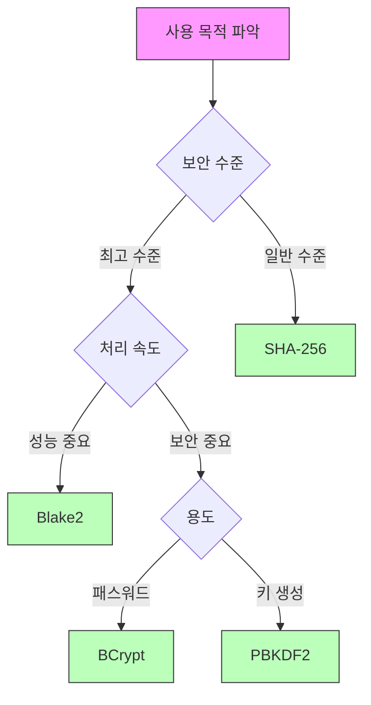

```table-of-contents
title: 
style: nestedList # TOC style (nestedList|nestedOrderedList|inlineFirstLevel)
minLevel: 0 # Include headings from the specified level
maxLevel: 0 # Include headings up to the specified level
includeLinks: true # Make headings clickable
hideWhenEmpty: false # Hide TOC if no headings are found
debugInConsole: false # Print debug info in Obsidian console
```
# 개념 설명
## 해시 함수란?
해시 함수는 임의의 크기를 가진 데이터를 고정된 크기의 값으로 변환하는 단방향 함수이다. 마치 종이를 파쇄기에 넣으면 일정한 크기로 잘리는 것과 같다.

## 좋은 해시 함수의 특성
1. 단방향성: 해시값에서 원본 데이터를 복원할 수 없다
2. 충돌 저항성: 서로 다른 입력이 같은 해시값을 가질 확률이 매우 낮다
3. 눈사태 효과: 입력의 작은 변화도 완전히 다른 해시값을 만든다

# 주요 해시 함수 분석
## SHA-256
```python
import hashlib

def sha256_hash(data):
    """
    SHA-256 해시를 생성한다
    """
    return hashlib.sha256(data.encode()).hexdigest()

# 사용 예시
data = "중요한 데이터"
hash_value = sha256_hash(data)
print(f"SHA-256 해시: {hash_value}")
```

### 특징
- 출력 크기: 256비트 (64자리 16진수)
- 보안성: 매우 높음
- 속도: 중간
- 주요 용도: 블록체인, 디지털 서명, 일반적인 무결성 검증

## BCrypt
```python
import bcrypt

def hash_password(password):
    """
    BCrypt로 패스워드를 안전하게 해시한다
    """
    # 자동으로 salt 생성 및 적용
    salt = bcrypt.gensalt(rounds=12)  # 작업 계수 설정
    return bcrypt.hashpw(password.encode(), salt)

def verify_password(password, hashed):
    """
    패스워드를 검증한다
    """
    return bcrypt.checkpw(password.encode(), hashed)

# 사용 예시
password = "my_secure_password"
hashed_password = hash_password(password)
is_valid = verify_password(password, hashed_password)
print(f"검증 결과: {is_valid}")
```

### 특징
- 출력 크기: 가변 (일반적으로 60자)
- 보안성: 매우 높음
- 속도: 의도적으로 느림
- 주요 용도: 패스워드 저장

## PBKDF2
```python
import os
from cryptography.hazmat.primitives import hashes
from cryptography.hazmat.primitives.kdf.pbkdf2 import PBKDF2HMAC

def create_key_pbkdf2(password, salt=None):
    """
    PBKDF2를 사용하여 키를 생성한다
    """
    if salt is None:
        salt = os.urandom(16)
    
    kdf = PBKDF2HMAC(
        algorithm=hashes.SHA256(),
        length=32,
        salt=salt,
        iterations=100000,
    )
    key = kdf.derive(password.encode())
    
    return {
        'key': key,
        'salt': salt
    }

# 사용 예시
result = create_key_pbkdf2("my_password")
print(f"생성된 키: {result['key'].hex()}")
print(f"사용된 Salt: {result['salt'].hex()}")
```

### 특징
- 출력 크기: 설정 가능
- 보안성: 높음
- 속도: 조절 가능
- 주요 용도: 키 생성, 패스워드 기반 암호화

## Blake2
```python
from hashlib import blake2b

def blake2_hash(data, size=64):
    """
    Blake2 해시를 생성한다
    """
    return blake2b(data.encode(), digest_size=size).hexdigest()

# 사용 예시
data = "고성능 처리가 필요한 데이터"
hash_value = blake2_hash(data)
print(f"Blake2 해시: {hash_value}")
```

### 특징
- 출력 크기: 가변 (1-64 바이트)
- 보안성: 매우 높음
- 속도: 매우 빠름
- 주요 용도: 고성능이 필요한 무결성 검증

# 사용 목적별 선택 가이드


# 실제 구현 시나리오
## 1. 사용자 인증 시스템
```python
class UserAuth:
    def __init__(self):
        self.users = {}
    
    def register(self, username, password):
        """
        새 사용자를 등록한다
        """
        hashed = bcrypt.hashpw(password.encode(), bcrypt.gensalt())
        self.users[username] = hashed
        
    def verify(self, username, password):
        """
        사용자 인증을 수행한다
        """
        if username not in self.users:
            return False
        return bcrypt.checkpw(password.encode(), self.users[username])
```

## 2. 파일 무결성 검증 시스템
```python
class FileIntegrity:
    def __init__(self):
        self.hash_cache = {}
    
    def calculate_hash(self, filepath):
        """
        파일의 해시값을 계산한다
        """
        hasher = hashlib.sha256()
        with open(filepath, 'rb') as f:
            while chunk := f.read(8192):
                hasher.update(chunk)
        return hasher.hexdigest()
    
    def verify_file(self, filepath):
        """
        파일의 무결성을 검증한다
        """
        current_hash = self.calculate_hash(filepath)
        original_hash = self.hash_cache.get(filepath)
        
        if original_hash is None:
            self.hash_cache[filepath] = current_hash
            return True
            
        return current_hash == original_hash
```

# 보안 고려사항
## 1. 솔트(Salt) 사용
```python
def secure_hash_with_salt(data):
    """
    솔트를 사용하여 안전한 해시를 생성한다
    """
    salt = os.urandom(32)
    hasher = hashlib.sha256()
    hasher.update(salt)
    hasher.update(data.encode())
    
    return {
        'hash': hasher.hexdigest(),
        'salt': salt.hex()
    }
```

## 2. 작업 증명 조정
```python
def adjust_work_factor(execution_time_ms=250):
    """
    목표 실행 시간에 맞춰 작업 계수를 조정한다
    """
    rounds = 12
    while True:
        start = time.time()
        bcrypt.gensalt(rounds=rounds)
        duration = (time.time() - start) * 1000
        
        if duration >= execution_time_ms:
            break
        rounds += 1
    
    return rounds
```

# 성능 최적화
## 1. 병렬 처리
```python
from concurrent.futures import ThreadPoolExecutor

def parallel_hash(files):
    """
    여러 파일의 해시를 병렬로 계산한다
    """
    with ThreadPoolExecutor() as executor:
        return list(executor.map(calculate_hash, files))
```

## 2. 캐싱 전략
```python
from functools import lru_cache

@lru_cache(maxsize=1000)
def cached_hash(data):
    """
    자주 사용되는 해시값을 캐싱한다
    """
    return hashlib.sha256(data.encode()).hexdigest()
```

# 결론
해시 함수의 선택은 사용 목적, 보안 요구사항, 성능 요구사항을 종합적으로 고려해야 한다. 특히 패스워드 저장과 같은 보안 중심의 용도에는 반드시 그에 맞는 전문 해시 함수를 사용해야 한다.

# 참고 자료
- NIST SP 800-107: Hash Functions
- OWASP Password Storage Cheat Sheet
- bcrypt 공식 문서
- Blake2 명세서