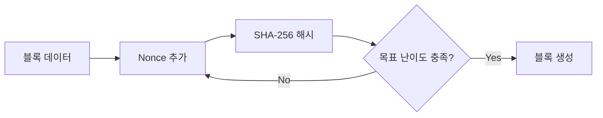

```table-of-contents
title: 
style: nestedList # TOC style (nestedList|nestedOrderedList|inlineFirstLevel)
minLevel: 0 # Include headings from the specified level
maxLevel: 0 # Include headings up to the specified level
includeLinks: true # Make headings clickable
hideWhenEmpty: false # Hide TOC if no headings are found
debugInConsole: false # Print debug info in Obsidian console
```
# 개요
비트코인은 암호화폐의 대표주자로서 SHA-256 해시 알고리즘을 핵심 기술로 활용한다. 이 문서에서는 비트코인이 SHA-256을 어떻게 활용하는지 상세히 살펴본다.

# SHA-256의 기본 개념
## 해시 함수란?
해시 함수는 마치 문서 파쇄기와 같다. 어떤 크기의 입력값이든 항상 동일한 크기의 출력값(해시값)을 생성한다. SHA-256의 경우 항상 256비트(32바이트) 길이의 해시값을 생성한다.

## SHA-256의 특징
- 단방향성: 해시값에서 원본 데이터를 복원할 수 없다
- 결정성: 동일한 입력은 항상 동일한 출력을 생성한다
- 충돌 저항성: 서로 다른 입력이 동일한 해시값을 가질 확률이 극히 낮다

# 비트코인에서의 SHA-256 활용
## 1. 작업증명(Proof of Work)


## 2. 트랜잭션 ID 생성
모든 비트코인 트랜잭션은 고유한 식별자(TXID)를 가지며, 이는 트랜잭션 데이터를 SHA-256으로 두 번 해시하여 생성한다.

# 작업증명 상세 과정
## 블록 헤더 구조
```python
class BlockHeader:
    def __init__(self):
        self.version = 1
        self.previous_block_hash = "0000000000000000000000000000000000000000000000000000000000000000"
        self.merkle_root = ""
        self.timestamp = int(time.time())
        self.bits = 0x1d00ffff  # 난이도 타겟
        self.nonce = 0
```

## 마이닝 프로세스
```python
import hashlib

def double_sha256(header_bin):
    """블록 헤더에 대해 이중 SHA-256 해시를 수행한다"""
    return hashlib.sha256(hashlib.sha256(header_bin).digest()).digest()

def mine_block(block_header):
    """목표 난이도를 만족하는 논스를 찾는다"""
    while True:
        block_header.nonce += 1
        header_bin = block_header.serialize()
        hash_result = double_sha256(header_bin)
        
        if int.from_bytes(hash_result, 'big') < block_header.target:
            return block_header.nonce
```

# 성능과 보안 고려사항
## 성능 최적화
- 해시 계산의 병렬화
- ASIC 하드웨어 활용
- 메모리 사용 최적화

## 보안 위협
- 51% 공격 가능성
- 양자 컴퓨팅 위협
- 해시 충돌 공격

# 주의사항
1. 높은 전력 소비
2. 하드웨어 의존성
3. 채굴 난이도 변동성

# 발전 방향
## 현재 과제
- 에너지 효율성 개선
- 트랜잭션 처리 속도 향상
- 탈중앙화 유지

## 미래 전망
- 양자 내성 암호화로의 전환 가능성
- 지속 가능한 채굴 방식 연구
- Layer 2 솔루션 통합

# 결론
SHA-256은 비트코인 생태계의 근간을 이루는 핵심 알고리즘이다. 작업증명과 트랜잭션 무결성 보장에 필수적인 역할을 하며, 향후에도 암호화폐 발전의 중요한 기술적 기반이 될 것이다.

# 참고 자료
- Bitcoin Whitepaper (Satoshi Nakamoto, 2008)
- Bitcoin Core GitHub Repository
- Bitcoin Developer Documentation