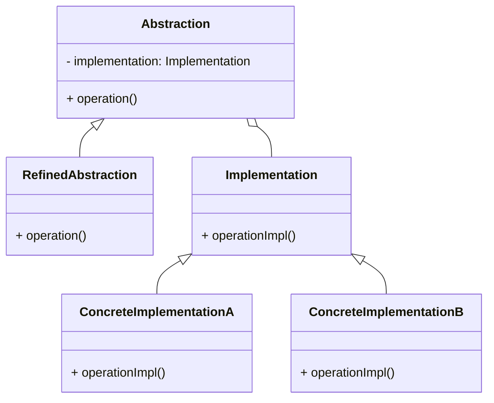

```table-of-contents
title: 
style: nestedList # TOC style (nestedList|nestedOrderedList|inlineFirstLevel)
minLevel: 0 # Include headings from the specified level
maxLevel: 0 # Include headings up to the specified level
includeLinks: true # Make headings clickable
hideWhenEmpty: false # Hide TOC if no headings are found
debugInConsole: false # Print debug info in Obsidian console
```

브리지 패턴(Bridge Pattern)

# 개념 설명

브리지 패턴은 구조적 디자인 패턴으로, 추상화(abstraction)와 구현(implementation)을 분리하여 둘을 독립적으로 변형할 수 있게 한다. 이 패턴은 "두 가지 직교하는 개념의 결합"을 효과적으로 처리하는 방법을 제공한다.

## 실생활 비유

브리지 패턴은 TV 리모컨과 같다. TV(구현체)와 리모컨(추상화)은 별개의 존재로, 다양한 TV 브랜드에 대해 동일한 리모컨 인터페이스를 사용할 수 있다. 리모컨의 디자인이 변경되어도 TV의 기능은 그대로 유지되며, TV의 내부 구현이 변경되어도 리모컨의 버튼은 같은 기능을 수행한다.

# 기본 동작 방식

브리지 패턴은 다음과 같은 구조로 이루어진다:



- **Abstraction**: 높은 수준의 제어 로직을 정의하며 Implementation 객체에 의존한다.
- **Implementation**: 모든 구현 클래스에 대한 인터페이스를 정의한다.
- **Refined Abstraction**: Abstraction의 확장으로, 추상화에 변형을 제공한다.
- **Concrete Implementation**: Implementation 인터페이스를 구체적인 플랫폼에 맞게 구현한다.

# 실제 사용 예시

## Python 예시

다양한 메시지 전송 방식(이메일, SMS)과 다양한 메시지 형식(일반, HTML, 암호화)을 처리하는 시스템을 구현해보자.

```python
# Implementation 인터페이스
class MessageSender:
    def send_message(self, message, recipient):
        pass

# 구체적인 Implementation 클래스들
class EmailSender(MessageSender):
    def send_message(self, message, recipient):
        print(f"이메일로 전송: '{message}'를 {recipient}에게 보냄")

class SMSSender(MessageSender):
    def send_message(self, message, recipient):
        print(f"SMS로 전송: '{message}'를 {recipient}에게 보냄")

# Abstraction 클래스
class Message:
    def __init__(self, sender):
        self.sender = sender
    
    def send(self, recipient):
        pass

# Refined Abstraction 클래스들
class SimpleMessage(Message):
    def send(self, recipient):
        message = "간단한 텍스트 메시지"
        self.sender.send_message(message, recipient)

class HTMLMessage(Message):
    def send(self, recipient):
        message = "<html><body>HTML 형식의 메시지</body></html>"
        self.sender.send_message(message, recipient)

class EncryptedMessage(Message):
    def send(self, recipient):
        original = "비밀 메시지"
        message = f"암호화: {original.upper()}"
        self.sender.send_message(message, recipient)

# 클라이언트 코드
if __name__ == "__main__":
    email_sender = EmailSender()
    sms_sender = SMSSender()
    
    simple_email = SimpleMessage(email_sender)
    html_email = HTMLMessage(email_sender)
    encrypted_sms = EncryptedMessage(sms_sender)
    
    simple_email.send("user@example.com")
    html_email.send("admin@example.com")
    encrypted_sms.send("+123456789")
```

## PHP 예시

웹 페이지 렌더링과 다양한 테마(어두운 테마, 밝은 테마)를 처리하는 예시를 살펴보자.

```php
// Implementation 인터페이스
interface Theme {
    public function getColor();
    public function getFont();
}

// 구체적인 Implementation 클래스들
class DarkTheme implements Theme {
    public function getColor() {
        return "어두운 색상";
    }
    
    public function getFont() {
        return "어두운 테마 폰트";
    }
}

class LightTheme implements Theme {
    public function getColor() {
        return "밝은 색상";
    }
    
    public function getFont() {
        return "밝은 테마 폰트";
    }
}

// Abstraction 클래스
abstract class WebPage {
    protected $theme;
    
    public function __construct(Theme $theme) {
        $this->theme = $theme;
    }
    
    abstract public function render();
}

// Refined Abstraction 클래스들
class HomePage extends WebPage {
    public function render() {
        $color = $this->theme->getColor();
        $font = $this->theme->getFont();
        return "홈 페이지 렌더링 (색상: {$color}, 폰트: {$font})";
    }
}

class AboutPage extends WebPage {
    public function render() {
        $color = $this->theme->getColor();
        $font = $this->theme->getFont();
        return "소개 페이지 렌더링 (색상: {$color}, 폰트: {$font})";
    }
}

// 클라이언트 코드
$darkTheme = new DarkTheme();
$lightTheme = new LightTheme();

$homePage = new HomePage($darkTheme);
$aboutPage = new AboutPage($lightTheme);

echo $homePage->render() . "\n";
echo $aboutPage->render() . "\n";
```

## JavaScript 예시

다양한 그리기 도구(펜, 브러시)와 다양한 색상(빨강, 파랑)을 처리하는 그래픽 편집기를 구현해보자.

```javascript
// Implementation 인터페이스
class DrawingAPI {
    drawLine(x1, y1, x2, y2, color) {
        throw new Error("이 메서드는 구현체에서 오버라이드 되어야 합니다");
    }
    
    drawCircle(x, y, radius, color) {
        throw new Error("이 메서드는 구현체에서 오버라이드 되어야 합니다");
    }
}

// 구체적인 Implementation 클래스들
class CanvasAPI extends DrawingAPI {
    drawLine(x1, y1, x2, y2, color) {
        console.log(`Canvas API로 선 그리기: (${x1},${y1})에서 (${x2},${y2})까지 ${color} 색상으로`);
    }
    
    drawCircle(x, y, radius, color) {
        console.log(`Canvas API로 원 그리기: 중심(${x},${y}), 반지름 ${radius}, ${color} 색상으로`);
    }
}

class SVGDrawingAPI extends DrawingAPI {
    drawLine(x1, y1, x2, y2, color) {
        console.log(`SVG로 선 그리기: (${x1},${y1})에서 (${x2},${y2})까지 ${color} 색상으로`);
    }
    
    drawCircle(x, y, radius, color) {
        console.log(`SVG로 원 그리기: 중심(${x},${y}), 반지름 ${radius}, ${color} 색상으로`);
    }
}

// Abstraction 클래스
class Shape {
    constructor(drawingAPI, color) {
        this.drawingAPI = drawingAPI;
        this.color = color;
    }
    
    draw() {
        throw new Error("이 메서드는 자식 클래스에서 구현되어야 합니다");
    }
}

// Refined Abstraction 클래스들
class CircleShape extends Shape {
    constructor(x, y, radius, drawingAPI, color) {
        super(drawingAPI, color);
        this.x = x;
        this.y = y;
        this.radius = radius;
    }
    
    draw() {
        this.drawingAPI.drawCircle(this.x, this.y, this.radius, this.color);
    }
}

class LineShape extends Shape {
    constructor(x1, y1, x2, y2, drawingAPI, color) {
        super(drawingAPI, color);
        this.x1 = x1;
        this.y1 = y1;
        this.x2 = x2;
        this.y2 = y2;
    }
    
    draw() {
        this.drawingAPI.drawLine(this.x1, this.y1, this.x2, this.y2, this.color);
    }
}

// 클라이언트 코드
const canvasAPI = new CanvasAPI();
const svgAPI = new SVGDrawingAPI();

const redCircle = new CircleShape(100, 100, 50, canvasAPI, "빨강");
const blueCircle = new CircleShape(200, 200, 30, svgAPI, "파랑");
const greenLine = new LineShape(10, 10, 100, 100, svgAPI, "초록");

redCircle.draw();
blueCircle.draw();
greenLine.draw();
```

# 고급 활용법

## 브리지 패턴의 확장

브리지 패턴은 다음과 같은 방식으로 확장할 수 있다:

1. **다중 추상화 계층**: 필요에 따라 여러 추상화 계층을 두어 복잡성을 관리할 수 있다.
2. **캐싱 레이어**: 구현체의 호출 결과를 캐싱하여 성능을 최적화할 수 있다.
3. **장식자 패턴과 결합**: 추상화에 추가적인 기능을 동적으로 첨가할 수 있다.

## 브리지 패턴과 의존성 주입

브리지 패턴은 의존성 주입(Dependency Injection)의 원리와 밀접한 관련이 있다. 구현체를 추상화에 주입함으로써 결합도를 낮추고 유연성을 높일 수 있다.

```python
# 브리지 패턴과 의존성 주입 예시
class DatabaseConnector:
    def __init__(self, database_driver):
        self.driver = database_driver
    
    def connect(self, connection_string):
        return self.driver.connect(connection_string)
```

# 주의사항

## 성능 고려사항

브리지 패턴은 객체 지향 원칙을 따르기 위해 추가적인 추상화 계층을 도입하므로, 미세한 성능 저하가 발생할 수 있다. 매우 성능이 중요한 시스템에서는 이 점을 고려해야 한다.

## 복잡성 관리

브리지 패턴은 클래스의 수를 증가시키므로, 작은 프로젝트에서는 과도한 설계가 될 수 있다. 시스템의 복잡성과 확장 가능성을 고려하여 적용해야 한다.

## Security 고려사항

구현체가 외부에서 주입될 때 잠재적인 보안 위험이 있으므로, 검증된 구현체만 사용하도록 한다.

# 결론

브리지 패턴은 추상화와 구현을 분리하여 독립적으로 확장할 수 있게 한다. 이는 복잡한 시스템에서 다양한 변형을 효과적으로 관리할 수 있게 해준다. 하지만 작은 프로젝트에서는 오버엔지니어링이 될 수 있으므로, 적용 시 시스템의 복잡성과 확장성을 고려해야 한다.

브리지 패턴은 특히 다음과 같은 상황에 적합하다:

- 추상화와 구현이 모두 확장될 수 있는 경우
- 런타임에 구현체를 변경해야 하는 경우
- 추상화와 구현 간의 결합도를 낮추어야 하는 경우

# 패턴 비교

## 브리지 패턴 vs 전략 패턴

- **브리지 패턴**: 추상화와 구현을 분리하는 구조적 패턴
- **전략 패턴**: 알고리즘을 캡슐화하는 행동 패턴

## 브리지 패턴 vs 어댑터 패턴

- **브리지 패턴**: 설계 시점에 추상화와 구현을 분리
- **어댑터 패턴**: 이미 존재하는 인터페이스를 다른 인터페이스에 맞게 변환