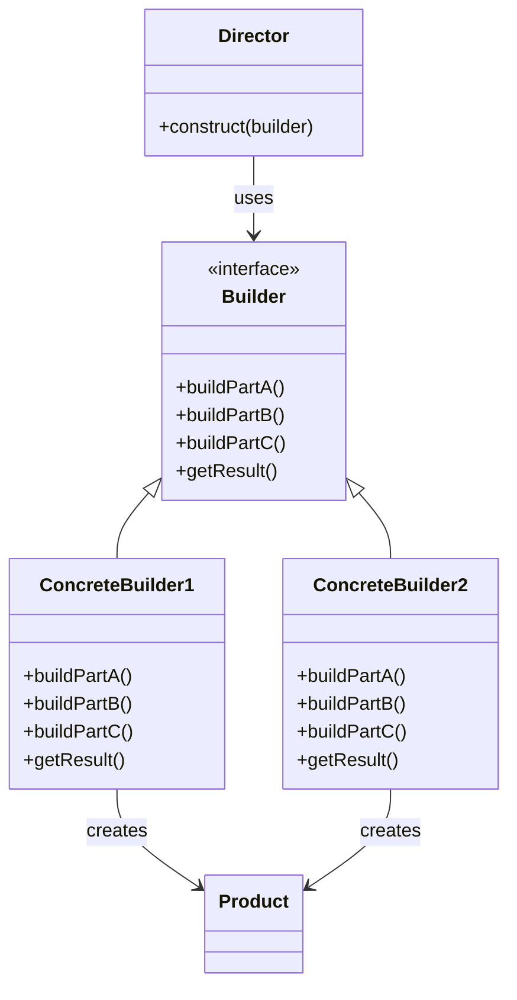
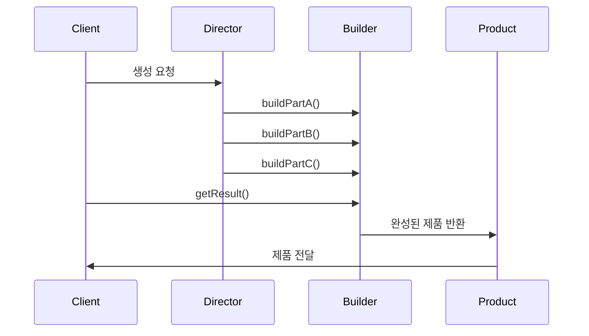

```table-of-contents
title: 
style: nestedList # TOC style (nestedList|nestedOrderedList|inlineFirstLevel)
minLevel: 0 # Include headings from the specified level
maxLevel: 0 # Include headings up to the specified level
includeLinks: true # Make headings clickable
hideWhenEmpty: false # Hide TOC if no headings are found
debugInConsole: false # Print debug info in Obsidian console
```

Builder 패턴: 복잡한 객체 생성을 단순화하는 디자인 패턴

# 개념 설명

Builder 패턴은 복잡한 객체의 생성 과정을 분리하여 동일한 생성 과정으로 서로 다른 표현을 만들 수 있게 하는 생성 패턴이다. 마치 주문제작 가구를 만드는 과정과 유사하다. 가구 장인(Director)이 조립 계획을 세우고, 실제 조립은 목수(Builder)가 단계별로 수행하여 완성품(Product)을 만드는 것처럼, 객체 생성의 복잡한 과정을 단계별로 분리한다.

## 실생활 비유

집을 짓는 과정을 생각해보자. 건축가는 설계도를 그리지만, 실제 집을 짓는 것은 건설업체가 담당한다. 이때 건설업체는 기초공사, 벽체공사, 지붕공사 등 단계적으로 집을 완성한다. 동일한 설계도로도 사용하는 재료나 마감재에 따라 다양한 형태의 집을 지을 수 있다. Builder 패턴도 이와 같이 객체 생성 과정을 단계별로 분리하고, 동일한 생성 과정으로 다양한 결과물을 만들 수 있게 한다.

# 기본 동작 방식

Builder 패턴은 다음과 같은 구성요소를 가진다:

- **Product**: 생성될 복잡한 객체
- **Builder**: 제품 생성을 위한 추상 인터페이스 정의
- **ConcreteBuilder**: Builder 인터페이스를 구현, 부품을 모아 제품 생성
- **Director**: Builder 인터페이스를 사용하여 객체 생성 과정 관리



## 작동 프로세스



# 실제 사용 예시

## Python 예시

```python
from abc import ABC, abstractmethod
from typing import Any

# Product
class Pizza:
    def __init__(self):
        self.dough = ""
        self.sauce = ""
        self.topping = ""
    
    def __str__(self):
        return f"Pizza with {self.dough} dough, {self.sauce} sauce, and {self.topping} topping"

# Builder 인터페이스
class PizzaBuilder(ABC):
    @abstractmethod
    def reset(self) -> None:
        pass
    
    @abstractmethod
    def build_dough(self) -> None:
        pass
    
    @abstractmethod
    def build_sauce(self) -> None:
        pass
    
    @abstractmethod
    def build_topping(self) -> None:
        pass
    
    @abstractmethod
    def get_pizza(self) -> Pizza:
        pass

# ConcreteBuilder
class HawaiianPizzaBuilder(PizzaBuilder):
    def __init__(self):
        self.reset()
    
    def reset(self) -> None:
        self.pizza = Pizza()
    
    def build_dough(self) -> None:
        self.pizza.dough = "thin"
    
    def build_sauce(self) -> None:
        self.pizza.sauce = "sweet"
    
    def build_topping(self) -> None:
        self.pizza.topping = "ham and pineapple"
    
    def get_pizza(self) -> Pizza:
        pizza = self.pizza
        self.reset()
        return pizza

# 다른 ConcreteBuilder
class SpicyPizzaBuilder(PizzaBuilder):
    def __init__(self):
        self.reset()
    
    def reset(self) -> None:
        self.pizza = Pizza()
    
    def build_dough(self) -> None:
        self.pizza.dough = "thick"
    
    def build_sauce(self) -> None:
        self.pizza.sauce = "spicy"
    
    def build_topping(self) -> None:
        self.pizza.topping = "pepperoni and jalapenos"
    
    def get_pizza(self) -> Pizza:
        pizza = self.pizza
        self.reset()
        return pizza

# Director
class Cook:
    def __init__(self):
        self.builder = None
    
    def set_builder(self, builder: PizzaBuilder) -> None:
        self.builder = builder
    
    def make_pizza(self) -> None:
        self.builder.build_dough()
        self.builder.build_sauce()
        self.builder.build_topping()

# 사용 예시
if __name__ == "__main__":
    cook = Cook()
    hawaiian_builder = HawaiianPizzaBuilder()
    spicy_builder = SpicyPizzaBuilder()
    
    # 하와이안 피자 만들기
    cook.set_builder(hawaiian_builder)
    cook.make_pizza()
    pizza = hawaiian_builder.get_pizza()
    print(pizza)  # Pizza with thin dough, sweet sauce, and ham and pineapple topping
    
    # 스파이시 피자 만들기
    cook.set_builder(spicy_builder)
    cook.make_pizza()
    pizza = spicy_builder.get_pizza()
    print(pizza)  # Pizza with thick dough, spicy sauce, and pepperoni and jalapenos topping
```

## PHP 예시

```php
<?php

// Product
class Car {
    private $engine;
    private $wheels;
    private $color;
    
    public function setEngine($engine) {
        $this->engine = $engine;
    }
    
    public function setWheels($wheels) {
        $this->wheels = $wheels;
    }
    
    public function setColor($color) {
        $this->color = $color;
    }
    
    public function showDetails() {
        return "Car with {$this->engine} engine, {$this->wheels} wheels, and {$this->color} color";
    }
}

// Builder 인터페이스
interface CarBuilder {
    public function reset();
    public function buildEngine();
    public function buildWheels();
    public function buildColor();
    public function getCar();
}

// ConcreteBuilder
class SportsCarBuilder implements CarBuilder {
    private $car;
    
    public function __construct() {
        $this->reset();
    }
    
    public function reset() {
        $this->car = new Car();
    }
    
    public function buildEngine() {
        $this->car->setEngine("V8");
    }
    
    public function buildWheels() {
        $this->car->setWheels("18-inch alloy");
    }
    
    public function buildColor() {
        $this->car->setColor("red");
    }
    
    public function getCar() {
        $car = $this->car;
        $this->reset();
        return $car;
    }
}

// 다른 ConcreteBuilder
class FamilyCarBuilder implements CarBuilder {
    private $car;
    
    public function __construct() {
        $this->reset();
    }
    
    public function reset() {
        $this->car = new Car();
    }
    
    public function buildEngine() {
        $this->car->setEngine("V6");
    }
    
    public function buildWheels() {
        $this->car->setWheels("16-inch steel");
    }
    
    public function buildColor() {
        $this->car->setColor("blue");
    }
    
    public function getCar() {
        $car = $this->car;
        $this->reset();
        return $car;
    }
}

// Director
class CarManufacturer {
    private $builder;
    
    public function setBuilder(CarBuilder $builder) {
        $this->builder = $builder;
    }
    
    public function buildCompleteCar() {
        $this->builder->buildEngine();
        $this->builder->buildWheels();
        $this->builder->buildColor();
    }
}

// 사용 예시
$manufacturer = new CarManufacturer();
$sportsBuilder = new SportsCarBuilder();
$familyBuilder = new FamilyCarBuilder();

// 스포츠카 생성
$manufacturer->setBuilder($sportsBuilder);
$manufacturer->buildCompleteCar();
$sportsCar = $sportsBuilder->getCar();
echo $sportsCar->showDetails() . "\n"; // Car with V8 engine, 18-inch alloy wheels, and red color

// 가족용 자동차 생성
$manufacturer->setBuilder($familyBuilder);
$manufacturer->buildCompleteCar();
$familyCar = $familyBuilder->getCar();
echo $familyCar->showDetails() . "\n"; // Car with V6 engine, 16-inch steel wheels, and blue color
?>
```

## JavaScript 예시

```javascript
// Product
class Meal {
  constructor() {
    this.mainDish = "";
    this.sideDish = "";
    this.drink = "";
    this.dessert = "";
  }
  
  showDetails() {
    return `Meal with ${this.mainDish} main dish, ${this.sideDish} side dish, ${this.drink} drink, and ${this.dessert} dessert`;
  }
}

// Builder 인터페이스 (JavaScript에서는 명시적인 인터페이스가 없어 주석으로 표시)
class MealBuilder {
  reset() {}
  buildMainDish() {}
  buildSideDish() {}
  buildDrink() {}
  buildDessert() {}
  getMeal() {}
}

// ConcreteBuilder
class KoreanMealBuilder extends MealBuilder {
  constructor() {
    super();
    this.reset();
  }
  
  reset() {
    this.meal = new Meal();
  }
  
  buildMainDish() {
    this.meal.mainDish = "bibimbap";
  }
  
  buildSideDish() {
    this.meal.sideDish = "kimchi";
  }
  
  buildDrink() {
    this.meal.drink = "sikhye";
  }
  
  buildDessert() {
    this.meal.dessert = "yakgwa";
  }
  
  getMeal() {
    const meal = this.meal;
    this.reset();
    return meal;
  }
}

// 다른 ConcreteBuilder
class WesternMealBuilder extends MealBuilder {
  constructor() {
    super();
    this.reset();
  }
  
  reset() {
    this.meal = new Meal();
  }
  
  buildMainDish() {
    this.meal.mainDish = "steak";
  }
  
  buildSideDish() {
    this.meal.sideDish = "mashed potato";
  }
  
  buildDrink() {
    this.meal.drink = "wine";
  }
  
  buildDessert() {
    this.meal.dessert = "cheesecake";
  }
  
  getMeal() {
    const meal = this.meal;
    this.reset();
    return meal;
  }
}

// Director
class Chef {
  constructor() {
    this.builder = null;
  }
  
  setBuilder(builder) {
    this.builder = builder;
  }
  
  prepareMeal() {
    this.builder.buildMainDish();
    this.builder.buildSideDish();
    this.builder.buildDrink();
    this.builder.buildDessert();
  }
}

// 사용 예시
const chef = new Chef();
const koreanBuilder = new KoreanMealBuilder();
const westernBuilder = new WesternMealBuilder();

// 한식 준비
chef.setBuilder(koreanBuilder);
chef.prepareMeal();
const koreanMeal = koreanBuilder.getMeal();
console.log(koreanMeal.showDetails()); // Meal with bibimbap main dish, kimchi side dish, sikhye drink, and yakgwa dessert

// 양식 준비
chef.setBuilder(westernBuilder);
chef.prepareMeal();
const westernMeal = westernBuilder.getMeal();
console.log(westernMeal.showDetails()); // Meal with steak main dish, mashed potato side dish, wine drink, and cheesecake dessert
```

# 고급 활용법

## Method Chaining을 활용한 Builder 패턴

객체 생성 단계를 연속적으로 호출할 수 있는 형태로 구현하면 가독성이 향상된다.

```python
# Python 예시: Method Chaining Builder
class UserBuilder:
    def __init__(self):
        self.user = {"name": "", "age": 0, "address": "", "email": ""}
    
    def with_name(self, name):
        self.user["name"] = name
        return self  # self를 반환하여 체이닝 가능
    
    def with_age(self, age):
        self.user["age"] = age
        return self
    
    def with_address(self, address):
        self.user["address"] = address
        return self
    
    def with_email(self, email):
        self.user["email"] = email
        return self
    
    def build(self):
        return self.user

# 사용 예시
user = (UserBuilder()
        .with_name("홍길동")
        .with_age(30)
        .with_address("서울시 강남구")
        .with_email("hong@example.com")
        .build())

print(user)  # {'name': '홍길동', 'age': 30, 'address': '서울시 강남구', 'email': 'hong@example.com'}
```

## 빌더 패턴과 팩토리 패턴의 조합

복잡한 객체 생성을 Builder 패턴으로 처리하고, 여러 Builder 중 적절한 것을 선택하는 방식을 팩토리 패턴으로 구현할 수 있다.

```javascript
// JavaScript 예시: Builder + Factory 패턴
class ReportFactory {
  static createReport(type, data) {
    switch(type) {
      case 'pdf':
        return new PDFReportBuilder(data).build();
      case 'excel':
        return new ExcelReportBuilder(data).build();
      case 'html':
        return new HTMLReportBuilder(data).build();
      default:
        throw new Error(`Unknown report type: ${type}`);
    }
  }
}

// 사용 예시
const pdfReport = ReportFactory.createReport('pdf', data);
const excelReport = ReportFactory.createReport('excel', data);
```

# 주의사항

## 적용 시점

- 객체의 생성 과정이 복잡하고 단계적일 때 사용한다.
- 다양한 표현이 필요한 객체를 생성할 때 유용하다.
- 객체 생성 코드를 비즈니스 로직과 분리하고 싶을 때 활용한다.

## 패턴 오용

- 간단한 객체 생성에 Builder 패턴을 적용하면 코드가 불필요하게 복잡해질 수 있다.
- Director 클래스는 항상 필요한 것은 아니다. 클라이언트가 직접 Builder를 사용할 수도 있다.

## Performance 최적화

- Builder 패턴은 추가적인 객체를 생성하므로 메모리 사용이 증가할 수 있다.
- 자주 생성되는 객체의 경우, Builder 객체를 재사용하는 방식으로 최적화할 수 있다.

## Security 고려사항

- 사용자 입력을 받아 객체를 생성할 때는 유효성 검증을 Builder에 포함시켜야 한다.
- 필수 속성이 설정되지 않은 상태에서 객체가 생성되지 않도록 해야 한다.

# 결론

Builder 패턴은 복잡한 객체 생성 과정을 단계별로 분리하여 동일한 생성 과정으로 다양한 결과물을 만들 수 있게 한다. 객체 생성 코드를 비즈니스 로직과 분리하고, 가독성 있는 코드 구조를 제공한다. 특히 생성자 매개변수가 많고 선택적인 파라미터들이 있는 경우 유용하다. 그러나 간단한 객체에 적용하면 오히려 코드가 복잡해질 수 있으므로 적절한 상황에서 사용해야 한다.

Builder 패턴은 다른 생성 패턴들과 함께 사용되기도 하며, Method Chaining 기법과 결합하면 더욱 우아한 객체 생성 API를 제공할 수 있다. 현대 프로그래밍에서는 많은 라이브러리와 프레임워크가 Builder 패턴을 채택하고 있으며, API 설계 시 참고할만한 강력한 디자인 패턴이다.