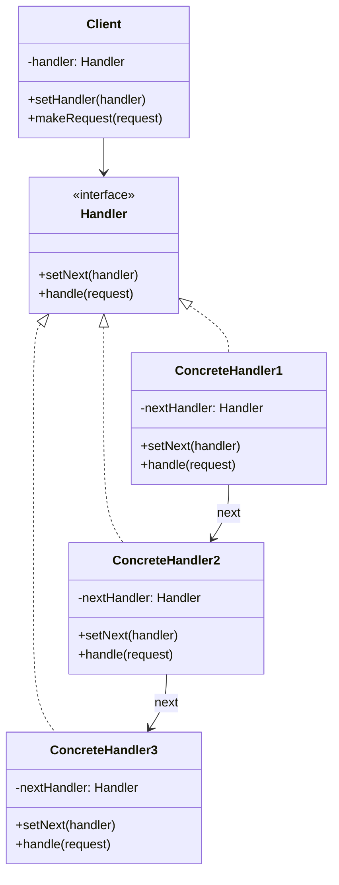
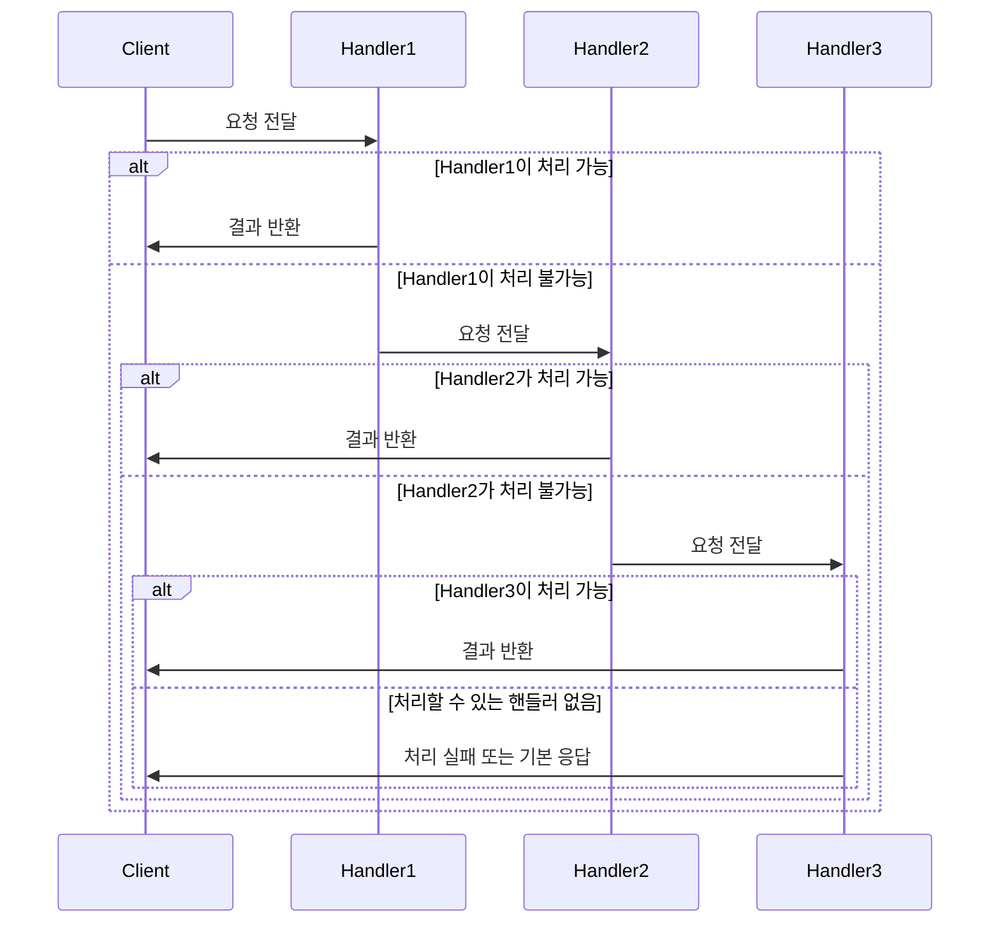
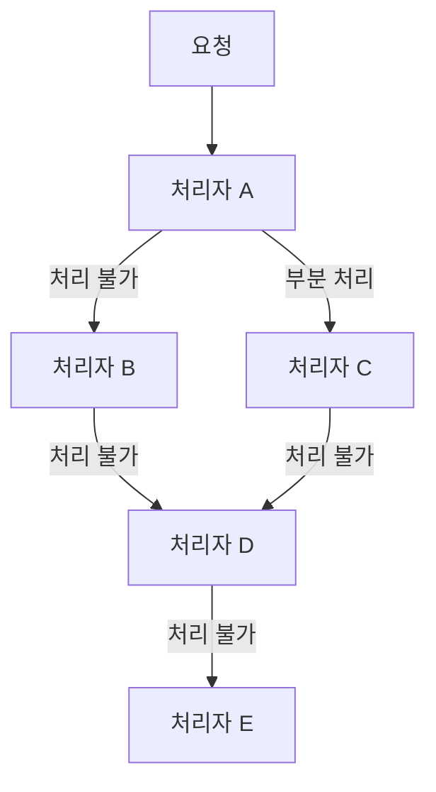
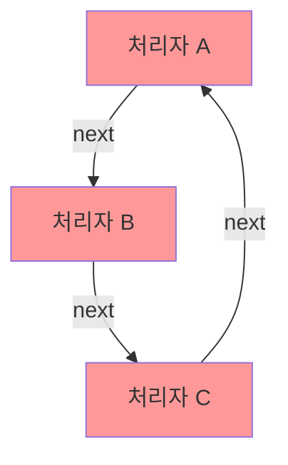

```table-of-contents
title: 
style: nestedList # TOC style (nestedList|nestedOrderedList|inlineFirstLevel)
minLevel: 0 # Include headings from the specified level
maxLevel: 0 # Include headings up to the specified level
includeLinks: true # Make headings clickable
hideWhenEmpty: false # Hide TOC if no headings are found
debugInConsole: false # Print debug info in Obsidian console
```

Chain of Responsibility 패턴

# 개념 설명

Chain of Responsibility는 요청을 보내는 객체와 요청을 처리하는 객체를 분리하는 행동 디자인 패턴이다. 이 패턴은 요청을 처리할 수 있는 객체들의 체인(사슬)을 따라 요청을 전달하는 방식으로 동작한다.

## 실생활 비유

식당에서 고객의 요청 처리를 생각해보자:

- 고객이 음료를 요청하면 웨이터가 처리한다
- 고객이 메뉴 변경을 요청하면 웨이터가 처리할 수 없어 주방장에게 전달한다
- 고객이 환불을 요청하면 웨이터와 주방장이 처리할 수 없어 매니저에게 전달한다

각 단계에서 처리 가능한 요청은 해결하고, 처리할 수 없는 요청은 다음 책임자에게 전달한다.

# 기본 동작 방식

## 패턴 구조



## 핵심 요소

- Handler(처리자): 요청을 처리하는 인터페이스 정의
- ConcreteHandler(구체적 처리자): 요청 처리 여부를 결정하고, 처리할 수 없으면 다음 처리자에게 전달
- Client(클라이언트): 요청을 처리자 체인의 첫 번째 객체에게 전달

## 처리 흐름



# 실제 사용 예시

## Python 예시: 로깅 시스템

```python
from abc import ABC, abstractmethod

# Handler (처리자) 인터페이스
class Logger(ABC):
    def __init__(self):
        self._next_logger = None
    
    def set_next(self, logger):
        self._next_logger = logger
        return logger  # 체이닝을 위해 반환
    
    def log(self, level, message):
        if self._next_logger:
            return self._next_logger.log(level, message)
        return None
    
    @abstractmethod
    def write(self, message):
        pass

# ConcreteHandler 구현 (INFO 레벨)
class InfoLogger(Logger):
    def log(self, level, message):
        if level == "INFO":
            self.write(message)
            return True
        return super().log(level, message)
    
    def write(self, message):
        print(f"[INFO] 콘솔 로그: {message}")

# ConcreteHandler 구현 (WARNING 레벨)
class WarningLogger(Logger):
    def log(self, level, message):
        if level == "WARNING":
            self.write(message)
            return True
        return super().log(level, message)
    
    def write(self, message):
        print(f"[WARNING] 이메일 알림: {message}")

# ConcreteHandler 구현 (ERROR 레벨)
class ErrorLogger(Logger):
    def log(self, level, message):
        if level == "ERROR":
            self.write(message)
            return True
        return super().log(level, message)
    
    def write(self, message):
        print(f"[ERROR] SMS 알림: {message}")

# 로깅 체인 생성 및 사용
def create_logger_chain():
    info_logger = InfoLogger()
    warning_logger = WarningLogger()
    error_logger = ErrorLogger()
    
    # 체인 연결: info -> warning -> error
    info_logger.set_next(warning_logger).set_next(error_logger)
    
    return info_logger

# 클라이언트 코드
if __name__ == "__main__":
    logger = create_logger_chain()
    
    # 각 레벨별 로그 메시지 전송
    logger.log("INFO", "일반 정보 메시지입니다.")
    logger.log("WARNING", "경고! 서버 부하가 높습니다.")
    logger.log("ERROR", "심각한 오류! 서버가 다운되었습니다.")
    logger.log("CRITICAL", "처리되지 않는 레벨입니다.")  # 아무 처리자도 처리하지 않음
```

## PHP 예시: 인증 시스템

```php
<?php

// Handler 인터페이스
interface AuthHandler {
    public function setNext(AuthHandler $handler): AuthHandler;
    public function handle(array $request): ?string;
}

// 기본 처리자 추상 클래스
abstract class AbstractAuthHandler implements AuthHandler {
    private $nextHandler;
    
    public function setNext(AuthHandler $handler): AuthHandler {
        $this->nextHandler = $handler;
        return $handler;  // 체이닝을 위해 반환
    }
    
    public function handle(array $request): ?string {
        if ($this->nextHandler) {
            return $this->nextHandler->handle($request);
        }
        
        return null;  // 기본 응답
    }
}

// 토큰 검증 처리자
class TokenAuthHandler extends AbstractAuthHandler {
    public function handle(array $request): ?string {
        // 토큰이 유효한지 확인
        if (!isset($request['token'])) {
            return "인증 토큰이 없습니다.";
        }
        
        if ($request['token'] !== "valid_token") {
            return "인증 토큰이 유효하지 않습니다.";
        }
        
        // 토큰이 유효하면 다음 처리자로 전달
        return parent::handle($request);
    }
}

// 역할 검증 처리자
class RoleAuthHandler extends AbstractAuthHandler {
    public function handle(array $request): ?string {
        // 사용자 역할 검증
        if (!isset($request['role'])) {
            return "사용자 역할이 지정되지 않았습니다.";
        }
        
        if ($request['role'] !== "admin") {
            return "이 작업을 수행할 권한이 없습니다.";
        }
        
        // 역할이 유효하면 다음 처리자로 전달
        return parent::handle($request);
    }
}

// IP 검증 처리자
class IpAuthHandler extends AbstractAuthHandler {
    private $allowedIps = ["192.168.1.1", "127.0.0.1"];
    
    public function handle(array $request): ?string {
        // IP 검증
        if (!isset($request['ip'])) {
            return "IP 주소가 없습니다.";
        }
        
        if (!in_array($request['ip'], $this->allowedIps)) {
            return "허용되지 않은 IP 주소입니다.";
        }
        
        // IP가 유효하면 다음 처리자로 전달
        return parent::handle($request);
    }
}

// 클라이언트 코드
function clientCode(AuthHandler $handler) {
    // 유효한 요청
    $validRequest = [
        'token' => 'valid_token',
        'role' => 'admin',
        'ip' => '127.0.0.1'
    ];
    
    // 유효하지 않은 요청 (권한 없음)
    $invalidRoleRequest = [
        'token' => 'valid_token',
        'role' => 'user',
        'ip' => '127.0.0.1'
    ];
    
    // 처리 결과 출력
    $result1 = $handler->handle($validRequest);
    echo $result1 === null ? "인증 성공! 요청을 처리합니다.\n" : $result1 . "\n";
    
    $result2 = $handler->handle($invalidRoleRequest);
    echo $result2 === null ? "인증 성공! 요청을 처리합니다.\n" : $result2 . "\n";
}

// 인증 체인 생성
$tokenHandler = new TokenAuthHandler();
$roleHandler = new RoleAuthHandler();
$ipHandler = new IpAuthHandler();

// 체인 연결: token -> role -> ip
$tokenHandler->setNext($roleHandler)->setNext($ipHandler);

// 클라이언트 코드 실행
clientCode($tokenHandler);
?>
```

## JavaScript 예시: 결제 시스템

```javascript
// 추상 핸들러 클래스
class PaymentHandler {
  constructor() {
    this.nextHandler = null;
  }
  
  setNext(handler) {
    this.nextHandler = handler;
    return handler; // 체이닝을 위해 반환
  }
  
  handle(amount) {
    if (this.nextHandler) {
      return this.nextHandler.handle(amount);
    }
    
    return { success: false, message: "결제 방법을 찾을 수 없습니다." };
  }
}

// 포인트 결제 처리자
class PointPaymentHandler extends PaymentHandler {
  constructor(userPoints) {
    super();
    this.userPoints = userPoints;
  }
  
  handle(amount) {
    console.log(`포인트 결제 시도: ${amount}`);
    
    if (amount <= this.userPoints) {
      return {
        success: true,
        message: `${amount} 포인트로 결제 완료`,
        method: "points"
      };
    }
    
    console.log(`포인트 부족 (보유: ${this.userPoints}, 필요: ${amount})`);
    return super.handle(amount);
  }
}

// 쿠폰 결제 처리자
class CouponPaymentHandler extends PaymentHandler {
  constructor(userCoupons) {
    super();
    this.userCoupons = userCoupons;
  }
  
  handle(amount) {
    console.log(`쿠폰 결제 시도: ${amount}`);
    
    // 유효한 쿠폰 찾기
    const validCoupon = this.userCoupons.find(coupon => 
      coupon.amount >= amount && coupon.isValid
    );
    
    if (validCoupon) {
      return {
        success: true,
        message: `${validCoupon.code} 쿠폰으로 결제 완료`,
        method: "coupon",
        couponCode: validCoupon.code
      };
    }
    
    console.log('적합한 쿠폰이 없습니다.');
    return super.handle(amount);
  }
}

// 신용카드 결제 처리자
class CreditCardPaymentHandler extends PaymentHandler {
  constructor(cardDetails) {
    super();
    this.cardDetails = cardDetails;
  }
  
  handle(amount) {
    console.log(`신용카드 결제 시도: ${amount}`);
    
    // 카드 유효성 검사 (간단한 예시)
    if (!this.cardDetails.isValid) {
      console.log('유효하지 않은 카드입니다.');
      return super.handle(amount);
    }
    
    if (this.cardDetails.balance < amount) {
      console.log('카드 잔액이 부족합니다.');
      return super.handle(amount);
    }
    
    return {
      success: true,
      message: `${this.cardDetails.cardNumber.substr(-4)}로 끝나는 카드로 ${amount} 결제 완료`,
      method: "credit_card"
    };
  }
}

// 현금 결제 처리자 (최종 대안)
class CashPaymentHandler extends PaymentHandler {
  handle(amount) {
    console.log(`현금 결제 시도: ${amount}`);
    
    return {
      success: true,
      message: `${amount} 현금 결제 완료`,
      method: "cash"
    };
  }
}

// 클라이언트 코드
function processPayment(amount) {
  // 사용자 정보 (실제로는 DB에서 가져옴)
  const userPoints = 100;
  const userCoupons = [
    { code: "SAVE10", amount: 10, isValid: true },
    { code: "SAVE50", amount: 50, isValid: true },
    { code: "SAVE200", amount: 200, isValid: false }
  ];
  const cardDetails = {
    cardNumber: "1234-5678-9012-3456",
    isValid: true,
    balance: 500
  };
  
  // 결제 처리 체인 생성
  const pointHandler = new PointPaymentHandler(userPoints);
  const couponHandler = new CouponPaymentHandler(userCoupons);
  const creditCardHandler = new CreditCardPaymentHandler(cardDetails);
  const cashHandler = new CashPaymentHandler();
  
  // 체인 연결: points -> coupons -> credit card -> cash
  pointHandler
    .setNext(couponHandler)
    .setNext(creditCardHandler)
    .setNext(cashHandler);
  
  // 결제 처리 시작
  return pointHandler.handle(amount);
}

// 테스트
console.log("=== 50원 결제 ===");
console.log(processPayment(50));

console.log("\n=== 150원 결제 ===");
console.log(processPayment(150));

console.log("\n=== 1000원 결제 ===");
console.log(processPayment(1000));
```

# 고급 활용법

## 하이브리드 체인 구성

여러 처리자를 조합하거나 분기를 추가하여 복잡한 처리 로직을 구현할 수 있다.



## 동적 체인 구성

런타임에 체인 구성을 변경하여 상황에 맞게 처리 흐름을 제어할 수 있다.

```python
# 상황에 따라 체인 구성을 변경하는 예
def create_logger_chain(config):
    info_logger = InfoLogger()
    warning_logger = WarningLogger()
    error_logger = ErrorLogger()
    db_logger = DatabaseLogger()
    
    # 기본 체인: info -> warning -> error
    chain = info_logger
    chain.set_next(warning_logger).set_next(error_logger)
    
    # 설정에 따라 DB 로깅 추가
    if config.get('enable_db_logging', False):
        error_logger.set_next(db_logger)
    
    return chain
```

## 명령 처리와 결합

Command 패턴과 결합하여 요청을 객체로 캡슐화하고 체인에서 처리하는 방식을 구현할 수 있다.

```javascript
// 명령 객체
class PaymentCommand {
  constructor(amount, type, metadata = {}) {
    this.amount = amount;
    this.type = type;
    this.metadata = metadata;
    this.result = null;
  }
}

// 명령을 처리하는 체인 핸들러
class CommandHandler extends PaymentHandler {
  handle(command) {
    // 명령 유형에 따른 처리 로직
    // ...
    
    if (/* 처리 불가능한 경우 */) {
      return super.handle(command);
    }
    
    // 처리 결과 저장
    command.result = {/* 결과 */};
    return command;
  }
}
```

# 주의사항

## 성능 고려사항

- 체인이 너무 길어지면 요청 처리 지연이 발생할 수 있다
- 각 처리자의 처리 로직은 가능한 효율적으로 구현해야 한다
- 처리 불가능한 요청이 전체 체인을 통과하는 비효율 발생 가능성

## 순환 참조 방지

체인에서 순환 참조가 발생하지 않도록 설계해야 한다.



## 체인 종료 처리

모든 처리자가 요청을 처리할 수 없는 경우에 대한 기본 동작 정의가 필요하다.

```python
# 기본 처리자 추가
class DefaultHandler(Logger):
    def log(self, level, message):
        self.write(f"처리되지 않은 로그 ({level}): {message}")
        return True
    
    def write(self, message):
        print(f"[DEFAULT] {message}")

# 체인 구성 시 마지막에 기본 처리자 추가
def create_logger_chain():
    # ...기존 체인 구성...
    error_logger.set_next(DefaultHandler())
    return info_logger
```

# 결론

Chain of Responsibility 패턴은 요청 발신자와 수신자를 분리하여 결합도를 낮추고, 요청 처리 책임을 여러 객체에 분산시켜 유연성을 높이는 효과적인 디자인 패턴이다. 다양한 처리 단계가 필요하거나 처리 로직이 동적으로 변경되는 시스템에 적합하다.

## 장점

- 단일 책임 원칙(SRP) 준수: 각 처리자는 특정 요청만 처리
- 개방/폐쇄 원칙(OCP) 준수: 기존 코드 수정 없이 새로운 처리자 추가 가능
- 처리 로직 변경의 유연성 확보
- 요청 발신자와 수신자 간의 결합도 감소

## 단점

- 요청 처리 보장이 없음 (모든 처리자가 요청을 처리하지 않을 수 있음)
- 디버깅과 추적이 어려울 수 있음
- 체인이 너무 길어질 경우 성능 저하 가능성