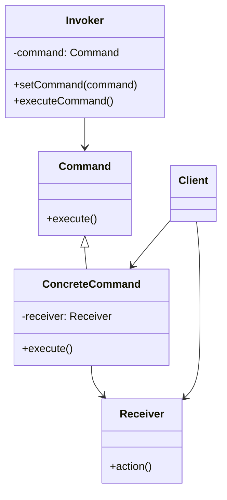
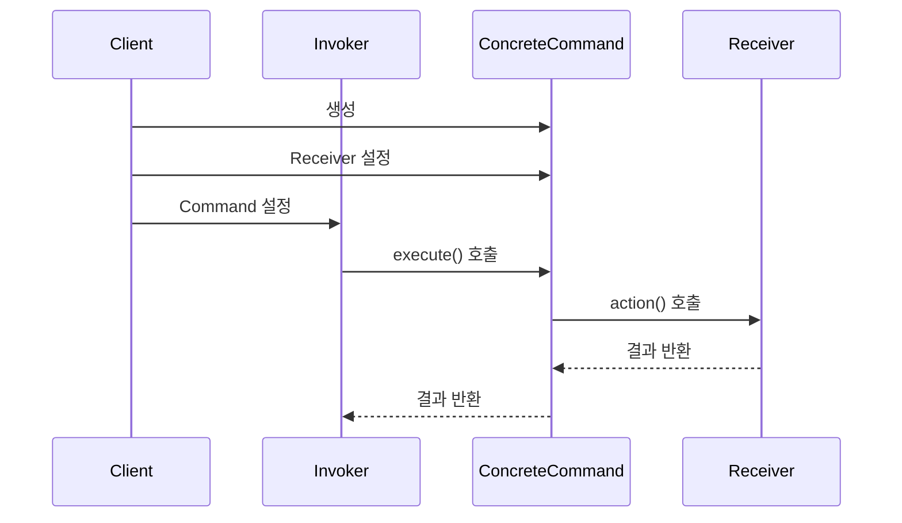
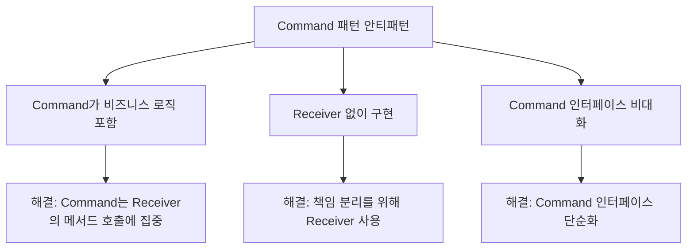

```table-of-contents
title: 
style: nestedList # TOC style (nestedList|nestedOrderedList|inlineFirstLevel)
minLevel: 0 # Include headings from the specified level
maxLevel: 0 # Include headings up to the specified level
includeLinks: true # Make headings clickable
hideWhenEmpty: false # Hide TOC if no headings are found
debugInConsole: false # Print debug info in Obsidian console
```
# Command 패턴 개념 이해

## 기본 개념

Command 패턴은 요청을 객체의 형태로 캡슐화하여 매개변수화하고, 요청을 대기시키거나 로깅하며, 취소 가능한 연산을 지원하는 행동 디자인 패턴이다. 간단히 말해 실행될 명령을 객체 형태로 저장하고 관리하는 패턴이다.

실생활에서는 식당의 주문서와 유사하다. 손님(Client)이 웨이터(Invoker)에게 주문서(Command)를 전달하면 웨이터는 주방(Receiver)에 주문서를 전달한다. 주방은 주문서에 따라 요리를 만들고, 이 과정에서 주문서는 요청 내용을 담고 있는 객체가 된다.

## 구성 요소

1. **Command** - 연산 수행에 필요한 인터페이스를 정의한다
2. **ConcreteCommand** - Command 인터페이스를 구현하고 실제 실행될 명령을 구현한다
3. **Invoker** - Command 객체를 실행(호출)하는 역할을 한다
4. **Receiver** - Command에 정의된 연산을 수행하는 실제 객체이다
5. **Client** - ConcreteCommand 객체를 생성하고 Receiver를 설정한다

## 기본 구조



# Command 패턴의 동작 방식

## 기본 동작 흐름

1. Client가 ConcreteCommand 객체를 생성하고 Receiver를 설정한다
2. Invoker에게 Command 객체를 전달한다
3. Invoker가 Command 객체의 execute() 메서드를 호출한다
4. ConcreteCommand는 Receiver의 액션 메서드를 호출하여 실제 작업을 수행한다

## 동작 시퀀스



# 실제 사용 예시

## PHP 예시

```php
<?php
// Command 인터페이스
interface Command {
    public function execute();
}

// Receiver 클래스
class TextEditor {
    private $text = "";
    
    public function write($text) {
        $this->text .= $text;
        echo "텍스트 추가: $text\n";
    }
    
    public function delete($size) {
        $deletedText = substr($this->text, -$size);
        $this->text = substr($this->text, 0, -$size);
        echo "텍스트 삭제: $deletedText\n";
        return $deletedText;
    }
    
    public function getText() {
        return $this->text;
    }
}

// ConcreteCommand 클래스
class WriteCommand implements Command {
    private $editor;
    private $text;
    
    public function __construct(TextEditor $editor, $text) {
        $this->editor = $editor;
        $this->text = $text;
    }
    
    public function execute() {
        $this->editor->write($this->text);
    }
}

class DeleteCommand implements Command {
    private $editor;
    private $size;
    private $backup;
    
    public function __construct(TextEditor $editor, $size) {
        $this->editor = $editor;
        $this->size = $size;
    }
    
    public function execute() {
        $this->backup = $this->editor->delete($this->size);
    }
    
    public function undo() {
        if ($this->backup) {
            $this->editor->write($this->backup);
        }
    }
}

// Invoker 클래스
class CommandHistory {
    private $history = [];
    
    public function executeCommand(Command $command) {
        $command->execute();
        $this->history[] = $command;
    }
    
    public function undo() {
        $command = array_pop($this->history);
        if ($command && method_exists($command, 'undo')) {
            $command->undo();
        }
    }
}

// Client 코드
$editor = new TextEditor();
$history = new CommandHistory();

// 명령 실행
$history->executeCommand(new WriteCommand($editor, "안녕하세요, "));
$history->executeCommand(new WriteCommand($editor, "Command 패턴입니다!"));
echo "현재 텍스트: " . $editor->getText() . "\n";

// 삭제 명령 실행
$history->executeCommand(new DeleteCommand($editor, 10));
echo "현재 텍스트: " . $editor->getText() . "\n";

// 실행 취소
$history->undo();
echo "실행 취소 후 텍스트: " . $editor->getText() . "\n";
```

## Python 예시

```python
from abc import ABC, abstractmethod
from typing import List, Optional

# Command 인터페이스
class Command(ABC):
    @abstractmethod
    def execute(self) -> None:
        pass
    
    def undo(self) -> None:
        pass

# Receiver 클래스
class Light:
    def __init__(self, name: str):
        self.name = name
        self.is_on = False
        
    def turn_on(self) -> None:
        self.is_on = True
        print(f"{self.name} 조명이 켜졌습니다.")
        
    def turn_off(self) -> None:
        self.is_on = False
        print(f"{self.name} 조명이 꺼졌습니다.")

# ConcreteCommand 클래스
class LightOnCommand(Command):
    def __init__(self, light: Light):
        self.light = light
        
    def execute(self) -> None:
        self.light.turn_on()
        
    def undo(self) -> None:
        self.light.turn_off()

class LightOffCommand(Command):
    def __init__(self, light: Light):
        self.light = light
        
    def execute(self) -> None:
        self.light.turn_off()
        
    def undo(self) -> None:
        self.light.turn_on()

# 여러 명령을 한 번에 실행하는 매크로 명령
class MacroCommand(Command):
    def __init__(self, commands: List[Command]):
        self.commands = commands
        
    def execute(self) -> None:
        for command in self.commands:
            command.execute()
            
    def undo(self) -> None:
        # 역순으로 실행 취소
        for command in reversed(self.commands):
            command.undo()

# Invoker 클래스
class RemoteControl:
    def __init__(self):
        self.command: Optional[Command] = None
        self.history: List[Command] = []
        
    def set_command(self, command: Command) -> None:
        self.command = command
        
    def press_button(self) -> None:
        if self.command:
            self.command.execute()
            self.history.append(self.command)
        
    def press_undo_button(self) -> None:
        if self.history:
            last_command = self.history.pop()
            last_command.undo()

# Client 코드
def main():
    # Receiver 생성
    living_room_light = Light("거실")
    kitchen_light = Light("주방")
    
    # Command 생성
    living_room_light_on = LightOnCommand(living_room_light)
    living_room_light_off = LightOffCommand(living_room_light)
    kitchen_light_on = LightOnCommand(kitchen_light)
    kitchen_light_off = LightOffCommand(kitchen_light)
    
    # 모든 조명을 한 번에 켜는 매크로 명령
    all_lights_on = MacroCommand([living_room_light_on, kitchen_light_on])
    all_lights_off = MacroCommand([living_room_light_off, kitchen_light_off])
    
    # Invoker 생성
    remote = RemoteControl()
    
    # 명령 실행
    remote.set_command(living_room_light_on)
    remote.press_button()  # 거실 조명 켜기
    
    remote.set_command(kitchen_light_on)
    remote.press_button()  # 주방 조명 켜기
    
    remote.set_command(all_lights_off)
    remote.press_button()  # 모든 조명 끄기
    
    # 실행 취소 (모든 조명이 다시 켜짐)
    remote.press_undo_button()
    
if __name__ == "__main__":
    main()
```

## JavaScript 예시

```javascript
// Receiver 클래스
class AudioPlayer {
  constructor() {
    this.isPlaying = false;
    this.currentTrack = null;
    this.volume = 50;
  }

  play(track) {
    this.currentTrack = track;
    this.isPlaying = true;
    console.log(`재생 중: ${track}, 볼륨: ${this.volume}%`);
  }

  stop() {
    if (this.isPlaying) {
      this.isPlaying = false;
      console.log(`중지됨: ${this.currentTrack}`);
    }
  }

  setVolume(percent) {
    const oldVolume = this.volume;
    this.volume = percent;
    console.log(`볼륨 변경: ${oldVolume}% -> ${percent}%`);
    return oldVolume;
  }
}

// Command 인터페이스 (JavaScript에서는 암묵적인 인터페이스)
class Command {
  execute() {}
  undo() {}
}

// ConcreteCommand 클래스
class PlayCommand extends Command {
  constructor(player, track) {
    super();
    this.player = player;
    this.track = track;
    this.previousTrack = null;
  }

  execute() {
    this.previousTrack = this.player.currentTrack;
    this.player.play(this.track);
  }

  undo() {
    if (this.previousTrack) {
      this.player.play(this.previousTrack);
    } else {
      this.player.stop();
    }
  }
}

class StopCommand extends Command {
  constructor(player) {
    super();
    this.player = player;
    this.trackBeforeStop = null;
    this.wasPlaying = false;
  }

  execute() {
    this.trackBeforeStop = this.player.currentTrack;
    this.wasPlaying = this.player.isPlaying;
    this.player.stop();
  }

  undo() {
    if (this.wasPlaying && this.trackBeforeStop) {
      this.player.play(this.trackBeforeStop);
    }
  }
}

class VolumeCommand extends Command {
  constructor(player, volume) {
    super();
    this.player = player;
    this.volume = volume;
    this.previousVolume = null;
  }

  execute() {
    this.previousVolume = this.player.setVolume(this.volume);
  }

  undo() {
    if (this.previousVolume !== null) {
      this.player.setVolume(this.previousVolume);
    }
  }
}

// Invoker 클래스
class MusicApp {
  constructor() {
    this.history = [];
  }

  executeCommand(command) {
    command.execute();
    this.history.push(command);
  }

  undo() {
    if (this.history.length > 0) {
      const command = this.history.pop();
      command.undo();
    } else {
      console.log("실행 취소할 명령이 없습니다.");
    }
  }
}

// Client 코드
function runMusicApp() {
  const player = new AudioPlayer();
  const app = new MusicApp();

  console.log("=== 음악 플레이어 명령 패턴 예시 ===");
  
  // 음악 재생
  app.executeCommand(new PlayCommand(player, "Imagine Dragons - Believer"));
  
  // 볼륨 변경
  app.executeCommand(new VolumeCommand(player, 75));
  
  // 다른 트랙 재생
  app.executeCommand(new PlayCommand(player, "Coldplay - Viva La Vida"));
  
  // 재생 중지
  app.executeCommand(new StopCommand(player));
  
  console.log("\n=== 실행 취소 테스트 ===");
  
  // 가장 최근 명령 실행 취소 (재생 중지 취소)
  app.undo();
  
  // 이전 명령 실행 취소 (이전 트랙으로 돌아가기)
  app.undo();
  
  // 이전 명령 실행 취소 (볼륨 복원)
  app.undo();
}

// 실행
runMusicApp();
```

# Command 패턴의 고급 활용법

## 명령 대기열(Queue)

Command 패턴을 활용하여 명령을 대기열에 넣고 순차적으로 실행하는 것이 가능하다. 이를 통해 작업 스케줄링을 구현할 수 있다.

```php
// PHP에서의 명령 대기열 예시
class CommandQueue {
    private $queue = [];
    
    public function addCommand(Command $command) {
        $this->queue[] = $command;
    }
    
    public function processCommands() {
        while (!empty($this->queue)) {
            $command = array_shift($this->queue);
            $command->execute();
        }
    }
}
```

## 명령 로깅 및 복구

모든 명령을 로그에 기록하고, 필요시 시스템이 충돌하더라도 로그를 재생하여 상태를 복구할 수 있다.

```python
# Python에서의 명령 로깅 예시
class CommandLogger:
    def __init__(self, file_path):
        self.file_path = file_path
        
    def log_command(self, command):
        with open(self.file_path, 'a') as f:
            # 명령을 직렬화하여 저장
            f.write(f"{command.__class__.__name__}\n")
            
    def replay_commands(self, invoker):
        with open(self.file_path, 'r') as f:
            for line in f:
                command_name = line.strip()
                # 명령 객체 복원 및 실행
                # 실제 구현은 복잡할 수 있음
```

## Composite Command

여러 명령을 그룹화하여 한 번에 실행하는 매크로 명령을 구현할 수 있다.

```javascript
// JavaScript에서의 Composite Command 예시
class CompositeCommand extends Command {
  constructor(commands = []) {
    super();
    this.commands = commands;
  }
  
  add(command) {
    this.commands.push(command);
  }
  
  execute() {
    this.commands.forEach(command => command.execute());
  }
  
  undo() {
    // 역순으로 undo 실행
    for (let i = this.commands.length - 1; i >= 0; i--) {
      this.commands[i].undo();
    }
  }
}
```

# 주의사항

## 성능 고려사항

- Command 객체가 많아질 경우 메모리 사용량이 증가한다.
- 복잡한 Command 체인은 디버깅을 어렵게 만들 수 있다.
- Command 객체의 상태를 저장하면 메모리 사용량이 증가할 수 있다.

## 보안 고려사항

- 권한 검증 기능을 Command 패턴에 추가하여 명령 실행 전 권한을 확인해야 한다.
- Command 객체가 직렬화될 경우 보안 취약점이 발생할 수 있으므로 주의해야 한다.

## 일반적인 안티 패턴

- Command 객체에 비즈니스 로직을 너무 많이 넣는 것
- Receiver 객체 없이 Command 내부에 모든 로직을 구현하는 것
- Command 인터페이스에 너무 많은 메서드를 추가하는 것



# 결론

Command 패턴은 요청을 객체화하여 다양한 요청을 매개변수화하고, 요청을 대기시키거나 로깅하며, 실행 취소 기능을 지원하는 강력한 디자인 패턴이다. 이 패턴은 GUI 버튼, 메뉴 항목의 액션, 트랜잭션 처리, 작업 스케줄링 등 다양한 상황에서 유용하게 활용될 수 있다.

특히 명령의 실행 취소(Undo), 재실행(Redo), 이력 관리, 트랜잭션 처리 등이 필요한 상황에서 Command 패턴은 매우 효과적인 해결책을 제공한다. 하지만 단순한 경우에는 오버엔지니어링이 될 수 있으므로, 패턴의 복잡성과 이점을 고려하여 적절히 사용하는 것이 중요하다.