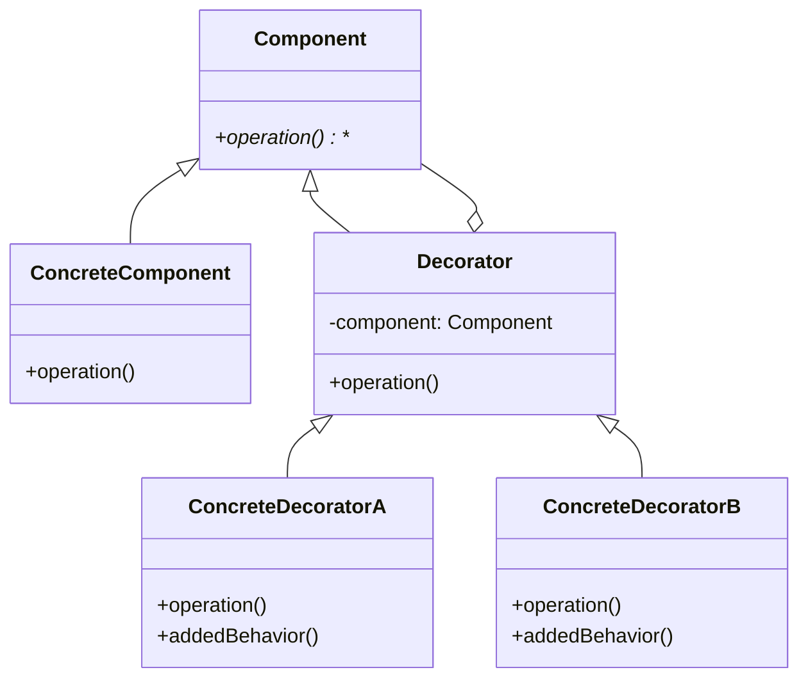

# 개념 설명

데코레이터 패턴은 객체에 동적으로 새로운 책임(기능)을 추가할 수 있게 해주는 구조적 디자인 패턴이다. 이 패턴은 기존 클래스를 수정하지 않고도 객체의 기능을 확장할 수 있는 유연한 대안을 제공한다.

## 실생활 비유

커피를 주문하는 과정을 생각해보자. 기본 커피(에스프레소)에 우유, 시럽, 휘핑크림 등을 추가하여 다양한 음료를 만들 수 있다. 각 추가 요소는 기본 커피의 가격과 특성을 "장식(데코레이션)"한다. 데코레이터 패턴도 이와 유사하게 기본 객체에 기능을 추가하는 방식으로 동작한다.

## 느낀 점

- 데코레이터 패턴을 적용시키는 등 OCP를 생각하면 도메인에 대한 지식은 필수적이다
# 기본 동작 방식

데코레이터 패턴의 구조는 다음과 같다:



1. Component: 기본 인터페이스나 추상 클래스로, 데코레이터와 실제 구현체가 공통으로 구현해야 하는 메서드를 정의한다.
2. ConcreteComponent: 실제 기본 객체의 구현체이다.
3. Decorator: 모든 데코레이터의 기본 클래스로, Component 객체를 참조한다.
4. ConcreteDecorator: 구체적인 기능을 추가하는 데코레이터 클래스들이다.

# 실제 사용 예시

## Python 예시

```python
# Component 인터페이스
from abc import ABC, abstractmethod

class Coffee(ABC):
    @abstractmethod
    def get_cost(self):
        pass
    
    @abstractmethod
    def get_description(self):
        pass

# ConcreteComponent
class Espresso(Coffee):
    def get_cost(self):
        return 2000
    
    def get_description(self):
        return "에스프레소"

# Decorator
class CoffeeDecorator(Coffee):
    def __init__(self, coffee):
        self._coffee = coffee
    
    def get_cost(self):
        return self._coffee.get_cost()
    
    def get_description(self):
        return self._coffee.get_description()

# ConcreteDecorator
class Milk(CoffeeDecorator):
    def __init__(self, coffee):
        super().__init__(coffee)
    
    def get_cost(self):
        return self._coffee.get_cost() + 500
    
    def get_description(self):
        return self._coffee.get_description() + ", 우유 추가"

class Whip(CoffeeDecorator):
    def __init__(self, coffee):
        super().__init__(coffee)
    
    def get_cost(self):
        return self._coffee.get_cost() + 300
    
    def get_description(self):
        return self._coffee.get_description() + ", 휘핑크림 추가"

# 사용 예시
if __name__ == "__main__":
    # 기본 에스프레소
    coffee = Espresso()
    print(f"{coffee.get_description()}: {coffee.get_cost()}원")
    
    # 우유 추가
    coffee = Milk(coffee)
    print(f"{coffee.get_description()}: {coffee.get_cost()}원")
    
    # 휘핑크림 추가
    coffee = Whip(coffee)
    print(f"{coffee.get_description()}: {coffee.get_cost()}원")
```

실행 결과:

```
에스프레소: 2000원
에스프레소, 우유 추가: 2500원
에스프레소, 우유 추가, 휘핑크림 추가: 2800원
```

## JavaScript 예시

```javascript
// Component 인터페이스
class TextFormatter {
  format(text) {
    return text;
  }
}

// ConcreteComponent
class PlainTextFormatter extends TextFormatter {
  format(text) {
    return text;
  }
}

// Decorator
class TextFormatterDecorator extends TextFormatter {
  constructor(formatter) {
    super();
    this.formatter = formatter;
  }
  
  format(text) {
    return this.formatter.format(text);
  }
}

// ConcreteDecorator
class BoldDecorator extends TextFormatterDecorator {
  format(text) {
    return `<b>${this.formatter.format(text)}</b>`;
  }
}

class ItalicDecorator extends TextFormatterDecorator {
  format(text) {
    return `<i>${this.formatter.format(text)}</i>`;
  }
}

class UnderlineDecorator extends TextFormatterDecorator {
  format(text) {
    return `<u>${this.formatter.format(text)}</u>`;
  }
}

// 사용 예시
const text = "Hello, Decorator Pattern!";
let formatter = new PlainTextFormatter();

console.log("Plain text:", formatter.format(text));

// Bold 데코레이터 추가
formatter = new BoldDecorator(formatter);
console.log("Bold text:", formatter.format(text));

// Italic 데코레이터 추가
formatter = new ItalicDecorator(formatter);
console.log("Bold and Italic text:", formatter.format(text));

// Underline 데코레이터 추가
formatter = new UnderlineDecorator(formatter);
console.log("Bold, Italic and Underline text:", formatter.format(text));
```

실행 결과:

```
Plain text: Hello, Decorator Pattern!
Bold text: <b>Hello, Decorator Pattern!</b>
Bold and Italic text: <i><b>Hello, Decorator Pattern!</b></i>
Bold, Italic and Underline text: <u><i><b>Hello, Decorator Pattern!</b></i></u>
```

## PHP 예시

```php
<?php

// Component 인터페이스
interface Logger {
    public function log($message);
}

// ConcreteComponent
class FileLogger implements Logger {
    private $filename;
    
    public function __construct($filename) {
        $this->filename = $filename;
    }
    
    public function log($message) {
        return "파일에 로그 저장: {$message}";
    }
}

// Decorator
abstract class LoggerDecorator implements Logger {
    protected $logger;
    
    public function __construct(Logger $logger) {
        $this->logger = $logger;
    }
    
    public function log($message) {
        return $this->logger->log($message);
    }
}

// ConcreteDecorator
class TimestampDecorator extends LoggerDecorator {
    public function log($message) {
        $timestamp = date('Y-m-d H:i:s');
        return $this->logger->log("[{$timestamp}] {$message}");
    }
}

class EncryptionDecorator extends LoggerDecorator {
    public function log($message) {
        // 간단한 암호화 예시
        $encrypted = base64_encode($message);
        return $this->logger->log("암호화된 메시지: {$encrypted}");
    }
}

// 사용 예시
$logger = new FileLogger("app.log");
echo $logger->log("사용자 로그인") . "\n";

// 타임스탬프 데코레이터 추가
$logger = new TimestampDecorator($logger);
echo $logger->log("사용자 로그인") . "\n";

// 암호화 데코레이터 추가
$logger = new EncryptionDecorator($logger);
echo $logger->log("사용자 로그인") . "\n";
?>
```

실행 결과:

```
파일에 로그 저장: 사용자 로그인
파일에 로그 저장: [2025-03-24 15:30:45] 사용자 로그인
파일에 로그 저장: 암호화된 메시지: 7IWc7ZuE7J6Q66W8IOuhnOq3uOyduA==
```

# 고급 활용법

## 데코레이터 패턴의 장점 활용

1. **단일 책임 원칙(SRP) 준수**: 각 데코레이터는 하나의 추가 기능에만 집중한다.
2. **개방-폐쇄 원칙(OCP) 준수**: 기존 코드를 수정하지 않고 기능을 확장할 수 있다.
3. **런타임에 동적으로 기능 조합**: 필요한 기능을 필요한 시점에 조합하여 사용할 수 있다.

## 실제 프레임워크 활용 사례

### Python Flask 미들웨어

Flask 웹 프레임워크에서는 데코레이터 패턴을 사용해 라우팅과 미들웨어를 구현한다:

```python
from flask import Flask

app = Flask(__name__)

# 데코레이터를 사용한 라우팅
@app.route('/hello')
def hello():
    return 'Hello, World!'

# 인증 미들웨어 데코레이터
def requires_auth(f):
    def decorated(*args, **kwargs):
        # 인증 로직
        auth = request.authorization
        if not auth:
            return '인증 필요', 401
        return f(*args, **kwargs)
    return decorated

# 인증 데코레이터 적용
@app.route('/protected')
@requires_auth
def protected_resource():
    return '보호된 자원에 접근했습니다.'
```

### Laravel의 미들웨어 체인

Laravel PHP 프레임워크에서도 데코레이터 패턴과 유사한 방식으로 HTTP 요청 처리 미들웨어를 체인할 수 있다:

```php
<?php

namespace App\Http\Middleware;

use Closure;

class LogRequest
{
    public function handle($request, Closure $next)
    {
        // 요청 로깅
        Log::info('요청 수신: ' . $request->fullUrl());
        
        // 다음 미들웨어로 요청 전달
        $response = $next($request);
        
        // 응답 반환
        return $response;
    }
}
```

# 주의사항

## 데코레이터 패턴 사용 시 고려할 점

1. **복잡성 증가**: 데코레이터가 많아지면 객체 생성 코드가 복잡해질 수 있다.
    
    ```python
    # 복잡한 데코레이터 체인
    coffee = Whip(Chocolate(Milk(Espresso())))
    ```
    
2. **타입 의존성 문제**: 구체적인 구현 타입에 의존하는 코드에서는 사용이 어려울 수 있다.
    
3. **데코레이터 순서 중요**: 데코레이터 적용 순서에 따라 결과가 달라질 수 있다.
    
    ```javascript
    // 결과가 다름
    const text1 = new BoldDecorator(new ItalicDecorator(formatter)).format(text);
    const text2 = new ItalicDecorator(new BoldDecorator(formatter)).format(text);
    ```
    

## 문제 해결 방법

1. **팩토리 패턴 결합**: 팩토리 패턴을 사용하여 복잡한 데코레이터 생성 로직을 캡슐화한다.
    
    ```python
    # 완전한 커피 팩토리 예시
    class CoffeeFactory:
        # 기본 커피 타입들
        @staticmethod
        def create_espresso():
            return Espresso()
        
        @staticmethod
        def create_americano():
            # 에스프레소에 물을 추가
            return Water(Espresso())
        
        # 우유 기반 커피
        @staticmethod
        def create_latte(size="regular", extra_shot=False):
            coffee = Espresso()
            
            # 추가 샷 옵션
            if extra_shot:
                coffee = ExtraShot(coffee)
            
            # 사이즈별 우유 양 조절
            if size == "small":
                return MilkSmall(coffee)
            elif size == "large":
                return MilkLarge(coffee)
            else:  # regular
                return Milk(coffee)
        
        @staticmethod
        def create_mocha(whipped_cream=True):
            # 모카는 에스프레소 + 우유 + 초콜릿 시럽
            coffee = Chocolate(Milk(Espresso()))
            
            # 휘핑크림 옵션
            if whipped_cream:
                coffee = Whip(coffee)
                
            return coffee
        
        @staticmethod
        def create_caramel_macchiato(iced=False):
            # 카라멜 마키아토 베이스
            coffee = Milk(Espresso())
            
            # 카라멜 시럽 추가
            coffee = Caramel(coffee)
            
            # 아이스 옵션
            if iced:
                coffee = Ice(coffee)
                
            return coffee
            
        # 시즌 스페셜 메뉴
        @staticmethod
        def create_seasonal_special():
            # 복잡한 시즌 스페셜 커피 생성
            coffee = Espresso()
            coffee = Milk(coffee)
            coffee = Cinnamon(coffee)
            coffee = Whip(coffee)
            coffee = CaramelDrizzle(coffee)
            
            return coffee
    
    # 사용 예시
    if __name__ == "__main__":
        # 기본 커피
        espresso = CoffeeFactory.create_espresso()
        print(f"{espresso.get_description()}: {espresso.get_cost()}원")
        
        # 라떼 (다양한 옵션)
        latte = CoffeeFactory.create_latte()
        print(f"{latte.get_description()}: {latte.get_cost()}원")
        
        large_latte_extra_shot = CoffeeFactory.create_latte(size="large", extra_shot=True)
        print(f"{large_latte_extra_shot.get_description()}: {large_latte_extra_shot.get_cost()}원")
        
        # 모카
        mocha = CoffeeFactory.create_mocha()
        print(f"{mocha.get_description()}: {mocha.get_cost()}원")
        
        mocha_no_cream = CoffeeFactory.create_mocha(whipped_cream=False)
        print(f"{mocha_no_cream.get_description()}: {mocha_no_cream.get_cost()}원")
        
        # 계절 스페셜
        special = CoffeeFactory.create_seasonal_special()
        print(f"{special.get_description()}: {special.get_cost()}원")
    ```
    
    이렇게 팩토리 패턴을 사용하면 다음과 같은 이점이 있다:
    
    - **복잡한 생성 로직 은닉**: 클라이언트 코드는 복잡한 데코레이터 체인을 알 필요 없이 간단한 메서드 호출만으로 객체를 생성할 수 있다.
    - **중앙화된 객체 생성 관리**: 객체 생성 로직이 한 곳에 모여 있어 유지보수가 용이하다.
    - **확장성**: 새로운 커피 종류가 필요하면 팩토리에 메서드만 추가하면 된다.
    - **매개변수화**: 사이즈, 추가 옵션 등을 매개변수로 받아 다양한 변형을 쉽게 지원할 수 있다.
2. **빌더 패턴 적용**: 빌더 패턴을 사용하여 데코레이터 체인 구성을 단순화한다.
    
    ```javascript
    class TextFormatterBuilder {
        constructor() {
            this.formatter = new PlainTextFormatter();
        }
        
        bold() {
            this.formatter = new BoldDecorator(this.formatter);
            return this;
        }
        
        italic() {
            this.formatter = new ItalicDecorator(this.formatter);
            return this;
        }
        
        underline() {
            this.formatter = new UnderlineDecorator(this.formatter);
            return this;
        }
        
        build() {
            return this.formatter;
        }
    }
    
    // 사용 예시
    const formatter = new TextFormatterBuilder()
        .bold()
        .italic()
        .underline()
        .build();
    ```
    

# Performance 최적화

데코레이터 패턴을 사용할 때 성능 최적화를 위한 몇 가지 방법을 자세히 살펴보자:

## 1. 캐싱 도입 (Caching)

동일한 데코레이터 체인의 결과를 캐싱하여 반복 계산을 피하고 성능을 향상시킬 수 있다.

```python
class CachedCoffeeDecorator(CoffeeDecorator):
    # 클래스 변수로 캐시 저장
    _cost_cache = {}  # {coffee_id: calculated_cost}
    _description_cache = {}  # {coffee_id: calculated_description}
    
    def __init__(self, coffee):
        super().__init__(coffee)
        # 고유 식별자 생성 (간단한 예시)
        self._id = id(coffee)
    
    def get_cost(self):
        # 캐시에 값이 있는지 확인
        if self._id not in self._cost_cache:
            # 계산 후 캐시에 저장
            cost = super().get_cost()
            self._cost_cache[self._id] = cost
            return cost
        # 캐시된 값 반환
        return self._cost_cache[self._id]
    
    def get_description(self):
        if self._id not in self._description_cache:
            description = super().get_description()
            self._description_cache[self._id] = description
            return description
        return self._description_cache[self._id]
    
    @classmethod
    def clear_cache(cls):
        """필요 시 캐시 초기화"""
        cls._cost_cache.clear()
        cls._description_cache.clear()

# 실제 구현 예시 - 캐싱된 우유 데코레이터
class CachedMilk(CachedCoffeeDecorator):
    def get_cost(self):
        # 캐시에 값이 있는지 확인
        if self._id not in self._cost_cache:
            # 우유 추가 비용 계산 후 캐시
            cost = self._coffee.get_cost() + 500
            self._cost_cache[self._id] = cost
            return cost
        return self._cost_cache[self._id]
    
    def get_description(self):
        if self._id not in self._description_cache:
            description = self._coffee.get_description() + ", 우유 추가"
            self._description_cache[self._id] = description
            return description
        return self._description_cache[self._id]

# 성능 측정 예시
import time

def measure_performance(coffee_creator, n=10000):
    start = time.time()
    for _ in range(n):
        coffee = coffee_creator()
        _ = coffee.get_cost()
        _ = coffee.get_description()
    end = time.time()
    return end - start

# 일반 데코레이터
def create_regular():
    return Whip(Chocolate(Milk(Espresso())))

# 캐싱 데코레이터
def create_cached():
    return CachedMilk(Espresso())

# 성능 비교
reg_time = measure_performance(create_regular)
cached_time = measure_performance(create_cached)
print(f"일반 데코레이터: {reg_time:.4f}초")
print(f"캐싱 데코레이터: {cached_time:.4f}초")
print(f"성능 향상: {(reg_time - cached_time) / reg_time * 100:.2f}%")
```

## 2. 지연 계산(Lazy Evaluation)

복잡한 계산이나 리소스 집약적인 작업을 데코레이터에서 실제로 필요할 때까지 지연시키는, 더 완성된 구현:

```python
class LazyDecorator(CoffeeDecorator):
    def __init__(self, coffee):
        super().__init__(coffee)
        self._cached_cost = None
        self._cached_description = None
        self._ingredients_calculated = False
        self._ingredients = None
        self._allergies_checked = False
        self._contains_allergens = None
    
    def get_cost(self):
        """가격은 실제 요청이 있을 때만 계산"""
        if self._cached_cost is None:
            # 비용 계산 시뮬레이션 (실제로는 복잡한 계산이 될 수 있음)
            print("비용 계산 수행 중...")
            self._cached_cost = self._calculate_cost()
        return self._cached_cost
    
    def _calculate_cost(self):
        # 실제 계산 로직 (비용이 많이 드는 작업 가정)
        base_cost = self._coffee.get_cost()
        # 추가 비용 계산 (세금, 특별 재료 비용 등)
        additional_cost = 200  # 예시
        return base_cost + additional_cost
    
    def get_description(self):
        """설명도 요청 시 계산"""
        if self._cached_description is None:
            print("설명 생성 중...")
            self._cached_description = self._coffee.get_description() + ", 특별 재료 추가"
        return self._cached_description
    
    def get_ingredients(self):
        """재료 목록은 요청 시에만 계산"""
        if not self._ingredients_calculated:
            print("재료 분석 중...")
            # 기본 커피 재료 가져오기
            base_ingredients = getattr(self._coffee, 'get_ingredients', lambda: [])()
            # 특별 재료 추가
            self._ingredients = base_ingredients + ["특별 재료"]
            self._ingredients_calculated = True
        return self._ingredients
    
    def contains_allergens(self, allergen_list):
        """알레르기 체크는 요청 시에만 수행"""
        if not self._allergies_checked:
            print("알레르기 체크 중...")
            ingredients = self.get_ingredients()
            self._contains_allergens = any(allergen in ingredients for allergen in allergen_list)
            self._allergies_checked = True
        return self._contains_allergens

# 사용 예시
special_coffee = LazyDecorator(Espresso())

# 초기에는 아무 계산도 수행하지 않음
print("커피 객체 생성됨, 아직 계산 안 함")

# 가격 요청 시 계산 수행
print(f"가격: {special_coffee.get_cost()}원")  # 처음 호출 시 계산
print(f"가격 재요청: {special_coffee.get_cost()}원")  # 캐시된 값 사용

# 설명 요청 시 계산
print(f"설명: {special_coffee.get_description()}")  # 처음 호출 시 계산
print(f"설명 재요청: {special_coffee.get_description()}")  # 캐시된 값 사용

# 재료 및 알레르기 정보는 필요할 때만 계산
print(f"재료: {special_coffee.get_ingredients()}")
print(f"우유 알레르기: {special_coffee.contains_allergens(['우유'])}")
```

## 3. 경량 데코레이터 (Flyweight Decorator)

필요한 기능만 포함하고 공유 가능한 상태를 분리하여 메모리 사용량을 최소화하는 방법:

```python
# 경량 패턴을 활용한 데코레이터 예시
class FlavorInfo:
    """여러 데코레이터 간에 공유되는 정보를 저장"""
    def __init__(self, name, cost, description):
        self.name = name
        self.cost = cost
        self.description = description

# 미리 정의된 공유 정보들
FLAVOR_REGISTRY = {
    'milk': FlavorInfo('우유', 500, '우유 추가'),
    'whip': FlavorInfo('휘핑크림', 300, '휘핑크림 추가'),
    'chocolate': FlavorInfo('초콜릿', 400, '초콜릿 시럽 추가'),
    'caramel': FlavorInfo('카라멜', 400, '카라멜 시럽 추가'),
    'vanilla': FlavorInfo('바닐라', 350, '바닐라 시럽 추가'),
}

class FlyweightDecorator(CoffeeDecorator):
    """경량 패턴을 적용한 데코레이터"""
    def __init__(self, coffee, flavor_key):
        super().__init__(coffee)
        # 공유 정보 참조만 저장 (객체 복사 X)
        self.flavor_info = FLAVOR_REGISTRY[flavor_key]
    
    def get_cost(self):
        return self._coffee.get_cost() + self.flavor_info.cost
    
    def get_description(self):
        return f"{self._coffee.get_description()}, {self.flavor_info.description}"

# 메모리 사용량 시뮬레이션
import sys

def create_many_coffees(decorator_class, n=1000):
    """여러 커피 객체 생성하여 메모리 사용량 테스트"""
    coffees = []
    base = Espresso()
    
    if decorator_class == FlyweightDecorator:
        # 경량 데코레이터 사용
        for _ in range(n):
            # 동일한 정보 객체를 참조하는 여러 데코레이터
            coffee = FlyweightDecorator(base, 'milk')
            coffee = FlyweightDecorator(coffee, 'whip')
            coffees.append(coffee)
    else:
        # 일반 데코레이터 사용
        for _ in range(n):
            # 매번 새 객체 생성
            coffee = Milk(base)
            coffee = Whip(coffee)
            coffees.append(coffee)
    
    # 근사적인 메모리 사용량 측정
    return sys.getsizeof(coffees) + sum(sys.getsizeof(c) for c in coffees)

# 메모리 사용량 비교
regular_mem = create_many_coffees(Milk)
flyweight_mem = create_many_coffees(FlyweightDecorator)

print(f"일반 데코레이터 메모리: {regular_mem:,} 바이트")
print(f"경량 데코레이터 메모리: {flyweight_mem:,} 바이트")
print(f"메모리 절약: {(regular_mem - flyweight_mem) / regular_mem * 100:.2f}%")
```

## 4. 실제 프로젝트 적용 시나리오

예를 들어, 대규모 웹 애플리케이션에서 HTTP 요청 처리를 위한 데코레이터 패턴 최적화:

```python
# 웹 API 요청 처리 예시
class APIRequest:
    def process(self, data):
        return {"result": "기본 API 응답"}

# 최적화된 데코레이터 체인
class CachingDecorator:
    """응답 캐싱 데코레이터"""
    _cache = {}  # 공유 캐시
    
    def __init__(self, api_handler, cache_ttl=300):  # 기본 5분 TTL
        self.api_handler = api_handler
        self.cache_ttl = cache_ttl
        self.last_updated = {}
    
    def process(self, data):
        # 캐시 키 생성 (실제로는 더 견고한 해싱 필요)
        cache_key = str(data)
        current_time = time.time()
        
        # 캐시 유효성 확인
        if (cache_key in self._cache and 
            current_time - self.last_updated.get(cache_key, 0) < self.cache_ttl):
            print("캐시 hit!")
            return self._cache[cache_key]
        
        # 캐시 miss - 실제 처리 수행
        print("캐시 miss - API 호출 중...")
        result = self.api_handler.process(data)
        
        # 결과 캐싱
        self._cache[cache_key] = result
        self.last_updated[cache_key] = current_time
        
        return result

class LoggingDecorator:
    """요청 로깅 데코레이터 - 필요한 정보만 기록"""
    def __init__(self, api_handler, log_level='info'):
        self.api_handler = api_handler
        self.log_level = log_level
    
    def process(self, data):
        # 필요한 최소 정보만 로깅
        print(f"[{self.log_level.upper()}] API 요청: {data.get('endpoint', 'unknown')}")
        
        start = time.time()
        result = self.api_handler.process(data)
        duration = time.time() - start
        
        # 실행 시간 로깅
        print(f"[{self.log_level.upper()}] 처리 시간: {duration:.4f}초")
        
        return result

# 실제 사용 예시
def handle_api_requests():
    # 기본 핸들러
    base_handler = APIRequest()
    
    # 최적화된 데코레이터 체인 구성
    # 1. 로깅 (최소 정보만)
    # 2. 캐싱 (중복 계산 방지)
    optimized_handler = CachingDecorator(LoggingDecorator(base_handler))
    
    # 여러 요청 처리
    for i in range(5):
        # 동일한 요청 여러 번 처리
        data = {"endpoint": "/users", "id": i % 2}  # id 0과 1만 반복
        result = optimized_handler.process(data)
        print(f"요청 {i+1} 결과: {result}\n")

# 실행
handle_api_requests()
```

이러한 최적화 기법들을 적절히 조합하면 데코레이터 패턴의 유연성을 유지하면서도 성능과 리소스 효율성을 크게 향상시킬 수 있다.

# Security 고려사항

데코레이터 패턴을 보안 관련 기능에 적용할 때 고려할 사항:

1. **인증 및 권한 부여**: 데코레이터를 사용해 보안 계층을 추가할 수 있다.
    
    ```python
    def require_admin(view_func):
        def decorated_view(*args, **kwargs):
            if not current_user.is_admin:
                return redirect(url_for('login'))
            return view_func(*args, **kwargs)
        return decorated_view
    
    @app.route('/admin')
    @require_admin
    def admin_dashboard():
        return render_template('admin.html')
    ```
    
2. **입력 검증**: 데이터 검증 로직을 데코레이터로 분리할 수 있다.
    
3. **로깅 및 감사**: 중요 작업에 대한, 로깅을 데코레이터로 자동화할 수 있다.
    

# 결론

데코레이터 패턴은 객체 지향 설계의 핵심 원칙을 따르면서 유연하게 기능을 확장할 수 있는 강력한 도구이다. 이 패턴을 통해 클래스 계층 구조를 복잡하게 만들지 않고도 객체의 책임을 동적으로 추가할 수 있다.

특히 다음과 같은 상황에서 데코레이터 패턴의 사용을 고려해볼 만하다:

1. 런타임에 객체의 기능을 동적으로 추가/제거해야 할 때
2. 상속으로 서브클래스를 만드는 것이 실용적이지 않을 때
3. 기능 조합이 다양하게 필요할 때
4. 기존 코드를 수정하지 않고 기능을 확장해야 할 때

디자인 패턴을 적용할 때는 항상 그 패턴이 해결하려는 문제와 자신의 상황이 일치하는지 고려해야 한다. 데코레이터 패턴은 강력하지만, 모든 상황에 적합한 것은 아니다. 상황에 맞게 적절히 활용하여 코드의 유연성과 확장성을 높이는 데 활용하자.