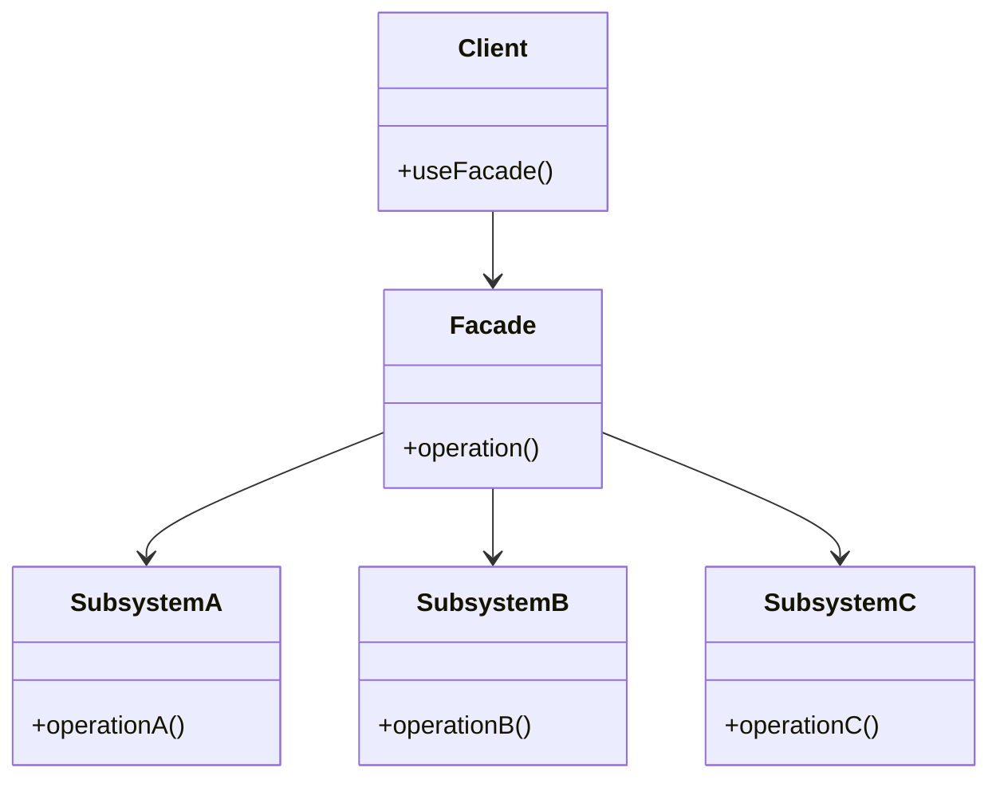

```table-of-contents
title: 
style: nestedList # TOC style (nestedList|nestedOrderedList|inlineFirstLevel)
minLevel: 0 # Include headings from the specified level
maxLevel: 0 # Include headings up to the specified level
includeLinks: true # Make headings clickable
hideWhenEmpty: false # Hide TOC if no headings are found
debugInConsole: false # Print debug info in Obsidian console
```

# 개념 설명

퍼사드(Facade) 디자인 패턴은 복잡한 하위 시스템에 대한 간단한 인터페이스를 제공하는 구조적 디자인 패턴이다. 이 패턴은 복잡한 시스템을 사용하기 쉽도록 상위 수준의 인터페이스를 정의하여 클라이언트 코드의 가독성과 사용성을 향상시킨다.

## 실생활 비유

퍼사드 패턴은 레스토랑의 웨이터와 같다. 손님(클라이언트)은 주문을 위해 주방(복잡한 하위 시스템)의 모든 요리사와 직접 상호작용할 필요가 없다. 대신 웨이터(퍼사드)가 주방과의 모든 상호작용을 처리한다. 웨이터는 주문을 받아 주방에 전달하고, 완성된 요리를 손님에게 제공하는 단순한 인터페이스를 제공한다.

# 기본 동작 방식

퍼사드 패턴의 핵심 구성 요소는 다음과 같다:

1. **퍼사드(Facade)**: 복잡한 하위 시스템을 추상화하는 상위 수준의 인터페이스를 제공한다.
2. **하위 시스템(Subsystem)**: 다양한 기능을 수행하는 여러 클래스의 집합이다.
3. **클라이언트(Client)**: 퍼사드를 통해 하위 시스템을 사용한다.



퍼사드 패턴의 동작 과정은 다음과 같다:

1. 클라이언트는 퍼사드 객체의 메서드를 호출한다.
2. 퍼사드는 요청을 적절한 하위 시스템 객체로 위임한다.
3. 하위 시스템 객체들은 요청된 작업을 수행한다.
4. 퍼사드는 하위 시스템의 결과를 클라이언트에 반환한다.

# 실제 사용 예시

## PHP (Laravel)

Laravel 프레임워크에서는 퍼사드 패턴을 광범위하게 사용하여 복잡한 기능을 간단하게 접근할 수 있도록 한다.

### Laravel 퍼사드 예시

```php
// 잘못된 예시 - 복잡한 하위 시스템 직접 사용
$cache = app('cache');
$value = $cache->store('redis')->get('key');

// 올바른 예시 - 퍼사드 사용
$value = \Cache::get('key');
```

### Laravel에서 사용자 정의 퍼사드 구현

```php
// 1. 서비스 클래스 (하위 시스템)
namespace App\Services;

class PaymentProcessor {
    protected $gateway;
    protected $logger;
    
    public function __construct($gateway, $logger) {
        $this->gateway = $gateway;
        $this->logger = $logger;
    }
    
    public function processPayment($amount) {
        // 결제 처리 로직
        $this->logger->log("결제 시도: $amount");
        $result = $this->gateway->charge($amount);
        $this->logger->log("결제 결과: " . json_encode($result));
        return $result;
    }
    
    public function refundPayment($transactionId) {
        // 환불 처리 로직
        return $this->gateway->refund($transactionId);
    }
}

// 2. 퍼사드 클래스
namespace App\Facades;

use Illuminate\Support\Facades\Facade;

class Payment extends Facade {
    protected static function getFacadeAccessor() {
        return 'payment.processor';
    }
}

// 3. 서비스 등록 (AppServiceProvider.php)
public function register() {
    $this->app->singleton('payment.processor', function ($app) {
        return new PaymentProcessor(
            $app->make('payment.gateway'),
            $app->make('log')
        );
    });
}

// 4. 퍼사드 사용
use App\Facades\Payment;

// 간단한 인터페이스로 복잡한 결제 프로세스 처리
$result = Payment::processPayment(100.00);
$refund = Payment::refundPayment($result->transaction_id);
```

## Python (Django)

Django는 명시적으로 퍼사드 패턴을 사용하지 않지만, 이를 구현하여 복잡한 기능을 단순화할 수 있다.

### Django 퍼사드 패턴 구현 예시

```python
# 잘못된 예시 - 복잡한 API 직접 사용
from django.core.mail import EmailMultiAlternatives
from django.template.loader import render_to_string
from django.utils.html import strip_tags

def send_welcome_email(user):
    subject = '환영합니다!'
    html_content = render_to_string('emails/welcome.html', {'user': user})
    text_content = strip_tags(html_content)
    
    email = EmailMultiAlternatives(
        subject, text_content, 'from@example.com', [user.email]
    )
    email.attach_alternative(html_content, "text/html")
    email.send()

# 올바른 예시 - 퍼사드 패턴 적용
class EmailFacade:
    @staticmethod
    def send_welcome_email(user):
        subject = '환영합니다!'
        template = 'emails/welcome.html'
        EmailFacade._send_email(subject, template, {'user': user}, [user.email])
    
    @staticmethod
    def send_order_confirmation(order, user):
        subject = '주문 확인'
        template = 'emails/order_confirmation.html'
        EmailFacade._send_email(subject, template, {'order': order, 'user': user}, [user.email])
    
    @staticmethod
    def _send_email(subject, template, context, recipients):
        html_content = render_to_string(template, context)
        text_content = strip_tags(html_content)
        
        email = EmailMultiAlternatives(
            subject, text_content, 'from@example.com', recipients
        )
        email.attach_alternative(html_content, "text/html")
        email.send()

# 사용 예시
user = User.objects.get(id=1)
EmailFacade.send_welcome_email(user)  # 간단한 인터페이스로 이메일 발송
```

### Django REST Framework에서 퍼사드 패턴 구현

```python
# 서비스 클래스 (하위 시스템)
class OrderService:
    def get_orders(self, user_id):
        return Order.objects.filter(user_id=user_id)
    
    def create_order(self, user_id, items):
        # 주문 생성 로직
        order = Order.objects.create(user_id=user_id)
        for item in items:
            OrderItem.objects.create(order=order, **item)
        # 결제 처리
        # 이메일 발송
        return order

class InventoryService:
    def check_availability(self, items):
        # 재고 확인 로직
        for item in items:
            if not self.is_available(item['product_id'], item['quantity']):
                return False
        return True
    
    def is_available(self, product_id, quantity):
        return Product.objects.get(id=product_id).stock >= quantity

# 퍼사드 클래스
class OrderFacade:
    def __init__(self):
        self.order_service = OrderService()
        self.inventory_service = InventoryService()
    
    def place_order(self, user_id, items):
        # 재고 확인
        if not self.inventory_service.check_availability(items):
            raise Exception("일부 상품의 재고가 부족합니다.")
        
        # 주문 생성
        return self.order_service.create_order(user_id, items)
    
    def get_user_orders(self, user_id):
        return self.order_service.get_orders(user_id)

# 뷰에서 사용
class OrderViewSet(viewsets.ViewSet):
    def __init__(self, **kwargs):
        super().__init__(**kwargs)
        self.order_facade = OrderFacade()
    
    def create(self, request):
        user_id = request.user.id
        items = request.data.get('items', [])
        
        try:
            order = self.order_facade.place_order(user_id, items)
            return Response(OrderSerializer(order).data, status=status.HTTP_201_CREATED)
        except Exception as e:
            return Response({'error': str(e)}, status=status.HTTP_400_BAD_REQUEST)
    
    def list(self, request):
        user_id = request.user.id
        orders = self.order_facade.get_user_orders(user_id)
        return Response(OrderSerializer(orders, many=True).data)
```

## JavaScript (Vue.js)

Vue.js에서는 서비스 레이어나 API 클라이언트를 통해 퍼사드 패턴을 구현할 수 있다.

### Vue.js API 퍼사드 예시

```javascript
// 잘못된 예시 - API 직접 호출
methods: {
  async fetchData() {
    try {
      // 여러 API 엔드포인트에 개별 요청
      const userResponse = await axios.get('/api/user');
      const ordersResponse = await axios.get('/api/orders');
      const notificationsResponse = await axios.get('/api/notifications');
      
      this.user = userResponse.data;
      this.orders = ordersResponse.data;
      this.notifications = notificationsResponse.data;
    } catch (error) {
      console.error('데이터 조회 실패:', error);
    }
  }
}

// 올바른 예시 - API 퍼사드 사용
// api/facade.js
import axios from 'axios';

class ApiFacade {
  async getUserDashboard() {
    try {
      // 병렬 요청 처리
      const [userResponse, ordersResponse, notificationsResponse] = await Promise.all([
        axios.get('/api/user'),
        axios.get('/api/orders'),
        axios.get('/api/notifications')
      ]);
      
      return {
        user: userResponse.data,
        orders: ordersResponse.data,
        notifications: notificationsResponse.data
      };
    } catch (error) {
      console.error('대시보드 데이터 조회 실패:', error);
      throw error;
    }
  }
  
  async updateUserProfile(profile) {
    try {
      // 프로필 업데이트 및 관련 작업 수행
      const updateResponse = await axios.put('/api/user', profile);
      await this.refreshUserData();
      return updateResponse.data;
    } catch (error) {
      console.error('프로필 업데이트 실패:', error);
      throw error;
    }
  }
  
  async refreshUserData() {
    // 캐시 갱신 등의 작업
    await axios.post('/api/refresh-cache');
  }
}

export default new ApiFacade();

// 컴포넌트에서 사용
import apiFacade from '@/api/facade';

export default {
  data() {
    return {
      dashboardData: null,
      loading: false,
      error: null
    }
  },
  methods: {
    async loadDashboard() {
      this.loading = true;
      try {
        this.dashboardData = await apiFacade.getUserDashboard();
        this.error = null;
      } catch (error) {
        this.error = '데이터를 불러오는 중 오류가 발생했습니다.';
      } finally {
        this.loading = false;
      }
    },
    async updateProfile(profile) {
      try {
        await apiFacade.updateUserProfile(profile);
        this.$toast.success('프로필이 업데이트되었습니다.');
      } catch (error) {
        this.$toast.error('프로필 업데이트에 실패했습니다.');
      }
    }
  },
  mounted() {
    this.loadDashboard();
  }
}
```

### Vue.js 상태 관리 퍼사드 구현

```javascript
// store/modules/auth.js, store/modules/products.js 등의 Vuex 모듈이 있다고 가정

// store/facade.js - Vuex 스토어에 대한 퍼사드
import store from './index';

export default {
  // 인증 관련 메서드
  login(credentials) {
    return store.dispatch('auth/login', credentials);
  },
  
  logout() {
    return store.dispatch('auth/logout');
  },
  
  isAuthenticated() {
    return store.getters['auth/isAuthenticated'];
  },
  
  // 상품 관련 메서드
  getProducts(filters) {
    return store.dispatch('products/fetchProducts', filters);
  },
  
  getProduct(id) {
    return store.dispatch('products/fetchProduct', id);
  },
  
  // 주문 관련 메서드
  placeOrder(items) {
    // 재고 확인 먼저 수행
    return store.dispatch('inventory/checkAvailability', items)
      .then(available => {
        if (available) {
          return store.dispatch('orders/placeOrder', items);
        } else {
          throw new Error('일부 상품의 재고가 부족합니다.');
        }
      });
  },
  
  // 통합 작업
  initializeApp() {
    return Promise.all([
      store.dispatch('auth/checkSession'),
      store.dispatch('settings/loadSettings'),
      store.dispatch('ui/initializeTheme')
    ]);
  }
};

// 컴포넌트에서 사용
import storeFacade from '@/store/facade';

export default {
  methods: {
    async submitLogin() {
      try {
        await storeFacade.login(this.credentials);
        this.$router.push('/dashboard');
      } catch (error) {
        this.errorMessage = '로그인에 실패했습니다.';
      }
    },
    
    async loadProducts() {
      this.products = await storeFacade.getProducts(this.filters);
    }
  },
  
  created() {
    storeFacade.initializeApp()
      .then(() => {
        this.appReady = true;
      })
      .catch(error => {
        console.error('앱 초기화 실패:', error);
      });
  }
}
```

# 고급 활용법

## 1. 템플릿 메서드 패턴과 결합

퍼사드에 템플릿 메서드 패턴을 적용하여 일관된 작업 흐름을 정의하면서도 유연성을 제공할 수 있다.

```php
// Laravel 예시
abstract class BaseExportFacade {
    // 템플릿 메서드
    public function export($data, $format) {
        $processedData = $this->preProcess($data);
        $formattedData = $this->format($processedData, $format);
        $result = $this->performExport($formattedData);
        $this->logExport($result);
        return $result;
    }
    
    // 하위 클래스에서 구현할 메서드
    abstract protected function preProcess($data);
    abstract protected function format($data, $format);
    abstract protected function performExport($formattedData);
    
    // 공통 기능
    protected function logExport($result) {
        \Log::info('Export completed: ' . json_encode($result));
    }
}

// 구체적인 구현
class UserExportFacade extends BaseExportFacade {
    protected function preProcess($data) {
        // 사용자 데이터 전처리
        return $data->filter(function($user) {
            return $user->is_active;
        });
    }
    
    protected function format($data, $format) {
        // 포맷에 맞게 변환
        return $format === 'csv' 
            ? $this->formatCsv($data) 
            : $this->formatJson($data);
    }
    
    protected function performExport($formattedData) {
        // 실제 내보내기 수행
        // ...
        return ['status' => 'success', 'records' => count($formattedData)];
    }
    
    private function formatCsv($data) {
        // CSV 포맷 변환 로직
    }
    
    private function formatJson($data) {
        // JSON 포맷 변환 로직
    }
}
```

## 2. 라우팅 퍼사드

여러 서비스 중에서 적절한 서비스를 선택하여 요청을 라우팅하는 퍼사드를 구현할 수 있다.

```python
# Django 예시
class PaymentFacade:
    def __init__(self):
        self.payment_services = {
            'credit_card': CreditCardService(),
            'paypal': PayPalService(),
            'bank_transfer': BankTransferService(),
        }
    
    def process_payment(self, method, amount, user_data):
        if method not in self.payment_services:
            raise ValueError(f"지원하지 않는 결제 방식: {method}")
        
        service = self.payment_services[method]
        return service.process(amount, user_data)
    
    def get_available_methods(self, user):
        available = []
        for method, service in self.payment_services.items():
            if service.is_available_for(user):
                available.append({
                    'method': method,
                    'display_name': service.get_display_name(),
                    'fees': service.calculate_fees()
                })
        return available
```

## 3. 캐싱 퍼사드

퍼사드에 캐싱 기능을 추가하여 성능을 최적화할 수 있다.

```javascript
// Vue.js 예시
class ProductFacade {
  constructor() {
    this.productService = new ProductService();
    this.cache = {};
    this.cacheTimeout = 5 * 60 * 1000; // 5분 캐시
  }
  
  async getProduct(id) {
    const cacheKey = `product_${id}`;
    
    // 캐시 확인
    if (this.cache[cacheKey] && (Date.now() - this.cache[cacheKey].timestamp < this.cacheTimeout)) {
      console.log('캐시에서 상품 데이터 반환');
      return this.cache[cacheKey].data;
    }
    
    // 캐시 미스: API 호출
    console.log('API에서 상품 데이터 조회');
    const product = await this.productService.fetchProduct(id);
    
    // 캐시 저장
    this.cache[cacheKey] = {
      data: product,
      timestamp: Date.now()
    };
    
    return product;
  }
  
  clearCache() {
    this.cache = {};
  }
  
  invalidateCacheFor(id) {
    delete this.cache[`product_${id}`];
  }
}
```

# 주의사항

## 1. 과도한 추상화

퍼사드 패턴을 사용할 때의 주의사항:

- **불필요한 복잡성 추가**: 간단한 하위 시스템에 퍼사드를 적용하면 코드가 오히려 복잡해질 수 있다.
- **유연성 감소**: 퍼사드가 제공하는 인터페이스만 사용 가능하므로 하위 시스템의 고급 기능에 접근하기 어려울 수 있다.
- **성능 오버헤드**: 추가 레이어로 인한 성능 저하가 발생할 수 있다.

## 2. 단일 책임 원칙 위반

퍼사드 클래스가 너무 커지면 단일 책임 원칙을 위반할 수 있다.

```php
// 잘못된 예시 - 너무 많은 책임을 가진 퍼사드
class SuperFacade {
    public function processOrder() { /* ... */ }
    public function handleUserRegistration() { /* ... */ }
    public function generateReports() { /* ... */ }
    public function manageInventory() { /* ... */ }
    public function processPayments() { /* ... */ }
}

// 올바른 예시 - 책임을 분리한 여러 퍼사드
class OrderFacade { /* ... */ }
class UserFacade { /* ... */ }
class ReportFacade { /* ... */ }
class InventoryFacade { /* ... */ }
class PaymentFacade { /* ... */ }
```

## 3. 하위 시스템 의존성 관리

퍼사드의 구현이 하위 시스템에 너무 강하게 결합되면 유지보수가 어려워진다.

```python
# 잘못된 예시 - 강한 결합
class EmailFacade:
    def send_marketing_email(self, user):
        # 하드코딩된 의존성
        email_service = ConcreteEmailService()
        template_engine = ConcreteTemplateEngine()
        user_service = ConcreteUserService()
        
        # 로직 구현
        # ...

# 올바른 예시 - 의존성 주입
class EmailFacade:
    def __init__(self, email_service, template_engine, user_service):
        self.email_service = email_service
        self.template_engine = template_engine
        self.user_service = user_service
    
    def send_marketing_email(self, user):
        # 로직 구현
        # ...

# 의존성 주입 사용
email_facade = EmailFacade(
    email_service=get_email_service(),
    template_engine=get_template_engine(),
    user_service=get_user_service()
)
```

# 결론

퍼사드 디자인 패턴은 복잡한 하위 시스템에 대한 단순한 인터페이스를 제공하여 코드의 가독성과 유지보수성을 향상시킨다. 이 패턴은 클라이언트 코드가 하위 시스템과의 직접적인 상호작용을 피할 수 있게 하며, 시스템 구성 요소 간의 결합도를 낮추는 데 도움이 된다.

PHP(Laravel), Python(Django), JavaScript(Vue.js) 등 다양한 기술 스택에서 이 패턴을 활용할 수 있으며, 특히 복잡한 외부 API 통합, 다양한 서비스 조합, 레거시 시스템 연동 등의 상황에서 유용하다.

퍼사드 패턴을 적용할 때는 과도한 추상화, 단일 책임 원칙 위반, 하위 시스템 의존성 관리 등의 잠재적 문제를 고려해야 한다. 적절히 사용된다면 퍼사드 패턴은 코드의 품질을 높이고 개발자의 생산성을 향상시키는 강력한 도구가 될 수 있다.