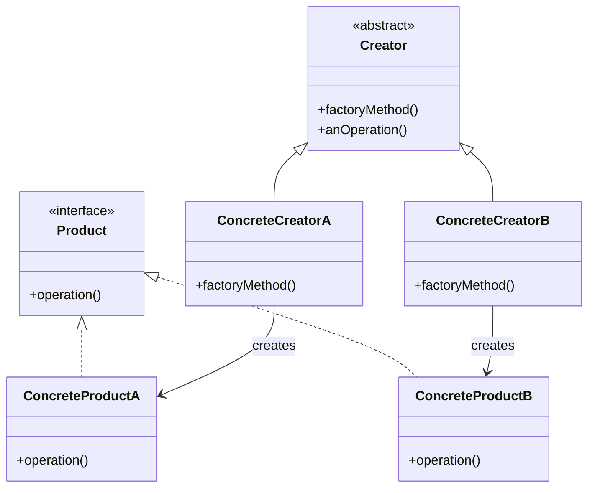
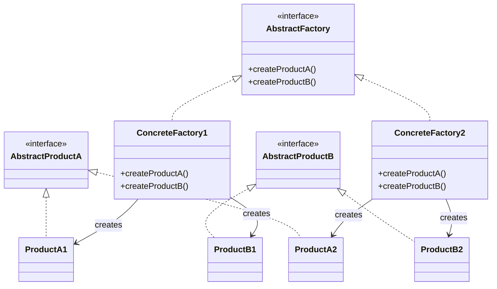

```table-of-contents
title: 
style: nestedList # TOC style (nestedList|nestedOrderedList|inlineFirstLevel)
minLevel: 0 # Include headings from the specified level
maxLevel: 0 # Include headings up to the specified level
includeLinks: true # Make headings clickable
hideWhenEmpty: false # Hide TOC if no headings are found
debugInConsole: false # Print debug info in Obsidian console
```
팩토리 패턴(Factory Pattern) 완벽 가이드

# 개념 설명

팩토리 패턴은 객체 생성 로직을 캡슐화하고 클라이언트 코드로부터 분리하는 생성(Creational) 디자인 패턴이다. 이 패턴은 객체 생성을 직접 수행하는 대신, 별도의 팩토리 클래스나 메서드를 통해 객체를 생성하는 방식을 제공한다.

## 실생활 비유

레스토랑 주문 과정을 생각해보자. 고객(클라이언트)은 음식이 어떻게 만들어지는지 자세히 알 필요 없이 메뉴판에서 원하는 음식을 주문한다. 주방(팩토리)은 주문을 받아 필요한 재료와 과정을 통해 요리를 만들어 제공한다. 고객은 음식 조리법을 알 필요 없이 결과물만 받아 사용할 수 있다.

# 기본 동작 방식

팩토리 패턴은 크게 세 가지 유형으로 나뉜다:

1. **단순 팩토리(Simple Factory)**: 하나의 팩토리 클래스가 여러 종류의 객체를 생성
2. **팩토리 메서드(Factory Method)**: 부모 클래스에서 객체 생성을 위한 인터페이스를 제공하고, 자식 클래스가 생성할 객체의 유형을 결정
3. **추상 팩토리(Abstract Factory)**: 관련된 객체 집합을 생성하기 위한 인터페이스 제공

## 팩토리 메서드 패턴의 기본 구조



## 추상 팩토리 패턴의 기본 구조



# 실제 사용 예시

다음은 각 언어별로 팩토리 패턴(Simple Factory, Factory Method, Abstract Factory)을 구현한 예시이다:

## Python 예시

### 단순 팩토리

```python
# 제품 클래스들
class Vehicle:
    def __init__(self, name):
        self.name = name
    
    def get_name(self):
        return self.name
    
    def drive(self):
        pass

class Car(Vehicle):
    def drive(self):
        return f"{self.name} 자동차가 도로를 달립니다."

class Bicycle(Vehicle):
    def drive(self):
        return f"{self.name} 자전거가 페달로 움직입니다."

class Motorcycle(Vehicle):
    def drive(self):
        return f"{self.name} 오토바이가 엔진을 켜고 달립니다."

# 단순 팩토리
class VehicleFactory:
    @staticmethod
    def create_vehicle(vehicle_type, name):
        if vehicle_type == "car":
            return Car(name)
        elif vehicle_type == "bicycle":
            return Bicycle(name)
        elif vehicle_type == "motorcycle":
            return Motorcycle(name)
        else:
            raise ValueError(f"알 수 없는 차량 유형: {vehicle_type}")

# 클라이언트 코드
if __name__ == "__main__":
    # 팩토리를 통해 객체 생성
    car = VehicleFactory.create_vehicle("car", "테슬라")
    bicycle = VehicleFactory.create_vehicle("bicycle", "삼천리")
    motorcycle = VehicleFactory.create_vehicle("motorcycle", "할리 데이비슨")
    
    # 생성된 객체 사용
    print(car.drive())  # 출력: 테슬라 자동차가 도로를 달립니다.
    print(bicycle.drive())  # 출력: 삼천리 자전거가 페달로 움직입니다.
    print(motorcycle.drive())  # 출력: 할리 데이비슨 오토바이가 엔진을 켜고 달립니다.
```

### 팩토리 메서드

```python
from abc import ABC, abstractmethod

# 제품 인터페이스
class Payment(ABC):
    @abstractmethod
    def process_payment(self, amount):
        pass

# 구체적인 제품 클래스들
class CreditCardPayment(Payment):
    def process_payment(self, amount):
        return f"신용카드로 {amount}원 결제되었습니다."

class PayPalPayment(Payment):
    def process_payment(self, amount):
        return f"페이팔로 {amount}원 결제되었습니다."

class CryptoPayment(Payment):
    def process_payment(self, amount):
        return f"암호화폐로 {amount}원 결제되었습니다."

# 팩토리 인터페이스
class PaymentFactory(ABC):
    @abstractmethod
    def create_payment(self):
        pass
    
    def process_order(self, amount):
        payment = self.create_payment()
        return payment.process_payment(amount)

# 구체적인 팩토리 클래스들
class CreditCardFactory(PaymentFactory):
    def create_payment(self):
        return CreditCardPayment()

class PayPalFactory(PaymentFactory):
    def create_payment(self):
        return PayPalPayment()

class CryptoFactory(PaymentFactory):
    def create_payment(self):
        return CryptoPayment()

# 클라이언트 코드
def complete_purchase(factory, amount):
    return factory.process_order(amount)

# 사용 예시
if __name__ == "__main__":
    # 사용자 결제 방법 선택에 따라 적절한 팩토리 사용
    credit_factory = CreditCardFactory()
    paypal_factory = PayPalFactory()
    crypto_factory = CryptoFactory()
    
    print(complete_purchase(credit_factory, 50000))  # 출력: 신용카드로 50000원 결제되었습니다.
    print(complete_purchase(paypal_factory, 30000))  # 출력: 페이팔로 30000원 결제되었습니다.
    print(complete_purchase(crypto_factory, 100000))  # 출력: 암호화폐로 100000원 결제되었습니다.
```

### 추상 팩토리

```python
from abc import ABC, abstractmethod

# 추상 제품 클래스들
class Button(ABC):
    @abstractmethod
    def render(self):
        pass
    
    @abstractmethod
    def click(self):
        pass

class Checkbox(ABC):
    @abstractmethod
    def render(self):
        pass
    
    @abstractmethod
    def toggle(self):
        pass

# 구체적인 제품 클래스들 - Windows 스타일
class WindowsButton(Button):
    def render(self):
        return "Windows 스타일 버튼을 렌더링합니다."
    
    def click(self):
        return "Windows 버튼 클릭 효과를 실행합니다."

class WindowsCheckbox(Checkbox):
    def render(self):
        return "Windows 스타일 체크박스를 렌더링합니다."
    
    def toggle(self):
        return "Windows 체크박스 토글 효과를 실행합니다."

# 구체적인 제품 클래스들 - MacOS 스타일
class MacOSButton(Button):
    def render(self):
        return "MacOS 스타일 버튼을 렌더링합니다."
    
    def click(self):
        return "MacOS 버튼 클릭 효과를 실행합니다."

class MacOSCheckbox(Checkbox):
    def render(self):
        return "MacOS 스타일 체크박스를 렌더링합니다."
    
    def toggle(self):
        return "MacOS 체크박스 토글 효과를 실행합니다."

# 추상 팩토리 인터페이스
class GUIFactory(ABC):
    @abstractmethod
    def create_button(self):
        pass
    
    @abstractmethod
    def create_checkbox(self):
        pass

# 구체적인 팩토리 클래스들
class WindowsFactory(GUIFactory):
    def create_button(self):
        return WindowsButton()
    
    def create_checkbox(self):
        return WindowsCheckbox()

class MacOSFactory(GUIFactory):
    def create_button(self):
        return MacOSButton()
    
    def create_checkbox(self):
        return MacOSCheckbox()

# 클라이언트 코드
class Application:
    def __init__(self, factory):
        self.factory = factory
        self.button = None
        self.checkbox = None
    
    def create_ui(self):
        self.button = self.factory.create_button()
        self.checkbox = self.factory.create_checkbox()
    
    def render(self):
        button_render = self.button.render()
        checkbox_render = self.checkbox.render()
        return f"UI 렌더링: {button_render} 그리고 {checkbox_render}"

# 사용 예시
if __name__ == "__main__":
    # 운영체제에 따라 적절한 팩토리 선택
    # 실제로는 OS 감지 로직이 여기에 들어갈 수 있음
    os_name = "Windows"  # 또는 "MacOS"
    
    if os_name == "Windows":
        factory = WindowsFactory()
    else:
        factory = MacOSFactory()
    
    app = Application(factory)
    app.create_ui()
    print(app.render())  # 출력: UI 렌더링: Windows 스타일 버튼을 렌더링합니다. 그리고 Windows 스타일 체크박스를 렌더링합니다.
    
    # MacOS 팩토리로 테스트
    mac_app = Application(MacOSFactory())
    mac_app.create_ui()
    print(mac_app.render())  # 출력: UI 렌더링: MacOS 스타일 버튼을 렌더링합니다. 그리고 MacOS 스타일 체크박스를 렌더링합니다.
```

## JavaScript 예시

### 단순 팩토리

```javascript
// 제품 클래스들
class User {
  constructor(name, roles = []) {
    this.name = name;
    this.roles = roles;
    this.createdAt = new Date();
  }
  
  describe() {
    return `User: ${this.name} (${this.roles.join(", ")})`;
  }
}

class AdminUser extends User {
  constructor(name) {
    super(name, ["admin", "editor"]);
    this.adminLevel = "full";
  }
  
  describe() {
    return `${super.describe()} - 관리자 수준: ${this.adminLevel}`;
  }
  
  deleteUser(user) {
    return `${user.name} 사용자를 삭제했습니다.`;
  }
}

class EditorUser extends User {
  constructor(name) {
    super(name, ["editor"]);
  }
  
  publishContent(content) {
    return `"${content}" 컨텐츠를 게시했습니다.`;
  }
}

class GuestUser extends User {
  constructor(name) {
    super(name, ["guest"]);
    this.sessionTimeout = 3600; // 세션 타임아웃 (초)
  }
  
  extendSession() {
    this.sessionTimeout += 1800;
    return `세션이 30분 연장되었습니다.`;
  }
}

// 단순 팩토리
class UserFactory {
  static createUser(type, name) {
    switch(type.toLowerCase()) {
      case "admin":
        return new AdminUser(name);
      case "editor":
        return new EditorUser(name);
      case "guest":
        return new GuestUser(name);
      default:
        return new User(name);
    }
  }
}

// 클라이언트 코드
function main() {
  const admin = UserFactory.createUser("admin", "김관리");
  const editor = UserFactory.createUser("editor", "박편집");
  const guest = UserFactory.createUser("guest", "이방문");

  console.log(admin.describe());
  console.log(editor.describe());
  console.log(guest.describe());
  
  console.log(admin.deleteUser(guest));
  console.log(editor.publishContent("JavaScript 팩토리 패턴"));
  console.log(guest.extendSession());
}

main();
```

### 팩토리 메서드

```javascript
// 제품 인터페이스(추상 클래스)
class Logistics {
  planDelivery() {
    // 공통 배송 계획 로직
    const transport = this.createTransport();
    return `배송 계획: ${transport.deliver()}`;
  }
  
  // 팩토리 메서드(하위 클래스에서 구현)
  createTransport() {
    throw new Error("자식 클래스에서 구현해야 합니다");
  }
}

// 구체적인 제품 클래스들
class Truck {
  deliver() {
    return "트럭으로 상품을 도로를 통해 배송합니다";
  }
}

class Ship {
  deliver() {
    return "선박으로 상품을 해상으로 배송합니다";
  }
}

class Plane {
  deliver() {
    return "비행기로 상품을 항공으로 배송합니다";
  }
}

// 구체적인 생성자 클래스들
class RoadLogistics extends Logistics {
  createTransport() {
    return new Truck();
  }
}

class SeaLogistics extends Logistics {
  createTransport() {
    return new Ship();
  }
}

class AirLogistics extends Logistics {
  createTransport() {
    return new Plane();
  }
}

// 클라이언트 코드
function deliverProduct(logistics) {
  // 클라이언트는 구체적인 로지스틱스 유형만 알면 됨
  console.log(logistics.planDelivery());
}

// 사용 예시
const roadLogistics = new RoadLogistics();
deliverProduct(roadLogistics);  // 배송 계획: 트럭으로 상품을 도로를 통해 배송합니다

const seaLogistics = new SeaLogistics();
deliverProduct(seaLogistics);  // 배송 계획: 선박으로 상품을 해상으로 배송합니다

const airLogistics = new AirLogistics();
deliverProduct(airLogistics);  // 배송 계획: 비행기로 상품을 항공으로 배송합니다
```

### 추상 팩토리

```javascript
// 추상 제품 인터페이스
class Chair {
  sitOn() { throw new Error("추상 메서드"); }
}

class Table {
  putOn(item) { throw new Error("추상 메서드"); }
}

class Sofa {
  layDown() { throw new Error("추상 메서드"); }
}

// Modern 스타일 제품들
class ModernChair extends Chair {
  sitOn() {
    return "심플한 모던 의자에 앉습니다.";
  }
}

class ModernTable extends Table {
  putOn(item) {
    return `${item}을(를) 미니멀한 모던 테이블 위에 놓습니다.`;
  }
}

class ModernSofa extends Sofa {
  layDown() {
    return "모던한 직선적 소파에 눕습니다.";
  }
}

// Victorian 스타일 제품들
class VictorianChair extends Chair {
  sitOn() {
    return "화려한 빅토리안 의자에 앉습니다.";
  }
}

class VictorianTable extends Table {
  putOn(item) {
    return `${item}을(를) 장식이 풍부한 빅토리안 테이블 위에 놓습니다.`;
  }
}

class VictorianSofa extends Sofa {
  layDown() {
    return "클래식한 빅토리안 소파에 눕습니다.";
  }
}

// 추상 팩토리 인터페이스
class FurnitureFactory {
  createChair() { throw new Error("추상 메서드"); }
  createTable() { throw new Error("추상 메서드"); }
  createSofa() { throw new Error("추상 메서드"); }
}

// 구체적인 팩토리들
class ModernFurnitureFactory extends FurnitureFactory {
  createChair() {
    return new ModernChair();
  }
  
  createTable() {
    return new ModernTable();
  }
  
  createSofa() {
    return new ModernSofa();
  }
}

class VictorianFurnitureFactory extends FurnitureFactory {
  createChair() {
    return new VictorianChair();
  }
  
  createTable() {
    return new VictorianTable();
  }
  
  createSofa() {
    return new VictorianSofa();
  }
}

// 클라이언트 코드
class Room {
  constructor(furnitureFactory) {
    this.furnitureFactory = furnitureFactory;
  }
  
  furnish() {
    this.chair = this.furnitureFactory.createChair();
    this.table = this.furnitureFactory.createTable();
    this.sofa = this.furnitureFactory.createSofa();
  }
  
  describe() {
    return `
      가구 배치:
      - ${this.chair.sitOn()}
      - ${this.table.putOn("책")}
      - ${this.sofa.layDown()}
    `;
  }
}

// 사용 예시 - 스타일에 따라 다른 팩토리 사용
function decorateRoom(style) {
  let factory;
  
  if (style === "modern") {
    factory = new ModernFurnitureFactory();
  } else if (style === "victorian") {
    factory = new VictorianFurnitureFactory();
  } else {
    throw new Error("지원하지 않는 스타일입니다.");
  }
  
  const room = new Room(factory);
  room.furnish();
  console.log(room.describe());
}

// 모던 스타일 룸 꾸미기
decorateRoom("modern");

// 빅토리안 스타일 룸 꾸미기
decorateRoom("victorian");
```

## PHP 예시

### 단순 팩토리

```php
<?php

// 제품 인터페이스
interface Database {
    public function connect(): string;
    public function query(string $sql): string;
    public function disconnect(): string;
}

// 구체적인 제품 클래스들
class MySQLDatabase implements Database {
    private $connected = false;
    
    public function connect(): string {
        $this->connected = true;
        return "MySQL 데이터베이스에 연결되었습니다.";
    }
    
    public function query(string $sql): string {
        if (!$this->connected) {
            return "데이터베이스에 연결되어 있지 않습니다.";
        }
        return "MySQL 쿼리 실행: {$sql}";
    }
    
    public function disconnect(): string {
        $this->connected = false;
        return "MySQL 데이터베이스 연결이 종료되었습니다.";
    }
}

class PostgreSQLDatabase implements Database {
    private $connected = false;
    
    public function connect(): string {
        $this->connected = true;
        return "PostgreSQL 데이터베이스에 연결되었습니다.";
    }
    
    public function query(string $sql): string {
        if (!$this->connected) {
            return "데이터베이스에 연결되어 있지 않습니다.";
        }
        return "PostgreSQL 쿼리 실행: {$sql}";
    }
    
    public function disconnect(): string {
        $this->connected = false;
        return "PostgreSQL 데이터베이스 연결이 종료되었습니다.";
    }
}

class SQLiteDatabase implements Database {
    private $connected = false;
    
    public function connect(): string {
        $this->connected = true;
        return "SQLite 데이터베이스에 연결되었습니다.";
    }
    
    public function query(string $sql): string {
        if (!$this->connected) {
            return "데이터베이스에 연결되어 있지 않습니다.";
        }
        return "SQLite 쿼리 실행: {$sql}";
    }
    
    public function disconnect(): string {
        $this->connected = false;
        return "SQLite 데이터베이스 연결이 종료되었습니다.";
    }
}

// 단순 팩토리
class DatabaseFactory {
    public static function createDatabase(string $type): Database {
        switch (strtolower($type)) {
            case 'mysql':
                return new MySQLDatabase();
            case 'postgresql':
                return new PostgreSQLDatabase();
            case 'sqlite':
                return new SQLiteDatabase();
            default:
                throw new InvalidArgumentException("알 수 없는 데이터베이스 유형: {$type}");
        }
    }
}

// 클라이언트 코드
function testDatabase(string $dbType, string $query) {
    try {
        $db = DatabaseFactory::createDatabase($dbType);
        
        echo $db->connect() . PHP_EOL;
        echo $db->query($query) . PHP_EOL;
        echo $db->disconnect() . PHP_EOL;
        
    } catch (InvalidArgumentException $e) {
        echo "오류: " . $e->getMessage() . PHP_EOL;
    }
}

// 사용 예시
testDatabase('mysql', 'SELECT * FROM users');
echo PHP_EOL;
testDatabase('postgresql', 'SELECT * FROM products');
echo PHP_EOL;
testDatabase('sqlite', 'SELECT * FROM orders');
?>
```

### 팩토리 메서드

```php
<?php

// 제품 인터페이스
interface SocialNetwork {
    public function login(): string;
    public function post(string $message): string;
    public function logout(): string;
}

// 구체적인 제품 클래스들
class Facebook implements SocialNetwork {
    private $username;
    private $password;
    
    public function __construct(string $username, string $password) {
        $this->username = $username;
        $this->password = $password;
    }
    
    public function login(): string {
        return "페이스북에 {$this->username}로 로그인했습니다.";
    }
    
    public function post(string $message): string {
        return "페이스북에 메시지 게시: {$message}";
    }
    
    public function logout(): string {
        return "페이스북에서 로그아웃했습니다.";
    }
}

class Twitter implements SocialNetwork {
    private $username;
    private $password;
    
    public function __construct(string $username, string $password) {
        $this->username = $username;
        $this->password = $password;
    }
    
    public function login(): string {
        return "트위터에 {$this->username}로 로그인했습니다.";
    }
    
    public function post(string $message): string {
        return "트위터에 트윗 게시: {$message}";
    }
    
    public function logout(): string {
        return "트위터에서 로그아웃했습니다.";
    }
}

// 생성자 추상 클래스
abstract class SocialNetworkPoster {
    abstract protected function createSocialNetwork(string $username, string $password): SocialNetwork;
    
    public function post(string $username, string $password, string $message): string {
        $network = $this->createSocialNetwork($username, $password);
        $result = "";
        
        $result .= $network->login() . PHP_EOL;
        $result .= $network->post($message) . PHP_EOL;
        $result .= $network->logout() . PHP_EOL;
        
        return $result;
    }
}

// 구체적인 생성자 클래스들
class FacebookPoster extends SocialNetworkPoster {
    protected function createSocialNetwork(string $username, string $password): SocialNetwork {
        return new Facebook($username, $password);
    }
}

class TwitterPoster extends SocialNetworkPoster {
    protected function createSocialNetwork(string $username, string $password): SocialNetwork {
        return new Twitter($username, $password);
    }
}

// 클라이언트 코드
function clientCode(SocialNetworkPoster $poster, string $username, string $password, string $message) {
    echo $poster->post($username, $password, $message);
}

// 사용 예시
$username = "사용자이름";
$password = "비밀번호";
$message = "안녕하세요! 팩토리 메서드 패턴을 PHP로 구현했습니다.";

echo "페이스북에 게시하기:\n";
clientCode(new FacebookPoster(), $username, $password, $message);

echo "\n트위터에 게시하기:\n";
clientCode(new TwitterPoster(), $username, $password, $message);
?>
```

### 추상 팩토리

```php
<?php

// 추상 제품 인터페이스
interface FormElement {
    public function render(): string;
    public function getValue(): string;
}

// 구체적인 제품 클래스들 - Dark 테마
class DarkButton implements FormElement {
    private $text;
    
    public function __construct(string $text) {
        $this->text = $text;
    }
    
    public function render(): string {
        return "<button class='dark-button'>{$this->text}</button>";
    }
    
    public function getValue(): string {
        return $this->text;
    }
}

class DarkTextInput implements FormElement {
    private $value;
    
    public function __construct(string $value = "") {
        $this->value = $value;
    }
    
    public function render(): string {
        return "<input type='text' class='dark-input' value='{$this->value}' />";
    }
    
    public function getValue(): string {
        return $this->value;
    }
}

class DarkCheckbox implements FormElement {
    private $checked;
    private $label;
    
    public function __construct(string $label, bool $checked = false) {
        $this->label = $label;
        $this->checked = $checked;
    }
    
    public function render(): string {
        $checked = $this->checked ? "checked" : "";
        return "<label class='dark-checkbox'><input type='checkbox' {$checked} />{$this->label}</label>";
    }
    
    public function getValue(): string {
        return $this->checked ? "on" : "off";
    }
}

// 구체적인 제품 클래스들 - Light 테마
class LightButton implements FormElement {
    private $text;
    
    public function __construct(string $text) {
        $this->text = $text;
    }
    
    public function render(): string {
        return "<button class='light-button'>{$this->text}</button>";
    }
    
    public function getValue(): string {
        return $this->text;
    }
}

class LightTextInput implements FormElement {
    private $value;
    
    public function __construct(string $value = "") {
        $this->value = $value;
    }
    
    public function render(): string {
        return "<input type='text' class='light-input' value='{$this->value}' />";
    }
    
    public function getValue(): string {
        return $this->value;
    }
}

class LightCheckbox implements FormElement {
    private $checked;
    private $label;
    
    public function __construct(string $label, bool $checked = false) {
        $this->label = $label;
        $this->checked = $checked;
    }
    
    public function render(): string {
        $checked = $this->checked ? "checked" : "";
        return "<label class='light-checkbox'><input type='checkbox' {$checked} />{$this->label}</label>";
    }
    
    public function getValue(): string {
        return $this->checked ? "on" : "off";
    }
}

// 추상 팩토리 인터페이스
interface UIFactory {
    public function createButton(string $text): FormElement;
    public function createTextInput(string $value = ""): FormElement;
    public function createCheckbox(string $label, bool $checked = false): FormElement;
}

// 구체적인 팩토리 클래스들
class DarkThemeFactory implements UIFactory {
    public function createButton(string $text): FormElement {
        return new DarkButton($text);
    }
    
    public function createTextInput(string $value = ""): FormElement {
        return new DarkTextInput($value);
    }
    
    public function createCheckbox(string $label, bool $checked = false): FormElement {
        return new DarkCheckbox($label, $checked);
    }
}

class LightThemeFactory implements UIFactory {
    public function createButton(string $text): FormElement {
        return new LightButton($text);
    }
    
    public function createTextInput(string $value = ""): FormElement {
        return new LightTextInput($value);
    }
    
    public function createCheckbox(string $label, bool $checked = false): FormElement {
        return new LightCheckbox($label, $checked);
    }
}

// 클라이언트 코드
class FormRenderer {
    private $factory;
    
    public function __construct(UIFactory $factory) {
        $this->factory = $factory;
    }
    
    public function renderContactForm(): string {
        $result = "<form class='contact-form'>\n";
        
        // 텍스트 입력 필드 생성
        $nameInput = $this->factory->createTextInput("");
        $result .= "<div class='form-group'>\n";
        $result .= "    <label>이름:</label>\n";
        $result .= "    " . $nameInput->render() . "\n";
        $result .= "</div>\n";
        
        $emailInput = $this->factory->createTextInput("");
        $result .= "<div class='form-group'>\n";
        $result .= "    <label>이메일:</label>\n";
        $result .= "    " . $emailInput->render() . "\n";
        $result .= "</div>\n";
        
        // 체크박스 생성
        $subscribeCheckbox = $this->factory->createCheckbox("뉴스레터 구독", true);
        $result .= "<div class='form-group'>\n";
        $result .= "    " . $subscribeCheckbox->render() . "\n";
        $result .= "</div>\n";
        
        // 버튼 생성
        $submitButton = $this->factory->createButton("제출");
        $result .= "<div class='form-group'>\n";
        $result .= "    " . $submitButton->render() . "\n";
        $result .= "</div>\n";
        
        $result .= "</form>";
        
        return $result;
    }
}

// 사용 예시
function renderFormWithTheme(string $theme) {
    // 테마에 따라 적절한 팩토리 선택
    if ($theme === "dark") {
        $factory = new DarkThemeFactory();
        echo "다크 테마로 폼 렌더링:\n";
    } else {
        $factory = new LightThemeFactory();
        echo "라이트 테마로 폼 렌더링:\n";
    }
    
    $formRenderer = new FormRenderer($factory);
    echo $formRenderer->renderContactForm();
}

// 다크 테마로 렌더링
renderFormWithTheme("dark");
echo "\n\n";

// 라이트 테마로 렌더링
renderFormWithTheme("light");
?>
```