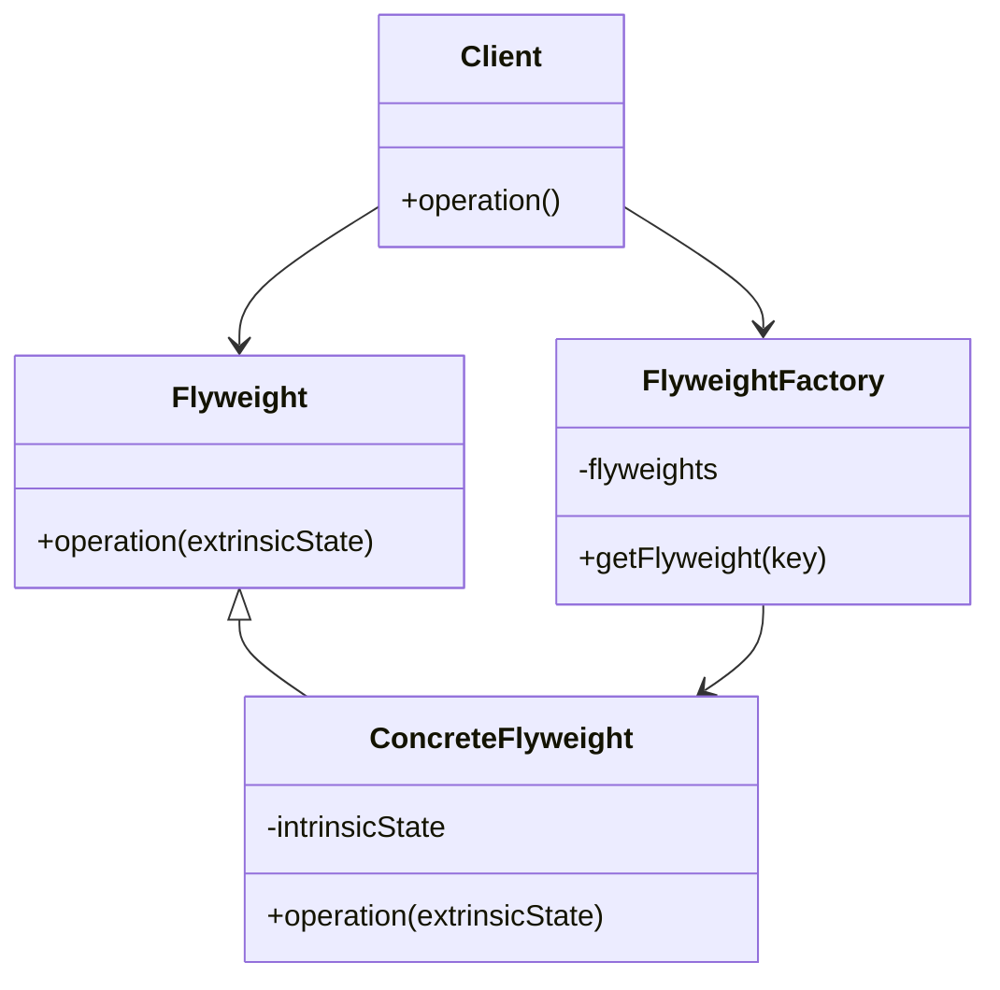
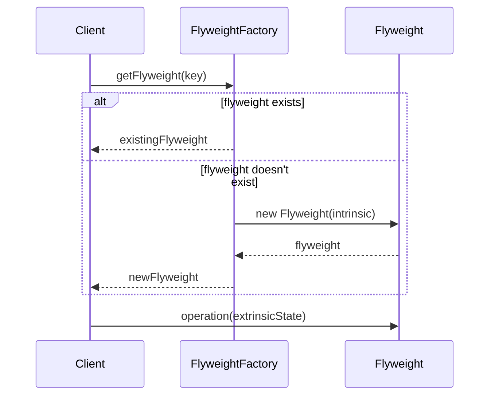
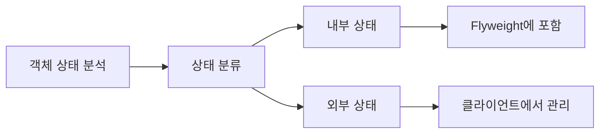

```table-of-contents
title: 
style: nestedList # TOC style (nestedList|nestedOrderedList|inlineFirstLevel)
minLevel: 0 # Include headings from the specified level
maxLevel: 0 # Include headings up to the specified level
includeLinks: true # Make headings clickable
hideWhenEmpty: false # Hide TOC if no headings are found
debugInConsole: false # Print debug info in Obsidian console
```
Flyweight 디자인 패턴

# 개념 설명

Flyweight 패턴은 많은 수의 유사한 객체를 효율적으로 공유하기 위한 구조적 디자인 패턴이다. 이 패턴은 각 객체에 모든 데이터를 저장하는 대신 공통 부분을 공유함으로써 메모리 사용량을 줄인다.

## 실생활 비유

도서관의 책을 생각해보자. 한 도서관에 같은 책이 여러 권 있을 때, 각 책의 내용(본문, 이미지, 저자 정보 등)은 동일하다. 다른 점은 책의 현재 상태(대출 여부, 마지막 대출 날짜, 배치 위치 등)뿐이다. Flyweight 패턴은 이처럼 공통된 내용(intrinsic state)은 공유하고, 개별적인 상태(extrinsic state)만 각 객체에 저장한다.

# 기본 동작 방식

Flyweight 패턴은 다음과 같은 구성요소로 이루어진다:

1. **Flyweight**: 공유 가능한 상태를 포함하는 인터페이스 또는 클래스
2. **ConcreteFlyweight**: Flyweight 인터페이스를 구현하며 공유 가능한 상태를 저장
3. **FlyweightFactory**: Flyweight 객체를 생성하고 관리하는 팩토리
4. **Client**: Flyweight 객체를 사용하는 클라이언트



## 동작 흐름



# 실제 사용 예시

## Python 예시

텍스트 편집기에서 문자 객체를 공유하는 예시:

```python
class Character:
    """Flyweight 클래스 - 문자의 공유 가능한 상태를 저장"""
    def __init__(self, char):
        # intrinsic state
        self.char = char
        print(f"문자 '{char}' 생성")
    
    def render(self, font, size, position):
        # extrinsic state를 매개변수로 받아 처리
        print(f"문자: '{self.char}', 폰트: {font}, 크기: {size}, 위치: {position}")


class CharacterFactory:
    """Flyweight Factory - 문자 객체를 생성하고 관리"""
    def __init__(self):
        self.characters = {}
    
    def get_character(self, char):
        # 이미 있는 문자면 기존 객체 반환, 없으면 새로 생성
        if char not in self.characters:
            self.characters[char] = Character(char)
        return self.characters[char]


class TextEditor:
    """Client - Flyweight를 사용하는 클라이언트"""
    def __init__(self):
        self.factory = CharacterFactory()
        self.characters = []
    
    def add_character(self, char, font, size, position):
        character = self.factory.get_character(char)
        # 외부 상태(extrinsic state)는 클라이언트에서 관리
        self.characters.append({
            'character': character,
            'font': font,
            'size': size,
            'position': position
        })
    
    def render(self):
        for item in self.characters:
            item['character'].render(
                item['font'], 
                item['size'], 
                item['position']
            )


# 사용 예시
editor = TextEditor()

# 같은 문자 'a'를 여러 번 추가해도 Character 객체는 한 번만 생성됨
editor.add_character('a', 'Arial', 12, (0, 0))
editor.add_character('b', 'Times', 14, (10, 0))
editor.add_character('a', 'Helvetica', 16, (20, 0))

editor.render()
```

## PHP 예시

데이터베이스 연결 풀을 Flyweight 패턴으로 구현한 예시:

```php
<?php

// Flyweight 인터페이스
interface ConnectionInterface {
    public function query($sql);
}

// Concrete Flyweight
class DatabaseConnection implements ConnectionInterface {
    private $dbType;    // 내부 상태 (Intrinsic)
    private $host;      // 내부 상태 (Intrinsic)
    
    public function __construct($dbType, $host) {
        $this->dbType = $dbType;
        $this->host = $host;
        echo "DB 연결 생성: {$dbType} on {$host}\n";
    }
    
    public function query($sql) {
        echo "{$this->dbType} 데이터베이스({$this->host})에 쿼리 실행: {$sql}\n";
        // 실제 쿼리 실행 로직
    }
}

// Flyweight Factory
class ConnectionPool {
    private $connections = [];
    
    public function getConnection($dbType, $host) {
        $key = $dbType . '_' . $host;
        
        if (!isset($this->connections[$key])) {
            $this->connections[$key] = new DatabaseConnection($dbType, $host);
        }
        
        return $this->connections[$key];
    }
    
    public function getConnectionCount() {
        return count($this->connections);
    }
}

// Client
class Application {
    private $connectionPool;
    
    public function __construct() {
        $this->connectionPool = new ConnectionPool();
    }
    
    public function executeQuery($dbType, $host, $sql) {
        $connection = $this->connectionPool->getConnection($dbType, $host);
        $connection->query($sql);
    }
    
    public function showStats() {
        echo "총 연결 객체 수: " . $this->connectionPool->getConnectionCount() . "\n";
    }
}

// 사용 예시
$app = new Application();

// 여러 쿼리 실행
$app->executeQuery('MySQL', 'localhost', 'SELECT * FROM users');
$app->executeQuery('PostgreSQL', 'db.example.com', 'SELECT * FROM products');
$app->executeQuery('MySQL', 'localhost', 'UPDATE users SET active = 1');  // 기존 연결 재사용

// 통계 표시
$app->showStats();  // 총 연결 객체 수: 2
?>
```

## JavaScript 예시

게임에서 그래픽 요소를 공유하는 예시:

```javascript
// Flyweight 클래스
class TreeType {
  constructor(name, color, texture) {
    // 내부 상태 (Intrinsic)
    this.name = name;
    this.color = color;
    this.texture = texture;
    console.log(`TreeType 생성: ${name}, ${color}`);
  }
  
  render(x, y, age) {
    // 외부 상태 (Extrinsic)를 매개변수로 받아 처리
    console.log(`나무 렌더링: ${this.name}, 위치: (${x}, ${y}), 나이: ${age}년, 색상: ${this.color}`);
    // 실제 렌더링 로직
  }
}

// Flyweight Factory
class TreeFactory {
  constructor() {
    this.treeTypes = {};
  }
  
  getTreeType(name, color, texture) {
    const key = `${name}_${color}_${texture}`;
    
    if (!this.treeTypes[key]) {
      this.treeTypes[key] = new TreeType(name, color, texture);
    }
    
    return this.treeTypes[key];
  }
  
  getTreeTypesCount() {
    return Object.keys(this.treeTypes).length;
  }
}

// 개별 나무 객체 (외부 상태만 저장)
class Tree {
  constructor(x, y, age, treeType) {
    this.x = x;
    this.y = y;
    this.age = age;
    this.treeType = treeType;
  }
  
  render() {
    this.treeType.render(this.x, this.y, this.age);
  }
}

// 포레스트 - 게임의 나무를 관리하는 클래스
class Forest {
  constructor() {
    this.trees = [];
    this.factory = new TreeFactory();
  }
  
  plantTree(x, y, age, name, color, texture) {
    const treeType = this.factory.getTreeType(name, color, texture);
    const tree = new Tree(x, y, age, treeType);
    this.trees.push(tree);
    return tree;
  }
  
  render() {
    this.trees.forEach(tree => tree.render());
  }
  
  showStats() {
    console.log(`총 나무 수: ${this.trees.length}`);
    console.log(`나무 타입 수: ${this.factory.getTreeTypesCount()}`);
  }
}

// 사용 예시
const forest = new Forest();

// 1000그루의 나무를 심지만 실제 TreeType 객체는 몇 개 안 됨
for (let i = 0; i < 10; i++) {
  const x = Math.floor(Math.random() * 100);
  const y = Math.floor(Math.random() * 100);
  const age = Math.floor(Math.random() * 30) + 1;
  
  // 같은 종류의 나무는 TreeType 객체를 공유
  if (i % 3 === 0) {
    forest.plantTree(x, y, age, '소나무', '짙은 녹색', 'pine_texture.png');
  } else if (i % 3 === 1) {
    forest.plantTree(x, y, age, '참나무', '연한 녹색', 'oak_texture.png');
  } else {
    forest.plantTree(x, y, age, '자작나무', '흰색', 'birch_texture.png');
  }
}

// 몇 개의 나무만 렌더링
for (let i = 0; i < 5; i++) {
  forest.trees[i].render();
}

// 통계 표시
forest.showStats();
```

# 고급 활용법

## 복합 Flyweight

복합 Flyweight는 여러 Flyweight를 하나로 묶어 구성할 수 있다. 예를 들어, 문서 편집기에서 문자를 개별 Flyweight로 만들고, 단어나 문장을 복합 Flyweight로 구성할 수 있다.

## 상태 공유 최적화

Flyweight 패턴에서는 최대한 많은 상태를 내부 상태(intrinsic)로 만들어 공유하는 것이 중요하다. 따라서 객체의 상태를 내부(공유 가능)와 외부(공유 불가능)로 명확히 구분해야 한다.



## 캐싱 전략

Flyweight Factory에서는 다양한 캐싱 전략을 적용할 수 있다:

- 무제한 캐싱: 모든 Flyweight 객체를 계속 유지
- LRU 캐싱: 최근에 사용되지 않은 객체부터 메모리에서 제거
- 크기 제한 캐싱: 최대 객체 수를 제한하여 메모리를 관리

# 주의사항

## 메모리와 성능 트레이드오프

Flyweight 패턴은 메모리 효율을 높이지만, 객체 검색과 외부 상태 관리에 추가 비용이 발생할 수 있다. 상황에 따라 메모리 절약과 성능 간의 적절한 균형점을 찾아야 한다.

## 동시성 고려

멀티스레드 환경에서 Flyweight Factory는 thread-safe하게 구현해야 한다. 여러 스레드가 동시에 같은 Flyweight 객체를 요청할 경우, 객체 생성과 관리에 동기화 처리가 필요하다.

## 불변성 유지

Flyweight 객체는 여러 컨텍스트에서 공유되므로, 내부 상태(intrinsic state)는 불변(immutable)해야 한다. 내부 상태를 변경하면 해당 객체를 공유하는 모든 곳에 영향을 미친다.

# 결론

Flyweight 패턴은 유사한 객체가 대량으로 필요한 경우 메모리 효율성을 크게 향상시킬 수 있다. 텍스트 편집기, 게임 엔진, 데이터베이스 연결 풀 등 다양한 시나리오에서 유용하게 활용된다. 내부 상태와 외부 상태를 명확히 구분하고, Factory를 통한 효율적인 객체 관리가 패턴 적용의 핵심이다.

Flyweight 패턴은 메모리 최적화가 중요한 대규모 시스템에서 특히 가치가 있으며, 객체 지향 설계의 효율성을 높이는 중요한 도구 중 하나이다.