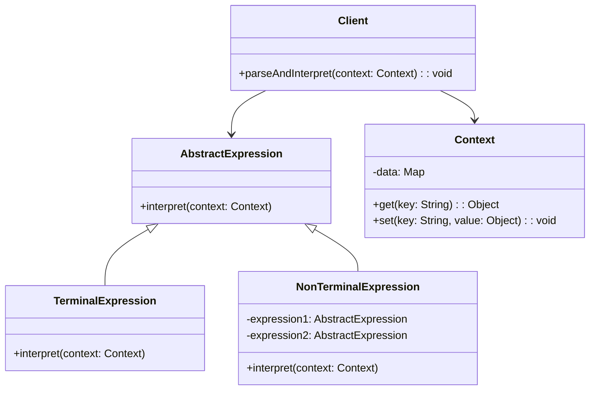
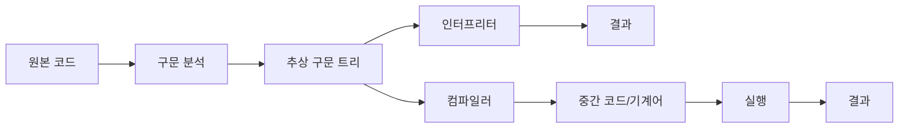

```table-of-contents
title: 
style: nestedList # TOC style (nestedList|nestedOrderedList|inlineFirstLevel)
minLevel: 0 # Include headings from the specified level
maxLevel: 0 # Include headings up to the specified level
includeLinks: true # Make headings clickable
hideWhenEmpty: false # Hide TOC if no headings are found
debugInConsole: false # Print debug info in Obsidian console
```
인터프리터 패턴 (Interpreter Pattern)

# 개념 설명

인터프리터 패턴은 특정 언어로 작성된 문장을 해석하고 처리하는 방법을 정의하는 행동 디자인 패턴이다. 이 패턴은 문법 규칙을 클래스화하여 언어의 문장을 해석하는 인터프리터를 구현한다.

## 실생활 비유

인터프리터 패턴은 외국어 통역사와 유사하다. 통역사는 한 언어로 된 문장을 듣고, 그 문장의 구조와 의미를 분석한 다음, 다른 언어로 변환하여 전달한다. 마찬가지로 소프트웨어의 인터프리터는 특정 문법으로 작성된 표현식을 받아 해석하고 실행한다.

# 기본 동작 방식

인터프리터 패턴은 다음과 같은 구성 요소로 이루어진다:

1. **추상 표현식(Abstract Expression)**: 모든 노드가 구현해야 하는 인터페이스를 정의한다.
2. **터미널 표현식(Terminal Expression)**: 문법의 종단 기호에 해당하는 표현식이다.
3. **비터미널 표현식(Non-terminal Expression)**: 다른 표현식을 포함하는 복합 표현식이다.
4. **컨텍스트(Context)**: 인터프리터가 해석할 때 필요한 정보를 포함한다.
5. **클라이언트(Client)**: 언어로 된 문장을 구문 트리로 구성하고 해석을 요청한다.



# 실제 사용 예시

## Python 예시: 간단한 수학 표현식 인터프리터

```python
# 추상 표현식
class Expression:
    def interpret(self, context):
        pass

# 터미널 표현식: 숫자
class NumberExpression(Expression):
    def __init__(self, number):
        self.number = number
    
    def interpret(self, context):
        return self.number

# 비터미널 표현식: 덧셈
class AddExpression(Expression):
    def __init__(self, left_expression, right_expression):
        self.left_expression = left_expression
        self.right_expression = right_expression
    
    def interpret(self, context):
        return self.left_expression.interpret(context) + self.right_expression.interpret(context)

# 비터미널 표현식: 뺄셈
class SubtractExpression(Expression):
    def __init__(self, left_expression, right_expression):
        self.left_expression = left_expression
        self.right_expression = right_expression
    
    def interpret(self, context):
        return self.left_expression.interpret(context) - self.right_expression.interpret(context)

# 컨텍스트
class Context:
    def __init__(self):
        self.variables = {}
    
    def set_variable(self, name, value):
        self.variables[name] = value
    
    def get_variable(self, name):
        return self.variables.get(name, 0)

# 사용 예시
if __name__ == "__main__":
    # 표현식 "5 + (10 - 2)" 구성
    expression = AddExpression(
        NumberExpression(5),
        SubtractExpression(
            NumberExpression(10),
            NumberExpression(2)
        )
    )
    
    context = Context()
    result = expression.interpret(context)
    print(f"결과: {result}")  # 결과: 13
```

## PHP 예시: 간단한 SQL 쿼리 인터프리터

```php
<?php
// 추상 표현식
interface Expression {
    public function interpret(Context $context);
}

// 컨텍스트
class Context {
    private $data = [];
    
    public function set($key, $value) {
        $this->data[$key] = $value;
    }
    
    public function get($key) {
        return isset($this->data[$key]) ? $this->data[$key] : null;
    }
}

// 터미널 표현식: 열 이름
class ColumnExpression implements Expression {
    private $columnName;
    
    public function __construct($columnName) {
        $this->columnName = $columnName;
    }
    
    public function interpret(Context $context) {
        $table = $context->get('table');
        $row = $context->get('current_row');
        
        if (isset($table[$row][$this->columnName])) {
            return $table[$row][$this->columnName];
        }
        return null;
    }
}

// 비터미널 표현식: 같음 조건
class EqualsExpression implements Expression {
    private $left;
    private $right;
    
    public function __construct(Expression $left, Expression $right) {
        $this->left = $left;
        $this->right = $right;
    }
    
    public function interpret(Context $context) {
        return $this->left->interpret($context) === $this->right->interpret($context);
    }
}

// 터미널 표현식: 리터럴 값
class LiteralExpression implements Expression {
    private $value;
    
    public function __construct($value) {
        $this->value = $value;
    }
    
    public function interpret(Context $context) {
        return $this->value;
    }
}

// 사용 예시
$table = [
    ['id' => 1, 'name' => 'John', 'age' => 30],
    ['id' => 2, 'name' => 'Jane', 'age' => 25],
    ['id' => 3, 'name' => 'Bob', 'age' => 40]
];

// 'name = John' 조건 구성
$expression = new EqualsExpression(
    new ColumnExpression('name'),
    new LiteralExpression('John')
);

$context = new Context();
$context->set('table', $table);

// 모든 행에 대해 조건 검사
$results = [];
for ($i = 0; $i < count($table); $i++) {
    $context->set('current_row', $i);
    if ($expression->interpret($context)) {
        $results[] = $table[$i];
    }
}

// 결과 출력
echo "검색 결과:\n";
foreach ($results as $row) {
    echo "ID: {$row['id']}, 이름: {$row['name']}, 나이: {$row['age']}\n";
}
?>
```

## JavaScript 예시: 간단한 정규 표현식 인터프리터

```javascript
// 추상 표현식
class Expression {
  interpret(context) {
    throw new Error('interpret 메서드를 구현해야 합니다.');
  }
}

// 터미널 표현식: 리터럴 패턴
class LiteralExpression extends Expression {
  constructor(literal) {
    super();
    this.literal = literal;
  }
  
  interpret(context) {
    const index = context.input.indexOf(this.literal, context.position);
    if (index !== -1 && index === context.position) {
      context.position += this.literal.length;
      return true;
    }
    return false;
  }
}

// 비터미널 표현식: 선택 패턴 (OR)
class AlternationExpression extends Expression {
  constructor(expression1, expression2) {
    super();
    this.expression1 = expression1;
    this.expression2 = expression2;
  }
  
  interpret(context) {
    const savedPosition = context.position;
    
    if (this.expression1.interpret(context)) {
      return true;
    }
    
    context.position = savedPosition;
    
    if (this.expression2.interpret(context)) {
      return true;
    }
    
    return false;
  }
}

// 비터미널 표현식: 연속 패턴 (AND)
class SequenceExpression extends Expression {
  constructor(expression1, expression2) {
    super();
    this.expression1 = expression1;
    this.expression2 = expression2;
  }
  
  interpret(context) {
    const savedPosition = context.position;
    
    if (this.expression1.interpret(context) && this.expression2.interpret(context)) {
      return true;
    }
    
    context.position = savedPosition;
    return false;
  }
}

// 비터미널 표현식: 반복 패턴 (*)
class RepetitionExpression extends Expression {
  constructor(expression) {
    super();
    this.expression = expression;
  }
  
  interpret(context) {
    while (true) {
      const savedPosition = context.position;
      
      if (!this.expression.interpret(context)) {
        context.position = savedPosition;
        break;
      }
    }
    
    return true; // 0번 이상 반복은 항상 성공
  }
}

// 컨텍스트
class Context {
  constructor(input) {
    this.input = input;
    this.position = 0;
  }
  
  get currentPosition() {
    return this.position;
  }
  
  get isAtEnd() {
    return this.position >= this.input.length;
  }
}

// 사용 예시
// 패턴: "hello" 또는 "hi", 그 다음에 공백, 그 다음에 "world"
const pattern = new SequenceExpression(
  new SequenceExpression(
    new AlternationExpression(
      new LiteralExpression("hello"),
      new LiteralExpression("hi")
    ),
    new LiteralExpression(" ")
  ),
  new LiteralExpression("world")
);

// 문자열 테스트
function testPattern(input) {
  const context = new Context(input);
  const result = pattern.interpret(context) && context.isAtEnd;
  console.log(`"${input}" 매칭 결과: ${result ? '성공' : '실패'}`);
}

testPattern("hello world");  // 성공
testPattern("hi world");     // 성공
testPattern("hey world");    // 실패
testPattern("hello earth");  // 실패
```

# 고급 활용법

## 복잡한 문법 구현

실제 인터프리터는 문법의 각 부분을 표현하는 클래스 계층 구조로 구성된다. 복잡한 문법의 경우 다음과 같은 구성 요소들이 추가된다:

- **문맥 자유 문법(Context-Free Grammar)** 정의
- **어휘 분석기(Lexer)** 구현
- **구문 분석기(Parser)** 구현
- **추상 구문 트리(AST)** 구성

## 기존 인터프리터 확장

기존 인터프리터에 새로운 기능을 추가할 때는 다음과 같은 방법을 사용할 수 있다:

1. 새로운 표현식 클래스 추가
2. 기존 표현식 클래스 수정 (개방-폐쇄 원칙을 위반할 수 있음)
3. 데코레이터 패턴과 결합하여 기능 확장

## 컴파일러와의 차이점

인터프리터는 구문 분석 트리를 순회하며 직접 실행하는 반면, 컴파일러는 구문 분석 트리를 중간 코드나 기계어로 변환한다. 인터프리터는 실행 시점에 문장을 해석하므로 컴파일러보다 일반적으로 실행 속도가 느리지만 개발과 디버깅이 더 쉬운 경향이 있다.



# 주의사항

## 성능 고려사항

- 인터프리터 패턴은 복잡한 문법에 대해 성능 이슈가 발생할 수 있다.
- 규모가 큰 언어 처리에는 파서 생성기(ANTLR, Yacc 등)를 사용하는 것이 효율적이다.
- 반복적인 해석이 필요한 경우 캐싱 전략을 고려한다.

## Security 고려사항

- 사용자 입력을 직접 해석하는 경우 코드 인젝션 공격에 취약할 수 있다.
- 실행 컨텍스트와 권한을 제한하는 샌드박스 메커니즘을 구현한다.
- 해석 전에 입력 유효성 검사를 철저히 수행한다.

# 결론

인터프리터 패턴은 특정 도메인 언어(DSL)나 쿼리 언어 등 간단한 문법을 갖는 언어를 해석하는 데 적합하다. 반복적인 문제에 대해 문법을 정의하고 해석기를 구현함으로써 유연하고 확장 가능한 솔루션을 제공한다.

그러나 복잡한 문법이나 대규모 언어 처리에는 전문 파서 생성기를 사용하는 것이 권장된다. 인터프리터 패턴은 적절한 상황에서 사용할 때 코드의 가독성과 유지보수성을 높이고, 도메인 특화 언어를 효과적으로 구현할 수 있게 해준다.

## 관련 디자인 패턴

- **컴포지트 패턴**: 인터프리터 패턴은 종종 추상 구문 트리를 구성하기 위해 컴포지트 패턴을 사용한다.
- **비지터 패턴**: 구문 트리 순회와 다양한 연산을 분리하기 위해 사용된다.
- **팩토리 패턴**: 표현식 객체의 생성을 캡슐화한다.
- **플라이웨이트 패턴**: 반복되는 터미널 심볼을 공유하여 메모리 사용을 최적화한다.