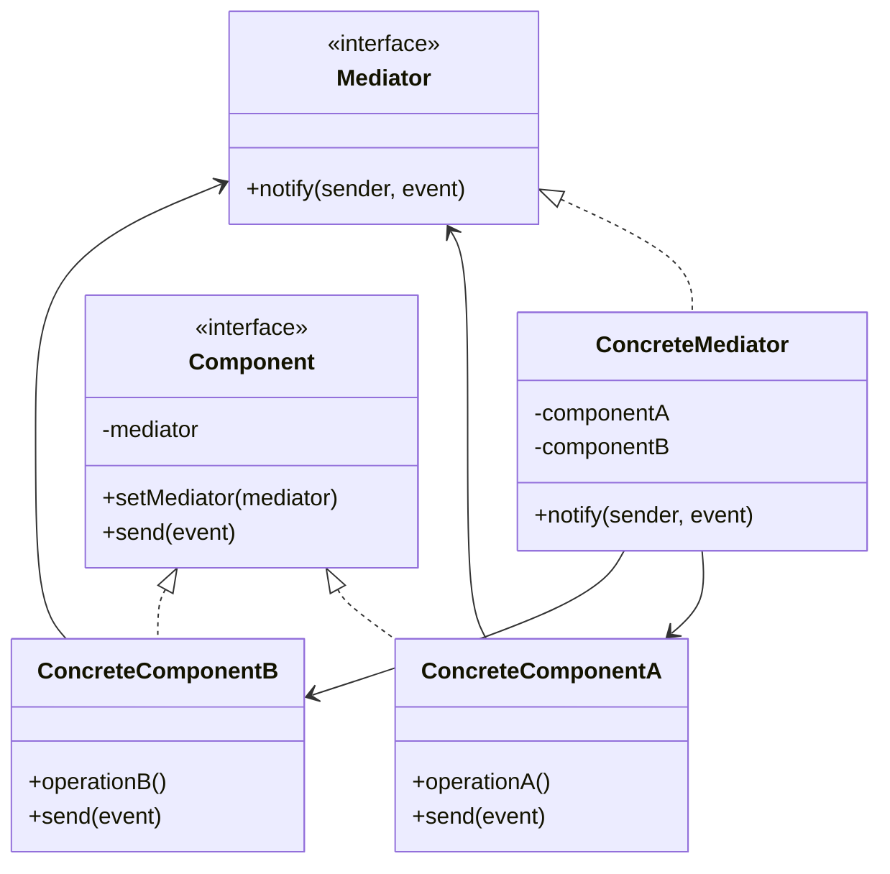

```table-of-contents
title: 
style: nestedList # TOC style (nestedList|nestedOrderedList|inlineFirstLevel)
minLevel: 0 # Include headings from the specified level
maxLevel: 0 # Include headings up to the specified level
includeLinks: true # Make headings clickable
hideWhenEmpty: false # Hide TOC if no headings are found
debugInConsole: false # Print debug info in Obsidian console
```
Mediator 패턴 가이드

# Mediator 패턴 개요

## 정의

Mediator 패턴은 객체 간의 상호작용을 캡슐화하는 행동 디자인 패턴이다. 객체들이 서로 직접 참조하는 대신 중재자(Mediator) 객체를 통해 통신하도록 설계한다. 이를 통해 객체 간의 결합도를 낮추고 코드의 유지보수성을 향상시킨다.

## 실생활 비유

실생활에서의 공항 관제탑을 생각해보자. 비행기들은 서로 직접 통신하지 않고 관제탑을 통해 통신한다. 각 비행기는 관제탑에만 메시지를 보내고, 관제탑은 이 정보를 필요한 비행기들에게 전달한다. 이처럼 Mediator 패턴은 중앙 통제 지점을 제공한다.

## 문제 상황

- 객체들 사이의 많은 연결로 인한 복잡성 증가
- 객체 간 의존성이 높아져 재사용성 저하
- 한 객체의 변경이 다른 여러 객체에 영향을 주는 상황

## 해결책

- 객체 간 직접 통신을 제한하고 중재자를 통한 통신 구현
- 관련 객체들을 중재자에 등록하고 상호작용 로직을 중앙화
- N:N 관계를 1:N 관계로 단순화

# 구조와 구성요소

## 기본 구조



## 구성요소

- **Mediator 인터페이스**: 컴포넌트와 통신하기 위한 메서드를 정의한다.
- **ConcreteMediator**: Mediator 인터페이스를 구현하고 컴포넌트 간의 조정 로직을 포함한다.
- **Component**: 기본 컴포넌트 인터페이스를 정의한다.
- **ConcreteComponent**: Component 인터페이스를 구현하는 구체적인 컴포넌트 클래스들이다.

# 구현 방법

## 단계별 구현 가이드

1. 시스템 컴포넌트 간의 관계를 분석하고 Mediator가 필요한지 판단한다.
2. Mediator 인터페이스를 설계하고 필요한 통신 메서드를 정의한다.
3. ConcreteMediator 클래스를 구현하여 컴포넌트 간 조정 로직을 작성한다.
4. 컴포넌트들이 Mediator를 참조할 수 있도록 설계한다.
5. 컴포넌트들의 상호작용 코드를 Mediator로 이동시킨다.

## Python 구현 예시

```python
from abc import ABC, abstractmethod
from typing import List


# Mediator 인터페이스
class ChatMediator(ABC):
    @abstractmethod
    def send_message(self, msg: str, user) -> None:
        pass
    
    @abstractmethod
    def add_user(self, user) -> None:
        pass


# Concrete Mediator
class ChatRoom(ChatMediator):
    def __init__(self):
        self.users: List = []
    
    def add_user(self, user) -> None:
        self.users.append(user)
    
    def send_message(self, msg: str, user) -> None:
        for u in self.users:
            # 메시지를 보낸 사용자를 제외한 모든 사용자에게 메시지 전달
            if u != user:
                u.receive(msg)


# Component
class User:
    def __init__(self, name: str, mediator: ChatMediator):
        self.name = name
        self.mediator = mediator
        self.mediator.add_user(self)
    
    def send(self, msg: str) -> None:
        print(f"{self.name} sends: {msg}")
        self.mediator.send_message(msg, self)
    
    def receive(self, msg: str) -> None:
        print(f"{self.name} receives: {msg}")


# 클라이언트 코드
if __name__ == "__main__":
    mediator = ChatRoom()
    
    alice = User("Alice", mediator)
    bob = User("Bob", mediator)
    charlie = User("Charlie", mediator)
    
    alice.send("Hi everyone!")
    bob.send("Hello Alice!")
```

## PHP 구현 예시

```php
<?php

// Mediator 인터페이스
interface MediatorInterface {
    public function notify(object $sender, string $event): void;
}

// Component 클래스
abstract class Component {
    protected $mediator;
    
    public function __construct(MediatorInterface $mediator = null) {
        $this->mediator = $mediator;
    }
    
    public function setMediator(MediatorInterface $mediator): void {
        $this->mediator = $mediator;
    }
}

// Concrete Component 1
class Button extends Component {
    public function click(): void {
        echo "Button: 클릭됨\n";
        $this->mediator->notify($this, "click");
    }
}

// Concrete Component 2
class Textbox extends Component {
    private $content = "";
    
    public function setText(string $text): void {
        $this->content = $text;
        echo "Textbox: 텍스트 설정됨 '{$text}'\n";
        $this->mediator->notify($this, "setText");
    }
    
    public function getText(): string {
        return $this->content;
    }
    
    public function clear(): void {
        $this->content = "";
        echo "Textbox: 내용 삭제됨\n";
    }
}

// Concrete Component 3
class Checkbox extends Component {
    private $checked = false;
    
    public function check(): void {
        $this->checked = !$this->checked;
        $status = $this->checked ? "체크됨" : "체크 해제됨";
        echo "Checkbox: {$status}\n";
        $this->mediator->notify($this, "check");
    }
    
    public function isChecked(): bool {
        return $this->checked;
    }
}

// Concrete Mediator
class DialogMediator implements MediatorInterface {
    private $button;
    private $textbox;
    private $checkbox;
    
    public function __construct(Button $button, Textbox $textbox, Checkbox $checkbox) {
        $this->button = $button;
        $this->button->setMediator($this);
        
        $this->textbox = $textbox;
        $this->textbox->setMediator($this);
        
        $this->checkbox = $checkbox;
        $this->checkbox->setMediator($this);
    }
    
    public function notify(object $sender, string $event): void {
        if ($event === "click") {
            if ($this->checkbox->isChecked()) {
                // 체크박스가 체크되어 있으면 텍스트박스 내용 저장 로직
                echo "Mediator: 텍스트 내용 저장: '{$this->textbox->getText()}'\n";
            } else {
                // 체크박스가 체크되어 있지 않으면 텍스트박스 초기화
                $this->textbox->clear();
                echo "Mediator: 텍스트박스 초기화\n";
            }
        }
        
        if ($event === "check" && !$this->checkbox->isChecked()) {
            echo "Mediator: 체크박스 해제에 따른 버튼 비활성화\n";
        }
    }
}

// 클라이언트 코드
$button = new Button();
$textbox = new Textbox();
$checkbox = new Checkbox();

$mediator = new DialogMediator($button, $textbox, $checkbox);

$textbox->setText("안녕하세요!");
$checkbox->check();
$button->click();
$checkbox->check();
$button->click();
```

## JavaScript 구현 예시

```javascript
// Mediator 패턴 구현

// Mediator 인터페이스
class TrafficTowerMediator {
  register(airplane) {
    throw new Error("Method 'register' must be implemented");
  }
  
  requestLanding(airplane) {
    throw new Error("Method 'requestLanding' must be implemented");
  }
  
  requestTakeoff(airplane) {
    throw new Error("Method 'requestTakeoff' must be implemented");
  }
}

// Concrete Mediator
class AirportControlTower extends TrafficTowerMediator {
  constructor() {
    super();
    this.airplanes = [];
    this.runwayFree = true;
    this.waitingForTakeoff = [];
    this.waitingForLanding = [];
  }
  
  register(airplane) {
    this.airplanes.push(airplane);
    airplane.mediator = this;
  }
  
  requestLanding(airplane) {
    console.log(`${airplane.id}: 착륙 요청`);
    
    if (this.runwayFree) {
      this.runwayFree = false;
      console.log(`관제탑: ${airplane.id}에게 착륙 허가`);
      airplane.land();
    } else {
      console.log(`관제탑: ${airplane.id}에게 대기 지시`);
      this.waitingForLanding.push(airplane);
    }
  }
  
  requestTakeoff(airplane) {
    console.log(`${airplane.id}: 이륙 요청`);
    
    if (this.runwayFree) {
      this.runwayFree = false;
      console.log(`관제탑: ${airplane.id}에게 이륙 허가`);
      airplane.takeoff();
    } else {
      console.log(`관제탑: ${airplane.id}에게 대기 지시`);
      this.waitingForTakeoff.push(airplane);
    }
  }
  
  runwayFreed() {
    this.runwayFree = true;
    
    // 착륙 대기 비행기가 있으면 우선 처리
    if (this.waitingForLanding.length > 0) {
      const nextPlane = this.waitingForLanding.shift();
      console.log(`관제탑: ${nextPlane.id}에게 착륙 허가`);
      this.runwayFree = false;
      nextPlane.land();
    } 
    // 착륙 대기가 없고 이륙 대기가 있으면 처리
    else if (this.waitingForTakeoff.length > 0) {
      const nextPlane = this.waitingForTakeoff.shift();
      console.log(`관제탑: ${nextPlane.id}에게 이륙 허가`);
      this.runwayFree = false;
      nextPlane.takeoff();
    }
  }
}

// Component
class Airplane {
  constructor(id) {
    this.id = id;
    this.mediator = null;
  }
  
  requestLanding() {
    this.mediator.requestLanding(this);
  }
  
  requestTakeoff() {
    this.mediator.requestTakeoff(this);
  }
  
  land() {
    console.log(`${this.id}: 착륙 중...`);
    setTimeout(() => {
      console.log(`${this.id}: 착륙 완료`);
      this.mediator.runwayFreed();
    }, 1000);
  }
  
  takeoff() {
    console.log(`${this.id}: 이륙 중...`);
    setTimeout(() => {
      console.log(`${this.id}: 이륙 완료`);
      this.mediator.runwayFreed();
    }, 1000);
  }
}

// 클라이언트 코드
const controlTower = new AirportControlTower();

const flight1 = new Airplane("Flight KE001");
const flight2 = new Airplane("Flight OZ203");
const flight3 = new Airplane("Flight JL712");

controlTower.register(flight1);
controlTower.register(flight2);
controlTower.register(flight3);

// 동시에 여러 요청이 들어오는 상황
flight1.requestLanding();
flight2.requestTakeoff();
flight3.requestLanding();

// 출력 결과:
// Flight KE001: 착륙 요청
// 관제탑: Flight KE001에게 착륙 허가
// Flight KE001: 착륙 중...
// Flight OZ203: 이륙 요청
// 관제탑: Flight OZ203에게 대기 지시
// Flight JL712: 착륙 요청
// 관제탑: Flight JL712에게 대기 지시
// Flight KE001: 착륙 완료
// 관제탑: Flight JL712에게 착륙 허가
// Flight JL712: 착륙 중...
// Flight JL712: 착륙 완료
// 관제탑: Flight OZ203에게 이륙 허가
// Flight OZ203: 이륙 중...
// Flight OZ203: 이륙 완료
```

# 사용 사례

## 적합한 사용 상황

- 다수의 객체 간 복잡한 상호작용이 존재하는 경우
- 객체 간 결합도를 낮추고 싶은 경우
- 여러 객체가 일관된 방식으로 통신해야 하는 경우
- 객체 간 관계가 명확하지 않거나 복잡한 경우

## 실제 사용 예시

- GUI 애플리케이션에서 컴포넌트 간 상호작용 관리
- 채팅 애플리케이션의 메시지 라우팅
- 항공 교통 관제 시스템
- 게임 엔진의 오브젝트 간 상호작용
- 이벤트 처리 시스템

## Framework/라이브러리 예시

- JavaScript의 EventBus 패턴
- Vue.js의 중앙화된 상태 관리(Vuex)
- Redux의 상태 관리자
- Node.js의 EventEmitter

# 장단점

## 장점

- **결합도 감소**: 객체 간 직접적인 참조가 줄어 결합도가 낮아진다.
- **재사용성 향상**: 객체들은 특정 Mediator가 아닌 인터페이스에 의존하므로 재사용이 쉬워진다.
- **단일 책임 원칙**: 객체 간 통신 로직이 중재자로 분리되어 각 객체는 본연의 책임에만 집중할 수 있다.
- **코드 유지보수성**: 객체 간 상호작용이 한 곳에서 관리되어 변경이 쉽다.

## 단점

- **중재자 복잡성**: 시스템이 복잡해질수록 중재자도 복잡해질 수 있다.
- **중앙화된 제어**: 중재자에 과도한 책임이 집중될 수 있다.
- **성능 이슈**: 모든 통신이 중재자를 거치므로 직접 통신보다 약간의 성능 저하가 있을 수 있다.

# 관련 패턴

## 유사 패턴과의 비교

- **Observer 패턴**: Observer는 일대다 관계를 다루는 반면, Mediator는 다대다 관계를 중앙화한다.
- **Facade 패턴**: Facade는 복잡한 서브시스템에 단순한 인터페이스를 제공하는 반면, Mediator는 객체 간 통신을 조정한다.
- **Command 패턴**: Command는 요청을 객체로 캡슐화하고, Mediator는 객체 간 통신을 캡슐화한다.

## 패턴 조합

- Mediator와 Observer를 함께 사용하여 이벤트 기반 시스템 구축
- Mediator와 Command를 조합하여 명령 실행 및 라우팅
- Mediator와 Strategy를 결합하여 동적 행동 변경

# 실제 적용 시 고려사항

## Best Practices

- Mediator는 너무 많은 책임을 갖지 않도록 설계한다.
- Component 객체들은 Mediator에만 의존하고 다른 Component를 직접 참조하지 않도록 한다.
- Mediator 인터페이스를 사용하여 구체적인 구현에 의존하지 않도록 한다.
- 단위 테스트를 위해 Mediator를 Mock 객체로 대체할 수 있도록 설계한다.

## 주의사항

- **God Object 안티패턴**: Mediator에 너무 많은 책임이 집중되면 유지보수가 어려워진다.
- **불필요한 복잡성**: 단순한 상호작용에는 Mediator가 오버엔지니어링이 될 수 있다.
- **디버깅 어려움**: 모든 통신이 중재자를 통해 이루어지면 문제 추적이 복잡해질 수 있다.

# 요약

## 핵심 개념

- Mediator 패턴은 객체 간 직접 참조를 제거하고 중앙 중재자를 통한 통신을 구현한다.
- 결합도를 낮추고 재사용성을 향상시키며 코드 유지보수성을 개선한다.
- 다수의 객체 간 복잡한 상호작용이 있는 시스템에 적합하다.

## 실무 적용 팁

- 중재자의 역할과 책임을 명확히 정의한다.
- 중재자가 너무 복잡해지면 여러 개의 특수 중재자로 분할을 고려한다.
- 성능 측정을 통해 병목현상이 발생하는지 확인한다.
- 테스트 용이성을 위해 의존성 주입을 활용한다.

# 참고 자료

## 디자인 패턴 도서

- "Design Patterns: Elements of Reusable Object-Oriented Software" by Gang of Four
- "Head First Design Patterns" by Eric Freeman, Elisabeth Robson
- "Patterns of Enterprise Application Architecture" by Martin Fowler

## 온라인 리소스

- [Refactoring Guru - Mediator Pattern](https://refactoring.guru/design-patterns/mediator)
- [Source Making - Mediator Pattern](https://sourcemaking.com/design_patterns/mediator)
- [Do Factory - Mediator Pattern](https://www.dofactory.com/net/mediator-design-pattern)