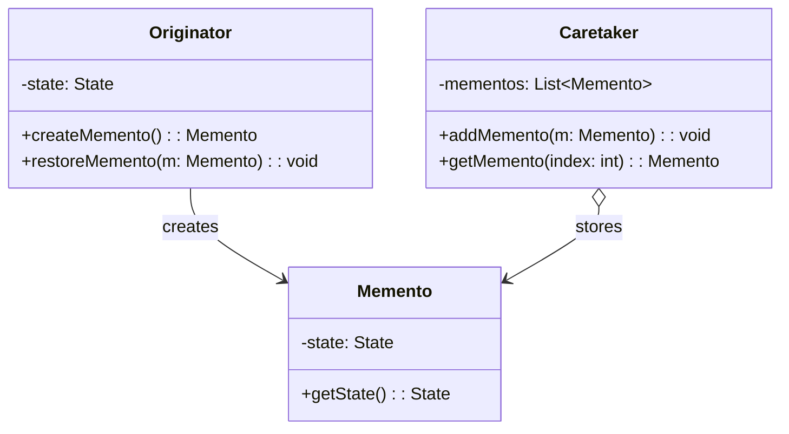
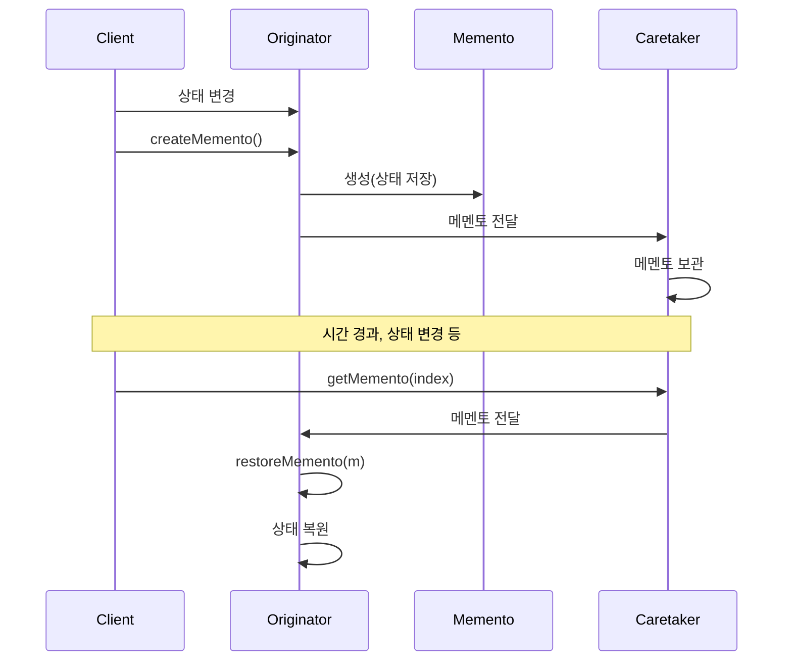
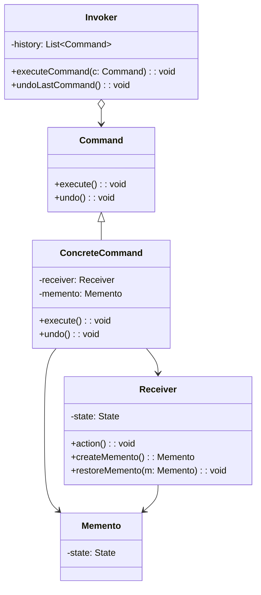

```table-of-contents
title: 
style: nestedList # TOC style (nestedList|nestedOrderedList|inlineFirstLevel)
minLevel: 0 # Include headings from the specified level
maxLevel: 0 # Include headings up to the specified level
includeLinks: true # Make headings clickable
hideWhenEmpty: false # Hide TOC if no headings are found
debugInConsole: false # Print debug info in Obsidian console
```
메멘토 패턴(Memento Pattern)

# 개념 설명

메멘토 패턴(Memento Pattern)은 객체의 내부 상태를 캡슐화하여 나중에 해당 상태로 객체를 복원할 수 있게 하는 행동 디자인 패턴이다. 이 패턴은 객체 지향 프로그래밍에서 실행 취소(Undo), 복원(Restore), 상태 저장(Save) 기능을 구현할 때 주로 사용된다.

## 실생활 비유

메멘토 패턴은 보드게임의 게임 세이브 기능과 유사하다. 게임을 진행하는 동안 특정 시점의 상태를 저장(Save)하고, 필요할 때 그 시점으로 되돌아갈(Load) 수 있는 것과 같다. 이때 게임의 상태는 메멘토 객체에 해당하고, 게임 자체는 오리지네이터(Originator)에 해당한다. 게임 세이브 파일을 관리하는 시스템은 케어테이커(Caretaker)의 역할을 한다.

# 기본 동작 방식

메멘토 패턴은 다음과 같은 세 가지 주요 구성 요소로 이루어진다:

1. **오리지네이터(Originator)**: 내부 상태를 가지고 있는 객체로, 상태를 저장하고 복원하는 기능을 제공한다.
2. **메멘토(Memento)**: 오리지네이터의 내부 상태를 저장하는 객체이다.
3. **케어테이커(Caretaker)**: 메멘토 객체를 보관하고 관리하는 객체이다.



## 기본 프로세스

1. 오리지네이터는 자신의 현재 상태를 담은 메멘토 객체를 생성한다.
2. 케어테이커는 이 메멘토 객체를 받아 보관한다.
3. 필요시 케어테이커는 메멘토 객체를 오리지네이터에게 제공한다.
4. 오리지네이터는 메멘토 객체를 통해 이전 상태로 복원된다.



# 실제 사용 예시

## Python 예시

```python
# Memento: 상태를 저장하는 클래스
class TextEditorMemento:
    def __init__(self, content):
        # 오직 생성시에만 상태 설정 가능
        self._content = content
    
    def get_saved_content(self):
        # 저장된 상태를 반환
        return self._content

# Originator: 상태를 가지고 변경 가능한 클래스
class TextEditor:
    def __init__(self):
        self.content = ""
    
    def write(self, text):
        # 상태 변경
        self.content += text
    
    def get_content(self):
        return self.content
    
    def save(self):
        # 현재 상태를 메멘토에 저장
        return TextEditorMemento(self.content)
    
    def restore(self, memento):
        # 메멘토로부터 상태 복원
        self.content = memento.get_saved_content()

# Caretaker: 상태 저장 이력을 관리하는 클래스
class History:
    def __init__(self):
        self._mementos = []
    
    def push(self, memento):
        # 새로운 메멘토 저장
        self._mementos.append(memento)
    
    def pop(self):
        # 가장 최근의 메멘토 반환 및 제거
        if not self._mementos:
            return None
        return self._mementos.pop()

# 사용 예시
if __name__ == "__main__":
    editor = TextEditor()
    history = History()
    
    # 텍스트 입력 및 상태 저장
    editor.write("첫 번째 문장. ")
    history.push(editor.save())
    
    editor.write("두 번째 문장. ")
    history.push(editor.save())
    
    editor.write("세 번째 문장. ")
    print(f"현재 내용: {editor.get_content()}")
    
    # 이전 상태로 복원 (실행 취소)
    if memento := history.pop():
        editor.restore(memento)
        print(f"실행 취소 후: {editor.get_content()}")
    
    # 한 번 더 이전 상태로 복원
    if memento := history.pop():
        editor.restore(memento)
        print(f"실행 취소 후: {editor.get_content()}")
```

## PHP 예시

```php
<?php
// Memento: 상태를 저장하는 클래스
class EditorMemento {
    private $content;
    
    public function __construct(string $content) {
        $this->content = $content;
    }
    
    public function getContent(): string {
        return $this->content;
    }
}

// Originator: 상태를 가지고 변경 가능한 클래스
class Editor {
    private $content;
    
    public function __construct() {
        $this->content = "";
    }
    
    public function type(string $text): void {
        $this->content .= $text;
    }
    
    public function getContent(): string {
        return $this->content;
    }
    
    // 현재 상태를 메멘토에 저장
    public function save(): EditorMemento {
        return new EditorMemento($this->content);
    }
    
    // 메멘토로부터 상태 복원
    public function restore(EditorMemento $memento): void {
        $this->content = $memento->getContent();
    }
}

// Caretaker: 상태 저장 이력을 관리하는 클래스
class EditorHistory {
    private $mementos = [];
    
    public function push(EditorMemento $memento): void {
        $this->mementos[] = $memento;
    }
    
    public function pop(): ?EditorMemento {
        if (empty($this->mementos)) {
            return null;
        }
        
        return array_pop($this->mementos);
    }
}

// 사용 예시
$editor = new Editor();
$history = new EditorHistory();

// 텍스트 입력 및 상태 저장
$editor->type("안녕하세요! ");
$history->push($editor->save());

$editor->type("PHP에서 메멘토 패턴 예시입니다. ");
$history->push($editor->save());

$editor->type("이 문장은 실행취소로 제거됩니다.");
echo "현재 내용: " . $editor->getContent() . PHP_EOL;

// 이전 상태로 복원 (실행 취소)
$memento = $history->pop();
if ($memento) {
    $editor->restore($memento);
    echo "실행 취소 후: " . $editor->getContent() . PHP_EOL;
}

// 한 번 더 이전 상태로 복원
$memento = $history->pop();
if ($memento) {
    $editor->restore($memento);
    echo "한 번 더 실행 취소 후: " . $editor->getContent() . PHP_EOL;
}
?>
```

## JavaScript 예시

```javascript
// Memento: 상태를 저장하는 클래스
class Memento {
  constructor(state) {
    this._state = Object.assign({}, state);
  }
  
  getState() {
    return this._state;
  }
}

// Originator: 상태를 가지고 변경 가능한 클래스
class DocumentEditor {
  constructor() {
    this.state = {
      content: "",
      selectionRange: { start: 0, end: 0 },
      cursorPosition: 0
    };
  }
  
  setContent(content) {
    this.state.content = content;
    this.state.cursorPosition = content.length;
  }
  
  setCursor(position) {
    this.state.cursorPosition = position;
  }
  
  setSelection(start, end) {
    this.state.selectionRange = { start, end };
  }
  
  getContent() {
    return this.state.content;
  }
  
  // 현재 상태를 메멘토에 저장
  save() {
    return new Memento(this.state);
  }
  
  // 메멘토로부터 상태 복원
  restore(memento) {
    this.state = Object.assign({}, memento.getState());
  }
}

// Caretaker: 상태 저장 이력을 관리하는 클래스
class DocumentHistory {
  constructor() {
    this.mementos = [];
    this.currentIndex = -1;
  }
  
  save(memento) {
    // 현재 위치 이후의 히스토리 제거 (새로운 브랜치)
    if (this.currentIndex < this.mementos.length - 1) {
      this.mementos = this.mementos.slice(0, this.currentIndex + 1);
    }
    
    this.mementos.push(memento);
    this.currentIndex = this.mementos.length - 1;
  }
  
  undo() {
    if (this.currentIndex > 0) {
      this.currentIndex--;
      return this.mementos[this.currentIndex];
    }
    return null;
  }
  
  redo() {
    if (this.currentIndex < this.mementos.length - 1) {
      this.currentIndex++;
      return this.mementos[this.currentIndex];
    }
    return null;
  }
}

// 사용 예시
const editor = new DocumentEditor();
const history = new DocumentHistory();

// 초기 상태 저장
editor.setContent("Hello");
history.save(editor.save());

// 내용 수정 및 저장
editor.setContent("Hello, World!");
history.save(editor.save());

editor.setContent("Hello, World! JavaScript example.");
console.log(`현재 내용: ${editor.getContent()}`);

// 실행 취소 (undo)
const prevMemento = history.undo();
if (prevMemento) {
  editor.restore(prevMemento);
  console.log(`실행 취소 후: ${editor.getContent()}`);
}

// 다시 실행 취소
const prevMemento2 = history.undo();
if (prevMemento2) {
  editor.restore(prevMemento2);
  console.log(`다시 실행 취소 후: ${editor.getContent()}`);
}

// 다시 실행 (redo)
const nextMemento = history.redo();
if (nextMemento) {
  editor.restore(nextMemento);
  console.log(`다시 실행 후: ${editor.getContent()}`);
}
```

# 고급 활용법

## 상태 스냅샷 최적화

대용량 객체의 경우 모든 상태를 복사하는 것은 비효율적일 수 있다. 다음과 같은 최적화 방법이 가능하다:

1. **증분식 백업**: 변경된 부분만 저장한다.
2. **플라이웨이트 패턴 조합**: 공통된 상태를 공유하여 메모리 사용량을 줄인다.
3. **지연 복사(Lazy Copy)**: 실제 복원이 필요할 때까지 복사를 지연시킨다.

## 명령 패턴(Command Pattern)과의 조합

명령 패턴과 메멘토 패턴을 함께 사용하면 실행 취소/다시 실행(Undo/Redo) 기능을 더 강력하게 구현할 수 있다.



# 주의사항

## 메모리 사용량

- 상태 히스토리가 많아질수록 메모리 소비가 증가한다.
- 오래된 상태는 주기적으로 제거하거나 갯수 제한을 두는 것이 좋다.

## 캡슐화 관련 이슈

- 메멘토 객체는 오리지네이터의 내부 상태에 접근하므로 캡슐화 원칙을 완벽히 지키기 어려울 수 있다.
- 언어별 접근 제어 기능(private, friend 등)을 활용하여 메멘토 클래스에만 접근 권한을 부여하는 것이 좋다.

## 성능 고려사항

- 상태가 복잡하거나 크기가 큰 경우 깊은 복사(Deep Copy)가 필요하여 성능에 영향을 줄 수 있다.
- 필요한 상태만 저장하는 '가벼운 메멘토(Lightweight Memento)' 전략을 고려할 수 있다.

# 결론

메멘토 패턴은 객체의 상태를 저장하고 복원하는 방법을 제공하는 유용한 디자인 패턴이다. 이 패턴은 실행 취소 기능, 복원 지점 제공, 트랜잭션 롤백 등의 기능을 구현할 때 널리 사용된다. 적절한 최적화 전략과 함께 사용하면, 메모리 효율성과 성능까지 보장할 수 있다.

이 패턴의 주요 장점은 캡슐화를 유지하면서 객체의 내부 상태를 외부에 노출하지 않고도 저장하고 복원할 수 있다는 점이다. 그러나 메모리 사용량과 성능 관련 이슈를 항상 고려해야 한다.

다른 디자인 패턴과 마찬가지로, 메멘토 패턴도 상황에 맞게 적절히 변형하여 사용할 수 있으며, 이를 통해 더 유지보수 가능하고 확장성 있는 코드를 작성할 수 있다.