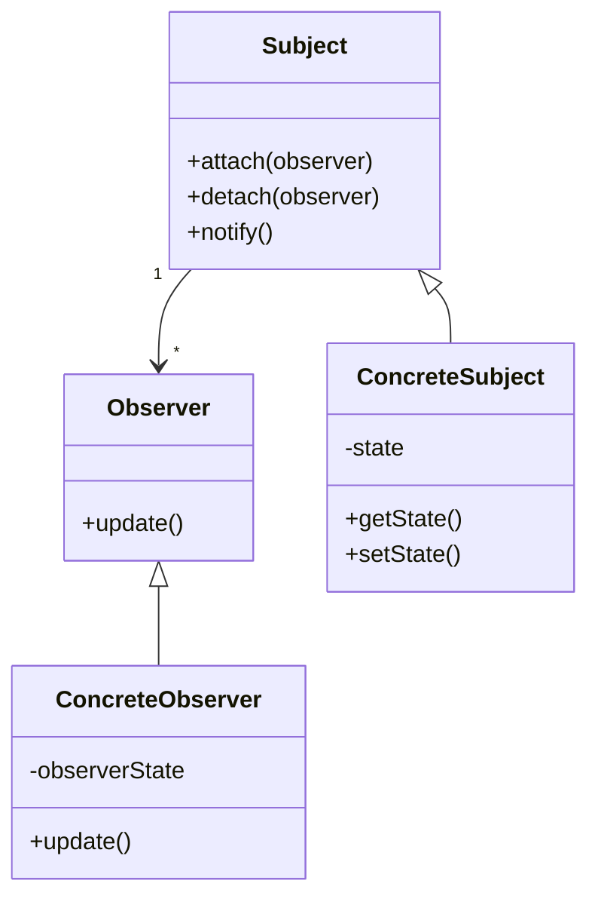
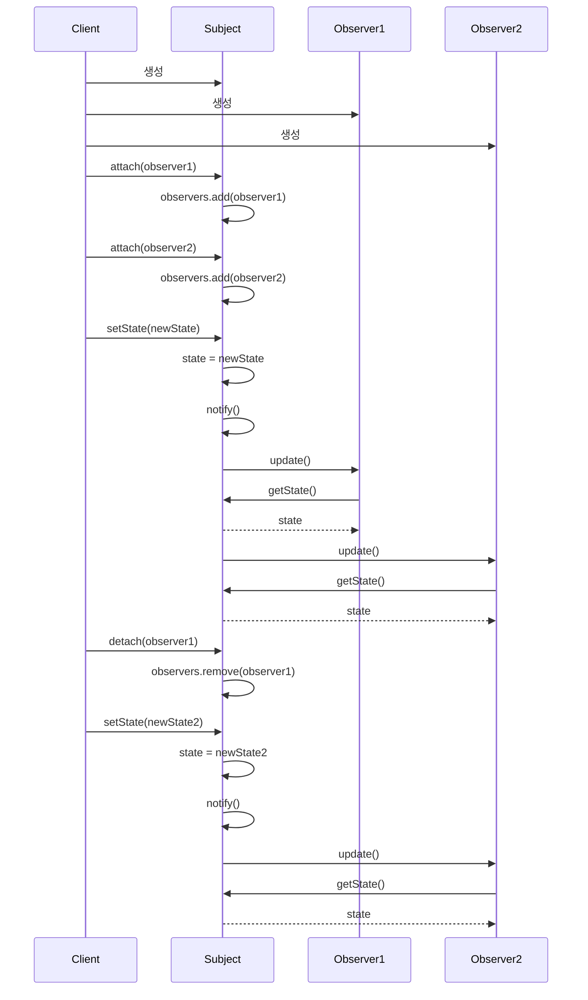

```table-of-contents
title: 
style: nestedList # TOC style (nestedList|nestedOrderedList|inlineFirstLevel)
minLevel: 0 # Include headings from the specified level
maxLevel: 0 # Include headings up to the specified level
includeLinks: true # Make headings clickable
hideWhenEmpty: false # Hide TOC if no headings are found
debugInConsole: false # Print debug info in Obsidian console
```
옵저버 패턴(Observer Pattern) 완벽 가이드

# 옵저버 패턴 개념 설명

## 기본 개념

옵저버 패턴은 객체 간의 일대다(one-to-many) 의존성을 정의하는 행동 디자인 패턴이다. 한 객체(Subject)의 상태가 변경되면 그 객체에 의존하는 모든 객체(Observer)들이 자동으로 알림을 받고 갱신된다.

실생활 비유로는 뉴스 구독 서비스와 유사하다. 신문사(Subject)가 새로운 뉴스를 발행하면 모든 구독자(Observer)는 자동으로 새 뉴스를 받게 된다. 구독자는 언제든지 구독을 시작하거나 취소할 수 있다.

## 핵심 구성 요소

- **Subject(주체)**: 관찰 대상이 되는 객체
    
    - Observer를 등록/제거하는 메서드 제공
    - Observer에게 상태 변경을 알리는 메서드 포함
- **Observer(관찰자)**: Subject의 변화를 감지하는 객체
    
    - Subject로부터 상태 변경 알림을 받는 인터페이스 구현
    - 알림 수신 시 특정 동작 수행
- **ConcreteSubject**: Subject 인터페이스 구현체
    
    - 실제 상태를 가지며 변경 시 Observer에게 알림
- **ConcreteObserver**: Observer 인터페이스 구현체
    
    - Subject의 상태 변경에 대응하는 특정 동작 정의

## 옵저버 패턴 구조



# 기본 동작 방식

## 옵저버 패턴 작동 흐름

1. Subject는 Observer 목록을 유지관리한다
2. Observer가 Subject를 구독하면 목록에 추가된다
3. Observer가 구독 취소하면 목록에서 제거된다
4. Subject의 상태가 변경되면 모든 Observer에게 알림을 보낸다
5. 각 Observer는 알림을 받아 적절한 동작을 수행한다



# 실제 사용 예시

## Python 구현 예시

```python
from abc import ABC, abstractmethod
from typing import List


class Observer(ABC):
    """관찰자 인터페이스"""
    
    @abstractmethod
    def update(self, temperature: float, humidity: float, pressure: float) -> None:
        """상태 업데이트 시 호출되는 메서드"""
        pass


class Subject(ABC):
    """주체 인터페이스"""
    
    @abstractmethod
    def register_observer(self, observer: Observer) -> None:
        """관찰자 등록"""
        pass
    
    @abstractmethod
    def remove_observer(self, observer: Observer) -> None:
        """관찰자 제거"""
        pass
    
    @abstractmethod
    def notify_observers(self) -> None:
        """모든 관찰자에게 알림"""
        pass


class WeatherData(Subject):
    """구체적인 주체 구현: 날씨 데이터"""
    
    def __init__(self):
        self._observers: List[Observer] = []
        self._temperature: float = 0
        self._humidity: float = 0
        self._pressure: float = 0
    
    def register_observer(self, observer: Observer) -> None:
        """관찰자 등록"""
        if observer not in self._observers:
            self._observers.append(observer)
    
    def remove_observer(self, observer: Observer) -> None:
        """관찰자 제거"""
        if observer in self._observers:
            self._observers.remove(observer)
    
    def notify_observers(self) -> None:
        """모든 관찰자에게 알림"""
        for observer in self._observers:
            observer.update(self._temperature, self._humidity, self._pressure)
    
    def measurements_changed(self) -> None:
        """측정값 변경 시 호출"""
        self.notify_observers()
    
    def set_measurements(self, temperature: float, humidity: float, pressure: float) -> None:
        """새로운 측정값 설정"""
        self._temperature = temperature
        self._humidity = humidity
        self._pressure = pressure
        self.measurements_changed()


class CurrentConditionsDisplay(Observer):
    """구체적인 관찰자 구현: 현재 날씨 상태 디스플레이"""
    
    def __init__(self, weather_data: WeatherData):
        self._temperature: float = 0
        self._humidity: float = 0
        self._weather_data = weather_data
        weather_data.register_observer(self)
    
    def update(self, temperature: float, humidity: float, pressure: float) -> None:
        """상태 업데이트"""
        self._temperature = temperature
        self._humidity = humidity
        self.display()
    
    def display(self) -> None:
        """화면에 정보 표시"""
        print(f"현재 상태: 온도 {self._temperature}°C, 습도 {self._humidity}%")


class StatisticsDisplay(Observer):
    """구체적인 관찰자 구현: 통계 디스플레이"""
    
    def __init__(self, weather_data: WeatherData):
        self._temperature_sum: float = 0
        self._reading_count: int = 0
        self._max_temp: float = float('-inf')
        self._min_temp: float = float('inf')
        self._weather_data = weather_data
        weather_data.register_observer(self)
    
    def update(self, temperature: float, humidity: float, pressure: float) -> None:
        """상태 업데이트"""
        self._temperature_sum += temperature
        self._reading_count += 1
        
        if temperature > self._max_temp:
            self._max_temp = temperature
        
        if temperature < self._min_temp:
            self._min_temp = temperature
        
        self.display()
    
    def display(self) -> None:
        """화면에 정보 표시"""
        avg_temp = self._temperature_sum / self._reading_count if self._reading_count > 0 else 0
        print(f"날씨 통계: 평균/최고/최저 온도 = {avg_temp:.1f}/{self._max_temp:.1f}/{self._min_temp:.1f}")


# 사용 예시
def main():
    weather_data = WeatherData()
    
    # 디스플레이 생성 (관찰자 등록)
    current_display = CurrentConditionsDisplay(weather_data)
    statistics_display = StatisticsDisplay(weather_data)
    
    # 날씨 데이터 업데이트
    print("첫 번째 측정값 설정:")
    weather_data.set_measurements(25.2, 65.0, 1013.1)
    
    print("\n두 번째 측정값 설정:")
    weather_data.set_measurements(26.5, 70.0, 1010.5)
    
    # 관찰자 제거
    weather_data.remove_observer(current_display)
    
    print("\n세 번째 측정값 설정 (현재 상태 디스플레이 제거 후):")
    weather_data.set_measurements(24.8, 80.0, 1012.0)


if __name__ == "__main__":
    main()
```

### 실행 결과:

```
첫 번째 측정값 설정:
현재 상태: 온도 25.2°C, 습도 65.0%
날씨 통계: 평균/최고/최저 온도 = 25.2/25.2/25.2

두 번째 측정값 설정:
현재 상태: 온도 26.5°C, 습도 70.0%
날씨 통계: 평균/최고/최저 온도 = 25.9/26.5/25.2

세 번째 측정값 설정 (현재 상태 디스플레이 제거 후):
날씨 통계: 평균/최고/최저 온도 = 25.5/26.5/24.8
```

## JavaScript 구현 예시

```javascript
// Observer 패턴 - JavaScript 구현

// Subject (주체) 클래스
class NewsPublisher {
  constructor() {
    this.subscribers = [];
    this.news = '';
  }

  // Observer 등록
  subscribe(observer) {
    if (!this.subscribers.includes(observer)) {
      this.subscribers.push(observer);
      console.log(`${observer.name}님이 뉴스 구독을 시작했습니다.`);
    }
  }

  // Observer 제거
  unsubscribe(observer) {
    const index = this.subscribers.indexOf(observer);
    if (index !== -1) {
      this.subscribers.splice(index, 1);
      console.log(`${observer.name}님이 뉴스 구독을 취소했습니다.`);
    }
  }

  // 모든 Observer에게 알림
  notify() {
    this.subscribers.forEach(subscriber => {
      subscriber.update(this.news);
    });
  }

  // 새 뉴스 발행 (상태 변경)
  publishNews(news) {
    this.news = news;
    console.log(`\n새로운 뉴스 발행: "${this.news}"`);
    this.notify();
  }
}

// Observer (관찰자) 클래스
class Subscriber {
  constructor(name) {
    this.name = name;
  }

  // 상태 업데이트 시 호출되는 메서드
  update(news) {
    console.log(`${this.name}: 새 뉴스를 받았습니다 - "${news}"`);
  }
}

// 특별한 Observer 타입 - 푸시 알림 구독자
class PushSubscriber extends Subscriber {
  update(news) {
    console.log(`🔔 ${this.name}에게 푸시 알림: "${news}"`);
  }
}

// 특별한 Observer 타입 - 프리미엄 구독자
class PremiumSubscriber extends Subscriber {
  update(news) {
    console.log(`✨ ${this.name}(프리미엄): "${news}" (추가 분석 포함)`);
  }
}

// 사용 예시
function runExample() {
  // Subject 생성
  const techNews = new NewsPublisher();

  // Observer 생성
  const john = new Subscriber('John');
  const jane = new PushSubscriber('Jane');
  const sam = new PremiumSubscriber('Sam');

  // Observer 등록
  techNews.subscribe(john);
  techNews.subscribe(jane);
  techNews.subscribe(sam);

  // 뉴스 발행 (상태 변경)
  techNews.publishNews('인공지능 기술 발전으로 새로운 산업 혁명 시작');

  // Observer 제거
  techNews.unsubscribe(john);

  // 다시 뉴스 발행
  techNews.publishNews('양자 컴퓨팅 돌파구 발견');
}

// 예시 실행
runExample();
```

### 실행 결과:

```
John님이 뉴스 구독을 시작했습니다.
Jane님이 뉴스 구독을 시작했습니다.
Sam님이 뉴스 구독을 시작했습니다.

새로운 뉴스 발행: "인공지능 기술 발전으로 새로운 산업 혁명 시작"
John: 새 뉴스를 받았습니다 - "인공지능 기술 발전으로 새로운 산업 혁명 시작"
🔔 Jane에게 푸시 알림: "인공지능 기술 발전으로 새로운 산업 혁명 시작"
✨ Sam(프리미엄): "인공지능 기술 발전으로 새로운 산업 혁명 시작" (추가 분석 포함)

John님이 뉴스 구독을 취소했습니다.

새로운 뉴스 발행: "양자 컴퓨팅 돌파구 발견"
🔔 Jane에게 푸시 알림: "양자 컴퓨팅 돌파구 발견"
✨ Sam(프리미엄): "양자 컴퓨팅 돌파구 발견" (추가 분석 포함)
```

## PHP 구현 예시

```php
<?php

// Observer 인터페이스
interface Observer {
    public function update(string $message): void;
}

// Subject 인터페이스
interface Subject {
    public function attach(Observer $observer): void;
    public function detach(Observer $observer): void;
    public function notify(): void;
}

// 구체적인 Subject: 이벤트 관리자
class EventManager implements Subject {
    private array $observers = [];
    private string $eventName = '';
    private string $eventDescription = '';
    
    public function attach(Observer $observer): void {
        $observerId = spl_object_hash($observer);
        if (!isset($this->observers[$observerId])) {
            $this->observers[$observerId] = $observer;
            echo get_class($observer) . "가 이벤트 관리자에 등록되었습니다.\n";
        }
    }
    
    public function detach(Observer $observer): void {
        $observerId = spl_object_hash($observer);
        if (isset($this->observers[$observerId])) {
            unset($this->observers[$observerId]);
            echo get_class($observer) . "가 이벤트 관리자에서 제거되었습니다.\n";
        }
    }
    
    public function notify(): void {
        foreach ($this->observers as $observer) {
            $observer->update("이벤트 발생: {$this->eventName} - {$this->eventDescription}");
        }
    }
    
    public function createEvent(string $name, string $description): void {
        $this->eventName = $name;
        $this->eventDescription = $description;
        echo "\n새 이벤트 생성: '{$name}'\n";
        $this->notify();
    }
}

// 구체적인 Observer: 이메일 알림
class EmailNotifier implements Observer {
    private string $email;
    
    public function __construct(string $email) {
        $this->email = $email;
    }
    
    public function update(string $message): void {
        echo "📧 이메일 ({$this->email})로 알림 전송: {$message}\n";
    }
}

// 구체적인 Observer: SMS 알림
class SmsNotifier implements Observer {
    private string $phoneNumber;
    
    public function __construct(string $phoneNumber) {
        $this->phoneNumber = $phoneNumber;
    }
    
    public function update(string $message): void {
        echo "📱 SMS ({$this->phoneNumber})로 알림 전송: {$message}\n";
    }
}

// 구체적인 Observer: 앱 내 알림
class AppNotifier implements Observer {
    private string $username;
    
    public function __construct(string $username) {
        $this->username = $username;
    }
    
    public function update(string $message): void {
        echo "🔔 앱 내 알림 (사용자: {$this->username}): {$message}\n";
    }
}

// 사용 예시
function runDemo() {
    // Subject 생성
    $eventManager = new EventManager();
    
    // Observer 생성
    $emailNotifier = new EmailNotifier("user@example.com");
    $smsNotifier = new SmsNotifier("010-1234-5678");
    $appNotifier = new AppNotifier("john_doe");
    
    // Observer 등록
    $eventManager->attach($emailNotifier);
    $eventManager->attach($smsNotifier);
    $eventManager->attach($appNotifier);
    
    // 이벤트 생성 (상태 변경)
    $eventManager->createEvent("신제품 출시", "새로운 제품이 출시되었습니다.");
    
    // Observer 제거
    $eventManager->detach($smsNotifier);
    
    // 다른 이벤트 생성
    $eventManager->createEvent("특별 할인", "오늘만 30% 할인 이벤트를 진행합니다.");
}

// 실행
runDemo();
?>
```

### 실행 결과:

```
EmailNotifier가 이벤트 관리자에 등록되었습니다.
SmsNotifier가 이벤트 관리자에 등록되었습니다.
AppNotifier가 이벤트 관리자에 등록되었습니다.

새 이벤트 생성: '신제품 출시'
📧 이메일 (user@example.com)로 알림 전송: 이벤트 발생: 신제품 출시 - 새로운 제품이 출시되었습니다.
📱 SMS (010-1234-5678)로 알림 전송: 이벤트 발생: 신제품 출시 - 새로운 제품이 출시되었습니다.
🔔 앱 내 알림 (사용자: john_doe): 이벤트 발생: 신제품 출시 - 새로운 제품이 출시되었습니다.

SmsNotifier가 이벤트 관리자에서 제거되었습니다.

새 이벤트 생성: '특별 할인'
📧 이메일 (user@example.com)로 알림 전송: 이벤트 발생: 특별 할인 - 오늘만 30% 할인 이벤트를 진행합니다.
🔔 앱 내 알림 (사용자: john_doe): 이벤트 발생: 특별 할인 - 오늘만 30% 할인 이벤트를 진행합니다.
```

# 고급 활용법

## 이벤트 시스템 구현

옵저버 패턴은 이벤트 기반 프로그래밍의 핵심이다. 이벤트 발생 시 등록된 리스너(observer)에게 알림을 전달하는 방식으로 동작한다.

```javascript
// JavaScript 이벤트 시스템 구현 예시
class EventEmitter {
  constructor() {
    this.events = {};
  }

  // 이벤트 리스너 등록
  on(event, listener) {
    if (!this.events[event]) {
      this.events[event] = [];
    }
    this.events[event].push(listener);
    return this;
  }

  // 이벤트 리스너 제거
  off(event, listener) {
    if (!this.events[event]) return this;
    
    this.events[event] = this.events[event].filter(l => l !== listener);
    return this;
  }

  // 이벤트 발생
  emit(event, ...args) {
    if (!this.events[event]) return this;
    
    this.events[event].forEach(listener => {
      listener.apply(this, args);
    });
    return this;
  }

  // 한 번만 실행되는 이벤트 리스너 등록
  once(event, listener) {
    const onceWrapper = (...args) => {
      listener.apply(this, args);
      this.off(event, onceWrapper);
    };
    
    return this.on(event, onceWrapper);
  }
}

// 사용 예시
const userEvents = new EventEmitter();

function userLoginHandler(user) {
  console.log(`${user}님이 로그인했습니다.`);
}

function userActivityHandler(user, activity) {
  console.log(`${user}님이 ${activity} 활동을 수행했습니다.`);
}

// 이벤트 리스너 등록
userEvents.on('login', userLoginHandler);
userEvents.on('activity', userActivityHandler);

// 이벤트 발생
userEvents.emit('login', '김철수');
userEvents.emit('activity', '김철수', '댓글 작성');

// 이벤트 리스너 제거
userEvents.off('login', userLoginHandler);

// 이벤트 리스너 제거 후 발생
userEvents.emit('login', '박영희'); // 출력 없음
userEvents.emit('activity', '박영희', '글 작성');
```

## 푸시 기반 vs. 풀 기반 모델

1. **푸시 기반 모델**
    
    - Subject가 Observer에게 상세 데이터를 전달
    - 장점: Observer가 추가 요청 없이 필요한 데이터를 한 번에 받음
    - 단점: Observer가 필요하지 않은 데이터까지 전달받을 수 있음
2. **풀 기반 모델**
    
    - Subject는 상태 변경 알림만 전달
    - Observer가 필요한 데이터를 Subject에게 요청
    - 장점: Observer가 필요한 데이터만 선택적으로 가져올 수 있음
    - 단점: 데이터 조회를 위한 추가 호출 필요

```python
# 풀 기반 모델 예시
class WeatherData:
    def __init__(self):
        self._observers = []
        self._temperature = 0
        self._humidity = 0
        self._pressure = 0
    
    def register_observer(self, observer):
        if observer not in self._observers:
            self._observers.append(observer)
    
    def remove_observer(self, observer):
        if observer in self._observers:
            self._observers.remove(observer)
    
    def notify_observers(self):
        # 데이터를 푸시하지 않고 변경 사실만 알림
        for observer in self._observers:
            observer.update(self)  # Subject 자체를 전달
    
    # 상태 접근자 메서드들
    def get_temperature(self):
        return self._temperature
    
    def get_humidity(self):
        return self._humidity
    
    def get_pressure(self):
        return self._pressure
    
    def set_measurements(self, temperature, humidity, pressure):
        self._temperature = temperature
        self._humidity = humidity
        self._pressure = pressure
        self.notify_observers()


class TemperatureDisplay:
    def update(self, weather_data):
        # 필요한 데이터만 가져옴 (풀)
        temperature = weather_data.get_temperature()
        print(f"현재 온도: {temperature}°C")


class HumidityDisplay:
    def update(self, weather_data):
        # 필요한 데이터만 가져옴 (풀)
        humidity = weather_data.get_humidity()
        print(f"현재 습도: {humidity}%")
```

## 비동기 Observer 패턴

현대 웹 애플리케이션에서는 비동기 이벤트 처리가 중요하다. Promise, async/await과 결합한 Observer 패턴은 매우 유용하다.

```javascript
// 비동기 Observer 패턴 예시
class AsyncNewsPublisher {
  constructor() {
    this.subscribers = [];
    this.news = '';
  }

  subscribe(observer) {
    this.subscribers.push(observer);
    return {
      unsubscribe: () => {
        this.subscribers = this.subscribers.filter(obs => obs !== observer);
      }
    };
  }

  async publishNews(news) {
    this.news = news;
    console.log(`뉴스 발행 중: "${news}"`);
    
    // 모든 Observer에게 알림 (비동기 처리)
    const notificationPromises = this.subscribers.map(subscriber => 
      Promise.resolve().then(() => subscriber.update(this.news))
    );
    
    // 모든 알림이 완료될 때까지 기다림
    await Promise.all(notificationPromises);
    console.log('모든 구독자에게 알림 완료');
  }
}

// 비동기 Observer 예시
class AsyncSubscriber {
  constructor(name, delay) {
    this.name = name;
    this.delay = delay; // 의도적 지연 (ms)
  }

  async update(news) {
    // 비동기 처리 시뮬레이션
    await new Promise(resolve => setTimeout(resolve, this.delay));
    console.log(`${this.name} (${this.delay}ms 지연): 뉴스 수신 - "${news}"`);
    return true;
  }
}

// 사용 예시
async function runAsyncExample() {
  const publisher = new AsyncNewsPublisher();
  
  // 다양한 지연 시간을 가진 구독자
  const subscriber1 = new AsyncSubscriber('빠른 구독자', 100);
  const subscriber2 = new AsyncSubscriber('일반 구독자', 500);
  const subscriber3 = new AsyncSubscriber('느린 구독자', 1000);
  
  // 구독
  const subscription1 = publisher.subscribe(subscriber1);
  const subscription2 = publisher.subscribe(subscriber2);
  const subscription3 = publisher.subscribe(subscriber3);
  
  // 뉴스 발행 (비동기)
  await publisher.publishNews('중요한 속보입니다!');
  
  // 첫 번째 구독자 구독 취소
  subscription1.unsubscribe();
  
  // 다른 뉴스 발행
  await publisher.publishNews('추가 정보가 있습니다.');
}

// 실행
runAsyncExample();
```

# 주의사항

## 성능 고려사항

- **Observer 관리**: Observer가 많을 경우 메모리 사용량이 증가할 수 있다
- **순환 참조**: Subject와 Observer 간 순환 참조 발생 가능성 주의
- **알림 순서**: Observer 알림 순서에 의존하지 않도록 설계해야 한다
- **지연 알림**: 많은 상태 변경 시 알림 지연(batch notification) 고려

## 자주 발생하는 문제점

1. **Memory Leak**
    - Observer 제거를 잊는 경우 메모리 누수 발생
    - 해결: 약한 참조(weak reference) 사용, 명시적 구독 취소 메커니즘 구현

```javascript
// 약한 참조를 활용한 Observer 패턴 (JavaScript)
class WeakPublisher {
  constructor() {
    // WeakMap을 사용하여 Observer 관리
    this.observers = new WeakMap();
  }
  
  subscribe(observer, callback) {
```