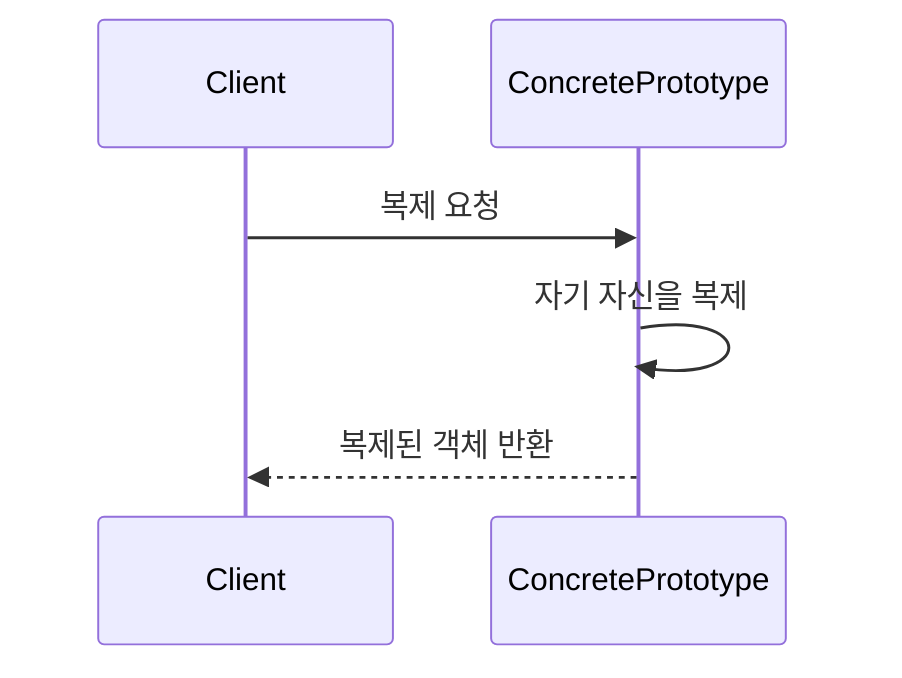

```table-of-contents
title: 
style: nestedList # TOC style (nestedList|nestedOrderedList|inlineFirstLevel)
minLevel: 0 # Include headings from the specified level
maxLevel: 0 # Include headings up to the specified level
includeLinks: true # Make headings clickable
hideWhenEmpty: false # Hide TOC if no headings are found
debugInConsole: false # Print debug info in Obsidian console
```
Prototype 패턴

# 개념 설명

Prototype 패턴은 기존 객체를 복제하여 새로운 객체를 생성하는 생성 패턴이다. 이 패턴은 객체 생성 비용이 높거나 이미 유사한 객체가 존재할 때 효율적으로 새 객체를 생성하는 방법을 제공한다.

## 실생활 비유

Prototype 패턴은 생물학에서의 세포 분열과 유사하다. 원본 세포(prototype)가 자신을 복제하여 새로운 세포를 만들어내는 과정과 같다. 또 다른 예로, 문서를 복사기로 복사하는 경우를 생각할 수 있다. 원본 문서를 매번 새로 작성하지 않고 복사하여 필요한 부분만 수정하는 방식이다.

# 기본 동작 방식

Prototype 패턴의 핵심 구성 요소는 다음과 같다:

- **Prototype**: 복제 메서드를 선언하는 인터페이스
- **ConcretePrototype**: 복제 메서드를 구현하는 클래스
- **Client**: 원형 객체에 복제를 요청하는 클래스

## 동작 흐름



# 실제 사용 예시

## Python 예시

```python
import copy

class Prototype:
    def clone(self):
        # 얕은 복사 수행
        return copy.copy(self)
    
    def deep_clone(self):
        # 깊은 복사 수행
        return copy.deepcopy(self)

class Document(Prototype):
    def __init__(self, name, content, styles):
        self.name = name
        self.content = content
        self.styles = styles  # 중첩된 객체를 포함
    
    def __str__(self):
        return f"Document: {self.name}, Content: {self.content}, Styles: {self.styles}"

# 클라이언트 코드
if __name__ == "__main__":
    # 원본 객체 생성
    original_doc = Document("Original", "Hello World", {"font": "Arial", "size": 12})
    print(f"Original: {original_doc}")
    
    # 얕은 복사
    shallow_copy = original_doc.clone()
    shallow_copy.name = "Shallow Copy"
    shallow_copy.styles["font"] = "Times New Roman"  # 원본 객체의 styles도 변경됨
    print(f"Shallow: {shallow_copy}")
    print(f"Original after shallow copy: {original_doc}")  # styles가 변경된 것을 확인
    
    # 깊은 복사
    deep_copy = original_doc.deep_clone()
    deep_copy.name = "Deep Copy"
    deep_copy.styles["font"] = "Calibri"  # 원본 객체의 styles는 변경되지 않음
    print(f"Deep: {deep_copy}")
    print(f"Original after deep copy: {original_doc}")  # 원본은 변경되지 않음
```

## PHP 예시

```php
<?php
// Prototype 인터페이스
interface Prototype {
    public function clone(): Prototype;
}

// 구체적인 Prototype 구현
class Page implements Prototype {
    private $title;
    private $content;
    private $metadata;
    
    public function __construct(string $title, string $content, array $metadata) {
        $this->title = $title;
        $this->content = $content;
        $this->metadata = $metadata;
    }
    
    public function clone(): Prototype {
        // PHP의 clone 키워드를 사용하여 얕은 복사 수행
        $clone = clone $this;
        // 중첩된 객체에 대해 깊은 복사 수행
        $clone->metadata = array_map(function($item) {
            return is_object($item) ? clone $item : $item;
        }, $this->metadata);
        
        return $clone;
    }
    
    public function setTitle(string $title): void {
        $this->title = $title;
    }
    
    public function setContent(string $content): void {
        $this->content = $content;
    }
    
    public function setMetadata(string $key, $value): void {
        $this->metadata[$key] = $value;
    }
    
    public function getInfo(): string {
        return "Title: {$this->title}, Content: {$this->content}, Metadata: " . json_encode($this->metadata);
    }
}

// 클라이언트 코드
$originalPage = new Page("Homepage", "Welcome to our website", ["author" => "Admin", "created" => "2025-04-05"]);
echo "Original: " . $originalPage->getInfo() . "\n";

// 페이지 복제 및 수정
$aboutPage = $originalPage->clone();
$aboutPage->setTitle("About Us");
$aboutPage->setContent("Our company was founded in 2020");
$aboutPage->setMetadata("author", "Marketing Team");
echo "Cloned: " . $aboutPage->getInfo() . "\n";

// 원본 객체는 변경되지 않음
echo "Original after cloning: " . $originalPage->getInfo() . "\n";
?>
```

## JavaScript 예시

```javascript
// Prototype 객체 정의
class WidgetPrototype {
  constructor(id, template, styles) {
    this.id = id;
    this.template = template;
    this.styles = styles;
  }
  
  // 얕은 복사 메서드
  clone() {
    // Object.assign을 사용한 얕은 복사
    return Object.assign(Object.create(Object.getPrototypeOf(this)), this);
  }
  
  // 깊은 복사 메서드
  deepClone() {
    // JSON을 사용한 깊은 복사 (함수나 특수 객체에는 제한이 있음)
    const clone = Object.create(Object.getPrototypeOf(this));
    const deepCopy = JSON.parse(JSON.stringify(this));
    
    Object.keys(deepCopy).forEach(key => {
      clone[key] = deepCopy[key];
    });
    
    return clone;
  }
  
  // 위젯 렌더링 메서드
  render() {
    return `<div id="${this.id}" style="${Object.entries(this.styles).map(([key, value]) => `${key}:${value}`).join(';')}">
      ${this.template}
    </div>`;
  }
}

// 클라이언트 코드
const originalWidget = new WidgetPrototype(
  'widget-1', 
  '<h2>Default Widget</h2><p>Click to interact</p>', 
  { background: '#f0f0f0', padding: '10px', border: '1px solid #ccc' }
);

console.log('Original widget:');
console.log(originalWidget.render());

// 얕은 복사로 새 위젯 생성
const sidebarWidget = originalWidget.clone();
sidebarWidget.id = 'sidebar-widget';
sidebarWidget.template = '<h2>Sidebar Widget</h2><p>Quick access</p>';
sidebarWidget.styles.background = '#e0e0ff';

console.log('Sidebar widget:');
console.log(sidebarWidget.render());

// 깊은 복사로 새 위젯 생성
const footerWidget = originalWidget.deepClone();
footerWidget.id = 'footer-widget';
footerWidget.template = '<h2>Footer Widget</h2><p>Additional information</p>';
footerWidget.styles.background = '#ffe0e0';
footerWidget.styles.borderRadius = '5px';

console.log('Footer widget:');
console.log(footerWidget.render());

// 원본 위젯 확인
console.log('Original widget after cloning:');
console.log(originalWidget.render());
```

# 고급 활용법

## 프로토타입 레지스트리

복잡한 애플리케이션에서는 자주 사용되는 프로토타입 객체를 중앙 저장소(레지스트리)에 등록하여 관리할 수 있다.

```python
class PrototypeRegistry:
    def __init__(self):
        self._prototypes = {}
    
    def register(self, name, prototype):
        self._prototypes[name] = prototype
    
    def unregister(self, name):
        del self._prototypes[name]
    
    def clone(self, name, **attrs):
        # 프로토타입 복제 후 추가 속성 설정
        prototype = self._prototypes.get(name)
        if not prototype:
            raise ValueError(f"Prototype with name '{name}' not found")
        
        clone = prototype.deep_clone()
        
        # 추가 속성 설정
        for attr_name, attr_value in attrs.items():
            setattr(clone, attr_name, attr_value)
        
        return clone

# 사용 예시
registry = PrototypeRegistry()
registry.register("document", Document("Template", "Default content", {"font": "Arial", "size": 12}))

# 등록된 프로토타입을 복제하고 속성 변경
custom_doc = registry.clone("document", name="Custom Document", content="Modified content")
```

## 복사 전략

복제 과정에서 객체의 특성에 따라 다양한 복사 전략을 선택할 수 있다:

- **얕은 복사**: 객체의 최상위 속성만 복사
- **깊은 복사**: 객체와 그 내부의 중첩된 객체까지 모두 복사
- **선택적 복사**: 특정 속성만 복사하고 나머지는 공유

# 주의사항

## 깊은 복사와 얕은 복사의 차이

- **얕은 복사**는 객체의 최상위 속성만 복사하므로 중첩된 객체는 원본과 복제본이 공유된다.
- **깊은 복사**는 모든 중첩 객체까지 복사하므로 원본과 복제본이 완전히 독립적이다.
- 얕은 복사가 성능 측면에서 유리하지만, 객체 간 상태 공유로 예기치 않은 버그가 발생할 수 있다.

## 순환 참조 처리

객체 내부에 순환 참조가 있는 경우 깊은 복사 시 무한 루프가 발생할 수 있다. 이런 경우 적절한 복사 전략이나 처리 로직이 필요하다.

```python
# Python에서 순환 참조가 있는 객체 복사
class Node(Prototype):
    def __init__(self, data):
        self.data = data
        self.next = None
    
    def clone(self):
        # copy 모듈은 순환 참조를 자동으로 처리
        return copy.deepcopy(self)

# 순환 참조 생성
node1 = Node("Node 1")
node2 = Node("Node 2")
node1.next = node2
node2.next = node1

# 복제
clone_node1 = node1.clone()
```

## 성능 고려사항

객체 생성 비용이 높지 않은 경우 Prototype 패턴이 오히려 성능 저하를 가져올 수 있다. 복잡한 객체나 생성 비용이 높은 경우에 주로 사용한다.

# 결론

Prototype 패턴은 객체 생성 비용이 높거나 유사한 객체를 다수 생성해야 할 때 효과적인 생성 패턴이다. 기존 객체를 복제하여 새로운 객체를 만들기 때문에 초기화 비용을 절감하고 복잡한 객체 생성 과정을 추상화할 수 있다.

이 패턴은 특히:

- 객체 생성 비용이 높은 경우
- 객체의 초기 상태가 다양한 조합을 가질 수 있는 경우
- 런타임에 객체 종류를 결정해야 하는 경우
- 클래스 계층 구조를 단순화하고 싶을 때

유용하게 활용할 수 있다.

다양한 프로그래밍 언어에서 Prototype 패턴을 지원하는 내장 메커니즘(Python의 copy 모듈, JavaScript의 Object.assign, PHP의 clone 키워드)을 제공하므로 실제 구현이 용이하다.