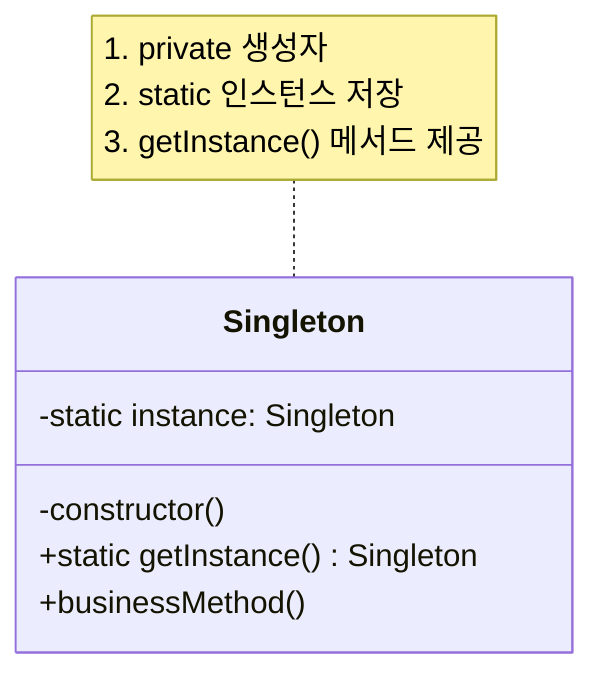
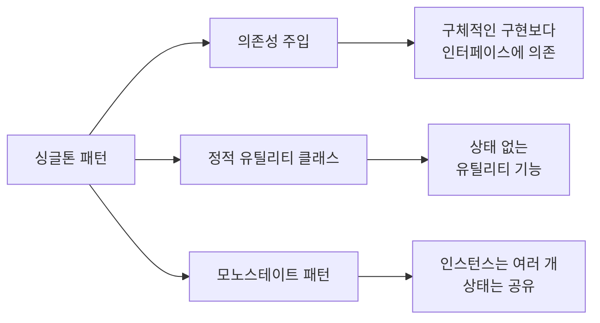

```table-of-contents
title: 
style: nestedList # TOC style (nestedList|nestedOrderedList|inlineFirstLevel)
minLevel: 0 # Include headings from the specified level
maxLevel: 0 # Include headings up to the specified level
includeLinks: true # Make headings clickable
hideWhenEmpty: false # Hide TOC if no headings are found
debugInConsole: false # Print debug info in Obsidian console
```

# 개념 설명

싱글톤 패턴은 소프트웨어 디자인 패턴 중 하나로, 특정 클래스의 인스턴스가 오직 하나만 생성되도록 보장하는 패턴이다. 이 단일 인스턴스는 전역적으로 접근 가능하며, 애플리케이션 전체에서 공유된다.

## 실생활 비유

싱글톤 패턴은 국가의 대통령과 같다. 한 국가에는 한 명의 대통령만 존재하며(단일 인스턴스), 국민 누구나 대통령의 결정이나 정책을 참조할 수 있다(전역 접근점). 대통령이 여러 명 존재한다면 국가 운영에 혼란이 생기는 것과 마찬가지로, 특정 리소스나 서비스가 여러 인스턴스로 존재하면 애플리케이션에 문제가 발생할 수 있다.

# 기본 동작 방식

## 핵심 원리

- 클래스의 생성자를 private으로 설정하여 외부에서 직접 인스턴스를 생성할 수 없게 한다
- 클래스 내부에 정적(static) 인스턴스를 저장하는 변수를 만든다
- 인스턴스에 접근할 수 있는 정적 메서드를 제공한다
- 해당 메서드는 인스턴스가 존재하지 않을 경우에만 새로 생성하고, 이미 존재한다면 기존 인스턴스를 반환한다

## 구현 방식 다이어그램



# 실제 사용 예시

## Java 구현

```java
public class Singleton {
  // 정적 변수로 유일한 인스턴스 참조 저장
  private static Singleton instance;
  
  // private 생성자로 외부에서 인스턴스 생성 방지
  private Singleton() {
    // 초기화 코드
  }
  
  // 인스턴스에 접근할 수 있는 정적 메서드
  public static Singleton getInstance() {
    // 인스턴스가 없을 때만 생성
    if (instance == null) {
      instance = new Singleton();
    }
    return instance;
  }
  
  // 비즈니스 로직 메서드
  public void doSomething() {
    System.out.println("Singleton 작업 수행");
  }
}

// 사용 예시
public class Main {
  public static void main(String[] args) {
    // new Singleton(); // 컴파일 오류! 생성자가 private
    
    // 올바른 사용법
    Singleton instance1 = Singleton.getInstance();
    Singleton instance2 = Singleton.getInstance();
    
    // 두 변수는 동일한 인스턴스를 참조
    System.out.println(instance1 == instance2); // true 출력
    
    instance1.doSomething();
  }
}
```

## Python 구현

### 기본 구현 (**new** 메서드 활용)

```python
class Singleton:
    # 클래스 변수로 인스턴스 저장
    _instance = None
    
    # __new__를 오버라이드하여 인스턴스 생성 제어
    def __new__(cls):
        if cls._instance is None:
            cls._instance = super(Singleton, cls).__new__(cls)
            # 초기화 코드
        return cls._instance
    
    # 비즈니스 로직 메서드
    def do_something(self):
        print("Singleton 작업 수행")

# 사용 예시
instance1 = Singleton()
instance2 = Singleton()

# 두 변수는 동일한 인스턴스를 참조
print(instance1 is instance2)  # True 출력

instance1.do_something()
```

### 데코레이터를 활용한 구현

```python
def singleton(cls):
    """싱글톤 패턴을 구현하는 데코레이터"""
    instances = {}
    
    def get_instance(*args, **kwargs):
        if cls not in instances:
            instances[cls] = cls(*args, **kwargs)
        return instances[cls]
    
    return get_instance

@singleton
class Logger:
    def __init__(self):
        self.log_count = 0
    
    def log(self, message):
        self.log_count += 1
        print(f"[LOG {self.log_count}] {message}")

# 사용 예시
logger1 = Logger()
logger2 = Logger()

print(logger1 is logger2)  # True 출력

logger1.log("첫 번째 메시지")
logger2.log("두 번째 메시지")  # log_count가 2로 증가됨
```

### 메타클래스를 활용한 구현

```python
class SingletonMeta(type):
    """싱글톤 패턴을 구현하는 메타클래스"""
    _instances = {}
    
    def __call__(cls, *args, **kwargs):
        if cls not in cls._instances:
            cls._instances[cls] = super(SingletonMeta, cls).__call__(*args, **kwargs)
        return cls._instances[cls]

class Database(metaclass=SingletonMeta):
    def __init__(self):
        self.connection = None
        print("데이터베이스 연결 생성")
    
    def connect(self):
        if self.connection is None:
            print("데이터베이스에 연결합니다")
            self.connection = "Connected"
        return self.connection

# 사용 예시
db1 = Database()  # "데이터베이스 연결 생성" 출력
db2 = Database()  # 아무것도 출력되지 않음

print(db1 is db2)  # True 출력

db1.connect()  # "데이터베이스에 연결합니다" 출력
db2.connect()  # 이미 연결되어 있으므로 아무것도 출력되지 않음
```

## JavaScript 구현

```javascript
// ES6 방식의 싱글톤 패턴
class Singleton {
  constructor() {
    // 인스턴스가 이미 있는지 확인
    if (Singleton.instance) {
      return Singleton.instance;
    }
    
    // 초기화 코드
    this.data = [];
    
    // 인스턴스 저장
    Singleton.instance = this;
  }
  
  // 비즈니스 로직 메서드
  doSomething() {
    console.log('Singleton 작업 수행');
  }
}

// 사용 예시
const instance1 = new Singleton();
const instance2 = new Singleton();

// 두 변수는 동일한 인스턴스를 참조
console.log(instance1 === instance2);  // true 출력

instance1.doSomething();
```

# 고급 활용법

## 스레드 안전한 싱글톤 (Java)

멀티스레드 환경에서는 기본 싱글톤 구현이 문제를 일으킬 수 있다. 여러 스레드가 동시에 getInstance()를 호출하면 여러 인스턴스가 생성될 위험이 있다.

```java
// 1. synchronized 키워드 사용 (성능 이슈 있음)
public static synchronized Singleton getInstance() {
  if (instance == null) {
    instance = new Singleton();
  }
  return instance;
}

// 2. Double-checked locking (권장)
public static Singleton getInstance() {
  if (instance == null) {
    synchronized (Singleton.class) {
      if (instance == null) {
        instance = new Singleton();
      }
    }
  }
  return instance;
}

// 3. 정적 초기화 블록 사용 (Eager Initialization)
public class Singleton {
  private static final Singleton instance = new Singleton();
  
  private Singleton() {}
  
  public static Singleton getInstance() {
    return instance;
  }
}

// 4. 내부 정적 클래스 사용 (권장)
public class Singleton {
  private Singleton() {}
  
  private static class SingletonHolder {
    private static final Singleton INSTANCE = new Singleton();
  }
  
  public static Singleton getInstance() {
    return SingletonHolder.INSTANCE;
  }
}
```

## 열거형(Enum) 싱글톤 (Java)

```java
// 가장 간결하고 직렬화 문제도 해결된 방식
public enum Singleton {
  INSTANCE;
  
  // 필요한 필드와 메서드
  private int value;
  
  public int getValue() {
    return value;
  }
  
  public void setValue(int value) {
    this.value = value;
  }
  
  public void doSomething() {
    System.out.println("Enum Singleton 작업 수행");
  }
}

// 사용 예시
Singleton.INSTANCE.doSomething();
```

## 의존성 주입(DI) 프레임워크에서의 싱글톤

```java
// Spring Framework에서의 싱글톤 구현
@Component // 또는 @Service, @Repository, @Controller 등
public class SingletonService {
  // Spring이 자동으로 싱글톤으로 관리
  public void doSomething() {
    System.out.println("Spring 싱글톤 서비스 작업 수행");
  }
}

// 사용 예시
@Autowired
private SingletonService service;
```

# 주의사항

## 싱글톤 패턴의 단점

1. **테스트 어려움**
    
    - 전역 상태를 공유하기 때문에 단위 테스트 시 격리가 어렵다
    - 테스트 순서에 따라 다른 결과가 나올 수 있다
2. **강한 결합도**
    
    - 싱글톤을 직접 참조하는 코드는 싱글톤 클래스와 강하게 결합된다
    - 인터페이스를 통한 참조나 의존성 주입으로 완화할 수 있다
3. **동시성 이슈**
    
    - 멀티스레드 환경에서 공유 자원에 대한 적절한 동기화가 필요하다

## 싱글톤 안티패턴 사례

```java
// 잘못된 예시: 전역 상태를 과도하게 사용
public class BadSingleton {
  private static BadSingleton instance = new BadSingleton();
  
  // 전역 변수처럼 사용되는 상태
  private List<User> users = new ArrayList<>();
  
  private BadSingleton() {}
  
  public static BadSingleton getInstance() {
    return instance;
  }
  
  // 상태를 직접 변경하는 메서드들
  public void addUser(User user) {
    users.add(user);
  }
  
  public List<User> getUsers() {
    return users; // 외부에서 직접 수정 가능
  }
}

// 올바른 예시: 불변 객체로 관리하거나 동기화 적용
public class GoodSingleton {
  private static GoodSingleton instance = new GoodSingleton();
  
  // 접근 제한된 상태
  private final List<User> users = new ArrayList<>();
  
  private GoodSingleton() {}
  
  public static GoodSingleton getInstance() {
    return instance;
  }
  
  // 동기화된 상태 변경 메서드
  public synchronized void addUser(User user) {
    users.add(user);
  }
  
  // 불변 객체 반환
  public List<User> getUsers() {
    return Collections.unmodifiableList(users);
  }
}
```

## 싱글톤 패턴의 대안



# 싱글톤 패턴의 사용 사례

1. **리소스 관리자**
    
    - 데이터베이스 연결 관리자
    - 파일 시스템 관리자
    - 스레드 풀
2. **설정 관리**
    
    - 애플리케이션 설정
    - 환경 설정
3. **캐시**
    
    - 메모리 캐시
    - 객체 풀
4. **로깅**
    
    - 로그 관리자

## 실제 사용 예시: 데이터베이스 연결 관리자

```java
public class DatabaseConnectionManager {
  private static DatabaseConnectionManager instance;
  private Connection connection;
  
  private DatabaseConnectionManager() {
    // 데이터베이스 연결 초기화
  }
  
  public static synchronized DatabaseConnectionManager getInstance() {
    if (instance == null) {
      instance = new DatabaseConnectionManager();
    }
    return instance;
  }
  
  public Connection getConnection() {
    if (connection == null) {
      // 새 연결 생성
      try {
        String url = "jdbc:mysql://localhost:3306/mydb";
        connection = DriverManager.getConnection(url, "username", "password");
      } catch (SQLException e) {
        e.printStackTrace();
      }
    }
    return connection;
  }
  
  public void closeConnection() {
    if (connection != null) {
      try {
        connection.close();
      } catch (SQLException e) {
        e.printStackTrace();
      }
    }
  }
}
```

# 생각해볼만한 문제

## 이론적 문제

1. **싱글톤 vs 정적 클래스**
    
    - 싱글톤 패턴과 정적(static) 유틸리티 클래스의 차이점은 무엇인가?
    - 어떤 상황에서 싱글톤이 정적 클래스보다 더 적합한가?
    - 인터페이스 구현, 상속, 다형성 측면에서 두 접근 방식을 비교하라.
2. **싱글톤의 수명 주기**
    
    - 애플리케이션의 전체 라이프사이클 동안 싱글톤 인스턴스가 유지되는 것이 항상 바람직한가?
    - 싱글톤 인스턴스를 특정 시점에 제거하고 다시 생성해야 하는 상황은 언제인가?
    - 싱글톤 패턴과 객체 풀(Object Pool) 패턴의 관계를 설명하라.
3. **동시성과 분산 환경**
    
    - 분산 시스템에서 싱글톤 패턴을 어떻게 적용할 수 있는가?
    - 멀티 프로세스 환경에서 싱글톤의 의미는 무엇인가?
    - 마이크로서비스 아키텍처에서 싱글톤 패턴의 적용 방안을 논의하라.

## 실습 문제

1. **로깅 시스템 구현**
    
    - 싱글톤 패턴을 사용하여 다양한 로그 레벨(DEBUG, INFO, WARNING, ERROR)을 지원하는 로깅 시스템을 구현하라.
    - 로그를 콘솔과 파일에 동시에 출력할 수 있어야 한다.
    - 설정 파일에서 로그 레벨을 동적으로 변경할 수 있는 기능을 추가하라.
2. **데이터베이스 연결 풀**
    
    - 싱글톤 패턴을 응용하여 제한된 수의 데이터베이스 연결을 관리하는 연결 풀을 구현하라.
    - 연결 요청이 많을 때 대기열 기능을 구현하라.
    - 연결 타임아웃, 자동 재연결 기능을 구현하라.
3. **멀티스레드 테스트**
    
    - 기본 싱글톤 구현과 Thread-safe 싱글톤 구현의 성능 차이를 측정하는 벤치마크 프로그램을 작성하라.
    - 여러 스레드가 동시에 싱글톤 인스턴스를 생성하려 할 때 발생할 수 있는 문제를 시뮬레이션하라.
    - Lazy Initialization과 Eager Initialization의 성능과 리소스 사용을 비교하라.

```python
# 실습 문제 1: 로깅 시스템 구현 예시 코드
import time
from enum import Enum, auto

class LogLevel(Enum):
    DEBUG = auto()
    INFO = auto()
    WARNING = auto()
    ERROR = auto()

class Logger:
    _instance = None
    
    def __new__(cls):
        if cls._instance is None:
            cls._instance = super(Logger, cls).__new__(cls)
            cls._instance._level = LogLevel.INFO
            cls._instance._outputs = ["console"]
            cls._instance._file = None
        return cls._instance
    
    def set_level(self, level):
        if isinstance(level, LogLevel):
            self._level = level
    
    def add_output(self, output):
        if output not in self._outputs:
            if output == "file":
                self._file = open(f"log_{time.strftime('%Y%m%d_%H%M%S')}.txt", "w")
            self._outputs.append(output)
    
    def _should_log(self, level):
        return level.value >= self._level.value
    
    def _write_log(self, level, message):
        log_entry = f"[{time.strftime('%Y-%m-%d %H:%M:%S')}] [{level.name}] {message}"
        
        if "console" in self._outputs:
            print(log_entry)
            
        if "file" in self._outputs and self._file:
            self._file.write(log_entry + "\n")
            self._file.flush()
    
    def debug(self, message):
        if self._should_log(LogLevel.DEBUG):
            self._write_log(LogLevel.DEBUG, message)
    
    def info(self, message):
        if self._should_log(LogLevel.INFO):
            self._write_log(LogLevel.INFO, message)
    
    def warning(self, message):
        if self._should_log(LogLevel.WARNING):
            self._write_log(LogLevel.WARNING, message)
    
    def error(self, message):
        if self._should_log(LogLevel.ERROR):
            self._write_log(LogLevel.ERROR, message)
    
    def close(self):
        if self._file:
            self._file.close()
            self._file = None

# 사용 예시
if __name__ == "__main__":
    logger = Logger()
    logger.add_output("file")
    
    logger.debug("이 메시지는 기본적으로 보이지 않습니다.")
    logger.info("애플리케이션이 시작되었습니다.")
    logger.warning("메모리 사용량이 높습니다.")
    logger.error("데이터베이스 연결 실패!")
    
    # 로그 레벨 변경
    logger.set_level(LogLevel.DEBUG)
    logger.debug("이제 디버그 메시지가 보입니다.")
    
    logger.close()
```

# 결론

싱글톤 패턴은 특정 클래스의 인스턴스가 오직 하나만 존재하도록 보장하며, 이 인스턴스에 대한 전역적인 접근점을 제공한다. 리소스 관리, 설정, 캐시 등의 영역에서 유용하게 사용될 수 있다.

그러나 싱글톤 패턴은 코드의 결합도를 높이고 테스트를 어렵게 만들 수 있는 단점이 있다. 따라서 꼭 필요한 경우에만 신중하게 사용하고, 가능하면 의존성 주입과 같은 대안을 고려하는 것이 좋다.

현대적인 개발 환경에서는 Spring, Laravel, Angular 등의 프레임워크가 제공하는 의존성 주입 메커니즘을 통해 싱글톤 패턴의 장점은 유지하면서 단점을 최소화하는 방법을 사용할 수 있다.

올바르게 구현된 싱글톤 패턴은 애플리케이션의 구조를 개선하고 리소스 사용을 최적화하는 데 도움이 될 수 있다.