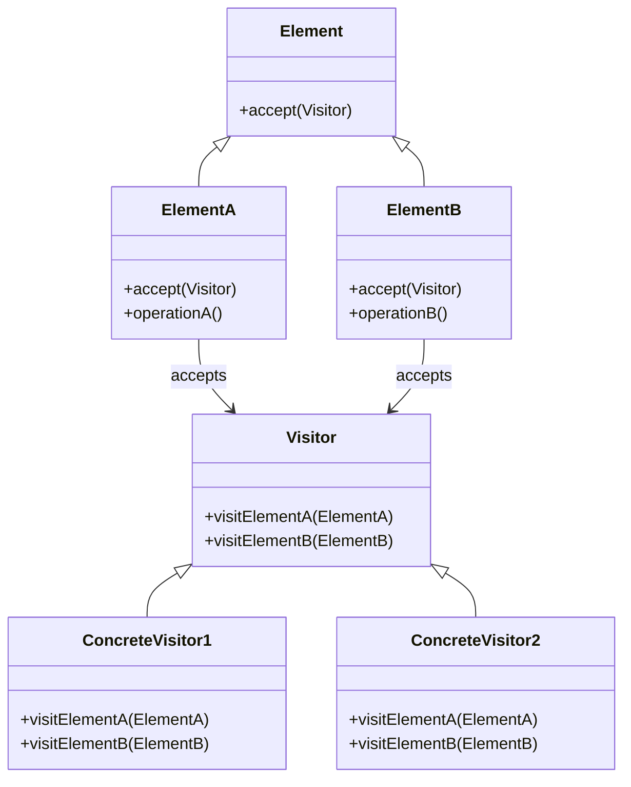
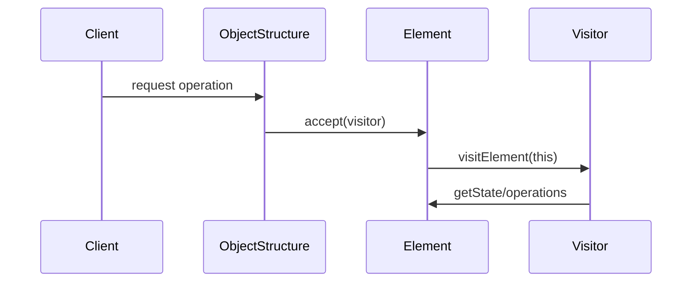

```table-of-contents
title: 
style: nestedList # TOC style (nestedList|nestedOrderedList|inlineFirstLevel)
minLevel: 0 # Include headings from the specified level
maxLevel: 0 # Include headings up to the specified level
includeLinks: true # Make headings clickable
hideWhenEmpty: false # Hide TOC if no headings are found
debugInConsole: false # Print debug info in Obsidian console
```
방문자(Visitor) 패턴

# 개념 설명

방문자(Visitor) 패턴은 객체 구조를 변경하지 않고 새로운 연산을 추가할 수 있게 해주는 행동 디자인 패턴이다. 이 패턴은 연산과 이를 적용하는 객체 구조를 분리하여, 새로운 연산을 추가할 때 객체 구조를 수정하지 않고도 가능하게 한다.

## 실생활 비유

도서관의 책들(요소)과 사서(방문자)를 생각해보자:

- 책들은 소설, 참고서, 잡지 등 다양한 종류(클래스)로 존재한다
- 사서는 책을 대출하거나, 정리하거나, 수리하는 등 다양한 작업을 수행한다
- 새로운 작업(예: 디지털화)이 필요할 때, 책 자체를 변경하지 않고 새로운 사서(방문자)를 추가하여 처리할 수 있다

# 기본 동작 방식

## 구조



## 주요 구성 요소

1. **Visitor(방문자)**: 요소 클래스에 대한 연산을 정의하는 인터페이스
2. **ConcreteVisitor(구체 방문자)**: Visitor 인터페이스를 구현하여 특정 연산을 수행
3. **Element(요소)**: 방문자를 수락하는 인터페이스를 정의
4. **ConcreteElement(구체 요소)**: Element 인터페이스를 구현하여 방문자를 수락
5. **ObjectStructure(객체 구조)**: 요소 객체의 집합으로, 방문자가 접근할 수 있는 인터페이스 제공

## 동작 원리



1. 클라이언트는 객체 구조와 방문자 객체를 생성
2. 클라이언트는 객체 구조에게 방문자를 받아들이도록 요청
3. 객체 구조는 각 요소에게 방문자를 받아들이도록 지시
4. 각 요소는 방문자의 해당 방문 메서드를 호출하며, 자신을 인자로 전달
5. 방문자는 요소의 상태와 연산을 활용하여 작업 수행

# 실제 사용 예시

## Python 예시

```python
from abc import ABC, abstractmethod

# Element 인터페이스
class FileSystemElement(ABC):
    @abstractmethod
    def accept(self, visitor):
        pass

# ConcreteElement 클래스들
class File(FileSystemElement):
    def __init__(self, name, size):
        self.name = name
        self.size = size
    
    def accept(self, visitor):
        return visitor.visit_file(self)
    
    def get_name(self):
        return self.name
    
    def get_size(self):
        return self.size

class Directory(FileSystemElement):
    def __init__(self, name):
        self.name = name
        self.elements = []
    
    def accept(self, visitor):
        result = visitor.visit_directory(self)
        for element in self.elements:
            result += element.accept(visitor)
        return result
    
    def get_name(self):
        return self.name
    
    def add(self, element):
        self.elements.append(element)
    
    def get_elements(self):
        return self.elements

# Visitor 인터페이스
class FileSystemVisitor(ABC):
    @abstractmethod
    def visit_file(self, file):
        pass
    
    @abstractmethod
    def visit_directory(self, directory):
        pass

# ConcreteVisitor 클래스들
class SizeCalculatorVisitor(FileSystemVisitor):
    def visit_file(self, file):
        return file.get_size()
    
    def visit_directory(self, directory):
        return 0  # 디렉토리 자체의 크기는 0으로 계산

class FileCountVisitor(FileSystemVisitor):
    def visit_file(self, file):
        return 1  # 파일 하나를 발견할 때마다 1을 반환
    
    def visit_directory(self, directory):
        return 0  # 디렉토리는 파일 수에 포함하지 않음

# 사용 예시
if __name__ == "__main__":
    # 파일 시스템 구조 생성
    root = Directory("root")
    
    bin_dir = Directory("bin")
    bin_dir.add(File("ls", 5120))
    bin_dir.add(File("grep", 8192))
    
    home_dir = Directory("home")
    user_dir = Directory("user")
    user_dir.add(File("document.txt", 1024))
    user_dir.add(File("image.jpg", 20480))
    home_dir.add(user_dir)
    
    root.add(bin_dir)
    root.add(home_dir)
    root.add(File("boot.img", 102400))
    
    # 방문자 패턴 사용
    size_calculator = SizeCalculatorVisitor()
    file_counter = FileCountVisitor()
    
    total_size = root.accept(size_calculator)
    total_files = root.accept(file_counter)
    
    print(f"전체 파일 시스템 크기: {total_size} 바이트")
    print(f"전체 파일 수: {total_files}")
```

## PHP 예시

```php
<?php

// Element 인터페이스
interface ShapeElement {
    public function accept(ShapeVisitor $visitor);
}

// ConcreteElement 클래스들
class Circle implements ShapeElement {
    private $radius;
    
    public function __construct(float $radius) {
        $this->radius = $radius;
    }
    
    public function accept(ShapeVisitor $visitor) {
        return $visitor->visitCircle($this);
    }
    
    public function getRadius(): float {
        return $this->radius;
    }
}

class Rectangle implements ShapeElement {
    private $width;
    private $height;
    
    public function __construct(float $width, float $height) {
        $this->width = $width;
        $this->height = $height;
    }
    
    public function accept(ShapeVisitor $visitor) {
        return $visitor->visitRectangle($this);
    }
    
    public function getWidth(): float {
        return $this->width;
    }
    
    public function getHeight(): float {
        return $this->height;
    }
}

class Triangle implements ShapeElement {
    private $base;
    private $height;
    
    public function __construct(float $base, float $height) {
        $this->base = $base;
        $this->height = $height;
    }
    
    public function accept(ShapeVisitor $visitor) {
        return $visitor->visitTriangle($this);
    }
    
    public function getBase(): float {
        return $this->base;
    }
    
    public function getHeight(): float {
        return $this->height;
    }
}

// Visitor 인터페이스
interface ShapeVisitor {
    public function visitCircle(Circle $circle);
    public function visitRectangle(Rectangle $rectangle);
    public function visitTriangle(Triangle $triangle);
}

// ConcreteVisitor 클래스들
class AreaCalculatorVisitor implements ShapeVisitor {
    public function visitCircle(Circle $circle): float {
        return pi() * pow($circle->getRadius(), 2);
    }
    
    public function visitRectangle(Rectangle $rectangle): float {
        return $rectangle->getWidth() * $rectangle->getHeight();
    }
    
    public function visitTriangle(Triangle $triangle): float {
        return 0.5 * $triangle->getBase() * $triangle->getHeight();
    }
}

class PerimeterCalculatorVisitor implements ShapeVisitor {
    public function visitCircle(Circle $circle): float {
        return 2 * pi() * $circle->getRadius();
    }
    
    public function visitRectangle(Rectangle $rectangle): float {
        return 2 * ($rectangle->getWidth() + $rectangle->getHeight());
    }
    
    public function visitTriangle(Triangle $triangle): float {
        // 단순화된 계산 (정확한 삼각형 둘레는 세 변의 길이가 필요)
        $hypotenuse = sqrt(pow($triangle->getBase(), 2) + pow($triangle->getHeight(), 2));
        return $triangle->getBase() + $triangle->getHeight() + $hypotenuse;
    }
}

// 사용 예시
$shapes = [
    new Circle(5),
    new Rectangle(4, 6),
    new Triangle(3, 8)
];

$areaVisitor = new AreaCalculatorVisitor();
$perimeterVisitor = new PerimeterCalculatorVisitor();

echo "도형의 면적:\n";
foreach ($shapes as $shape) {
    echo "- " . get_class($shape) . ": " . $shape->accept($areaVisitor) . "\n";
}

echo "\n도형의 둘레:\n";
foreach ($shapes as $shape) {
    echo "- " . get_class($shape) . ": " . $shape->accept($perimeterVisitor) . "\n";
}
```

## JavaScript 예시

```javascript
// Element 인터페이스와 구현체들
class ComputerComponent {
  accept(visitor) {
    throw new Error("Method 'accept()' must be implemented.");
  }
}

class CPU extends ComputerComponent {
  constructor(model, cores, frequency) {
    super();
    this.model = model;
    this.cores = cores;
    this.frequency = frequency;
  }
  
  accept(visitor) {
    return visitor.visitCPU(this);
  }
  
  getModel() {
    return this.model;
  }
  
  getCores() {
    return this.cores;
  }
  
  getFrequency() {
    return this.frequency;
  }
}

class RAM extends ComputerComponent {
  constructor(brand, size, type) {
    super();
    this.brand = brand;
    this.size = size;
    this.type = type;
  }
  
  accept(visitor) {
    return visitor.visitRAM(this);
  }
  
  getBrand() {
    return this.brand;
  }
  
  getSize() {
    return this.size;
  }
  
  getType() {
    return this.type;
  }
}

class HardDrive extends ComputerComponent {
  constructor(manufacturer, capacity, rpm) {
    super();
    this.manufacturer = manufacturer;
    this.capacity = capacity;
    this.rpm = rpm;
  }
  
  accept(visitor) {
    return visitor.visitHardDrive(this);
  }
  
  getManufacturer() {
    return this.manufacturer;
  }
  
  getCapacity() {
    return this.capacity;
  }
  
  getRPM() {
    return this.rpm;
  }
}

// Computer는 객체 구조를 담당
class Computer {
  constructor() {
    this.components = [];
  }
  
  addComponent(component) {
    this.components.push(component);
  }
  
  accept(visitor) {
    let result = '';
    for (const component of this.components) {
      result += component.accept(visitor);
    }
    return result;
  }
}

// Visitor 인터페이스와 구현체들
class ComputerVisitor {
  visitCPU(cpu) {
    throw new Error("Method 'visitCPU()' must be implemented.");
  }
  
  visitRAM(ram) {
    throw new Error("Method 'visitRAM()' must be implemented.");
  }
  
  visitHardDrive(hardDrive) {
    throw new Error("Method 'visitHardDrive()' must be implemented.");
  }
}

// 사양 정보를 출력하는 방문자
class SpecificationVisitor extends ComputerVisitor {
  visitCPU(cpu) {
    return `CPU: ${cpu.getModel()}, ${cpu.getCores()} cores, ${cpu.getFrequency()} GHz\n`;
  }
  
  visitRAM(ram) {
    return `RAM: ${ram.getBrand()}, ${ram.getSize()} GB, ${ram.getType()}\n`;
  }
  
  visitHardDrive(hardDrive) {
    return `Hard Drive: ${hardDrive.getManufacturer()}, ${hardDrive.getCapacity()} TB, ${hardDrive.getRPM()} RPM\n`;
  }
}

// 가격을 계산하는 방문자
class PriceVisitor extends ComputerVisitor {
  visitCPU(cpu) {
    // 코어 수와 주파수에 따라 가격 계산
    return cpu.getCores() * 50 + cpu.getFrequency() * 100;
  }
  
  visitRAM(ram) {
    // 용량에 따라 가격 계산
    return ram.getSize() * 10;
  }
  
  visitHardDrive(hardDrive) {
    // 용량과 RPM에 따라 가격 계산
    return hardDrive.getCapacity() * 100 + (hardDrive.getRPM() / 1000);
  }
}

// 사용 예시
const computer = new Computer();
computer.addComponent(new CPU('Intel i7', 8, 3.6));
computer.addComponent(new RAM('Corsair', 32, 'DDR4'));
computer.addComponent(new RAM('Corsair', 32, 'DDR4'));
computer.addComponent(new HardDrive('Seagate', 2, 7200));

// 사양 정보 출력
const specVisitor = new SpecificationVisitor();
console.log('컴퓨터 사양:');
console.log(computer.accept(specVisitor));

// 가격 계산
const priceVisitor = new PriceVisitor();
let totalPrice = 0;
for (const component of computer.components) {
  totalPrice += component.accept(priceVisitor);
}
console.log(`총 가격: $${totalPrice}`);
```

# 고급 활용법

## 이중 디스패치(Double Dispatch)

방문자 패턴은 이중 디스패치를 구현하는 대표적인 예시다. 일반적인 메서드 호출은 단일 디스패치(객체 타입에 따라 메서드 선택)지만, 방문자 패턴은:

1. 첫 번째 디스패치: 요소의 `accept()` 메서드를 호출
2. 두 번째 디스패치: 방문자의 `visit...()` 메서드를 호출

이를 통해 방문자와 요소 모두의 타입에 따라 다른 동작을 수행할 수 있다.

## 복합 패턴(Composite Pattern)과 함께 사용

앞의 Python 예시에서 볼 수 있듯이, 방문자 패턴은 복합 패턴과 함께 사용하면 효과적이다:

- 디렉토리와 파일의 계층 구조(복합 패턴)
- 이 구조를 순회하며 다양한 연산 수행(방문자 패턴)

## 새로운 기능 추가

기존 클래스 수정 없이 새로운 기능을 추가할 수 있다:

```python
# 새로운 방문자 추가 - 파일 확장자 통계
class ExtensionCountVisitor(FileSystemVisitor):
    def __init__(self):
        self.extensions = {}
    
    def visit_file(self, file):
        name = file.get_name()
        if '.' in name:
            ext = name.split('.')[-1]
            self.extensions[ext] = self.extensions.get(ext, 0) + 1
        return ""
    
    def visit_directory(self, directory):
        return ""
    
    def get_statistics(self):
        return self.extensions
```

# 주의사항

## 장점

- **Open/Closed Principle**: 기존 클래스를 수정하지 않고 새로운 기능 추가 가능
- **관심사 분리**: 알고리즘이 작동하는 객체에서 알고리즘 자체를 분리
- **상태 누적**: 방문자는 객체 구조를 순회하며 상태를 수집할 수 있음
- **연관된 연산 그룹화**: 관련 기능을 하나의 방문자 클래스에 모을 수 있음

## 단점

- **새로운 요소 추가의 어려움**: 새로운 ConcreteElement 클래스를 추가할 때마다 모든 Visitor 인터페이스와 구현체를 수정해야 함
- **캡슐화 위반**: 방문자가 요소의 내부 상태에 접근해야 하므로 캡슐화가 약해질 수 있음
- **복잡성 증가**: 패턴 구현에 많은 인터페이스와 클래스가 필요함
- **상태 변경 문제**: 요소의 상태를 변경할 때 일관성을 유지하기 어려울 수 있음

## 적용 시기

- 비슷한 클래스의 계층 구조가 있고, 그 위에서 다양한 연산을 수행해야 할 때
- 객체의 구조는 비교적 안정적이지만, 새로운 연산이 자주 추가될 때
- 알고리즘이 객체 구조와 독립적으로 발전해야 할 때
- 알고리즘이 접근하는 객체의 구현 세부 사항이 노출되어도 괜찮을 때

# 결론

방문자 패턴은 객체 구조와 알고리즘을 분리하여 유연성을 제공하는 강력한 디자인 패턴이다. 기존 코드를 수정하지 않고 새로운 기능을 추가할 수 있어 확장성이 중요한 시스템에서 유용하다. 그러나 새로운 요소 유형을 추가하기 어렵다는 단점이 있어, 객체 구조가 자주 변경되지 않는 상황에서 가장 효과적이다.

실제 응용 분야로는 파일 시스템 순회, 문서 객체 모델(DOM) 처리, 컴파일러의 구문 트리 순회, 그래픽 에디터의 도형 처리 등이 있다. 이러한 시스템은 구조는 비교적 고정되어 있지만, 다양한 연산을 수행해야 하는 특성을 가지고 있어 방문자 패턴이 적합하다.