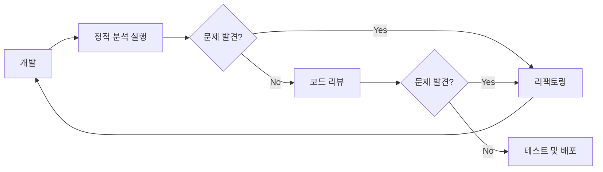

```table-of-contents
title: # 목차
style: nestedList # TOC style (nestedList|nestedOrderedList|inlineFirstLevel)
minLevel: 0 # Include headings from the specified level
maxLevel: 5 # Include headings up to the specified level
includeLinks: true # Make headings clickable
hideWhenEmpty: false # Hide TOC if no headings are found
debugInConsole: false # Print debug info in Obsidian console
```
# 안티패턴의 이해와 중요성

안티패턴(Anti-pattern)은 소프트웨어 개발에서 흔히 사용되지만 비효율적이거나 비생산적인 코딩 관행을 말한다. 이러한 패턴은 단기적으로는 빠른 해결책처럼 보일 수 있지만, 장기적으로는 유지보수성, 성능, 그리고 코드 품질을 심각하게 저하시킨다. 마치 집을 지을 때 기초를 제대로 다지지 않고 빠르게 벽만 세우는 것과 같다고 할 수 있다.

## 실생활 비유: 기술 부채

안티패턴은 '기술 부채(Technical Debt)'를 발생시킨다. 이는 신용카드로 물건을 구매하는 것과 유사하다. 당장은 원하는 것을 얻을 수 있지만, 나중에 더 많은 이자(유지보수 비용)를 지불해야 한다. 기술 부채가 누적될수록 개발 속도는 느려지고, 버그는 증가하며, 새로운 기능 추가는 더욱 어려워진다.

# 주요 코딩 안티패턴 유형

## 구조적 안티패턴

### 1. 스파게티 코드 (Spaghetti Code)

스파게티 코드는 구조가 복잡하게 얽혀 있어 이해하기 어려운 코드를 말한다. 주로 과도한 분기문(if-else), 복잡한 중첩 루프, 명확한 모듈화 없이 작성된 코드에서 나타난다.

```python
# 스파게티 코드 예시
def process_data(data):
    result = 0
    if data['type'] == 'A':
        for item in data['items']:
            if item['status'] == 'active':
                if item['value'] > 10:
                    result += item['value'] * 2
                else:
                    if item['priority'] == 'high':
                        result += item['value'] * 3
                    else:
                        result += item['value']
            else:
                if item['reason'] == 'expired':
                    if item['renew_count'] > 0:
                        result += item['value'] * 0.5
    return result

# 개선된 방식
def process_active_item(item):
    if item['value'] > 10:
        return item['value'] * 2
    elif item['priority'] == 'high':
        return item['value'] * 3
    return item['value']

def process_inactive_item(item):
    if item['reason'] == 'expired' and item['renew_count'] > 0:
        return item['value'] * 0.5
    return 0

def process_data_improved(data):
    if data['type'] != 'A':
        return 0
    
    result = 0
    for item in data['items']:
        if item['status'] == 'active':
            result += process_active_item(item)
        else:
            result += process_inactive_item(item)
    return result
```

### 2. 레이어 바이패싱 (Layer Bypassing)

다층 구조(예: MVC 패턴)를 사용하는 애플리케이션에서 계층 간 경계를 무시하고 직접 접근하는 안티패턴이다.

```python
# 레이어 바이패싱 예시 (Flask 웹 애플리케이션)
@app.route('/profile/<int:user_id>')
def get_profile(user_id):
    # 모델 레이어를 건너뛰고 직접 DB에 접근
    conn = sqlite3.connect('database.db')
    cursor = conn.cursor()
    user = cursor.execute("SELECT * FROM users WHERE id = ?", (user_id,)).fetchone()
    
    # 비즈니스 로직을 컨트롤러에 직접 구현
    if user[3] == 'active':  # subscription_status는 네 번째 컬럼
        premium_content = cursor.execute("SELECT * FROM premium_content").fetchall()
        conn.close()
        return render_template('profile.html', user=user, premium=premium_content)
    
    conn.close()
    return render_template('profile.html', user=user)

# 개선된 방식
def get_user_by_id(user_id):
    conn = sqlite3.connect('database.db')
    cursor = conn.cursor()
    user = cursor.execute("SELECT * FROM users WHERE id = ?", (user_id,)).fetchone()
    conn.close()
    return user

def get_premium_content():
    conn = sqlite3.connect('database.db')
    cursor = conn.cursor()
    premium_content = cursor.execute("SELECT * FROM premium_content").fetchall()
    conn.close()
    return premium_content

def has_active_subscription(user):
    return user[3] == 'active'

def get_user_profile_data(user_id):
    user = get_user_by_id(user_id)
    data = {'user': user}
    
    if has_active_subscription(user):
        data['premium'] = get_premium_content()
    
    return data

@app.route('/profile/<int:user_id>')
def get_profile(user_id):
    profile_data = get_user_profile_data(user_id)
    return render_template('profile.html', **profile_data)
```

## 성능 관련 안티패턴

### 1. N+1 쿼리 문제

데이터베이스에서 레코드 목록을 조회한 후, 각 레코드에 대해 추가 쿼리를 실행하는 비효율적인 패턴이다.

```python
# SQLAlchemy에서의 N+1 쿼리 문제 예시
def get_all_posts_with_authors():
    session = Session()
    posts = session.query(Post).all()  # 1개의 쿼리로 모든 포스트 조회
    
    for post in posts:
        author = post.author  # 각 포스트마다 추가 쿼리 실행 (N개의 추가 쿼리)
        print(f"{post.title} by {author.name}")
    
    # 총 N+1개의 쿼리 실행 (N = 포스트 수)

# 개선된 방식: join 사용
def get_all_posts_with_authors_optimized():
    session = Session()
    posts = session.query(Post).options(joinedload(Post.author)).all()  # 단 1개의 JOIN 쿼리로 모든 데이터 조회
    
    for post in posts:
        author = post.author  # 추가 쿼리 없음 (이미 로드됨)
        print(f"{post.title} by {author.name}")
    
    # 총 1개의 쿼리만 실행
```

### 2. 메모리 누수 (Memory Leak)

필요 없는 객체에 대한 참조를 유지하여 메모리가 불필요하게 점유되는 문제이다.

```python
# 파이썬에서의 메모리 누수 예시
def process_large_data():
    cache = {}
    
    def process_item(item_id, data):
        # 캐시에 결과 저장 (하지만 캐시를 비우는 로직이 없음)
        result = perform_expensive_calculation(data)
        cache[item_id] = result
        return result
    
    # 수백만 개의 항목을 처리하면서 캐시는 계속 커짐
    for item_id, data in get_millions_of_items():
        process_item(item_id, data)

# 개선된 방식: LRU 캐시 사용
from functools import lru_cache

@lru_cache(maxsize=1000)  # 최대 1000개의 항목만 저장
def perform_expensive_calculation_cached(data_key):
    return perform_expensive_calculation(get_data(data_key))

def process_large_data_optimized():
    for item_id, data_key in get_millions_of_items():
        perform_expensive_calculation_cached(data_key)
```

### 3. 무거운 연산의 반복 (Repetition of Heavy Computations)

캐싱이나 메모이제이션을 사용하지 않고 동일한 무거운 연산을 반복적으로 수행하는 패턴이다.

```python
# 무거운 연산 반복 예시
def process_user_data(users):
    for user in users:
        expensive_result = perform_expensive_calculation(user['data'])
        user['result1'] = transform_result(expensive_result, 'type1')
    
    # 다른 곳에서 동일한 계산을 다시 수행
    for user in users:
        expensive_result = perform_expensive_calculation(user['data'])  # 중복 계산
        user['result2'] = transform_result(expensive_result, 'type2')

# 개선된 방식: 계산 결과 캐싱
def process_user_data_optimized(users):
    calculation_cache = {}
    
    for user in users:
        if user['id'] not in calculation_cache:
            calculation_cache[user['id']] = perform_expensive_calculation(user['data'])
        
        expensive_result = calculation_cache[user['id']]
        user['result1'] = transform_result(expensive_result, 'type1')
        user['result2'] = transform_result(expensive_result, 'type2')
```

## 설계 관련 안티패턴

### 1. 하드코딩 (Hardcoding)

동적으로 처리되어야 할 값이나 환경에 따라 달라질 수 있는 설정을 코드에 직접 삽입하는 안티패턴이다.

```python
# 하드코딩 예시
def connect_to_database():
    connection = {
        'host': "192.168.1.100",
        'port': 5432,
        'username': "admin",
        'password': "secretpassword123",
        'database': "production_db"
    }
    return connection

# 개선된 방식: 환경 변수 또는 설정 파일 사용
import os
import json

def load_config():
    with open('config.json', 'r') as f:
        return json.load(f)

def connect_to_database():
    config = load_config()
    connection = {
        'host': os.environ.get("DB_HOST") or config.get("db_host"),
        'port': int(os.environ.get("DB_PORT") or config.get("db_port")),
        'username': os.environ.get("DB_USER") or config.get("db_user"),
        'password': os.environ.get("DB_PASSWORD") or config.get("db_password"),
        'database': os.environ.get("DB_NAME") or config.get("db_name")
    }
    return connection
```

### 2. 매직 넘버와 문자열 (Magic Numbers and Strings)

코드 내에서 상수 값을 직접 사용하는 대신, 이름이 부여된 상수로 대체해야 한다.

```python
# 매직 넘버 예시
def calculate_tax(amount):
    # 0.1은 무엇을 의미하는가? 왜 10%인가?
    return amount * 0.1

def process_payment(payment_type, amount):
    if payment_type == 'premium':
        # 5와 0.05는 무엇을 의미하는가?
        return amount - 5 + (amount * 0.05)
    return amount

# 개선된 방식: 의미 있는 상수 사용
TAX_RATE = 0.1
PREMIUM_DISCOUNT = 5
PREMIUM_CASHBACK_RATE = 0.05
PAYMENT_TYPES = {
    'PREMIUM': 'premium',
    'STANDARD': 'standard'
}

def calculate_tax(amount):
    return amount * TAX_RATE

def process_payment(payment_type, amount):
    if payment_type == PAYMENT_TYPES['PREMIUM']:
        return amount - PREMIUM_DISCOUNT + (amount * PREMIUM_CASHBACK_RATE)
    return amount
```

### 3. 골든 해머 (Golden Hammer)

특정 도구나 접근 방식을 모든 문제에 적용하려는 경향을 말한다. "망치를 들고 있으면 모든 것이 못처럼 보인다"는 격언과 유사하다.

```python
# 골든 해머 예시: 간단한 데이터 처리에도 복잡한 함수 체인을 사용하는 경우
def process_data(data):
    # 단순한 작업에 불필요하게 복잡한 함수형 프로그래밍 체인 사용
    result = (
        filter_data(data, lambda x: x > 0)
        .pipe(transform_data, multiplier=2)
        .pipe(sort_data, key='value', reverse=True)
        .pipe(group_data, key='category')
        .pipe(apply_formatting, format_type='special')
    )
    return result

# 단순한 데이터 처리를 위한 개선된 방식
def process_data_simple(data):
    # 필터링: 양수만 선택
    filtered_data = [x for x in data if x > 0]
    
    # 변환: 모든 값에 2를 곱함
    transformed_data = [x * 2 for x in filtered_data]
    
    # 정렬: 값 기준 내림차순
    sorted_data = sorted(transformed_data, reverse=True)
    
    return sorted_data
```

## 유지보수 관련 안티패턴

### 1. 주석 부재 (Lack of Comments)

복잡한 로직이나 비즈니스 규칙에 대한 설명 없이 코드만 작성하는 경우이다.

```python
# 주석 부재 예시
def calculate_final_price(base_price, quantity, customer_type):
    price = base_price
    if quantity > 10:
        price = price * 0.9
    if customer_type == 2:
        if quantity > 20:
            price = price * 0.7
        else:
            price = price * 0.8
    elif customer_type == 3:
        price = price * 0.85
    
    if price * quantity > 1000:
        price = price * 0.95
    
    return price * quantity

# 개선된 방식: 적절한 주석과 명확한 변수명 사용
# 고객 유형 상수
REGULAR_CUSTOMER = 1
WHOLESALE_CUSTOMER = 2
PARTNER_CUSTOMER = 3

def calculate_final_price(base_price, quantity, customer_type):
    """
    최종 가격을 계산하는 함수
    
    할인 규칙:
    1. 수량 할인: 10개 초과 구매 시 10% 할인
    2. 고객 유형별 할인:
       - 도매 고객(2): 수량이 20개 초과 시 30% 할인, 그 외 20% 할인
       - 제휴 고객(3): 무조건 15% 할인
    3. 대량 구매 할인: 총액이 1,000 초과 시 추가 5% 할인
    
    Args:
        base_price: 개당 기본 가격
        quantity: 구매 수량
        customer_type: 고객 유형 (1=일반, 2=도매, 3=제휴)
    
    Returns:
        최종 계산된 총 가격
    """
    discount_price = base_price
    
    # 수량 할인 적용
    if quantity > 10:
        discount_price *= 0.9  # 10% 할인
    
    # 고객 유형별 할인 적용
    if customer_type == WHOLESALE_CUSTOMER:
        if quantity > 20:
            discount_price *= 0.7  # 30% 할인
        else:
            discount_price *= 0.8  # 20% 할인
    elif customer_type == PARTNER_CUSTOMER:
        discount_price *= 0.85  # 15% 할인
    
    # 총액 계산
    total_price = discount_price * quantity
    
    # 대량 구매 추가 할인
    if total_price > 1000:
        total_price *= 0.95  # 5% 추가 할인
    
    return total_price
```

### 2. 복사-붙여넣기 프로그래밍 (Copy-Paste Programming)

동일하거나 유사한 코드 블록을 여러 위치에 복사하여 사용하는 안티패턴이다.

```python
# 복사-붙여넣기 프로그래밍 예시
def process_customer_order(order):
    # 주문 유효성 검사
    if 'customer_id' not in order:
        raise InvalidOrderException("Customer ID is required")
    if 'items' not in order or not order['items']:
        raise InvalidOrderException("Order must have at least one item")
    if 'payment_method' not in order:
        raise InvalidOrderException("Payment method is required")
    
    # 주문 처리 로직
    save_order(order)
    send_order_confirmation(order)
    update_inventory(order)

def process_gift_order(gift_order):
    # 복사-붙여넣기된 유효성 검사 코드
    if 'customer_id' not in gift_order:
        raise InvalidOrderException("Customer ID is required")
    if 'items' not in gift_order or not gift_order['items']:
        raise InvalidOrderException("Order must have at least one item")
    if 'payment_method' not in gift_order:
        raise InvalidOrderException("Payment method is required")
    
    # 추가 선물 주문 유효성 검사
    if 'recipient_id' not in gift_order:
        raise InvalidOrderException("Recipient ID is required for gift orders")
    
    # 선물 주문 처리 로직
    save_order(gift_order)
    send_order_confirmation(gift_order)
    send_gift_notification(gift_order)
    update_inventory(gift_order)

# 개선된 방식: 공통 로직 추출
def validate_order(order):
    if 'customer_id' not in order:
        raise InvalidOrderException("Customer ID is required")
    if 'items' not in order or not order['items']:
        raise InvalidOrderException("Order must have at least one item")
    if 'payment_method' not in order:
        raise InvalidOrderException("Payment method is required")

def save_and_update_inventory(order):
    save_order(order)
    update_inventory(order)

def process_customer_order(order):
    validate_order(order)
    save_and_update_inventory(order)
    send_order_confirmation(order)

def process_gift_order(gift_order):
    validate_order(gift_order)
    
    # 추가 선물 주문 유효성 검사
    if 'recipient_id' not in gift_order:
        raise InvalidOrderException("Recipient ID is required for gift orders")
    
    save_and_update_inventory(gift_order)
    send_order_confirmation(gift_order)
    send_gift_notification(gift_order)
```

### 3. 코드 스멜 (Code Smells)

보기에 이상하거나 유지보수를 어렵게 만드는 코드 특성을 말한다.

```python
# 코드 스멜 예시: 과도하게 긴 함수
def handle_user_registration(user_data):
    # 100줄 이상의 코드...
    # 유효성 검사
    if not user_data.get('email'):
        return {'error': 'Email is required'}
    if not user_data.get('password'):
        return {'error': 'Password is required'}
    if len(user_data.get('password', '')) < 8:
        return {'error': 'Password must be at least 8 characters'}
    
    # 중복 확인
    existing_user = find_user_by_email(user_data['email'])
    if existing_user:
        return {'error': 'Email already registered'}
    
    # 비밀번호 해싱
    import hashlib
    password_hash = hashlib.sha256(user_data['password'].encode()).hexdigest()
    user_data['password'] = password_hash
    
    # 데이터베이스 저장
    user_id = save_user_to_db(user_data)
    
    # 이메일 전송
    send_email(
        to=user_data['email'],
        subject="Welcome to our platform",
        body=f"Dear {user_data['name']}, thank you for registering..."
    )
    
    # 로그 기록
    log_entry = {
        'event': 'user_registered',
        'user_id': user_id,
        'timestamp': get_current_timestamp(),
        'ip_address': get_client_ip()
    }
    save_log(log_entry)
    
    # 분석 이벤트 발생
    track_event('user_registered', {
        'user_id': user_id,
        'utm_source': user_data.get('utm_source'),
        'utm_campaign': user_data.get('utm_campaign')
    })
    
    return {'success': True, 'user_id': user_id}

# 개선된 방식: 작은 단위로 분리
def validate_user_data(user_data):
    errors = {}
    if not user_data.get('email'):
        errors['email'] = 'Email is required'
    if not user_data.get('password'):
        errors['password'] = 'Password is required'
    if len(user_data.get('password', '')) < 8:
        errors['password'] = 'Password must be at least 8 characters'
    return errors

def check_for_duplicate_user(email):
    existing_user = find_user_by_email(email)
    return existing_user is not None

def hash_password(password):
    import hashlib
    return hashlib.sha256(password.encode()).hexdigest()

def save_user_to_database(user_data):
    return save_user_to_db(user_data)

def send_welcome_email(user):
    send_email(
        to=user['email'],
        subject="Welcome to our platform",
        body=f"Dear {user['name']}, thank you for registering..."
    )

def log_user_registration(user_id):
    log_entry = {
        'event': 'user_registered',
        'user_id': user_id,
        'timestamp': get_current_timestamp(),
        'ip_address': get_client_ip()
    }
    save_log(log_entry)

def track_analytics_event(event_name, user_data, user_id):
    track_event(event_name, {
        'user_id': user_id,
        'utm_source': user_data.get('utm_source'),
        'utm_campaign': user_data.get('utm_campaign')
    })

def handle_user_registration(user_data):
    # 검증
    errors = validate_user_data(user_data)
    if errors:
        return {'error': errors}
    
    if check_for_duplicate_user(user_data['email']):
        return {'error': 'Email already registered'}
    
    # 데이터 처리
    user_data['password'] = hash_password(user_data['password'])
    user_id = save_user_to_database(user_data)
    
    # 후처리
    send_welcome_email(user_data)
    log_user_registration(user_id)
    track_analytics_event('user_registered', user_data, user_id)
    
    return {'success': True, 'user_id': user_id}
```

# 안티패턴 탐지 및 해결 방법

## 코드 리뷰와 정적 분석

안티패턴을 조기에 발견하는 가장 효과적인 방법 중 하나는 정기적인 코드 리뷰이다. 또한 Pylint, Flake8, mypy와 같은 정적 분석 도구를 사용하여 코드의 잠재적 문제를 자동으로 감지할 수 있다.



## 리팩토링 전략

안티패턴을 발견했을 때 적용할 수 있는 리팩토링 전략은 다음과 같다:

1. **한 번에 하나씩 변경**: 모든 것을 한 번에 바꾸려 하지 말고, 작은 단위로 개선한다.
2. **테스트 보장**: 변경 전에 충분한 테스트를 작성하여 리팩토링 후에도 기능이 동일하게 작동하는지 확인한다.
3. **점진적 개선**: 완벽한 솔루션보다는 점진적으로 나아지는 것을 목표로 한다.

## 팀 문화와 지속적 학습

안티패턴을 예방하기 위해서는 다음과 같은 팀 문화가 중요하다:

1. **지속적 학습**: 새로운 패턴과 기술에 대한 학습을 장려한다.
2. **코드 품질 강조**: 단기적 생산성보다 장기적 코드 품질과 유지보수성을 중시한다.
3. **개방적 의사소통**: 팀원들이 자유롭게 코드에 대해 논의하고 피드백을 주고받을 수 있는 환경을 조성한다.

# 결론

안티패턴은 소프트웨어 개발에서 피해야 할 관행이지만, 이를 인식하고 대안을 알고 있다면 더 나은 코드를 작성할 수 있다. 단기적인 편의보다는 장기적인 유지보수성과 확장성을 고려하여 코드를 설계하고 작성하는 것이 중요하다. 모든 개발자는 안티패턴을 학습함으로써 같은 실수를 반복하지 않고, 지속적으로 발전하는 소프트웨어를 만들 수 있다.

코드 품질은 하루아침에 이루어지지 않는다. 지속적인 노력과 개선을 통해 점진적으로 더 나은 코드베이스를 구축해 나가는 것이 중요하다. 현재의 안티패턴을 발견하고 개선하는 작은 단계부터 시작하여, 장기적으로 건강한 코드베이스를 유지할 수 있도록 노력해야 한다.