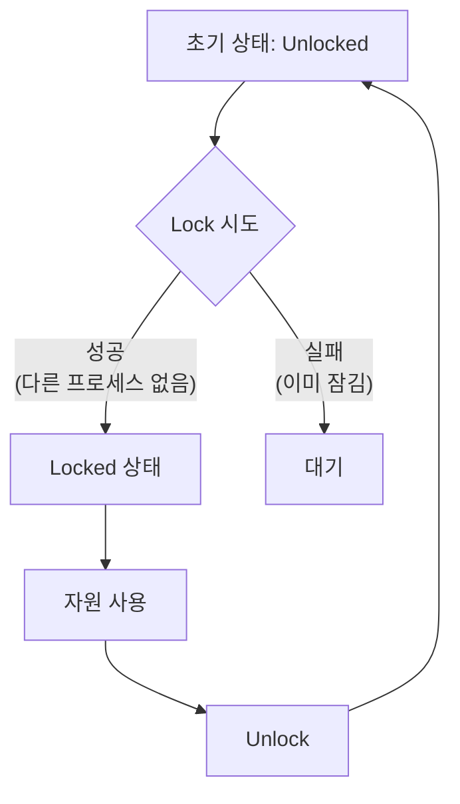
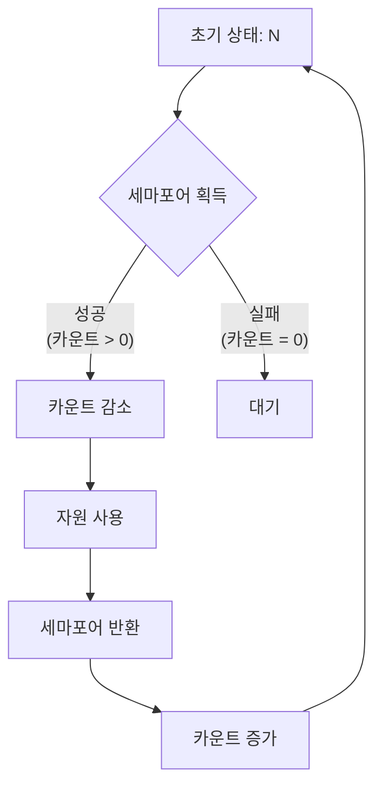
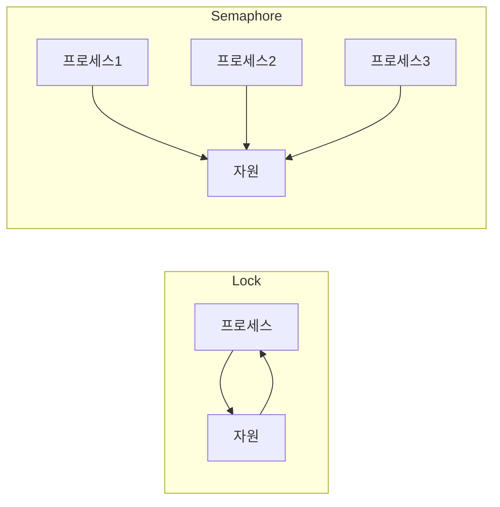
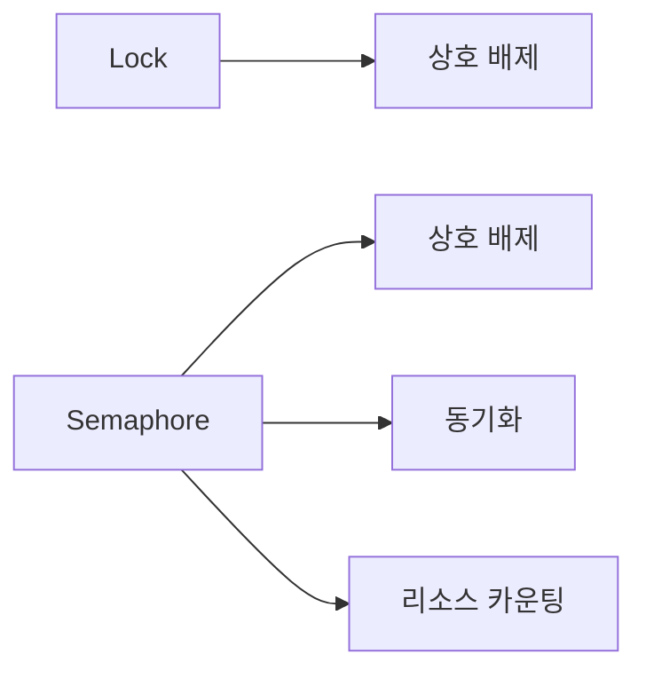
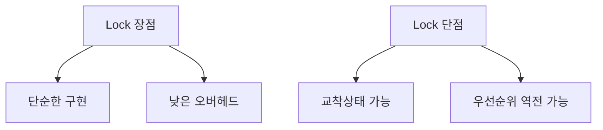
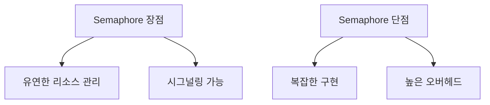

```table-of-contents
title: # 목차
style: nestedList # TOC style (nestedList|nestedOrderedList|inlineFirstLevel)
minLevel: 0 # Include headings from the specified level
maxLevel: 0 # Include headings up to the specified level
includeLinks: true # Make headings clickable
hideWhenEmpty: false # Hide TOC if no headings are found
debugInConsole: false # Print debug info in Obsidian console
```
# 기본 개념

## Lock (뮤텍스)


Lock은 상호 배제(Mutual Exclusion)를 위한 이진(Binary) 상태를 가진다:
- Locked (잠김)
- Unlocked (풀림)

## Semaphore


세마포어는 카운팅이 가능한 상태를 가진다:
- 0부터 N까지의 정수값
- 여러 프로세스의 동시 접근 허용 가능

# 주요 차이점

## 1. 소유권


- Lock: 소유한 프로세스만 해제 가능
- Semaphore: 아무 프로세스나 신호 전송 가능

## 2. 카운트 방식
```c
// Lock (Mutex) 예시
pthread_mutex_t mutex;
pthread_mutex_lock(&mutex);    // 잠금
pthread_mutex_unlock(&mutex);  // 해제

// Semaphore 예시
sem_t sem;
sem_init(&sem, 0, N);         // N개 초기값
sem_wait(&sem);               // 카운트 감소
sem_post(&sem);               // 카운트 증가
```

## 3. 사용 목적


# 실제 사용 예시

## 1. Lock 사용 사례
```c
// 파일 접근 제어
pthread_mutex_t file_mutex;

void access_file() {
    pthread_mutex_lock(&file_mutex);
    // 파일 작업 수행
    pthread_mutex_unlock(&file_mutex);
}
```

## 2. Semaphore 사용 사례
```c
// 동시 접속 제한
sem_t connection_sem;
sem_init(&connection_sem, 0, 10);  // 최대 10개 연결

void handle_connection() {
    sem_wait(&connection_sem);     // 연결 슬롯 획득
    // 연결 처리
    sem_post(&connection_sem);     // 연결 슬롯 반환
}
```

# 선택 가이드

## Lock을 사용해야 할 때
1. 단일 리소스 보호
2. 상호 배제가 필요할 때
3. 소유권이 중요할 때

예시:
```c
// 공유 데이터 보호
pthread_mutex_t data_mutex;
int shared_data;

void update_data() {
    pthread_mutex_lock(&data_mutex);
    shared_data++;
    pthread_mutex_unlock(&data_mutex);
}
```

## Semaphore를 사용해야 할 때
1. 리소스 풀 관리
2. 생산자-소비자 문제
3. 이벤트 신호

예시:
```c
// 리소스 풀 관리
sem_t resource_pool;
sem_init(&resource_pool, 0, 5);  // 5개 리소스

void use_resource() {
    sem_wait(&resource_pool);    // 리소스 획득
    // 리소스 사용
    sem_post(&resource_pool);    // 리소스 반환
}
```

# 성능 고려사항

## Lock


## Semaphore


# 결론
Lock과 Semaphore는 각각의 용도에 맞게 사용해야 한다:
- Lock: 단순한 상호 배제가 필요할 때
- Semaphore: 리소스 카운팅이나 시그널링이 필요할 때

이 두 메커니즘을 상황에 맞게 적절히 선택하여 사용하면 효과적인 동기화를 구현할 수 있다.