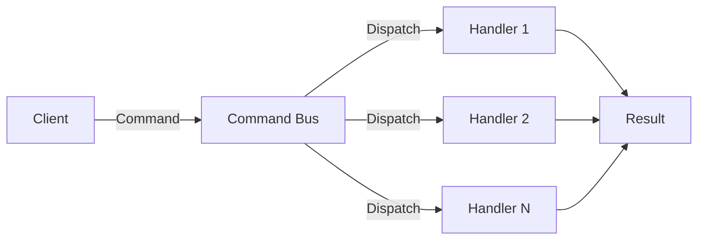

# Command Bus 개요

## 기본 구조
Command Bus는 애플리케이션의 명령(Command)을 실행하는 중앙 집중식 처리기이다. Command는 시스템에서 수행해야 할 작업을 나타내는 객체다.



# Laravel의 Command Bus

## 기본 사용법
Laravel의 Command Bus는 다음과 같은 방식으로 사용할 수 있다:

```php
<?php
// 1. dispatch 헬퍼 함수 사용
dispatch(new ProcessPodcast($podcast));

// 2. Bus 파사드 사용
use Illuminate\Support\Facades\Bus;
Bus::dispatch(new ProcessPodcast($podcast));

// 3. dispatchable 트레이트 사용
ProcessPodcast::dispatch($podcast);
```

## Command 생성
```bash
# Command 클래스 생성
php artisan make:job ProcessPodcast
```

## Command 구조
```php
<?php
namespace App\Jobs;

class ProcessPodcast implements ShouldQueue
{
    use Dispatchable, InteractsWithQueue, Queueable, SerializesModels;
    
    private $podcast;
    
    public function __construct(Podcast $podcast)
    {
        $this->podcast = $podcast;
    }
    
    public function handle(AudioProcessor $processor)
    {
        $processor->process($this->podcast);
    }
}
```

# Command Bus 고급 기능

## 1. Chaining (명령 체이닝)
여러 Command를 순차적으로 실행:

```php
Bus::chain([
    new ProcessPodcast($podcast),
    new OptimizePodcast($podcast),
    new PublishPodcast($podcast),
])->dispatch();
```

## 2. Batch 처리
여러 Command를 동시에 처리:

```php
$batch = Bus::batch([
    new ProcessPodcast($podcast1),
    new ProcessPodcast($podcast2),
    new ProcessPodcast($podcast3),
])->then(function (Batch $batch) {
    // 모든 작업 완료 후 실행
})->catch(function (Batch $batch, Throwable $e) {
    // 오류 발생 시 실행
})->dispatch();
```

## 3. 작업 분기
조건에 따른 Command 실행:

```php
class ProcessPodcast implements ShouldQueue
{
    public function handle(AudioProcessor $processor)
    {
        if ($this->podcast->needsTranscoding()) {
            dispatch(new TranscodePodcast($this->podcast));
            return;
        }
        
        dispatch(new PublishPodcast($this->podcast));
    }
}
```

# 실제 활용 사례

## 1. 주문 처리 시스템
```php
<?php
// Command 클래스
class ProcessOrder implements ShouldQueue
{
    private $order;
    
    public function __construct(Order $order)
    {
        $this->order = $order;
    }
    
    public function handle(
        InventoryManager $inventory,
        PaymentProcessor $payment
    ) {
        // 재고 확인
        if (!$inventory->checkAvailability($this->order)) {
            throw new InsufficientInventoryException();
        }
        
        // 결제 처리
        $payment->process($this->order);
        
        // 후속 Command 실행
        dispatch(new SendOrderConfirmation($this->order));
    }
}

// 사용 예시
class OrderController
{
    public function store(OrderRequest $request)
    {
        $order = Order::create($request->validated());
        
        ProcessOrder::dispatch($order)
            ->delay(now()->addMinutes(5));
            
        return response()->json([
            'message' => '주문이 접수되었습니다.'
        ]);
    }
}
```

## 2. 이메일 발송 시스템
```php
<?php
class SendWeeklyNewsletter implements ShouldQueue
{
    public function handle(NewsletterService $newsletter)
    {
        $subscribers = Subscriber::active()->get();
        
        $subscribers->each(function ($subscriber) {
            dispatch(new SendNewsletterToSubscriber($subscriber));
        });
    }
}
```

# 모범 사례

## Command 설계 원칙
1. 단일 책임 원칙 준수
```php
// 잘못된 예시
class ProcessOrder
{
    public function handle()
    {
        // 재고 확인
        // 결제 처리
        // 이메일 발송
        // 배송 처리
    }
}

// 올바른 예시
class ProcessOrder
{
    public function handle()
    {
        dispatch(new CheckInventory($this->order));
        dispatch(new ProcessPayment($this->order));
        dispatch(new SendOrderEmail($this->order));
        dispatch(new InitiateShipment($this->order));
    }
}
```

## 오류 처리
```php
<?php
class ProcessOrder implements ShouldQueue
{
    public $tries = 3;
    
    public function failed(Throwable $e)
    {
        Log::error('주문 처리 실패', [
            'order' => $this->order->id,
            'error' => $e->getMessage()
        ]);
        
        // 실패 알림 발송
        Notification::route('slack', 'webhook-url')
            ->notify(new OrderProcessingFailed($this->order));
    }
}
```

# 성능 최적화

## 1. 메모리 관리
```php
<?php
class ProcessLargeDataSet implements ShouldQueue
{
    public function handle()
    {
        User::chunk(100, function ($users) {
            foreach ($users as $user) {
                dispatch(new ProcessUser($user));
            }
        });
    }
}
```

## 2. 작업 우선순위
```php
<?php
ProcessOrder::dispatch($order)
    ->onQueue('high-priority');
```

# 결론
Command Bus 패턴은 애플리케이션의 비즈니스 로직을 체계적으로 관리할 수 있게 해준다. Laravel의 구현은 Queue 시스템과 긴밀하게 통합되어 있어 비동기 처리와 함께 사용하기 좋다.