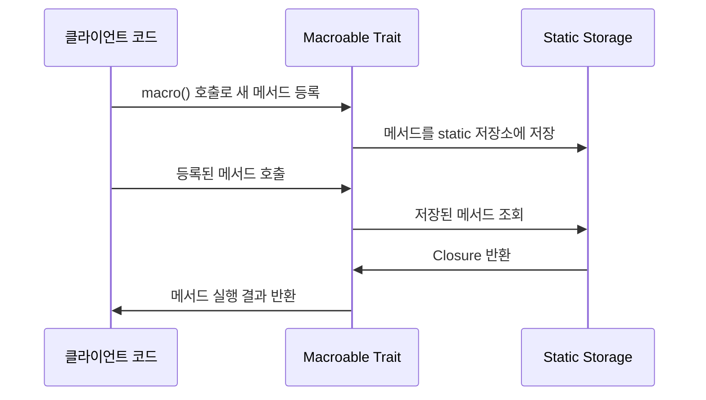
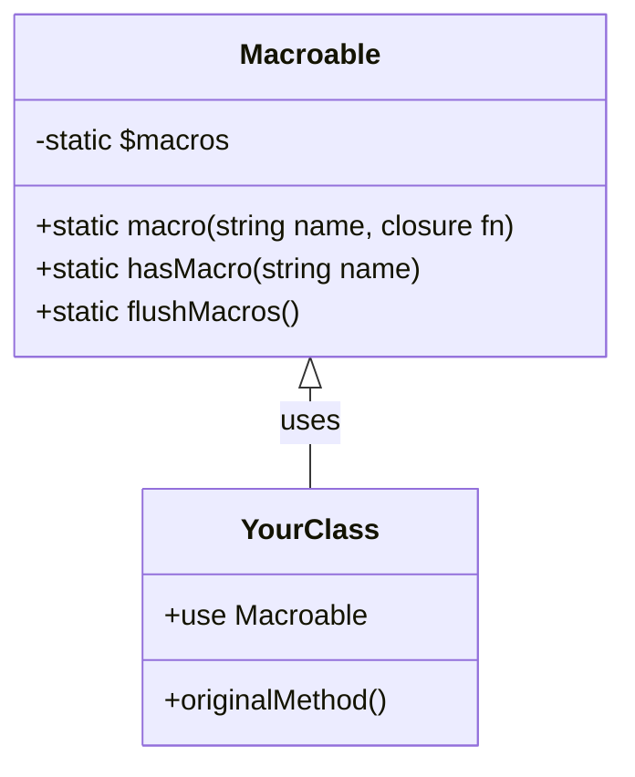

# Macroable이란?

Laravel의 Macroable trait은 클래스에 동적으로 메서드를 추가할 수 있게 해주는 강력한 기능입니다. 마치 스위스 아미 나이프에 새로운 도구를 추가하는 것처럼, 기존 클래스에 원하는 기능을 확장할 수 있습니다.

## 기본 개념

Macroable trait은 PHP의 메타 프로그래밍을 구현한 것으로, 런타임에 클래스의 기능을 확장할 수 있게 해줍니다. 이는 다음과 같은 상황에서 특히 유용합니다:

- 기존 Laravel 클래스에 새로운 기능 추가
- 프로젝트 전반에서 재사용할 수 있는 유틸리티 메서드 정의
- 코드의 가독성과 재사용성 향상

# 동작 방식



# 기본 사용법

## 1. Macroable 적용하기

```php
use Illuminate\Support\Traits\Macroable;

class MyClass
{
    use Macroable;
}
```

## 2. 새로운 메서드 추가

```php
// 잘못된 예시 ❌
MyClass::macro('newMethod', function() {
    return "Hello World";
});

// 올바른 예시 ✅
MyClass::macro('formatPrice', function($price) {
    // $this를 통해 클래스의 다른 메서드나 프로퍼티에 접근 가능
    return number_format($price, 2, '.', ',') . '원';
});
```

## 3. 사용 예시

```php
$instance = new MyClass();
echo $instance->formatPrice(10000); // 출력: 10,000.00원
```

# 고급 활용법

## 1. 파라미터와 타입 힌트 활용

```php
MyClass::macro('processArray', function(array $items): array {
    return array_map(function($item) {
        return strtoupper($item);
    }, $items);
});
```

## 2. 클로저 스코프 활용

```php
class PriceCalculator
{
    use Macroable;
    
    private $taxRate = 0.1;
    
    public function __construct($taxRate = 0.1)
    {
        $this->taxRate = $taxRate;
    }
}

PriceCalculator::macro('calculateTotalWithTax', function($price) {
    // $this를 통해 인스턴스 변수에 접근
    return $price * (1 + $this->taxRate);
});

$calculator = new PriceCalculator(0.15);
echo $calculator->calculateTotalWithTax(1000); // 1150
```

# 시스템 아키텍처



# 실제 개발 시 주의사항

## 1. 성능 고려사항
- Macro는 static 배열에 저장되므로 메모리 사용량에 주의
- 과도한 매크로 사용은 코드 추적을 어렵게 만들 수 있음

## 2. 네이밍 충돌 방지
```php
// 메서드 존재 여부 확인
if (!MyClass::hasMacro('formatPrice')) {
    MyClass::macro('formatPrice', function($price) {
        return number_format($price, 2);
    });
}
```

## 3. IDE 지원 한계
- PHPDoc을 통해 매크로 메서드 문서화
```php
/**
 * @method static string formatPrice(float $price)
 * @method static array processArray(array $items)
 */
class MyClass
{
    use Macroable;
}
```

# 실제 활용 사례

## 1. Collection 확장
```php
Collection::macro('toUpper', function () {
    return $this->map(function ($value) {
        return strtoupper($value);
    });
});

collect(['hello', 'world'])->toUpper(); // ['HELLO', 'WORLD']
```

## 2. Response 매크로
```php
Response::macro('apiSuccess', function ($data) {
    return response()->json([
        'status' => 'success',
        'data' => $data
    ], 200);
});

// 컨트롤러에서 사용
return Response::apiSuccess($user);
```

# 결론

Macroable trait은 Laravel의 강력한 기능 중 하나로, 적절히 사용하면 코드의 재사용성과 가독성을 크게 향상시킬 수 있습니다. 다만 다음 사항을 고려하여 사용해야 합니다:

- 명확한 사용 목적이 있는 경우에만 활용
- 적절한 문서화와 테스트 코드 작성
- 성능과 유지보수성을 고려한 설계

이러한 가이드라인을 따르면서 Macroable을 활용하면, 더 유연하고 확장 가능한 Laravel 애플리케이션을 개발할 수 있습니다.