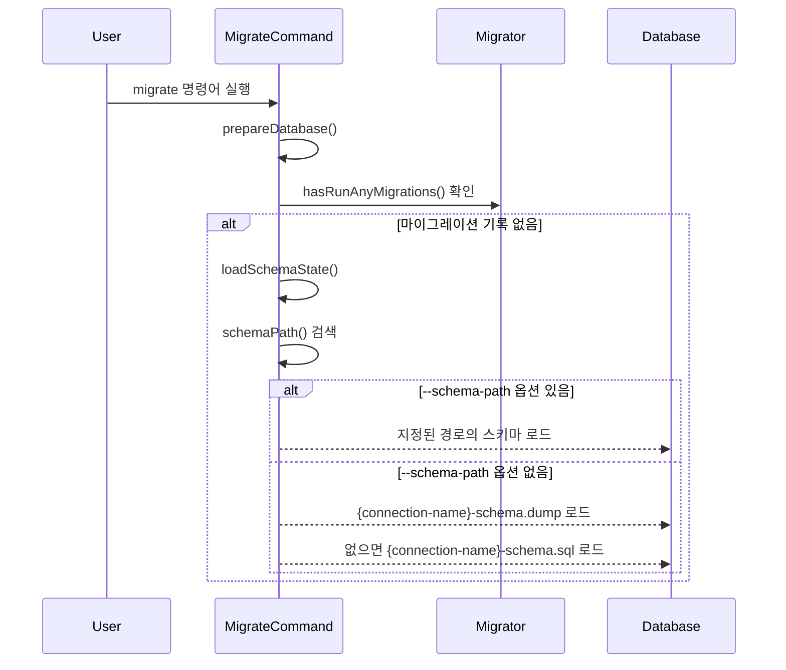

## Schema Dump란?
데이터베이스의 구조를 파일로 저장하여 마이그레이션 실행 전에 초기 데이터베이스 상태를 빠르게 구성하는 기능이다. 이는 마치 건물의 설계도면을 미리 준비해두는 것과 같다.

## 동작 방식
Laravel은 다음과 같은 순서로 Schema Dump 파일을 찾고 적용한다:



## 실제 작동 코드
```php
protected function schemaPath($connection)
{
    // 1. --schema-path 옵션 확인
    if ($this->option('schema-path')) {
        return $this->option('schema-path');
    }

    // 2. {connection-name}-schema.dump 파일 확인
    if (file_exists($path = database_path('schema/'.$connection->getName().'-schema.dump'))) {
        return $path;
    }

    // 3. {connection-name}-schema.sql 파일 확인
    return database_path('schema/'.$connection->getName().'-schema.sql');
}
```

## 사용 예시
1. 기본 사용:
```bash
php artisan migrate --database=sqlite-testing
```
이 경우 `database/schema/sqlite-testing-schema.dump` 파일을 찾아 로드한다.

2. 사용자 지정 경로:
```bash
php artisan migrate --database=sqlite-testing --schema-path=/custom/path/schema.dump
```

## 주의사항
- Schema Dump 파일은 마이그레이션 이력이 없을 때만 로드된다
- SQL Server 데이터베이스에서는 이 기능이 동작하지 않는다
- Schema 파일이 없어도 오류가 발생하지 않고 일반 마이그레이션을 진행한다

## 고급 활용법
1. 여러 환경에서의 활용:
```php
// config/database.php
'connections' => [
    'sqlite-testing' => [
        'driver' => 'sqlite',
        'database' => database_path('testing.sqlite'),
    ],
    'sqlite-development' => [
        'driver' => 'sqlite',
        'database' => database_path('development.sqlite'),
    ]
]
```

2. Schema 이벤트 처리:
```php
use Illuminate\Support\Facades\Event;
use Illuminate\Database\Events\SchemaLoaded;

Event::listen(function (SchemaLoaded $event) {
    // Schema 로드 후 추가 작업 실행
});
```

## 성능 고려사항
- Schema Dump를 사용하면 개별 마이그레이션 실행보다 빠르게 초기 데이터베이스 구조를 생성할 수 있다
- 대규모 프로젝트에서 특히 효과적이다

## 보안 고려사항
- Schema Dump 파일에 민감한 데이터가 포함되지 않도록 주의한다
- 버전 관리 시스템에 커밋하기 전 파일 내용을 검토한다

## 결론
Schema Dump는 Laravel의 데이터베이스 구조 초기화를 효율적으로 만드는 강력한 도구다. 특히 테스트 환경이나 새로운 개발 환경 설정 시 유용하게 활용할 수 있다.