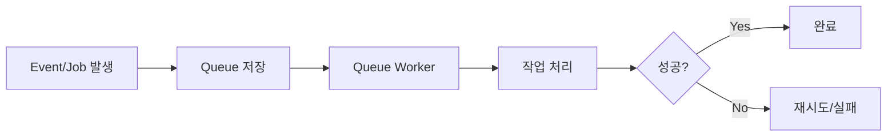
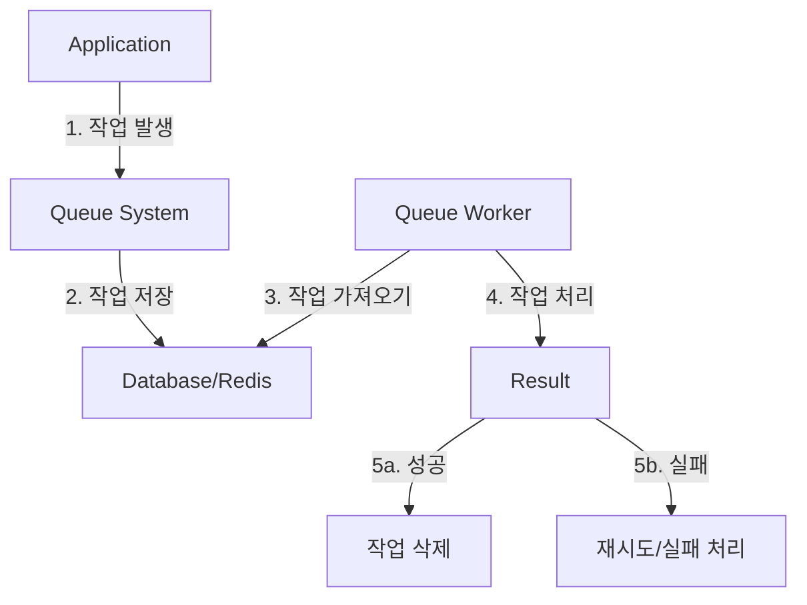

# 개념 설명
ShouldQueue는 Laravel에서 제공하는 Queue 처리를 위한 Interface다. 은행 창구 번호표 시스템과 유사하게 작동한다. 고객이 번호표를 뽑고 자신의 순서를 기다리듯이, ShouldQueue가 적용된 작업은 Queue에 저장되어 순차적으로 처리된다.

# 기본 동작 방식



## System Architecture


# 실제 사용 예시

## 잘못된 구현 예시
```php
// 잘못된 예시: Queue 처리가 필요한 무거운 작업을 동기적으로 처리
class HeavyProcessNotification extends Notification
{
    public function send($notifiable)
    {
        // 무거운 이미지 처리
        $image = Image::make($this->imageUrl);
        $image->resize(800, 600);
        
        // 외부 API 호출
        $response = Http::post('api.example.com/notify', [
            'user' => $notifiable->id,
            'image' => $image
        ]);
    }
}
```

## 올바른 구현 예시
```php
// 올바른 예시: Queue를 사용한 비동기 처리
class HeavyProcessNotification extends Notification implements ShouldQueue
{
    public $tries = 3;  // 재시도 횟수
    public $timeout = 120;  // 타임아웃 시간(초)
    
    /**
     * 알림 전송 처리
     *
     * @param mixed $notifiable
     * @return void
     */
    public function send($notifiable)
    {
        // 이미지 처리를 별도 Job으로 분리
        ProcessImageJob::dispatch($this->imageUrl)
            ->chain([
                new SendNotificationJob($notifiable->id)
            ]);
    }
}
```

## 단계별 구현 과정

### 1단계: Queue 설정
```php
// config/queue.php
return [
    'default' => env('QUEUE_CONNECTION', 'database'),
    
    'connections' => [
        'database' => [
            'driver' => 'database',
            'table' => 'jobs',
            'queue' => 'default',
            'retry_after' => 90,
            'after_commit' => false,
        ],
    ],
];
```

### 2단계: Job 클래스 구현
```php
// app/Jobs/ProcessDataJob.php
class ProcessDataJob implements ShouldQueue
{
    use Dispatchable, InteractsWithQueue, Queueable, SerializesModels;
    
    private $data;
    
    /**
     * Job 생성자
     *
     * @param array $data 처리할 데이터
     */
    public function __construct(array $data)
    {
        $this->data = $data;
    }
    
    /**
     * Job 실행
     *
     * @return void
     */
    public function handle()
    {
        // 데이터 처리 로직
        Log::info('데이터 처리 시작', $this->data);
        
        // 실패 시 예외 발생
        if (!$this->processData()) {
            throw new JobFailedException('데이터 처리 실패');
        }
    }
    
    /**
     * 실패 처리
     *
     * @param Exception $e
     * @return void
     */
    public function failed(Exception $e)
    {
        Log::error('Job 실패', [
            'error' => $e->getMessage(),
            'data' => $this->data
        ]);
    }
}
```

# 고급 활용법

## Batch 처리
```php
use Illuminate\Support\Facades\Bus;

$batch = Bus::batch([
    new ProcessDataJob($data1),
    new ProcessDataJob($data2),
    new ProcessDataJob($data3),
])->then(function (Batch $batch) {
    // 모든 Job 완료 후 처리
})->catch(function (Batch $batch, Throwable $e) {
    // 실패 처리
})->dispatch();
```

## 조건부 Queue 처리
```php
class ConditionalJob implements ShouldQueue
{
    public function shouldQueue(): bool
    {
        // 특정 조건에서만 Queue 처리
        return app()->environment('production');
    }
}
```

# 주의사항

## Performance 고려사항
- Queue Worker 수 최적화
- Memory Leak 방지
- Database 연결 관리
- Queue 우선순위 설정

## Security 고려사항
- Job 데이터 암호화
- Queue 접근 제한
- 민감 정보 처리 주의

# 결론
ShouldQueue Interface는 Laravel에서 비동기 처리를 구현하는 핵심 도구다. 적절한 사용으로 애플리케이션의 성능과 사용자 경험을 크게 향상시킬 수 있다.

# 추가 학습을 위한 질문들
1. Queue와 직접 처리의 Trade-off는 무엇인가?
2. 언제 Queue를 사용하고, 언제 직접 처리해야 하는가?
3. Queue 실패 시 어떤 복구 전략을 사용할 수 있는가?
4. Queue의 성능을 최적화하는 방법은 무엇인가?
5. Batch 처리와 개별 Job의 차이점은 무엇인가?