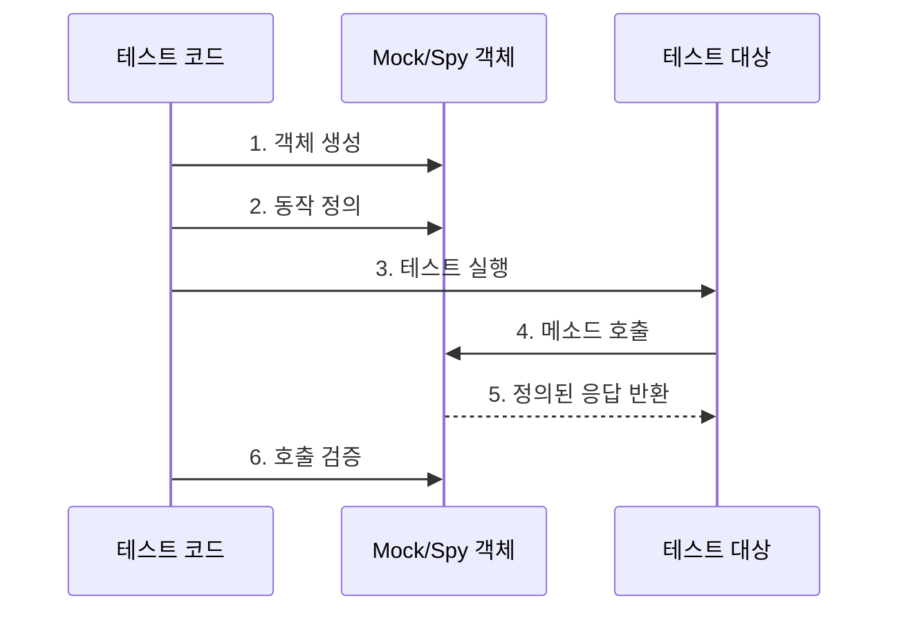

# Spy와 Mock의 개념

## 기본 개념
Spy와 Mock은 테스트에서 실제 객체를 대체하는 Test Double의 한 종류이다. 실생활에 비유하자면, 영화 촬영에서 위험한 장면을 대신하는 스턴트맨과 같은 역할을 한다.
[[test double의 종류]]

- 미리 정의된 동작을 수행하는 가짜 객체를 생성한다
- 특정 메소드 호출을 기대하고 그에 대한 반환값을 정의한다

### Spy
- 실제 객체의 행동을 관찰하고 기록한다
- 메소드 호출 여부, 횟수, 전달된 파라미터 등을 검증한다

# 기본 동작 방식

## Mock 객체 생성 및 사용
```php
// PaymentGateway 인터페이스
interface PaymentGateway {
    public function process(float $amount): bool;
    public function refund(float $amount): bool;
}

// Mock 객체 생성
public function testOrderPayment(): void
{
    // Mock 객체 생성
    $mock = $this->mock(PaymentGateway::class);
    
    // 동작 정의
    $mock->shouldReceive('process')
         ->with(100.00)
         ->once()
         ->andReturn(true);
         
    // 테스트 대상 코드 실행
    $order = new Order($mock);
    $result = $order->pay(100.00);
    
    // 결과 검증
    $this->assertTrue($result);
}
```

## Spy 객체 생성 및 사용
```php
// NotificationService 클래스
class NotificationService {
    public function sendEmail(string $to, string $subject): void
    {
        // 실제 이메일 발송 로직
    }
}

// Spy 객체를 활용한 테스트
public function testUserRegistration(): void
{
    // Spy 객체 생성
    $spy = Mockery::spy(NotificationService::class);
    
    // 의존성 주입
    $this->app->instance(NotificationService::class, $spy);
    
    // 테스트 대상 코드 실행
    $user = User::factory()->create();
    
    // 메소드 호출 검증
    $spy->shouldHaveReceived('sendEmail')
        ->with($user->email, '가입을 환영합니다')
        ->once();
}
```

# Process Flow



# 실제 사용 예시

## 1. API 호출 Mock 처리
```php
public function testProductSync(): void
{
    // HTTP 클라이언트 Mock
    $mock = $this->mock(HttpClient::class);
    
    // API 응답 정의
    $mock->shouldReceive('get')
         ->with('https://api.example.com/products')
         ->once()
         ->andReturn([
             'products' => [
                 ['id' => 1, 'name' => '상품A'],
                 ['id' => 2, 'name' => '상품B']
             ]
         ]);
    
    // 동기화 실행
    $syncer = new ProductSyncer($mock);
    $result = $syncer->sync();
    
    // 결과 검증
    $this->assertEquals(2, Product::count());
}
```

## 2. Event 발생 검증
```php
public function testOrderCompletion(): void
{
    // Event Spy 설정
    Event::spy();
    
    // 주문 완료 처리
    $order = Order::factory()->create();
    $order->complete();
    
    // 이벤트 발생 검증
    Event::assertDispatched(OrderCompletedEvent::class, function ($event) use ($order) {
        return $event->order->id === $order->id;
    });
}
```

# 고급 활용법

## 1. 순차적 응답 정의
```php
// 여러 번의 호출에 대해 다른 응답을 정의
$mock->shouldReceive('process')
     ->andReturn(true, false, true)  // 첫 번째, 두 번째, 세 번째 호출의 응답
     ->times(3);
```

## 2. 동적 응답 처리
```php
$mock->shouldReceive('calculate')
     ->andReturnUsing(function ($amount) {
         return $amount * 1.1;  // 10% 할증 계산
     });
```

# 주의사항

## 1. Mock 사용 시 주의점
- Mock은 실제 객체의 동작을 완전히 대체하므로, 과도한 사용은 테스트의 신뢰성을 저하시킨다
- 핵심 비즈니스 로직은 가능한 실제 객체를 사용하여 테스트한다

## 2. Spy 사용 시 주의점
```php
// 잘못된 예시
$spy->shouldReceive('process')  // Spy는 동작을 미리 정의하지 않는다
    ->andReturn(true);

// 올바른 예시
$spy->shouldHaveReceived('process')  // 호출 여부만 검증한다
    ->once();
```

# Security 고려사항

## 1. 민감한 정보 처리
```php
// 잘못된 예시
$mock->shouldReceive('getApiKey')
     ->andReturn('actual-secret-key');  // 실제 키를 테스트 코드에 포함시키지 않는다

// 올바른 예시
$mock->shouldReceive('getApiKey')
     ->andReturn(Str::random(32));  // 가짜 데이터 사용
```

# Performance 고려사항

## 1. 메모리 관리
```php
public function tearDown(): void
{
    Mockery::close();  // Mock 객체 정리
    parent::tearDown();
}
```

# 결론

Spy와 Mock은 Laravel 테스트에서 강력한 도구이지만, 적절한 사용이 중요하다. 다음 사항을 고려하여 사용한다:

1. Mock은 외부 의존성을 대체할 때 사용한다
2. Spy는 객체의 행동을 관찰할 때 사용한다
3. 핵심 비즈니스 로직은 실제 객체로 테스트한다
4. 테스트의 가독성과 유지보수성을 고려한다

이러한 도구들을 적절히 활용하면 안정적이고 효율적인 테스트 코드를 작성할 수 있다.