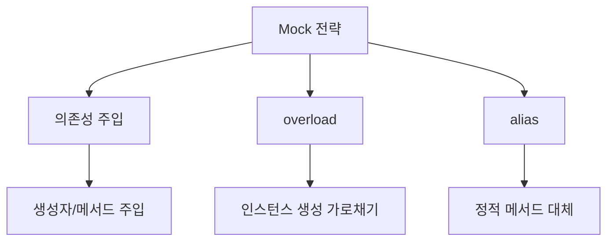

> [!info]
> [[Laravel에서의 의존성 주입을 활용한 효과적인 테스트 작성법]]
> [[Laravel Testing의 Mock 패턴 - overload vs alias]]
# Mock 전략의 개요

테스트 작성 시 의존성을 처리하는 방법은 크게 세 가지가 있다. 의존성 주입을 통한 Mocking, overload를 사용한 Mocking, 그리고 alias를 사용한 Mocking이다. 각각의 방식은 서로 다른 상황에서 유용하게 사용된다.

실생활에 비유하자면 다음과 같다:
- 의존성 주입: 조립 라인에서 부품을 끼워넣는 것
- overload: 완제품의 부품을 교체하는 것
- alias: 리모컨의 단축키를 다른 기능으로 매핑하는 것

# 세 가지 Mock 전략의 기본 동작 방식



## 의존성 주입 방식
```php
/**
 * 의존성 주입을 사용한 Mock 예시
 * 가장 권장되는 기본적인 방식이다
 */
interface PaymentGatewayInterface {
    public function process(float $amount): bool;
}

class OrderService {
    public function __construct(
        private PaymentGatewayInterface $gateway
    ) {}

    public function processOrder(float $amount): bool {
        return $this->gateway->process($amount);
    }
}

class OrderServiceTest extends TestCase {
    public function testProcessOrder() {
        // Mock 객체 생성 및 주입
        $gateway = Mockery::mock(PaymentGatewayInterface::class);
        $gateway->shouldReceive('process')
                ->once()
                ->with(100.0)
                ->andReturn(true);

        $service = new OrderService($gateway);
        $result = $service->processOrder(100.0);
        
        $this->assertTrue($result);
    }
}
```

## overload 방식
```php
/**
 * overload를 사용한 Mock 예시
 * 클래스 인스턴스화를 가로챈다
 */
class LegacyOrderService {
    public function processOrder(float $amount): bool {
        // 직접 인스턴스화하는 레거시 코드
        $gateway = new PaymentGateway();
        return $gateway->process($amount);
    }
}

class LegacyOrderServiceTest extends TestCase {
    public function testProcessOrder() {
        // overload로 PaymentGateway 클래스의 인스턴스화를 가로챔
        $mock = Mockery::mock('overload:PaymentGateway');
        $mock->shouldReceive('process')
             ->once()
             ->with(100.0)
             ->andReturn(true);

        $service = new LegacyOrderService();
        $result = $service->processOrder(100.0);
        
        $this->assertTrue($result);
    }
}
```

## alias 방식
```php
/**
 * alias를 사용한 Mock 예시
 * 정적 메서드 호출을 대체한다
 */
class StaticOrderService {
    public function processOrder(float $amount): bool {
        // 정적 메서드를 사용하는 코드
        return PaymentGateway::process($amount);
    }
}

class StaticOrderServiceTest extends TestCase {
    public function testProcessOrder() {
        // alias로 정적 메서드 호출을 대체
        $mock = Mockery::mock('alias:PaymentGateway');
        $mock->shouldReceive('process')
             ->once()
             ->with(100.0)
             ->andReturn(true);

        $service = new StaticOrderService();
        $result = $service->processOrder(100.0);
        
        $this->assertTrue($result);
    }
}
```

# 전략별 사용 시나리오

## 의존성 주입이 적합한 경우
- 새로운 프로젝트를 시작할 때
- 클린 아키텍처를 구현할 때
- 테스트 용이성을 중요시하는 경우
- 의존성이 명확해야 하는 경우

## overload가 필요한 경우
- 레거시 코드에서 new 키워드로 직접 인스턴스화하는 경우
- 외부 라이브러리의 인스턴스 생성을 가로채야 하는 경우
- 의존성 주입 리팩토링 전의 임시 해결책으로

## alias가 유용한 경우
- 정적 메서드를 사용하는 코드를 테스트할 때
- 파사드(Facade) 패턴을 사용하는 경우
- 전역적으로 사용되는 유틸리티 클래스를 테스트할 때

# 각 전략의 장단점

## 의존성 주입
장점:
- 명시적인 의존성 표현
- 높은 테스트 용이성
- 유연한 구현체 교체
- 견고한 설계 원칙 준수

단점:
- 초기 설계 시간 필요
- 더 많은 보일러플레이트 코드
- 의존성 그래프 관리 필요

## overload
장점:
- 레거시 코드 테스트 가능
- 코드 수정 없이 테스트 가능
- 빠른 구현 가능

단점:
- 전역 상태 변경
- 예측하기 어려운 부작용
- 테스트간 격리 어려움

## alias
장점:
- 정적 메서드 테스트 가능
- 최소한의 코드 수정
- 전역적 기능 테스트에 유용

단점:
- 테스트 실행 순서 의존성
- 다중 테스트 시 충돌 가능
- 디버깅 어려움

# 실제 적용 가이드

## 신규 프로젝트
```php
/**
 * 신규 프로젝트에서의 권장 구현
 * 의존성 주입을 기본으로 사용한다
 */
interface LoggerInterface {
    public function log(string $message): void;
}

class OrderService {
    public function __construct(
        private PaymentGatewayInterface $gateway,
        private LoggerInterface $logger
    ) {}

    public function processOrder(float $amount): bool {
        $this->logger->log("주문 처리 시작");
        return $this->gateway->process($amount);
    }
}
```

## 레거시 프로젝트
```php
/**
 * 레거시 코드의 점진적 개선
 * 1단계: overload로 임시 해결
 * 2단계: 의존성 주입으로 리팩토링
 */
// 1단계: overload 사용
class LegacyTest extends TestCase {
    public function testLegacyCode() {
        $mock = Mockery::mock('overload:Logger');
        $mock->shouldReceive('log')->once();
        // 테스트 진행...
    }
}

// 2단계: 의존성 주입으로 전환
class RefactoredService {
    public function __construct(
        private LoggerInterface $logger
    ) {}
    
    public function process() {
        $this->logger->log("처리 시작");
    }
}
```

# 주의사항

1. 격리 문제
- overload와 alias는 테스트 격리를 해칠 수 있다
- PHPUnit의 테스트 순서에 영향을 받을 수 있다
- tearDown에서 적절한 정리가 필요하다

2. 성능 고려사항
- 의존성 주입: 컨테이너 사용으로 인한 약간의 오버헤드
- overload: 클래스 로더 수준의 조작으로 인한 성능 영향
- alias: 정적 호출 처리로 인한 추가 연산

3. 유지보수성
- 의존성 주입이 장기적으로 가장 유지보수하기 쉽다
- overload와 alias는 임시 해결책으로만 사용한다

# 실무 적용 사례

자세한 의존성 주입 구현과 사용 방법은 "[Laravel Testing에서의 의존성 주입 활용 가이드](링크)" 문서를 참고한다.

# 결론

Mock 전략 선택은 프로젝트의 상황과 요구사항에 따라 달라진다:

- 신규 프로젝트: 의존성 주입을 우선적으로 고려한다
- 레거시 코드: overload나 alias를 사용하되, 점진적으로 의존성 주입으로 전환한다
- 정적 메서드: alias를 사용하되, 가능하다면 의존성 주입 패턴으로 리팩토링한다