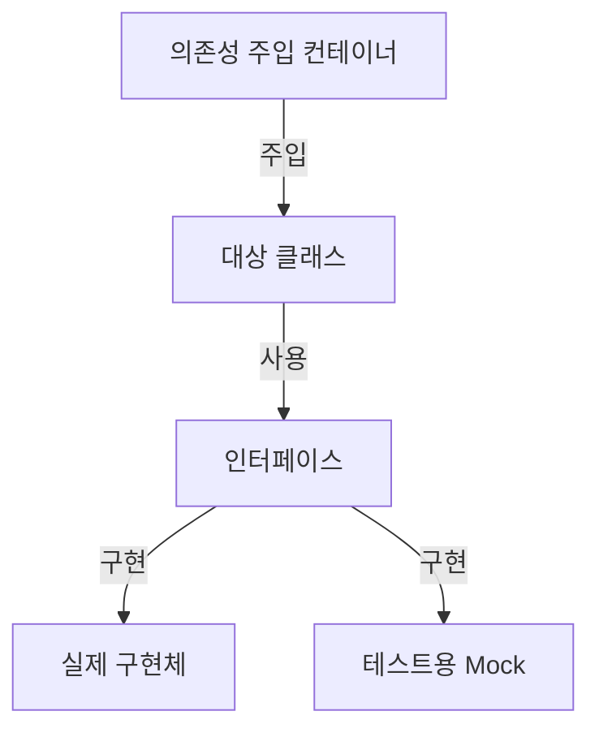
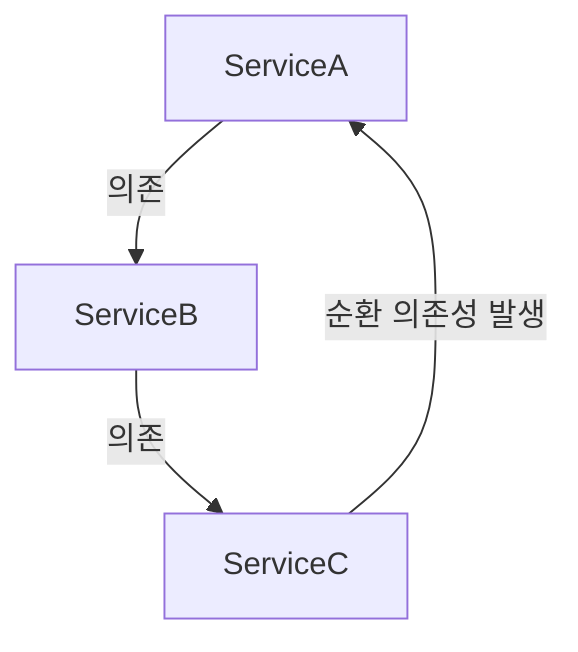

# 의존성 주입의 이해

의존성 주입(Dependency Injection)은 객체 간의 결합도를 낮추고 테스트 용이성을 높이는 설계 패턴이다.

## 실생활 비유
자동차 조립 공정을 생각해보자. 자동차 공장에서는 엔진을 자동차 내부에서 직접 제작하지 않는다. 대신 완성된 엔진을 조립 라인에서 장착한다. 이처럼 의존성 주입은 필요한 부품(의존성)을 외부에서 제공받아 사용한다.



# 기본 동작 방식

## 1단계: 인터페이스 정의
```php
/**
 * 결제 게이트웨이 인터페이스
 * 모든 결제 처리 클래스가 구현해야 하는 계약을 정의한다
 */
interface PaymentGatewayInterface 
{
    /**
     * 결제를 처리한다
     * @param float $amount 결제 금액
     * @return bool 결제 성공 여부
     */
    public function process(float $amount): bool;
}
```

## 2단계: 실제 구현체 작성
```php
/**
 * Stripe 결제 게이트웨이 구현체
 * 실제 운영 환경에서 사용되는 클래스이다
 */
class StripePaymentGateway implements PaymentGatewayInterface 
{
    private string $apiKey;

    public function __construct(string $apiKey) 
    {
        $this->apiKey = $apiKey;
    }

    public function process(float $amount): bool 
    {
        // 실제 Stripe API 호출 로직을 구현한다
        return true;
    }
}
```

## 3단계: 의존성 주입을 사용하는 클래스 작성
```php
/**
 * 주문 처리 클래스
 * 결제 게이트웨이에 의존하여 주문을 처리한다
 */
class OrderProcessor 
{
    private PaymentGatewayInterface $paymentGateway;

    public function __construct(PaymentGatewayInterface $paymentGateway) 
    {
        $this->paymentGateway = $paymentGateway;
    }

    public function processOrder(float $amount): bool 
    {
        return $this->paymentGateway->process($amount);
    }
}
```

# 실제 테스트 작성 예시

## 기본적인 테스트 작성법

### 잘못된 예시
```php
/**
 * 안티 패턴: 실제 구현체를 직접 사용하는 테스트
 * 이 방식은 외부 의존성을 직접 사용하므로 피해야 한다
 */
class OrderProcessorTest extends TestCase 
{
    public function testProcessOrder() 
    {
        $gateway = new StripePaymentGateway('real-api-key');
        $processor = new OrderProcessor($gateway);
        
        $result = $processor->processOrder(100.00);
        $this->assertTrue($result);
    }
}
```

### 올바른 예시
```php
/**
 * 올바른 패턴: Mock 객체를 사용하는 테스트
 * 외부 의존성을 Mock으로 대체하여 테스트를 격리시킨다
 */
class OrderProcessorTest extends TestCase 
{
    public function testProcessOrder() 
    {
        // Mock 객체 생성
        $gateway = Mockery::mock(PaymentGatewayInterface::class);
        
        // Mock 객체의 동작을 정의
        $gateway->shouldReceive('process')
            ->once()
            ->with(100.00)
            ->andReturn(true);

        $processor = new OrderProcessor($gateway);
        $result = $processor->processOrder(100.00);

        $this->assertTrue($result);
    }
}
```

# 고급 활용법

## Service Provider를 통한 의존성 관리
```php
/**
 * 결제 서비스 제공자
 * 애플리케이션의 결제 관련 의존성을 관리한다
 */
class PaymentServiceProvider extends ServiceProvider 
{
    public function register() 
    {
        $this->app->bind(PaymentGatewayInterface::class, function ($app) {
            // 환경에 따라 다른 구현체를 반환한다
            if ($app->environment('testing')) {
                return new MockPaymentGateway();
            }
            
            return new StripePaymentGateway(
                config('services.stripe.key')
            );
        });
    }
}
```

## 복잡한 의존성 처리
```php
/**
 * 복잡한 의존성을 가진 서비스 클래스
 * 여러 개의 의존성을 조합하여 비즈니스 로직을 처리한다
 */
class OrderService 
{
    private PaymentGatewayInterface $paymentGateway;
    private LoggerInterface $logger;
    private EmailService $emailService;

    public function __construct(
        PaymentGatewayInterface $paymentGateway,
        LoggerInterface $logger,
        EmailService $emailService
    ) {
        $this->paymentGateway = $paymentGateway;
        $this->logger = $logger;
        $this->emailService = $emailService;
    }

    public function placeOrder(Order $order): bool 
    {
        try {
            $this->logger->info('주문 처리 시작');
            
            $paymentResult = $this->paymentGateway->process($order->getTotal());
            
            if ($paymentResult) {
                $this->emailService->sendOrderConfirmation($order);
                $this->logger->info('주문 처리 완료');
                return true;
            }
            
            $this->logger->error('결제 실패');
            return false;
        } catch (Exception $e) {
            $this->logger->error('주문 처리 중 오류: ' . $e->getMessage());
            throw $e;
        }
    }
}
```

# 주의사항

1. 순환 의존성 주의


2. 테스트 격리
- 각 테스트는 독립적으로 실행되어야 한다
- tearDown 메서드에서 Mock 객체를 정리한다
- 전역 상태를 사용하지 않는다

3. Mock 객체 사용시 주의점
- 필요한 메서드만 Mock한다
- 실제 동작과 유사하게 설정한다
- 테스트 가능성을 위해 너무 많은 Mock을 사용하지 않는다

# 성능 고려사항

1. 인스턴스 생성 최적화
```php
/**
 * 성능 최적화를 위한 지연 로딩 패턴
 */
class OptimizedService 
{
    private ?PaymentGatewayInterface $paymentGateway = null;

    public function getPaymentGateway(): PaymentGatewayInterface 
    {
        if ($this->paymentGateway === null) {
            $this->paymentGateway = app(PaymentGatewayInterface::class);
        }
        return $this->paymentGateway;
    }
}
```

2. Container 캐싱 활용
```php
/**
 * Container 바인딩 최적화
 */
class AppServiceProvider extends ServiceProvider 
{
    public function register() 
    {
        // 싱글톤으로 등록하여 재사용
        $this->app->singleton(PaymentGatewayInterface::class, function () {
            return new StripePaymentGateway(config('services.stripe.key'));
        });
    }
}
```

# 결론

의존성 주입을 활용한 테스트는 다음과 같은 이점을 제공한다:
- 코드의 결합도를 낮춘다
- 테스트 용이성이 향상된다
- 유지보수가 쉬워진다
- 재사용성이 증가한다

효과적인 테스트를 위해서는 의존성 주입을 설계 단계부터 고려하고, 적절한 Mock 객체를 활용하여 테스트를 작성해야 한다.