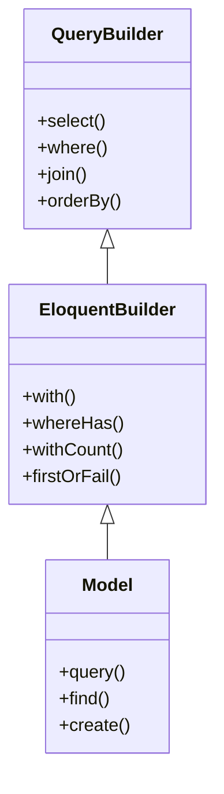
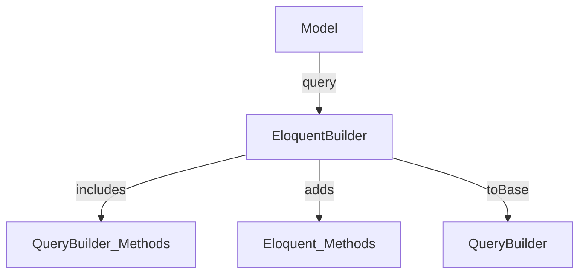

# Builder Type의 이해

## 개념 설명
Laravel에서 Builder Type은 레스토랑 주문 시스템과 유사하게 작동한다:

- 일반 주방 직원(Query Builder)은 기본적인 요리 작업만 수행한다.
- 수석 셰프(Eloquent Builder)는 일반 요리사의 모든 기술을 알고 있으며, 추가로 특별한 요리 기법도 구사할 수 있다.

## 기본 구조와 상속 관계



## Builder Type의 특징



# 실제 사용 예시

## 1. 기본적인 쿼리 작성

```php
class UserRepository
{
    /**
     * Model을 통한 쿼리 시작
     * @return \Illuminate\Database\Eloquent\Builder
     */
    public function getActiveUsers()
    {
        // Eloquent Builder를 반환하지만 Query Builder 메서드 사용 가능
        return User::query()          
            ->select('id', 'name')    // Query Builder 메서드
            ->where('active', true)   // Query Builder 메서드
            ->with('profile');        // Eloquent Builder 메서드
    }

    /**
     * Query Builder로 변환하여 사용
     * @return \Illuminate\Database\Query\Builder
     */
    public function getRawUserData()
    {
        return User::query()
            ->select('id', 'name')
            ->toBase();  // Query Builder로 변환
    }
}
```

## 2. 관계 처리와 Builder Type

```php
class PostRepository
{
    /**
     * 관계 쿼리에서의 Builder Type 변화 예시
     */
    public function getAuthorPosts(User $user)
    {
        // HasMany 관계 시작
        $relation = $user->posts();  // 반환: HasMany
        
        // 쿼리 조건 추가 시 Eloquent Builder로 변환
        $query = $relation->where('published', true);  // 반환: EloquentBuilder
        
        // Query Builder 메서드도 사용 가능
        return $query
            ->select('id', 'title')        // Query Builder 메서드
            ->orderBy('created_at');       // Query Builder 메서드
    }
}
```

# 고급 활용법

## 1. Type 체크와 메서드 호출

```php
class QueryService
{
    /**
     * Builder Type에 따른 메서드 사용 가능 여부 확인
     */
    public function demonstrateBuilderTypes()
    {
        // Eloquent Builder
        $eloquentQuery = User::query();
        
        // 모든 Query Builder 메서드 사용 가능
        $eloquentQuery->select('*')
                     ->where('active', true)
                     ->orderBy('id');
        
        // Eloquent 전용 메서드도 사용 가능
        $eloquentQuery->with('profile')
                     ->withCount('posts');

        // Query Builder
        $queryBuilder = DB::table('users');
        
        // Query Builder 메서드만 사용 가능
        $queryBuilder->select('*')
                    ->where('active', true);
        
        // 아래 코드는 오류 발생
        // $queryBuilder->with('profile');  // 실행 불가
    }
}
```

## 2. 성능 최적화

```php
class OptimizedQueryService
{
    /**
     * 상황에 따른 Builder Type 선택
     */
    public function performanceExample()
    {
        // 대량 데이터 처리 시 Query Builder 사용
        $simpleUsers = DB::table('users')
            ->select('id', 'name')
            ->where('active', true)
            ->cursor();  // 메모리 효율적 처리

        // 복잡한 관계 처리 시 Eloquent Builder 활용
        $complexUsers = User::query()
            ->with(['profile', 'posts' => function ($query) {
                $query->latest();
            }])
            ->whereHas('posts', function ($query) {
                $query->where('published', true);
            })
            ->get();
    }
}
```

# 주의사항

## 1. Builder Type 혼동 방지

```php
// 잘못된 예시: Builder Type 가정
public function wrong(Builder $query)  // 구체적이지 않은 타입 힌트
{
    return $query->with('profile');  // 런타임 오류 가능성
}

// 올바른 예시: 명확한 Type 지정
public function correct(EloquentBuilder $query)  // 명확한 타입 힌트
{
    return $query->with('profile');  // 안전한 호출
}
```

## 2. 성능 관련 주의사항

```php
// 비효율적인 예시
$users = User::all()->filter(function ($user) {  // 전체 로드 후 필터링
    return $user->is_active;
});

// 효율적인 예시
$users = User::query()
    ->where('is_active', true)  // DB 레벨에서 필터링
    ->get();
```

# 실무 응용

## 1. Repository 패턴 활용

```php
class UserRepository
{
    /**
     * Builder Type을 활용한 유연한 쿼리 구성
     */
    public function getUsers(array $criteria, bool $withRelations = true)
    {
        $query = User::query();  // Eloquent Builder 시작

        // 기본 조건 (Query Builder 메서드 사용)
        $query->select('id', 'name', 'email')
              ->where('active', true);

        // 관계 데이터 필요 시 (Eloquent Builder 메서드 사용)
        if ($withRelations) {
            $query->with(['profile', 'posts']);
        }

        // 최적화가 필요한 경우 Query Builder로 전환
        if (isset($criteria['optimize']) && $criteria['optimize']) {
            return $query->toBase();
        }

        return $query;
    }
}
```

## 2. 실제 문제 해결 사례

```php
class OrderService
{
    /**
     * 대량 주문 데이터 처리 예시
     */
    public function processLargeOrders()
    {
        // 메모리 부족 문제 해결
        $query = Order::query()
            ->select('id', 'total')
            ->where('status', 'pending');

        // 대량 데이터 처리 시 Query Builder로 전환
        if ($query->count() > 10000) {
            return $query->toBase()
                        ->orderBy('id')
                        ->chunk(1000, function ($orders) {
                            // 청크 단위 처리
                        });
        }

        // 소량 데이터는 Eloquent Builder 유지
        return $query->with('items')->get();
    }
}
```

# 결론

Builder Type의 선택은 다음 기준으로 결정한다:

1. Query Builder 선택:
   - 단순 CRUD 작업
   - 대량 데이터 처리
   - 메모리 최적화 필요

2. Eloquent Builder 선택:
   - 모델 관계 활용
   - 모델 이벤트 필요
   - 비즈니스 로직 포함

## 핵심 정리
1. Model에서 시작하는 쿼리는 항상 Eloquent Builder이다.
2. Eloquent Builder는 모든 Query Builder 메서드를 사용할 수 있다.
3. `toBase()`를 통해 Query Builder로 전환할 수 있다.
4. 상황에 맞는 Builder Type 선택이 성능과 개발 효율성을 좌우한다.
