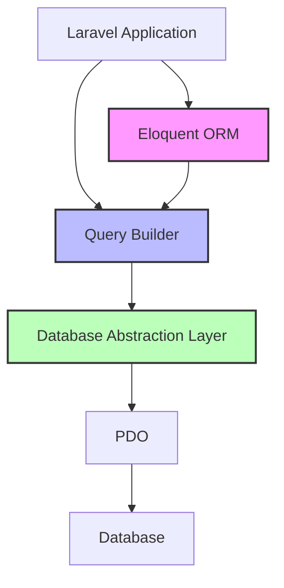
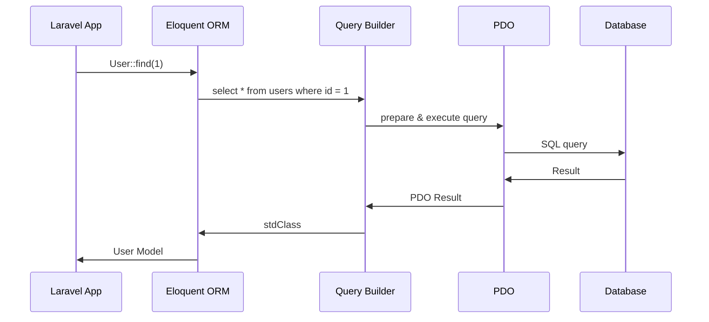

# 기본 아키텍처
Laravel의 데이터베이스 처리는 여러 계층으로 구성되어 있다.



# 데이터베이스 접근 방식

## 1. Eloquent ORM 사용 (가장 높은 추상화)
```php
// Eloquent Model 사용
class User extends Model
{
    protected $fillable = ['name', 'email'];
}

// 데이터 조회
$users = User::where('active', true)->get();

// 데이터 생성
$user = User::create([
    'name' => '홍길동',
    'email' => 'hong@example.com'
]);
```

## 2. Query Builder 사용 (중간 수준의 추상화)
```php
// Query Builder 사용
$users = DB::table('users')
    ->where('active', true)
    ->get();

// 데이터 삽입
DB::table('users')->insert([
    'name' => '홍길동',
    'email' => 'hong@example.com'
]);
```

## 3. Raw Query 사용 (가장 낮은 추상화)
```php
// Raw SQL 실행
$users = DB::select('select * from users where active = ?', [true]);

// Raw SQL 삽입
DB::insert('insert into users (name, email) values (?, ?)', [
    '홍길동',
    'hong@example.com'
]);
```

# 실제 동작 과정


# 각 계층별 특징

## 1. Eloquent ORM
- 가장 높은 수준의 추상화 제공
- 객체 지향적 접근 방식
- 관계 설정이 직관적
```php
// 관계 정의
class User extends Model
{
    public function posts()
    {
        return $this->hasMany(Post::class);
    }
}

// 관계 사용
$user = User::find(1);
$posts = $user->posts; // 자동으로 관련 posts 조회
```

## 2. Query Builder
- SQL과 유사한 메소드 체인 방식
- 유연한 쿼리 작성 가능
```php
$users = DB::table('users')
    ->select('name', 'email')
    ->whereNotNull('email')
    ->orderBy('name')
    ->limit(10)
    ->get();
```

## 3. PDO (내부 사용)
- 가장 낮은 수준의 데이터베이스 접근
- 직접적인 SQL 쿼리 실행 가능

# 성능과 사용 시나리오

## 1. 일반적인 CRUD 작업
```php
// Eloquent 사용 권장
$user = User::create([
    'name' => '홍길동',
    'email' => 'hong@example.com'
]);
```

## 2. 대량 데이터 처리
```php
// Query Builder 사용 권장
DB::table('users')
    ->whereNull('last_login')
    ->chunk(1000, function($users) {
        foreach ($users as $user) {
            // 처리 로직
        }
    });
```

## 3. 복잡한 쿼리
```php
// Raw Query 사용 가능
$result = DB::select(DB::raw('
    SELECT 
        users.*, 
        COUNT(orders.id) as order_count
    FROM users
    LEFT JOIN orders ON users.id = orders.user_id
    GROUP BY users.id
    HAVING order_count > ?
'), [10]);
```

# 사용 시 고려사항

## 1. 보안
- Laravel은 모든 계층에서 SQL Injection 방지를 제공한다
- 쿼리 파라미터 바인딩을 자동으로 처리한다

## 2. 성능
- Eloquent는 편리하지만 오버헤드가 있다
- 대량 데이터 처리시 Query Builder 사용을 고려한다

## 3. 유지보수
- 일관된 방식의 데이터베이스 접근을 사용한다
- 복잡한 쿼리는 Repository 패턴 사용을 고려한다

# 결론
Laravel은 PDO를 기반으로 하되, 더 높은 수준의 추상화를 제공하여 개발자가 상황에 맞는 적절한 추상화 수준을 선택할 수 있게 한다. Eloquent ORM, Query Builder, Raw Query 등 다양한 방식을 제공하여 유연성과 생산성을 모두 확보할 수 있다.