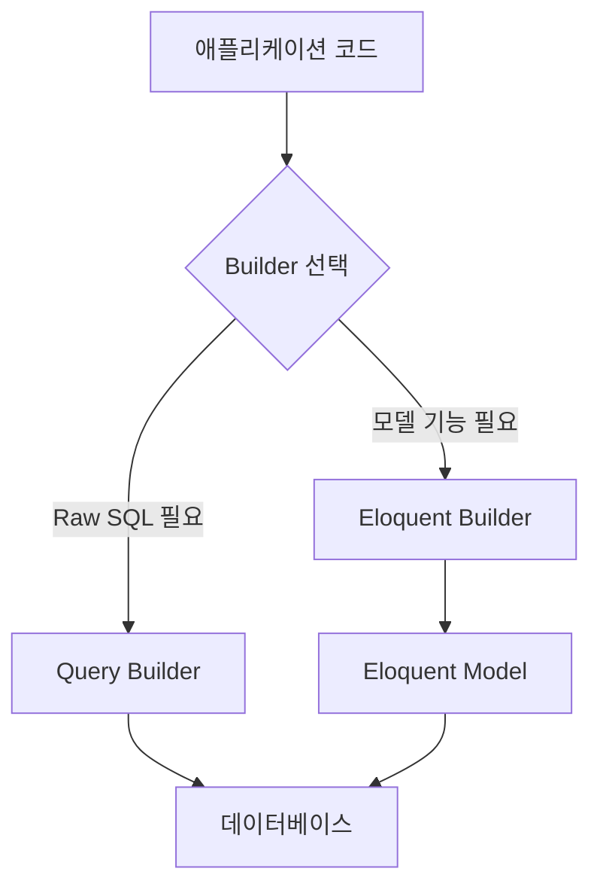
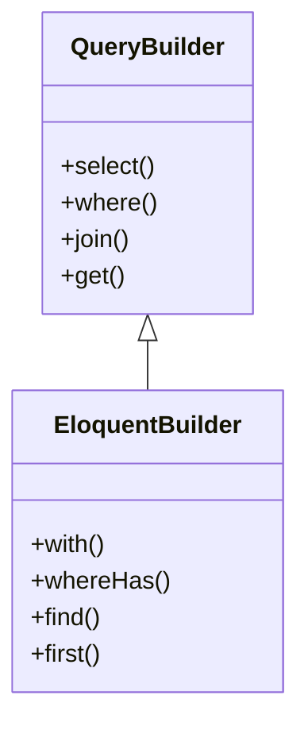

# Query Builder와 Eloquent Builder의 차이점

## 기본 개념
Query Builder와 Eloquent Builder는 Laravel에서 데이터베이스를 다루는 두 가지 핵심적인 도구이다. 이를 식당에 비유하면 다음과 같다:

- Query Builder는 주방에서 직접 요리하는 것과 같다. 재료(데이터)를 직접 다루며 더 세밀한 통제가 가능하다.
- Eloquent Builder는 메뉴(모델)를 통해 주문하는 것과 같다. 편리하지만 약간의 추가 과정이 포함된다.

## 기본 동작 방식

### 아키텍처 구조


### 주요 차이점


> [!info] 
> [[Laravel의 Builder Type 상속 관계]]
## 실제 사용 예시

### 1. 기본적인 조회 작업

```php
// Query Builder 사용
$users = DB::table('users')
    ->select('name', 'email')
    ->where('active', 1)
    ->get();

// Eloquent Builder 사용
$users = User::query()
    ->select('name', 'email')
    ->where('active', 1)
    ->get();
```

### 2. 관계 데이터 조회

```php
// Query Builder - 복잡한 조인 필요
$posts = DB::table('posts')
    ->join('users', 'posts.user_id', '=', 'users.id')
    ->select('posts.*', 'users.name as author_name')
    ->where('posts.active', 1)
    ->get();

// Eloquent Builder - 간단한 관계 정의
$posts = Post::query()
    ->with('author')
    ->where('active', 1)
    ->get();
```

## 고급 활용법

### 1. Query Builder의 최적화된 쿼리

```php
// 대량의 데이터 처리 시 효율적
DB::table('users')
    ->select('id', 'name')
    ->orderBy('id')
    ->chunk(100, function ($users) {
        foreach ($users as $user) {
            // 처리 로직
        }
    });
```

### 2. Eloquent Builder의 고급 기능

```php
// 동적 관계 로딩과 조건부 집계
User::query()
    ->with(['posts' => function ($query) {
        $query->where('active', 1);
    }])
    ->withCount('posts')
    ->having('posts_count', '>', 5)
    ->get();
```

## 성능 고려사항

### Query Builder 사용이 적합한 경우
- 대량의 데이터 처리
- 복잡한 조인이나 서브쿼리
- 메모리 사용 최적화 필요

```php
// 효율적인 대량 데이터 처리
DB::table('large_table')
    ->select('id', 'value')
    ->orderBy('id')
    ->lazy()
    ->each(function ($row) {
        // 처리 로직
    });
```

### Eloquent Builder 사용이 적합한 경우
- 비즈니스 로직이 모델에 포함된 경우
- 모델 이벤트 활용 필요
- 관계 데이터 처리

```php
// 모델 이벤트와 관계 활용
User::query()
    ->with(['posts', 'comments'])
    ->whereHas('posts', function ($query) {
        $query->where('published', true);
    })
    ->get();
```

## 주의사항

### 잘못된 사용 예시

```php
// 잘못된 예시: Eloquent를 사용하면서 불필요한 조인
$users = User::query()
    ->join('posts', 'users.id', '=', 'posts.user_id')
    ->select('users.*')
    ->get();

// 올바른 예시: 관계 활용
$users = User::query()
    ->with('posts')
    ->get();
```

### 성능 관련 주의사항
1. N+1 문제 방지
```php
// 잘못된 예시
$users = User::all();
foreach ($users as $user) {
    $user->posts; // 추가 쿼리 발생
}

// 올바른 예시
$users = User::with('posts')->get();
```

2. 메모리 사용 최적화
```php
// 잘못된 예시
$users = User::all(); // 전체 데이터 로드

// 올바른 예시
User::chunk(100, function ($users) {
    // 처리 로직
});
```

## 결론

### 선택 기준
1. Query Builder 선택 시기:
   - 단순한 CRUD 작업
   - 최적화된 성능 필요
   - 복잡한 SQL 쿼리 필요

2. Eloquent Builder 선택 시기:
   - 비즈니스 로직이 모델에 포함
   - 관계 데이터 처리 필요
   - 모델 이벤트 활용

### 실무 적용 팁
1. 프로젝트 초기에 Builder 선택 기준 수립
2. 성능 요구사항 고려
3. 팀 내 일관성 유지
4. 코드 재사용성 고려

## 참고 자료
- Laravel 공식 문서
- 실제 프로젝트 사례
- 성능 테스트 결과
