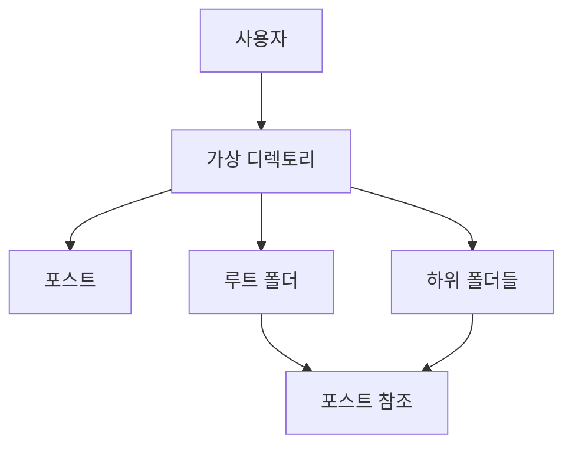
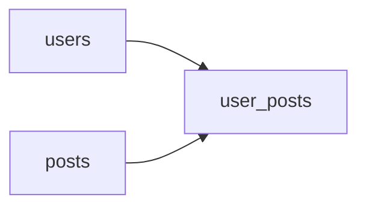

```table-of-contents
title: 
style: nestedList # TOC style (nestedList|nestedOrderedList|inlineFirstLevel)
minLevel: 0 # Include headings from the specified level
maxLevel: 0 # Include headings up to the specified level
includeLinks: true # Make headings clickable
hideWhenEmpty: false # Hide TOC if no headings are found
debugInConsole: false # Print debug info in Obsidian console
```

# 개요
이 문서는 포스트(또는 파일)를 가상 디렉토리로 구성하는 시스템의 구현 가이드를 제공한다. S3나 Google Drive와 같이 실제 디렉토리 구조가 아닌 논리적 구조를 사용하여 구현한다.

# 시스템 아키텍처
## 기본 구조


## 데이터베이스 스키마


# 데이터베이스 설계
## 기본 테이블 구조
```php
// create_user_posts_table.php
use Illuminate\Database\Migrations\Migration;
use Illuminate\Database\Schema\Blueprint;
use Illuminate\Support\Facades\Schema;

return new class extends Migration
{
    public function up()
    {
        Schema::create('user_posts', function (Blueprint $table) {
            $table->id();
            $table->foreignId('user_id')->constrained()->onDelete('cascade');
            $table->foreignId('post_id')->constrained()->onDelete('cascade');
            // 전체 경로 (예: /favorites/tech/ai)
            $table->string('path')->default('/');
            // 표시 이름 (옵션)
            $table->string('display_name')->nullable();
            $table->timestamps();
            
            // 인덱스 및 제약조건
            $table->unique(['user_id', 'path', 'post_id']);
            $table->index(['user_id', 'path']);
            $table->index(['path'], 'path_index');
        });
    }

    public function down()
    {
        Schema::dropIfExists('user_posts');
    }
};
```

# 핵심 컴포넌트 구현
## 1. 모델 정의
```php
class UserPost extends Model
{
    protected $fillable = ['user_id', 'post_id', 'path', 'display_name'];
    
    // 경로 관련 헬퍼 메서드
    public function getParentPath(): string
    {
        return dirname($this->path);
    }
    
    public function getDepth(): int
    {
        return substr_count($this->path, '/') - 1;
    }
    
    // 관계 정의
    public function post()
    {
        return $this->belongsTo(Post::class)
            ->select(['id', 'title', 'slug']); // 성능 최적화
    }
}
```

## 2. 저장소 클래스
```php
class UserPostRepository
{
    const MAX_DEPTH = 5;
    const MAX_ITEMS_PER_FOLDER = 1000;

    public function getFolderContents(int $userId, string $path, int $perPage = 50)
    {
        // 캐시 키 생성
        $cacheKey = "folder_contents:{$userId}:{$path}";
        
        return Cache::remember($cacheKey, now()->addMinutes(5), function() 
            use ($userId, $path, $perPage) {
            // 현재 경로의 포스트 조회
            $posts = UserPost::query()
                ->where('user_id', $userId)
                ->where('path', $path)
                ->with('post')
                ->latest()
                ->paginate($perPage);
                
            // 직계 하위 폴더 조회
            $subfolders = UserPost::query()
                ->where('user_id', $userId)
                ->where('path', 'like', $path . '/%')
                ->whereRaw('path NOT LIKE ?', [$path . '/%/%'])
                ->select(DB::raw('DISTINCT SUBSTRING_INDEX(path, "/", -1) as name'))
                ->limit(100)
                ->get();
                
            return [
                'posts' => $posts,
                'folders' => $subfolders
            ];
        });
    }

    public function addPostToFolder(int $userId, int $postId, string $path)
    {
        // 경로 깊이 검증
        if ($this->getPathDepth($path) > self::MAX_DEPTH) {
            throw new MaxDepthExceededException();
        }
        
        // 폴더 내 항목 수 검증
        if ($this->getFolderItemCount($userId, $path) >= self::MAX_ITEMS_PER_FOLDER) {
            throw new FolderLimitExceededException();
        }
        
        // 포스트 추가
        $userPost = UserPost::create([
            'user_id' => $userId,
            'post_id' => $postId,
            'path' => $path
        ]);
        
        // 캐시 무효화
        $this->invalidateFolderCache($userId, $path);
        
        return $userPost;
    }

    private function invalidateFolderCache(int $userId, string $path)
    {
        // 현재 경로 캐시 삭제
        Cache::forget("folder_contents:{$userId}:{$path}");
        
        // 상위 경로들의 캐시도 삭제
        $parentPath = dirname($path);
        while ($parentPath !== '/') {
            Cache::forget("folder_contents:{$userId}:{$parentPath}");
            $parentPath = dirname($parentPath);
        }
    }
}
```

## 3. 서비스 클래스
```php
class FolderService
{
    private $repository;
    private $performanceMonitor;

    public function __construct(
        UserPostRepository $repository,
        FolderPerformanceMonitor $performanceMonitor
    ) {
        $this->repository = $repository;
        $this->performanceMonitor = $performanceMonitor;
    }

    public function moveItems(int $userId, string $sourcePath, string $targetPath)
    {
        DB::beginTransaction();
        
        try {
            $startTime = microtime(true);
            
            // 이동할 항목들 조회
            UserPost::where('user_id', $userId)
                ->where('path', 'like', $sourcePath . '%')
                ->chunkById(1000, function ($posts) use ($sourcePath, $targetPath) {
                    foreach ($posts as $post) {
                        $newPath = str_replace($sourcePath, $targetPath, $post->path);
                        $post->update(['path' => $newPath]);
                    }
                });
            
            DB::commit();
            
            // 성능 모니터링
            $duration = microtime(true) - $startTime;
            $this->performanceMonitor->logOperation('move', $duration, [
                'source' => $sourcePath,
                'target' => $targetPath
            ]);
            
        } catch (\Exception $e) {
            DB::rollBack();
            throw $e;
        }
    }
}
```

# API 엔드포인트
## 1. 컨트롤러
```php
class FolderController extends Controller
{
    private $service;
    
    public function __construct(FolderService $service)
    {
        $this->service = $service;
    }

    public function show(Request $request, string $path = '/')
    {
        $contents = $this->service->getFolderContents(
            auth()->id(), 
            $path, 
            $request->get('per_page', 50)
        );
        
        return response()->json([
            'path' => $path,
            'breadcrumbs' => $this->getBreadcrumbs($path),
            'contents' => $contents
        ]);
    }

    private function getBreadcrumbs(string $path)
    {
        $parts = explode('/', trim($path, '/'));
        $breadcrumbs = [];
        $currentPath = '';
        
        foreach ($parts as $part) {
            $currentPath .= '/' . $part;
            $breadcrumbs[] = [
                'name' => $part,
                'path' => $currentPath
            ];
        }
        
        return $breadcrumbs;
    }
}
```

# 성능 최적화
## 1. 인덱스 최적화
- 복합 인덱스 활용
- 조회 패턴에 맞는 인덱스 설계

## 2. 캐싱 전략
- 폴더 내용 캐싱
- 계층 구조 캐싱
- 적절한 캐시 무효화

## 3. 데이터 제한
- 폴더 깊이 제한
- 폴더당 항목 수 제한
- 사용자당 총 폴더 수 제한

## 4. 비동기 처리
- 대량 이동/복사 작업
- 백그라운드 정리 작업

# 모니터링과 유지보수
## 1. 성능 모니터링
```php
class FolderPerformanceMonitor
{
    public function logOperation(string $operation, float $duration, array $context = [])
    {
        if ($duration > 1.0) {  // 1초 이상 소요된 작업
            Log::warning("Slow folder operation: {$operation}", [
                'duration' => $duration,
                'context' => $context,
                'user_id' => auth()->id()
            ]);
        }
    }
}
```

## 2. 정기적인 유지보수
- 고아 레코드 정리
- 빈 폴더 정리
- 캐시 정리

# 결론
이러한 가상 디렉토리 시스템은 다음과 같은 이점을 제공한다:
1. 효율적인 저장 구조
2. 유연한 구조 변경
3. 높은 확장성
4. 성능 최적화 용이

주의할 점:
1. 경로 문자열 처리 주의
2. 적절한 제한 설정
3. 캐시 전략 수립
4. 성능 모니터링

이러한 가이드라인을 따르면서 실제 서비스의 요구사항에 맞게 조정하여 구현하면 된다.


# 보충할 내용

## 예외 처리 부분이 부족
```php
// Custom Exceptions
class FolderException extends Exception {}
class MaxDepthExceededException extends FolderException {}
class FolderLimitExceededException extends FolderException {}
class DuplicateEntryException extends FolderException {}
class InvalidPathException extends FolderException {}
```

## 경로 검증 로직이 필요
```php
class PathValidator
{
    public function validate(string $path): void
    {
        // 경로 형식 검증
        if (!preg_match('/^\/[\w\-\/]*$/', $path)) {
            throw new InvalidPathException('Invalid path format');
        }

        // 상대 경로 참조 방지 (.., .)
        if (strpos($path, '..') !== false || strpos($path, './') !== false) {
            throw new InvalidPathException('Path contains invalid references');
        }

        // 중복 슬래시 검사
        if (strpos($path, '//') !== false) {
            throw new InvalidPathException('Path contains consecutive slashes');
        }
    }
}
```

## 동시성 제어가 필요할 수 있음
```php
class FolderService
{
    public function moveItems(int $userId, string $sourcePath, string $targetPath)
    {
        $lockKey = "folder_lock:{$userId}:{$sourcePath}";
        
        return Cache::lock($lockKey, 10)->block(5, function () use ($userId, $sourcePath, $targetPath) {
            // 기존 이동 로직...
        });
    }
}
```

## API 응답 형식의 표준화가 필요
```php
return response()->json([
    'status' => 'success',
    'data' => [
        'path' => $path,
        'breadcrumbs' => $breadcrumbs,
        'contents' => [
            'folders' => $folders->map(fn($f) => [
                'name' => $f->name,
                'path' => $f->path,
                'item_count' => $f->item_count,
                'created_at' => $f->created_at->toISOString()
            ]),
            'posts' => $posts->map(fn($p) => [
                'id' => $p->id,
                'title' => $p->title,
                'path' => $p->path,
                'created_at' => $p->created_at->toISOString()
            ])
        ],
        'meta' => [
            'total_items' => $total,
            'current_page' => $currentPage,
            'per_page' => $perPage
        ]
    ]
], 200);
```

## 테스트 케이스도 추가
```php
class FolderServiceTest extends TestCase
{
    /** @test */
    public function it_prevents_exceeding_maximum_depth()
    {
        $this->expectException(MaxDepthExceededException::class);
        
        $deep_path = '/1/2/3/4/5/6';  // MAX_DEPTH + 1
        $this->folderService->addPostToFolder(
            $this->user->id,
            $this->post->id,
            $deep_path
        );
    }
}
```

## 이벤트와 리스너
```php
class FolderEvents
{
    public static function postMoved($userId, $postId, $oldPath, $newPath)
    {
        event(new PostMovedEvent($userId, $postId, $oldPath, $newPath));
    }
}

class PostMovedEvent
{
    public $userId;
    public $postId;
    public $oldPath;
    public $newPath;
    
    public function __construct($userId, $postId, $oldPath, $newPath)
    {
        $this->userId = $userId;
        $this->postId = $postId;
        $this->oldPath = $oldPath;
        $this->newPath = $newPath;
    }
}
```

## 부모 폴더 자동 생성 기능
```php
class FolderService
{
    private function ensureParentFoldersExist(int $userId, string $path)
    {
        $parts = explode('/', trim($path, '/'));
        $currentPath = '';
        
        foreach ($parts as $part) {
            $currentPath .= '/' . $part;
            
            // 이미 존재하는지 확인
            if (!$this->folderExists($userId, $currentPath)) {
                $this->createFolder($userId, $currentPath);
            }
        }
    }
}
```

## 대량 작업을 위한 Job 클래스
```php
class BulkFolderOperation implements ShouldQueue
{
    use Dispatchable, InteractsWithQueue, Queueable, SerializesModels;
    
    private $userId;
    private $sourcePath;
    private $targetPath;
    
    public function handle()
    {
        UserPost::where('user_id', $this->userId)
            ->where('path', 'like', $this->sourcePath . '%')
            ->chunkById(1000, function ($posts) {
                foreach ($posts as $post) {
                    // 개별 처리 로직
                }
            });
    }
}
```
