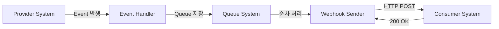
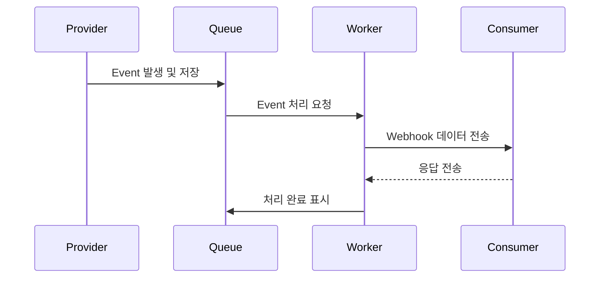

# 개념 설명
Webhook은 실시간 데이터 전송을 위한 HTTP 기반 Protocol이다. 마치 택배 배송 알림 시스템처럼 작동한다. 택배 기사가 물건을 배달할 때마다 시스템이 자동으로 수령인에게 알림을 보내는 것처럼, Webhook은 특정 이벤트 발생 시 지정된 URL로 데이터를 자동 전송한다.

## 발전 과정
1. Traditional Polling: 주기적으로 서버에 데이터 요청
2. Long Polling: 요청을 유지하며 데이터 대기
3. WebSocket: 양방향 실시간 통신
4. Webhook: 이벤트 기반 단방향 통신

# 기본 동작 방식

## System Architecture


## Process Flow


# 실제 사용 예시

## 환경 설정
```php
// config/webhook.php
return [
    'queue' => 'webhook',
    'timeout' => 30,
    'retry_count' => 3,
    'retry_delay' => 60,
    'signature_header' => 'X-Webhook-Signature',
];
```

## 잘못된 구현 예시
```php
// 잘못된 예시: 동기 처리
public function sendWebhook($url, $data)
{
    return Http::post($url, $data);  // 동기 처리로 인한 성능 저하
}
```

## 올바른 구현 예시
```php
// 올바른 예시: 비동기 처리
public function sendWebhook($url, $data)
{
    SendWebhookJob::dispatch($url, $data)
        ->onQueue(config('webhook.queue'));
}
```

## 단계별 구현 과정

### 1단계: 기본 구조 설정
```php
// app/Models/Webhook.php
class Webhook extends Model
{
    protected $fillable = ['url', 'secret', 'active'];
    
    // Webhook 엔드포인트 상태 확인
    public function isActive(): bool
    {
        return $this->active;
    }
}
```

### 2단계: Event 처리
```php
// app/Events/WebhookEvent.php
class WebhookEvent
{
    public $data;
    
    public function __construct(array $data)
    {
        $this->data = $data;
    }
}
```

### 3단계: Job 구현
```php
// app/Jobs/ProcessWebhookJob.php
class ProcessWebhookJob implements ShouldQueue
{
    use Dispatchable, InteractsWithQueue, Queueable, SerializesModels;
    
    private $url;
    private $data;
    
    /**
     * @param string $url Webhook 수신 URL
     * @param array $data 전송할 데이터
     */
    public function __construct(string $url, array $data)
    {
        $this->url = $url;
        $this->data = $data;
    }
    
    public function handle()
    {
        // 재시도 정책 설정
        $this->tries = config('webhook.retry_count');
        $this->backoff = config('webhook.retry_delay');
        
        // 데이터 전송
        $response = Http::timeout(config('webhook.timeout'))
            ->post($this->url, $this->data);
            
        // 응답 확인
        if (!$response->successful()) {
            throw new WebhookFailedException(
                "Webhook 전송 실패: {$response->status()}"
            );
        }
    }
}
```

# 고급 활용법

## 서명 검증 구현
```php
// app/Services/WebhookService.php
class WebhookService
{
    public function generateSignature(array $data, string $secret): string
    {
        return hash_hmac('sha256', json_encode($data), $secret);
    }
    
    public function verifySignature(string $signature, array $data, string $secret): bool
    {
        $expectedSignature = $this->generateSignature($data, $secret);
        return hash_equals($expectedSignature, $signature);
    }
}
```

## 테스트 방법
```php
// tests/Feature/WebhookTest.php
class WebhookTest extends TestCase
{
    /** @test */
    public function webhook_sends_correct_data()
    {
        Http::fake([
            '*' => Http::response(['status' => 'ok'], 200)
        ]);
        
        $webhook = Webhook::factory()->create();
        $data = ['event' => 'test'];
        
        ProcessWebhookJob::dispatch($webhook->url, $data);
        
        Http::assertSent(function ($request) use ($data) {
            return $request['event'] === 'test';
        });
    }
}
```

# 주의사항

## Security 고려사항
- HTTPS Protocol 사용 필수
- 서명 검증 구현 필수
- Rate Limiting 적용
- IP 제한 설정

## Performance 고려사항
- Queue Worker 수 최적화
- Timeout 설정 관리
- Batch Processing 구현
- Monitoring System 구축

# 결론
Webhook은 시스템 간 효율적인 데이터 전송을 가능하게 하는 강력한 도구다. Laravel의 Queue, Event, Job 시스템과 결합하여 안정적이고 확장 가능한 구현이 가능하다.

# 추가 학습을 위한 질문들
1. Webhook과 WebSocket의 차이점은 무엇인가?
2. 어떤 상황에서 Polling 대신 Webhook을 사용해야 하는가?
3. Webhook의 보안을 더욱 강화할 수 있는 방법은 무엇인가?
4. 대량의 Webhook 처리 시 발생할 수 있는 문제점과 해결 방안은?