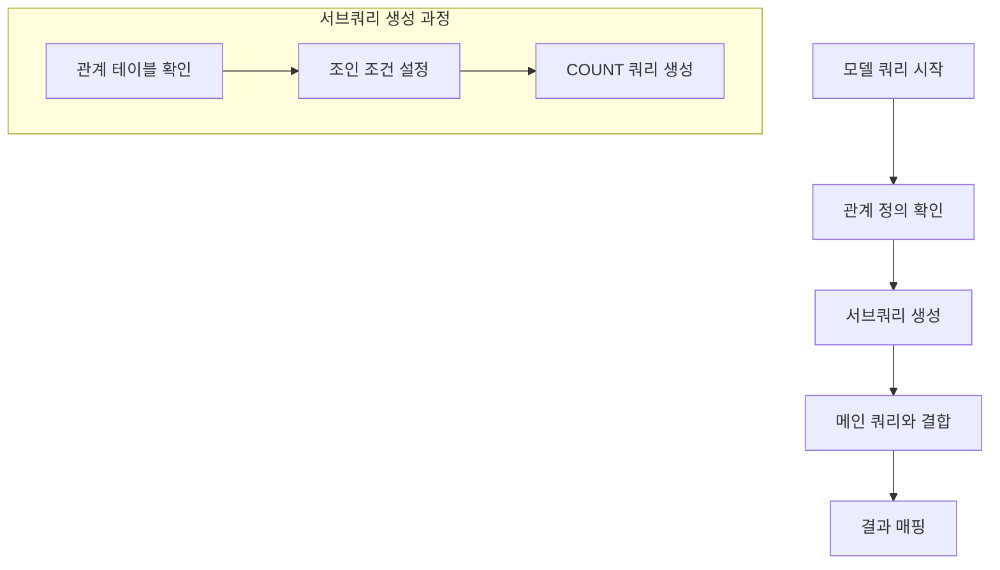

withCount는 Eloquent ORM에서 관계형 데이터의 개수를 효율적으로 조회하는 메서드이다. 연관된 데이터의 수를 단일 쿼리로 조회할 수 있다.

## 기술적 배경
- ORM (Object Relational Mapping)
- Query Builder
- Database Relationship
- Subquery

## 기본 동작 방식

### 내부 쿼리 생성 과정


## 실제 생성되는 SQL

### 1. 기본 withCount
```php
// PHP 코드
$categories = Category::withCount('products')->get();

// 생성되는 SQL
SELECT 
    categories.*,
    (
        SELECT COUNT(*) 
        FROM products 
        WHERE categories.id = products.category_id
    ) as products_count 
FROM categories;
```

### 2. 조건부 withCount
```php
// PHP 코드
$categories = Category::withCount([
    'products' => function($query) {
        $query->where('status', 'active');
    }
])->get();

// 생성되는 SQL
SELECT 
    categories.*,
    (
        SELECT COUNT(*) 
        FROM products 
        WHERE categories.id = products.category_id 
        AND status = 'active'
    ) as products_count 
FROM categories;
```

## 실제 사용 예시

```php
// 모델 정의
class Category extends Model
{
    protected $table = 'categories';
    
    public function products()
    {
        return $this->hasMany(Product::class);
    }
}

// 구현 코드
$categories = Category::withCount([
    'products',                              // 전체 상품 수
    'products as active_products_count'      // 활성 상품 수
        => function($query) {
            $query->where('status', 'active');
        }
    ])
    ->having('products_count', '>', 0)       // 상품이 있는 카테고리만
    ->orderBy('active_products_count', 'desc')// 활성 상품 수 기준 정렬
    ->get();

// 생성되는 SQL
SELECT 
    categories.*,
    (SELECT COUNT(*) FROM products WHERE categories.id = products.category_id) as products_count,
    (
        SELECT COUNT(*) 
        FROM products 
        WHERE categories.id = products.category_id 
        AND status = 'active'
    ) as active_products_count
FROM categories
HAVING products_count > 0
ORDER BY active_products_count DESC;
```


## 고급 활용법

### 1. 다중 관계 카운트
```php
// 여러 관계의 개수를 동시에 조회
$posts = Post::withCount([
    'comments',
    'likes',
    'shares'
])->get();

// 생성되는 SQL
SELECT 
    posts.*,
    (SELECT COUNT(*) FROM comments WHERE posts.id = comments.post_id) as comments_count,
    (SELECT COUNT(*) FROM likes WHERE posts.id = likes.post_id) as likes_count,
    (SELECT COUNT(*) FROM shares WHERE posts.id = shares.post_id) as shares_count
FROM posts;
```

### 2. 조건부 집계
```php
$posts = Post::withCount([
    'comments',
    'comments as pending_comments_count' => function($query) {
        $query->where('status', 'pending');
    }
])->get();
```

## 성능 최적화

### 1. 분석하기
```sql
EXPLAIN SELECT 
    posts.*,
    (SELECT COUNT(*) FROM comments WHERE posts.id = comments.post_id) as comments_count
FROM posts;
```

### 2. 인덱스 최적화
```sql
-- 관계 테이블에 인덱스 생성
CREATE INDEX idx_comments_post_id ON comments(post_id);
CREATE INDEX idx_comments_status_post_id ON comments(status, post_id);
```

## 문제 해결

### 1. N+1 문제
```php
// 문제 상황
foreach (Category::all() as $category) {
    echo $category->products()->count(); // 각 반복마다 추가 쿼리 실행
}

// 해결 방안
$categories = Category::withCount('products')->get();
foreach ($categories as $category) {
    echo $category->products_count; // 추가 쿼리 없음
}
```

### 2. 메모리 사용량 최적화
```php
// 대량 데이터 처리
Category::withCount('products')
    ->chunk(100, function($categories) {
        foreach ($categories as $category) {
            // 처리 로직
        }
    });
```