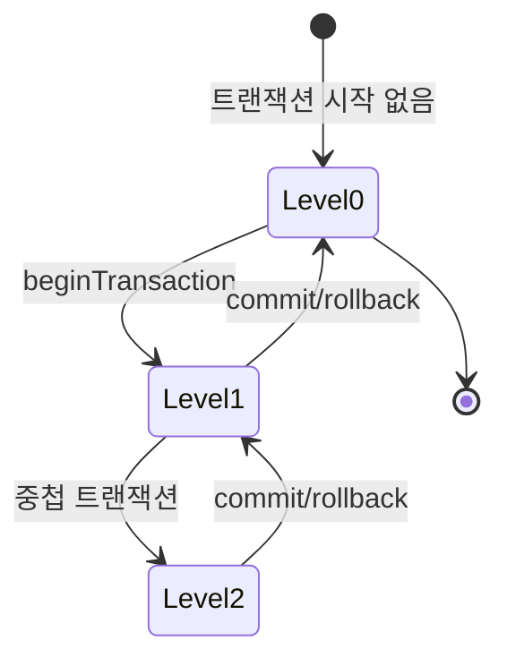
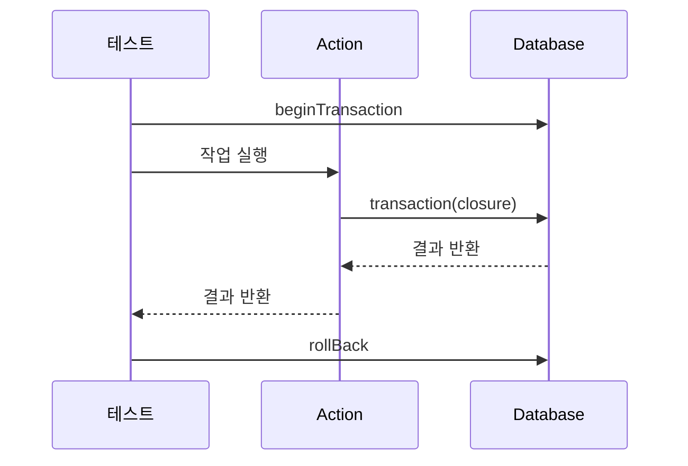

# 트랜잭션 테스트의 이해

트랜잭션 테스트는 마치 은행 송금과 같습니다. 송금 과정에서 출금과 입금이 모두 성공하거나, 하나라도 실패하면 모두 취소되어야 합니다. 이처럼 여러 데이터베이스 작업이 하나의 단위로 처리되어야 할 때, 그 동작을 검증하는 것이 트랜잭션 테스트입니다.

# 트랜잭션 테스트의 기본 동작

## 트랜잭션 레벨의 이해
트랜잭션은 중첩될 수 있으며, 각 레벨은 다음과 같이 동작합니다:



## 기본 테스트 구조

```php
// 1. 트랜잭션 컨텍스트 설정
DB::beginTransaction();

// 2. 현재 트랜잭션 레벨 확인
$currentLevel = DB::transactionLevel();

// 3. 테스트 대상 실행
$result = executeOperation();

// 4. 트랜잭션 레벨 검증
expect(DB::transactionLevel())->toBe($currentLevel);

// 5. 정리
DB::rollBack();
```

# 실제 사용 예시

## 기본적인 트랜잭션 테스트
```php
test('트랜잭션 내 모든 작업이 함께 처리된다', function () {
    // 준비
    $post = Post::factory()->create();
    $originalContent = $post->content;
    
    // 실행
    try {
        DB::beginTransaction();
        
        $post->update(['content' => '새로운 내용']);
        throw new Exception('강제 실패');
        
        DB::commit();
    } catch (Exception $e) {
        DB::rollBack();
    }
    
    // 검증
    expect($post->fresh()->content)->toBe($originalContent);
});
```

## 중첩 트랜잭션 테스트
```php
test('중첩 트랜잭션이 올바르게 처리된다', function () {
    // 준비
    DB::beginTransaction();
    $outerLevel = DB::transactionLevel();
    
    // 실행
    UpdatePostAction::run($post, $updateData);
    
    // 검증
    expect(DB::transactionLevel())
        ->toBe($outerLevel)
        ->and($post->fresh())
        ->toBeInstanceOf(Post::class);
        
    DB::rollBack();
});
```

# 고급 활용법

## 트랜잭션 레벨 모니터링


## 실패 시나리오 테스트
```php
test('부분 실패 시 전체가 롤백된다', function () {
    // 준비
    $post = Post::factory()->create();
    $files = [
        UploadedFile::fake()->image('test1.jpg'),
        UploadedFile::fake()->image('test2.jpg')
    ];
    
    // 실행 및 검증
    expect(fn () => 
        DB::transaction(function () use ($post, $files) {
            $post->update(['content' => '새 내용']);
            $post->attachFiles($files);
            throw new Exception('강제 실패');
        })
    )->toThrow(Exception::class);
    
    // 모든 변경사항 롤백 확인
    expect($post->fresh()->content)
        ->toBe($post->content)
        ->and($post->files)
        ->toHaveCount(0);
});
```

# 주의사항

1. 트랜잭션 누수 방지
   - 테스트 종료 시 반드시 트랜잭션 정리
   - 중첩 레벨 일치 확인

2. 데이터베이스 정합성
   - 테스트 전후 상태 검증
   - 부분 실패 시나리오 고려

3. 성능 고려사항
   - 불필요한 트랜잭션 중첩 방지
   - 테스트 격리 수준 적절히 설정

# 보안 고려사항

1. 권한 검증
```php
test('권한이 없는 사용자의 트랜잭션이 거부된다', function () {
    $this->actingAs($unauthorizedUser);
    
    expect(fn () => UpdatePostAction::run($post, $data))
        ->toThrow(AuthorizationException::class);
});
```

2. 데이터 접근 제어
```php
test('민감한 데이터가 트랜잭션 롤백으로 보호된다', function () {
    DB::beginTransaction();
    
    $post->update(['sensitive_data' => 'secret']);
    DB::rollBack();
    
    expect($post->fresh()->sensitive_data)->toBeNull();
});
```

# 결론

트랜잭션 테스트는 데이터 정합성을 보장하는 핵심 요소입니다. 올바른 테스트 작성을 통해:
- 데이터 일관성 보장
- 실패 시나리오 대응
- 안전한 데이터 처리
- 신뢰성 있는 애플리케이션 운영

을 달성할 수 있습니다.