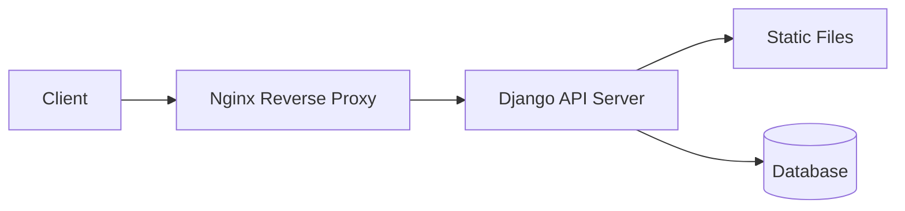

Django API 서버 프로덕션 배포 가이드

# 개요
이 가이드는 Django API 서버를 Docker와 Nginx를 사용하여 프로덕션 환경에 배포하는 전체 과정을 다룹니다.

# 시스템 아키텍처


# Django 설정

## URL 구성
Django 프로젝트의 URLs를 설정하여 admin과 API 엔드포인트를 노출합니다.

```python
from django.urls import path
from django.contrib import admin
from .api import api

urlpatterns = [
    path("admin/", admin.site.urls),  # Django Admin 인터페이스
    path("api/", api.urls),           # API 엔드포인트
]
```

## 정적 파일 설정
Django의 정적 파일 처리를 위한 settings.py 구성:

```python
# 정적 파일의 URL 접두사
STATIC_URL = "/static/"

# collectstatic 명령어로 파일이 모이는 디렉토리
STATIC_ROOT = BASE_DIR / "static"

# 개발 환경에서 추가 정적 파일 디렉토리 (선택사항)
STATICFILES_DIRS = [
    BASE_DIR / "assets",
]
```

# Docker 구성

## Dockerfile
```dockerfile
# Python 베이스 이미지
FROM python:3.9-slim

# 작업 디렉토리 설정
WORKDIR /code

# 시스템 의존성 설치
RUN apt-get update && apt-get install -y \
    postgresql-client \
    && rm -rf /var/lib/apt/lists/*

# Python 패키지 설치
COPY requirements.txt .
RUN pip install --no-cache-dir -r requirements.txt

# 보안을 위한 비root 사용자 생성
RUN useradd -m django-user
USER django-user

# 프로젝트 파일 복사 (권한 유지)
COPY --chown=django-user:django-user . /code
RUN chown -R django-user /code

# 서버 실행
CMD ["gunicorn", "config.wsgi:application", "--bind", "0.0.0.0:8000"]
```

## Docker Compose
```yaml
version: '3.8'

services:
  backend:
    build: .
    volumes:
      - static:/code/static
    environment:
      - DEBUG=0
      - DATABASE_URL=postgres://user:password@db/dbname
    depends_on:
      - db
    
  nginx:
    image: nginx:alpine
    volumes:
      - static:/code/static
      - ./nginx.conf:/etc/nginx/conf.d/default.conf
    ports:
      - "80:80"
    depends_on:
      - backend

  db:
    image: postgres:13
    volumes:
      - postgres_data:/var/lib/postgresql/data
    environment:
      - POSTGRES_DB=dbname
      - POSTGRES_USER=user
      - POSTGRES_PASSWORD=password

volumes:
  static:
  postgres_data:
```

# Nginx 설정

## 개발 환경 설정
```nginx
server {
    listen 80;
    server_name localhost;

    # backend urls
    location ~ ^/(admin|api|static) {
        proxy_redirect off;
        proxy_pass http://backend;
        proxy_set_header X-Forwarded-For $proxy_add_x_forwarded_for;
        proxy_set_header Host $http_host;
    }
}
```

## 프로덕션 환경 설정
```nginx
server {
    listen 80;
    server_name example.com;

    # API 및 Admin 요청 프록시
    location ~ ^/(admin|api) {
        proxy_redirect off;
        proxy_pass http://backend;
        proxy_set_header X-Forwarded-For $proxy_add_x_forwarded_for;
        proxy_set_header Host $http_host;
        proxy_set_header X-Real-IP $remote_addr;
    }

    # 정적 파일 처리
    location /static {
        autoindex off;
        alias /code/static/;
        
        # 캐시 설정
        location ~* \.(?:ico|css|js|gif|jpe?g|png)$ {
            expires max;
            add_header Pragma public;
            add_header Cache-Control "public, must-revalidate, proxy-revalidate";
        }
    }

    # 보안 헤더
    add_header X-Frame-Options "SAMEORIGIN" always;
    add_header X-XSS-Protection "1; mode=block" always;
    add_header X-Content-Type-Options "nosniff" always;
}
```

# 배포 프로세스

1. 정적 파일 수집
```bash
python manage.py collectstatic --no-input
```

2. 마이그레이션 실행
```bash
python manage.py migrate
```

3. 컨테이너 실행
```bash
docker-compose up -d
```

# 성능 최적화

## Django 설정
- `DEBUG = False` 설정
- 캐시 설정 활성화
- 데이터베이스 커넥션 풀링 사용

## Nginx 최적화
- Worker 프로세스 조정
- Gzip 압축 활성화
- 캐시 헤더 설정
- Keep-alive 연결 설정

# 보안 고려사항

1. 환경 변수 사용
   - 민감한 정보는 `.env` 파일이나 환경 변수로 관리
   - `SECRET_KEY`, 데이터베이스 자격증명 등

2. HTTPS 설정
   - SSL/TLS 인증서 적용
   - Let's Encrypt 활용

3. 보안 헤더 설정
   - CORS 설정
   - XSS 방지
   - CSRF 보호

# 모니터링

1. 로깅 설정
```python
LOGGING = {
    'version': 1,
    'disable_existing_loggers': False,
    'handlers': {
        'file': {
            'level': 'INFO',
            'class': 'logging.FileHandler',
            'filename': '/var/log/django.log',
        },
    },
    'loggers': {
        'django': {
            'handlers': ['file'],
            'level': 'INFO',
            'propagate': True,
        },
    },
}
```

2. 모니터링 도구
   - Prometheus + Grafana
   - Sentry for error tracking
   - ELK Stack for log management

# 문제 해결

## 일반적인 문제

1. 정적 파일 404
   - `collectstatic` 명령어 실행 확인
   - 볼륨 마운트 확인
   - 파일 권한 확인

2. 데이터베이스 연결 실패
   - 환경 변수 확인
   - 네트워크 설정 확인
   - 데이터베이스 자격증명 확인

3. 메모리 문제
   - Gunicorn worker 수 조정
   - 데이터베이스 커넥션 풀 크기 최적화

# 결론

Django API 서버의 성공적인 배포를 위해서는 다음 사항들을 특히 주의해야 합니다:

1. 보안 설정 철저
2. 성능 최적화
3. 모니터링 체계 구축
4. 백업 전략 수립
5. 스케일링 계획 수립

정기적인 업데이트와 모니터링을 통해 서비스의 안정성을 유지하고, 문제 발생 시 신속한 대응이 가능하도록 준비해야 합니다.