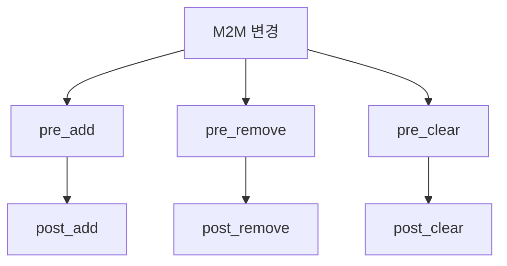

Django Many-to-Many 관계 구현과 최적화 가이드

# Many-to-Many 모델 구현하기

## 기본 구조
Many-to-Many 관계는 두 모델 간의 다대다 관계를 표현합니다. 예를 들어, 한 책은 여러 저자를 가질 수 있고, 한 저자는 여러 책을 쓸 수 있습니다.

```python
from django.db import models

class Author(models.Model):
    name = models.CharField(max_length=100)

class Book(models.Model):
    title = models.CharField(max_length=100)
    authors = models.ManyToManyField(
        Author,
        through="Authorship",
        related_name="books"
    )

class Authorship(models.Model):
    author = models.ForeignKey(Author, on_delete=models.CASCADE)
    book = models.ForeignKey(Book, on_delete=models.CASCADE)
    contribution = models.CharField(max_length=100)
    date_joined = models.DateField()
```

## 주요 키워드 설명

1. `through`:
   - 중개 테이블 모델을 지정합니다
   - 추가 필드가 필요한 경우 사용합니다
   - 관계에 대한 메타데이터를 저장할 수 있습니다

2. `related_name`:
   - 역방향 관계 참조 이름을 설정합니다
   - `author.books.all()`과 같은 방식으로 접근 가능합니다

# 쿼리 최적화

## 기본 쿼리와 최적화
```python
# 기본 쿼리 - N+1 문제 발생
author = Author.objects.get(id=1)
books = author.books.all()  # 추가 쿼리 발생

# 최적화된 쿼리
author = Author.objects.prefetch_related("books").get(id=1)
books = author.books.all()  # 캐시된 데이터 사용
```

## 복잡한 쿼리 최적화
```python
# 중개 테이블 데이터도 함께 가져오기
authors = Author.objects.prefetch_related(
    models.Prefetch(
        'books',
        queryset=Book.objects.select_related('authorship')
    )
).all()
```

# 시그널 구현

## 기본 시그널 설정
```python
from django.db.models.signals import m2m_changed
from django.dispatch import receiver

@receiver(m2m_changed, sender=Book.authors.through)
def authors_changed(sender, instance, action, reverse, model, pk_set, **kwargs):
    if action == "post_add":
        handle_authors_added(instance, pk_set)
    elif action == "post_remove":
        handle_authors_removed(instance, pk_set)
    elif action == "post_clear":
        handle_authors_cleared(instance)

def handle_authors_added(book, author_ids):
    """저자가 추가되었을 때의 처리"""
    print(f"새로운 저자가 {book.title}에 추가됨: {author_ids}")

def handle_authors_removed(book, author_ids):
    """저자가 제거되었을 때의 처리"""
    print(f"저자가 {book.title}에서 제거됨: {author_ids}")

def handle_authors_cleared(book):
    """모든 저자가 제거되었을 때의 처리"""
    print(f"{book.title}의 모든 저자가 제거됨")
```

## 시그널 액션 종류


# 실제 사용 예시

## 1. 기본적인 관계 관리
```python
# 저자와 책 생성
author = Author.objects.create(name="홍길동")
book = Book.objects.create(title="전래동화")

# 관계 추가
Authorship.objects.create(
    author=author,
    book=book,
    contribution="주저자",
    date_joined="2024-01-01"
)

# 관계 조회
author.books.all()
book.authors.all()
```

## 2. 시그널을 활용한 이벤트 처리
```python
@receiver(m2m_changed, sender=Book.authors.through)
def update_book_status(sender, instance, action, **kwargs):
    if action == "post_add":
        instance.status = "저자 할당됨"
    elif action == "post_clear":
        instance.status = "저자 미할당"
    instance.save()
```

# 주의사항

## 1. 성능 관련
- 대량의 데이터 처리 시 주의가 필요합니다
```python
# 좋지 않은 예
for author in authors:
    book.authors.add(author)  # 각각의 add마다 시그널 발생

# 좋은 예
book.authors.add(*authors)  # 한 번의 시그널로 처리
```

## 2. 시그널 사용 시
- 순환 참조를 주의해야 합니다
- 시그널 핸들러는 가능한 가벼운 작업만 수행합니다

## 3. 데이터베이스 부하
```python
# 비효율적인 방식
for book in books:
    authors = book.authors.all()  # N+1 쿼리 발생

# 효율적인 방식
books = Book.objects.prefetch_related('authors').all()
for book in books:
    authors = book.authors.all()  # 캐시된 데이터 사용
```

# 결론

Many-to-Many 관계 구현 시 고려사항:
1. 적절한 중개 테이블 설계
2. 효율적인 쿼리 최적화
3. 시그널의 적절한 활용
4. 성능과 유지보수성 균형

이러한 요소들을 고려하여 효율적인 Many-to-Many 관계를 구현할 수 있습니다.