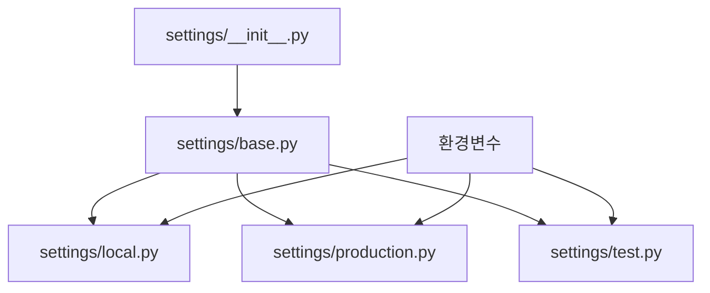

# 개념 설명
Django에서 설정 파일을 분리하는 것은 마치 사무실의 서류 정리 시스템과 같다. 모든 서류를 한 서랍에 넣는 대신, 용도별로 다른 서랍에 정리하면 관리와 찾기가 쉬워진다. Laravel의 config 디렉터리처럼 Django에서도 설정을 목적별로 분리하여 관리할 수 있다.

# 기본 동작 방식



# 실제 사용 예시

## 잘못된 구현 예시
```python
# settings.py (잘못된 예시)
# 모든 설정을 하나의 파일에 관리
DEBUG = True
DATABASES = {
    'default': {
        'ENGINE': 'django.db.backends.postgresql',
        'NAME': 'mydatabase',
        'USER': 'myuser',
        'PASSWORD': 'mypassword',
        'HOST': 'localhost',
    }
}
EMAIL_HOST = 'smtp.gmail.com'
# ... 수백 줄의 설정이 이어짐
```

## 올바른 구현 예시

### 1단계: 디렉터리 구조 설정
```
myproject/
├── manage.py
└── myproject/
    ├── __init__.py
    ├── asgi.py
    ├── wsgi.py
    ├── urls.py
    └── settings/
        ├── __init__.py
        ├── base.py
        ├── local.py
        ├── production.py
        ├── test.py
        └── components/
            ├── __init__.py
            ├── database.py
            ├── email.py
            ├── cache.py
            └── static.py
```

### 2단계: 기본 설정 파일 작성
```python
# settings/base.py
from pathlib import Path

BASE_DIR = Path(__file__).resolve().parent.parent.parent

INSTALLED_APPS = [
    'django.contrib.admin',
    'django.contrib.auth',
    # ...
]

MIDDLEWARE = [
    'django.middleware.security.SecurityMiddleware',
    # ...
]

ROOT_URLCONF = 'myproject.urls'
```

### 3단계: 컴포넌트별 설정 파일 작성
```python
# settings/components/database.py
from decouple import config

DATABASES = {
    'default': {
        'ENGINE': 'django.db.backends.postgresql',
        'NAME': config('DB_NAME'),
        'USER': config('DB_USER'),
        'PASSWORD': config('DB_PASSWORD'),
        'HOST': config('DB_HOST', default='localhost'),
        'PORT': config('DB_PORT', default='5432'),
    }
}

# settings/components/email.py
EMAIL_BACKEND = 'django.core.mail.backends.smtp.EmailBackend'
EMAIL_HOST = config('EMAIL_HOST')
EMAIL_PORT = config('EMAIL_PORT', default=587, cast=int)
EMAIL_USE_TLS = config('EMAIL_USE_TLS', default=True, cast=bool)
```

### 4단계: 환경별 설정 파일 작성
```python
# settings/base.py
def load_components():
    # components 디렉토리 경로
    components_dir = Path(__file__).parent / 'components'
    globals_dict = globals()
    
    # components 폴더의 모든 .py 파일을 순회
    for component_file in components_dir.glob('*.py'):
        # __init__.py 파일은 제외
        if component_file.stem == '__init__':
            continue
            
        # 동적으로 컴포넌트 모듈 import
        module_name = f".components.{component_file.stem}"
        module = __import__(module_name, globals(), locals(), ['*'], 1)
        
        # 모듈의 모든 대문자 변수를 설정으로 가져옴
        for attr in dir(module):
            if attr.isupper():
                globals_dict[attr] = getattr(module, attr)

# 컴포넌트 로드 실행
load_components()


# settings/local.py
from .base import *

DEBUG = True
ALLOWED_HOSTS = ['localhost', '127.0.0.1']

# 개발용 추가 앱
INSTALLED_APPS += [
    'debug_toolbar',
]

# settings/production.py
from .base import *

DEBUG = False
ALLOWED_HOSTS = ['.mydomain.com']

# 보안 설정
SECURE_SSL_REDIRECT = True
SESSION_COOKIE_SECURE = True
CSRF_COOKIE_SECURE = True
```

### 5단계: 환경변수 설정
```ini
# .env
DJANGO_SETTINGS_MODULE=myproject.settings.local
DB_NAME=mydatabase
DB_USER=myuser
DB_PASSWORD=mypassword
DB_HOST=localhost
EMAIL_HOST=smtp.gmail.com
```

# 고급 활용법

## 설정 유효성 검사
```python
# settings/validators.py
from django.core.exceptions import ImproperlyConfigured

def validate_settings():
    required_settings = [
        'SECRET_KEY',
        'DATABASE_URL',
        'EMAIL_HOST',
    ]
    
    for setting in required_settings:
        if not globals().get(setting):
            raise ImproperlyConfigured(f'{setting} must be set')
```

## 동적 설정 로딩
```python
# settings/__init__.py
import os
from importlib import import_module

env = os.environ.get('DJANGO_ENV', 'local')
settings_module = f'myproject.settings.{env}'

try:
    settings = import_module(settings_module)
    globals().update({k: v for k, v in settings.__dict__.items() 
                     if not k.startswith('_')})
except ImportError as e:
    raise ImportError(f'Could not import settings {settings_module}') from e
```

# 주의사항

## Security 고려사항
- 민감한 설정은 항상 환경변수로 관리
- SECRET_KEY는 절대 소스 코드에 포함하지 않음
- 프로덕션 설정 파일의 DEBUG는 반드시 False
- 환경변수 파일(.env)은 버전 관리에서 제외

## Performance 고려사항
- 설정 파일 분리로 인한 import 시간 고려
- 캐시 설정의 환경별 최적화
- 정적 파일 처리 설정의 환경별 구성

# 결론
Django의 설정 파일을 구조화하여 관리하면 프로젝트의 유지보수성과 확장성이 크게 향상된다. Laravel의 설정 관리 방식을 참고하여 Django에서도 체계적인 설정 관리가 가능하다.

# 추가 학습을 위한 질문들
1. 설정 파일 분리가 애플리케이션 성능에 미치는 영향은?
2. 마이크로서비스 환경에서 설정 관리는 어떻게 해야 하는가?
3. 설정 변경을 실시간으로 적용하는 방법은?
4. 여러 환경(개발, 스테이징, 프로덕션)의 설정을 효과적으로 관리하는 방법은?