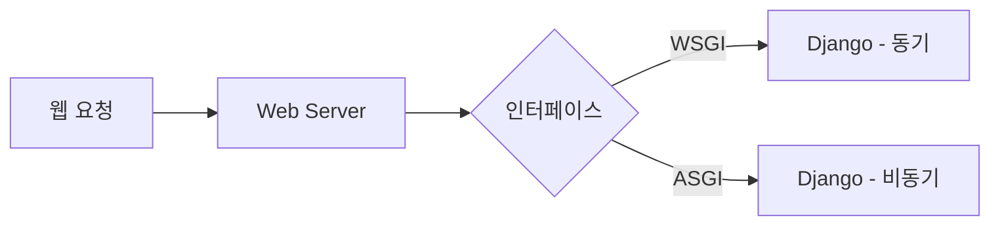
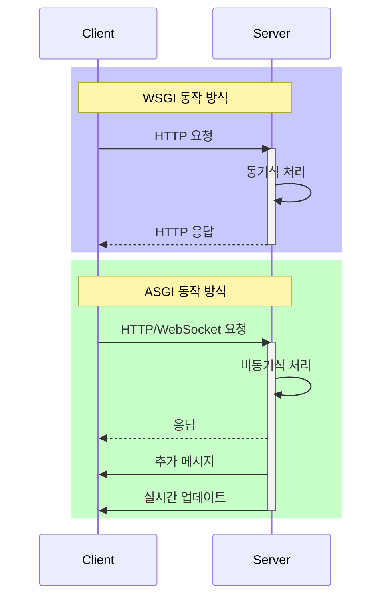
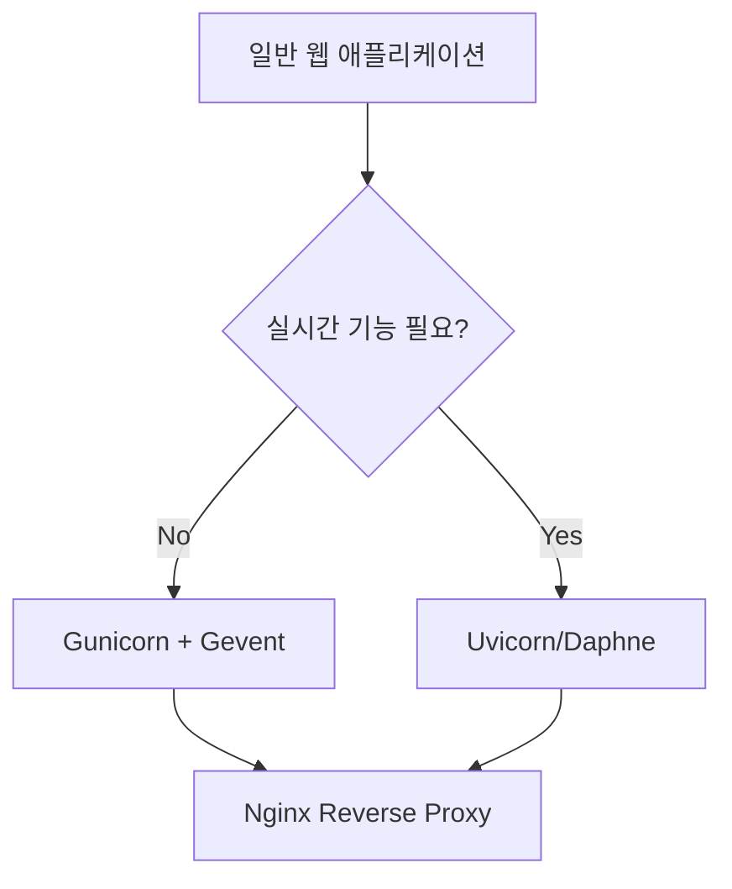

# 1. WSGI와 ASGI 개요

## 1.1 웹 서버 인터페이스의 이해



### WSGI (Web Server Gateway Interface)
- Python 웹 애플리케이션 표준 인터페이스
- PEP 3333에서 정의
- 동기식 처리 방식

### ASGI (Asynchronous Server Gateway Interface)
- WSGI의 비동기 확장 버전
- WebSocket 등 비동기 프로토콜 지원
- 실시간 애플리케이션에 적합

## 1.2 동작 방식 비교



# 2. WSGI 서버 구현체

## 2.1 Gunicorn

### 특징
- 안정적이고 성능이 검증됨
- 다중 워커 프로세스 지원
- 다양한 워커 클래스 지원

### 설정 예시
```python
# gunicorn.conf.py
import multiprocessing

# 워커 프로세스 수 설정
workers = multiprocessing.cpu_count() * 2 + 1

# 워커 클래스 설정
worker_class = 'sync'  # 기본값
# worker_class = 'gevent'  # gevent 사용 시

# 바인딩 주소
bind = '0.0.0.0:8000'

# 타임아웃 설정
timeout = 30

# 로깅 설정
accesslog = '-'
errorlog = '-'
loglevel = 'info'
```

### 실행 명령어
```bash
# 기본 실행
gunicorn myproject.wsgi:application

# gevent 워커로 실행
gunicorn --worker-class=gevent myproject.wsgi:application

# 설정 파일 사용
gunicorn -c gunicorn.conf.py myproject.wsgi:application
```

[[Gunicorn 서버 관리]]
## 2.2 Gevent

### 특징
- 비동기 I/O 처리
- 코루틴 기반 동시성
- Gunicorn과 통합 가능

### 구현 예시
```python
# gevent_server.py
from gevent import monkey
monkey.patch_all()

from gevent.pywsgi import WSGIServer
from django.core.wsgi import get_wsgi_application

# Django WSGI 애플리케이션 로드
application = get_wsgi_application()

# Gevent 서버 설정
server = WSGIServer(('0.0.0.0', 8000), application)
server.serve_forever()
```

## 2.3 uWSGI

### 특징
- 완전한 웹 서버 스택
- 다양한 프로토콜 지원
- 복잡한 설정 가능

### 설정 예시
```ini
# uwsgi.ini
[uwsgi]
# Django 관련 설정
chdir = /path/to/your/project
module = myproject.wsgi:application
env = DJANGO_SETTINGS_MODULE=myproject.settings

# 프로세스 관련 설정
master = true
processes = 4
threads = 2

# 소켓 설정
socket = 0.0.0.0:8000
protocol = http

# 로깅
logto = /var/log/uwsgi/myproject.log
```

# 3. ASGI 서버 구현체

## 3.1 Uvicorn

### 특징
- 경량화된 ASGI 서버
- 빠른 성능
- HTTP/1.1, WebSocket 지원

### 설정 및 실행
```python
# uvicorn_config.py
from uvicorn.workers import UvicornWorker

class CustomUvicornWorker(UvicornWorker):
    CONFIG_KWARGS = {
        "loop": "auto",
        "http": "auto",
        "ws": "auto",
        "lifespan": "auto",
        "log_level": "info",
        "access_log": True,
    }
```

```bash
# 실행 명령어
uvicorn myproject.asgi:application

# 옵션 추가
uvicorn myproject.asgi:application --workers 4 --loop uvloop --http httptools
```

## 3.2 Daphne

### 특징
- Django Channels의 기본 서버
- 안정적인 ASGI 구현
- HTTP/1.1, HTTP/2, WebSocket 지원

### 설정 예시
```python
# daphne_app.py
import os
from django.core.asgi import get_asgi_application
from channels.routing import ProtocolTypeRouter, URLRouter
from channels.auth import AuthMiddlewareStack
from myapp.routing import websocket_urlpatterns

os.environ.setdefault('DJANGO_SETTINGS_MODULE', 'myproject.settings')

application = ProtocolTypeRouter({
    "http": get_asgi_application(),
    "websocket": AuthMiddlewareStack(
        URLRouter(
            websocket_urlpatterns
        )
    ),
})
```

### 실행 명령어
```bash
daphne myproject.asgi:application
```

## 3.3 Hypercorn

### 특징
- HTTP/1.1, HTTP/2, WebSocket 지원
- QUIC 프로토콜 지원
- 다양한 설정 옵션

### 설정 예시
```python
# hypercorn_config.py
bind = ['0.0.0.0:8000']
workers = 4
worker_class = 'asyncio'
keepalive_timeout = 5
errorlog = '-'
accesslog = '-'
loglevel = 'info'
```

```bash
# 실행 명령어
hypercorn myproject.asgi:application --config hypercorn_config.py
```

# 4. 성능 비교 및 선택 가이드

## 4.1 서버별 성능 특성

| 서버 | 동시접속 처리 | 메모리 사용 | CPU 사용 | 설정 복잡도 |
|------|-------------|------------|----------|------------|
| Gunicorn | 중간 | 낮음 | 중간 | 낮음 |
| Gevent | 높음 | 중간 | 낮음 | 중간 |
| uWSGI | 높음 | 높음 | 높음 | 높음 |
| Uvicorn | 높음 | 낮음 | 중간 | 낮음 |
| Daphne | 높음 | 중간 | 중간 | 중간 |
| Hypercorn | 높음 | 중간 | 중간 | 중간 |

## 4.2 사용 사례별 권장 서버

### 일반적인 웹 애플리케이션


### 실시간 애플리케이션
- WebSocket 필요: Daphne/Uvicorn
- HTTP/2 필요: Hypercorn
- 높은 동시성: Uvicorn + uvloop

# 5. 배포 구성 예시

## 5.1 WSGI 배포 (Gunicorn + Nginx)

```nginx
# nginx.conf
server {
    listen 80;
    server_name example.com;

    location / {
        proxy_pass http://127.0.0.1:8000;
        proxy_set_header Host $host;
        proxy_set_header X-Real-IP $remote_addr;
    }
}
```

```bash
# 실행 스크립트
#!/bin/bash
gunicorn myproject.wsgi:application \
    --workers 4 \
    --worker-class gevent \
    --bind 127.0.0.1:8000 \
    --daemon
```

## 5.2 ASGI 배포 (Uvicorn + Nginx)

```nginx
# nginx.conf
server {
    listen 80;
    server_name example.com;

    location / {
        proxy_pass http://127.0.0.1:8000;
        proxy_http_version 1.1;
        proxy_set_header Upgrade $http_upgrade;
        proxy_set_header Connection "upgrade";
    }
}
```

```bash
# 실행 스크립트
#!/bin/bash
uvicorn myproject.asgi:application \
    --workers 4 \
    --loop uvloop \
    --host 127.0.0.1 \
    --port 8000 \
    --daemon
```

# 6. 주의사항 및 최적화

## 6.1 일반적인 고려사항
- 워커 수 최적화
- 메모리 관리
- 타임아웃 설정
- 로깅 구성

## 6.2 보안 고려사항
- Reverse Proxy 사용
- SSL/TLS 설정
- 헤더 보안
- 접근 제어

# 7. 결론

프로젝트 요구사항에 따라 적절한 서버를 선택해야 한다:

1. 일반적인 Django 애플리케이션
   - Gunicorn + Gevent 조합 권장
   - 설정이 간단하고 안정적

2. 실시간 기능이 필요한 경우
   - Uvicorn 또는 Daphne 권장
   - WebSocket 및 비동기 처리 지원

3. 고급 기능이 필요한 경우
   - HTTP/2: Hypercorn
   - 복잡한 설정: uWSGI

모든 경우에 Nginx를 리버스 프록시로 사용하는 것을 권장한다.