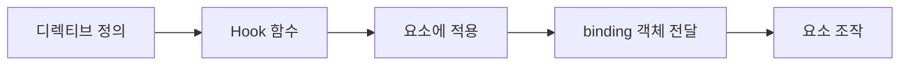
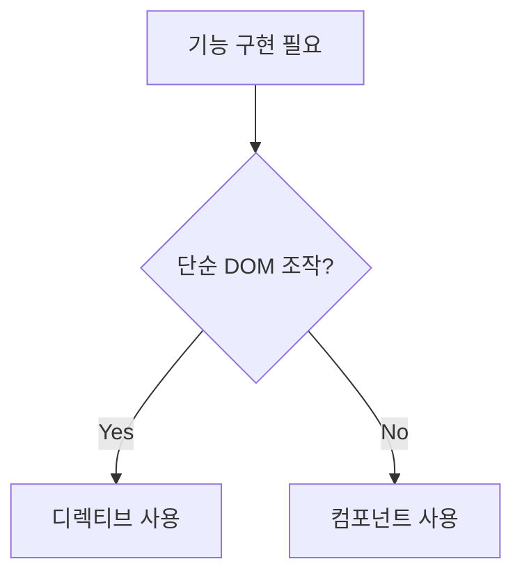

```table-of-contents
title: # 목차
style: nestedList # TOC style (nestedList|nestedOrderedList|inlineFirstLevel)
minLevel: 0 # Include headings from the specified level
maxLevel: 5 # Include headings up to the specified level
includeLinks: true # Make headings clickable
hideWhenEmpty: false # Hide TOC if no headings are found
debugInConsole: false # Print debug info in Obsidian console
```
# Custom Directive 개념

Vue.js에서 Custom Directive는 DOM 요소에 대한 저수준 접근이 필요할 때 사용하는 기능이다. 기본 제공되는 `v-model`, `v-show`와 같은 디렉티브처럼 개발자가 직접 정의하여 특정 요소의 동작이나 스타일을 제어할 수 있다.

## 언제 Custom Directive를 사용하는가?

- 특정 DOM 요소에 직접 접근이 필요할 때
- 반복되는 DOM 조작 패턴을 재사용하고 싶을 때
- Component로 추상화하기에는 과도한 경우
- 요소의 생명주기에 따른 정밀한 제어가 필요할 때

실생활 비유: Custom Directive는 가구에 부착하는 특수 장치와 같다. 가구(DOM 요소)는 그대로지만, 특수 장치(디렉티브)를 부착함으로써 새로운 기능을 추가할 수 있다.

# Custom Directive 기본 동작 방식

## Hook 함수

Vue 3에서 Custom Directive는 다음과 같은 Hook 함수들을 정의할 수 있다:

- `created`: 요소의 속성이나 이벤트 리스너가 적용되기 전에 호출
- `beforeMount`: 요소가 DOM에 삽입되기 직전에 호출
- `mounted`: 요소가 DOM에 삽입된 직후 호출
- `beforeUpdate`: 요소를 포함하는 컴포넌트가 업데이트되기 전에 호출
- `updated`: 요소를 포함하는 컴포넌트가 업데이트된 후에 호출
- `beforeUnmount`: 요소가 DOM에서 제거되기 직전에 호출
- `unmounted`: 요소가 DOM에서 제거된 후에 호출

각 Hook 함수는 다음 파라미터를 전달받는다:

- `el`: 디렉티브가 바인딩된 요소
- `binding`: 디렉티브에 관한 데이터를 포함하는 객체
- `vnode`: Vue 컴파일러에 의해 생성된 가상 노드
- `prevVnode`: 이전 렌더링에서의 가상 노드 (업데이트 Hook에서만 사용 가능)

## Binding 객체

`binding` 객체는 다음과 같은 프로퍼티를 포함한다:

- `value`: 디렉티브에 전달된 값
- `oldValue`: 이전 값 (업데이트 Hook에서만 사용 가능)
- `arg`: 디렉티브에 전달된 인자 (있는 경우)
- `modifiers`: 디렉티브 수식어를 포함하는 객체
- `instance`: 디렉티브를 사용하는 컴포넌트 인스턴스
- `dir`: 디렉티브 정의 객체



# Custom Directive 실제 사용 예시

## Composition API와 `<script setup>`에서 Custom Directive 등록

### 전역 디렉티브 등록

```javascript
// main.js
import { createApp } from 'vue'
import App from './App.vue'

const app = createApp(App)

// 전역 디렉티브 등록
app.directive('focus', {
  mounted(el) {
    el.focus()
  }
})

app.mount('#app')
```

### 로컬 디렉티브 등록 (Composition API + `<script setup>`)

```vue
<template>
  <input v-focus />
</template>

<script setup>
import { directive } from 'vue'

// 로컬 디렉티브 등록
const vFocus = {
  mounted(el) {
    el.focus()
  }
}
</script>
```

Vue 3.2부터는 `<script setup>`에서 `v` 접두사로 시작하는 변수를 선언하면 자동으로 디렉티브로 인식한다:

```vue
<template>
  <input v-focus />
</template>

<script setup>
// vFocus는 v-focus 디렉티브로 사용 가능
const vFocus = {
  mounted(el) {
    el.focus()
  }
}
</script>
```

## 값과 인자를 사용하는 예시

```vue
<template>
  <div v-highlight:background="'yellow'">하이라이트된 텍스트</div>
  <div v-highlight:color="'red'">색상이 변경된 텍스트</div>
</template>

<script setup>
const vHighlight = {
  mounted(el, binding) {
    if (binding.arg === 'background') {
      el.style.backgroundColor = binding.value
    } else if (binding.arg === 'color') {
      el.style.color = binding.value
    }
  }
}
</script>
```

## 수식어를 사용하는 예시

```vue
<template>
  <div v-tooltip.top="'위쪽 툴팁'">마우스를 올려보세요</div>
  <div v-tooltip.bottom.bold="'아래쪽 굵은 툴팁'">마우스를 올려보세요</div>
</template>

<script setup>
const vTooltip = {
  mounted(el, binding) {
    const position = Object.keys(binding.modifiers)[0] || 'top'
    const isBold = binding.modifiers.bold
    
    el.setAttribute('data-tooltip', binding.value)
    el.setAttribute('data-position', position)
    
    if (isBold) {
      el.setAttribute('data-bold', 'true')
    }
    
    el.classList.add('tooltip-container')
  }
}
</script>

<style>
.tooltip-container {
  position: relative;
}

.tooltip-container::after {
  content: attr(data-tooltip);
  position: absolute;
  /* 위치에 따른 스타일 설정 */
  /* 생략 */
}

.tooltip-container[data-bold="true"]::after {
  font-weight: bold;
}
</style>
```

# 고급 활용법

## 여러 Hook 함수 활용하기

```vue
<template>
  <div v-track-scroll="handleScroll">스크롤 추적 영역</div>
</template>

<script setup>
const handleScroll = (event) => {
  console.log('스크롤 위치:', event.target.scrollTop)
}

const vTrackScroll = {
  mounted(el, binding) {
    const callback = binding.value
    if (typeof callback !== 'function') {
      console.warn('v-track-scroll에는 함수가 필요합니다')
      return
    }
    el.addEventListener('scroll', callback)
  },
  beforeUnmount(el, binding) {
    const callback = binding.value
    el.removeEventListener('scroll', callback)
  }
}
</script>
```

## 객체 값 전달하기

```vue
<template>
  <div v-styled="{ color: 'red', fontWeight: 'bold', fontSize: '18px' }">
    스타일이 적용된 텍스트
  </div>
</template>

<script setup>
const vStyled = {
  mounted(el, binding) {
    const styles = binding.value
    Object.entries(styles).forEach(([property, value]) => {
      el.style[property] = value
    })
  },
  updated(el, binding) {
    // 값이 변경되었을 때 스타일 업데이트
    const styles = binding.value
    Object.entries(styles).forEach(([property, value]) => {
      el.style[property] = value
    })
  }
}
</script>
```

## 동적 디렉티브 인자

```vue
<template>
  <div v-position:[direction]="offset">위치가 조정된 요소</div>
</template>

<script setup>
import { ref } from 'vue'

const direction = ref('left')
const offset = ref('20px')

const vPosition = {
  mounted(el, binding) {
    const pos = binding.arg || 'top'
    el.style.position = 'absolute'
    el.style[pos] = binding.value
  },
  updated(el, binding) {
    const pos = binding.arg || 'top'
    el.style.position = 'absolute'
    el.style[pos] = binding.value
  }
}

// 1초 후에 방향 변경
setTimeout(() => {
  direction.value = 'top'
  offset.value = '50px'
}, 1000)
</script>
```

## 함수 약식 문법

단순한 디렉티브의 경우, 객체 대신 함수로 정의할 수 있다:

```vue
<template>
  <button v-ripple>클릭시 물결 효과</button>
</template>

<script setup>
// 함수로 정의된 디렉티브는 mounted와 updated Hook에 동일하게 적용
const vRipple = (el) => {
  el.addEventListener('click', (e) => {
    const ripple = document.createElement('span')
    ripple.classList.add('ripple-effect')
    
    const rect = el.getBoundingClientRect()
    const x = e.clientX - rect.left
    const y = e.clientY - rect.top
    
    ripple.style.left = `${x}px`
    ripple.style.top = `${y}px`
    
    el.appendChild(ripple)
    
    setTimeout(() => {
      ripple.remove()
    }, 600)
  })
}
</script>

<style>
button {
  position: relative;
  overflow: hidden;
}

.ripple-effect {
  position: absolute;
  border-radius: 50%;
  background-color: rgba(0, 0, 0, 0.3);
  width: 100px;
  height: 100px;
  transform: translate(-50%, -50%) scale(0);
  animation: ripple 0.6s linear;
}

@keyframes ripple {
  to {
    transform: translate(-50%, -50%) scale(3);
    opacity: 0;
  }
}
</style>
```

# 주의사항

## 성능 고려사항

- DOM 조작이 빈번하게 발생하는 디렉티브는 성능에 영향을 줄 수 있다.
- 가능한 경우 `mounted`와 `updated` Hook에서 변경 사항을 체크하여 불필요한 DOM 조작을 방지한다.

```javascript
const vEfficient = {
  updated(el, binding) {
    if (binding.value !== binding.oldValue) {
      // 값이 변경된 경우에만 DOM 조작 수행
      performExpensiveOperation(el, binding.value)
    }
  }
}
```

## 메모리 누수 방지

- 이벤트 리스너를 추가한 경우, 반드시 `beforeUnmount` 또는 `unmounted` Hook에서 제거한다.

```javascript
const vListener = {
  mounted(el, binding) {
    // 이벤트 핸들러를 참조하기 위해 요소에 저장
    el._handler = () => {
      binding.value()
    }
    el.addEventListener('click', el._handler)
  },
  beforeUnmount(el) {
    // 요소가 제거되기 전에 이벤트 리스너 제거
    el.removeEventListener('click', el._handler)
    delete el._handler
  }
}
```

## 컴포넌트 vs 디렉티브

- 복잡한 기능은 디렉티브보다 컴포넌트로 구현하는 것이 좋다.
- 디렉티브는 DOM 요소 조작에 초점을 맞추고, 컴포넌트는 재사용 가능한 UI 구성 요소에 초점을 맞춘다.



# 실제 프로젝트에서의 Custom Directive 구조화

대규모 프로젝트에서는 디렉티브를 모듈화하여 관리하는 것이 좋다:

```
src/
├── directives/
│   ├── index.js          # 모든 디렉티브를 내보내는 진입점
│   ├── focus.js          # v-focus 디렉티브
│   ├── highlight.js      # v-highlight 디렉티브
│   └── tooltip.js        # v-tooltip 디렉티브
```

각 디렉티브 파일 구조:

```javascript
// src/directives/focus.js
export default {
  mounted(el) {
    el.focus()
  }
}
```

진입점 파일:

```javascript
// src/directives/index.js
import focus from './focus'
import highlight from './highlight'
import tooltip from './tooltip'

export default {
  install(app) {
    app.directive('focus', focus)
    app.directive('highlight', highlight)
    app.directive('tooltip', tooltip)
  }
}
```

메인 파일에서 등록:

```javascript
// main.js
import { createApp } from 'vue'
import App from './App.vue'
import directives from './directives'

const app = createApp(App)
app.use(directives)
app.mount('#app')
```

Composition API + `<script setup>`에서 개별 디렉티브 가져오기:

```vue
<template>
  <input v-focus />
</template>

<script setup>
import focus from './directives/focus'

// v-focus로 사용
const vFocus = focus
</script>
```

# 결론

Vue 3에서 Custom Directive는 DOM 요소에 대한 직접적인 제어가 필요한 경우 유용한 도구이다. Composition API와 `<script setup>` 구문을 사용할 때는 `v` 접두사를 활용하여 간결하게 디렉티브를 정의할 수 있다.

강력한 `binding` 객체를 통해 값, 인자, 수식어를 활용하면 재사용성 높은 디렉티브를 구현할 수 있으며, 다양한 Hook 함수를 활용하여 요소의 생명주기에 따른 정밀한 제어가 가능하다.

DOM 조작은 성능에 영향을 줄 수 있으므로, 필요한 경우에만 디렉티브를 사용하고 복잡한 기능은 컴포넌트로 추상화하는 것이 좋다. 대규모 프로젝트에서는 디렉티브를 모듈화하여 체계적으로 관리하는 것이 유지보수에 도움이 된다.