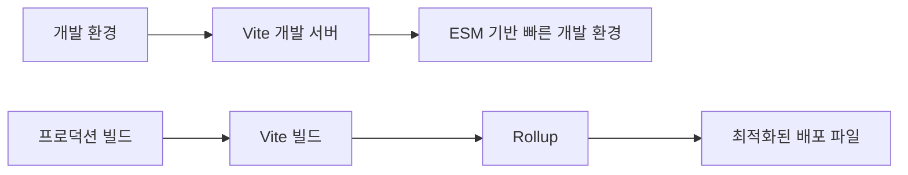

```table-of-contents
title: # 목차
style: nestedList # TOC style (nestedList|nestedOrderedList|inlineFirstLevel)
minLevel: 0 # Include headings from the specified level
maxLevel: 5 # Include headings up to the specified level
includeLinks: true # Make headings clickable
hideWhenEmpty: false # Hide TOC if no headings are found
debugInConsole: false # Print debug info in Obsidian console
```
# Rollup 이해하기

## Rollup이란?

Rollup은 JavaScript 모듈 번들러로, 여러 개의 작은 코드 조각을 라이브러리나 애플리케이션과 같은 더 큰 단위로 컴파일하는 도구이다. Rollup은 특히 ES 모듈을 사용하도록 설계되었으며, Tree Shaking이라는 최적화 기법을 통해 불필요한 코드를 제거하는데 탁월한 성능을 보인다.

## Vite와 Rollup의 관계

Vite는 개발 서버로는, ESM(ES Modules)을 기반으로 하는 브라우저 네이티브 모듈 시스템을 활용하지만, 프로덕션 빌드 시에는 내부적으로 Rollup을 사용한다. 따라서 Vite 프로젝트에서 Rollup 설정을 최적화하면 배포 버전의 성능을 향상시킬 수 있다.



# Rollup의 핵심 기능

## Tree Shaking

Tree Shaking은 사용하지 않는 코드를 제거하는 프로세스이다. ES 모듈의 정적 구조를 분석하여 실제로 사용되는 코드만 포함시킨다.

```javascript
// 모듈에서 전체가 아닌 필요한 함수만 가져오면
// 사용하지 않는 부분은 최종 번들에 포함되지 않는다
import { usedFunction } from 'some-package';
// unusedFunction은 번들에 포함되지 않음
```

## 코드 분할(Code Splitting)

필요한 코드만 필요할 때 로드할 수 있도록 애플리케이션을 여러 청크로 분할한다.

```javascript
// 동적 임포트를 사용하면 해당 모듈은 별도의 청크로 분리된다
import('./heavyModule.js').then((module) => {
  // 필요할 때만 로드됨
});
```

## 다양한 출력 포맷 지원

Rollup은 다양한 모듈 형식(ES 모듈, CommonJS, UMD 등)으로 코드를 내보낼 수 있어, 다양한 환경에서 코드를 사용할 수 있다.

# Vite에서 Rollup 설정하기

## 기본 설정

Vite는 내부적으로 Rollup을 사용하며, `vite.config.js` 파일에서 Rollup 설정을 조정할 수 있다.

```javascript
// vite.config.js
export default {
  build: {
    rollupOptions: {
      // 여기에 Rollup 설정을 추가
    }
  }
}
```

## node_modules 패키지 사이즈 최적화하기

### 외부 의존성 설정

큰 라이브러리를 외부 의존성으로 표시하여 번들에서 제외할 수 있다.

```javascript
// vite.config.js
export default {
  build: {
    rollupOptions: {
      external: ['large-library'],
      output: {
        // 외부 의존성을 CDN에서 로드
        globals: {
          'large-library': 'LargeLibrary'
        }
      }
    }
  }
}
```

### Manualchunks를 사용한 번들 최적화

`manualChunks` 옵션을 사용하여 node_modules의 패키지를 별도 청크로 분리할 수 있다.

```javascript
// vite.config.js
export default {
  build: {
    rollupOptions: {
      output: {
        manualChunks: {
          // vendor 청크에 node_modules의 모든 패키지를 포함
          'vendor': ['react', 'react-dom'],
          // 특정 패키지를 별도 청크로 분리
          'lodash': ['lodash']
        }
      }
    }
  }
}
```

### 더 세부적인 분할 예시

패키지 유형별로 그룹화하여 더 효율적인 캐싱을 구현할 수 있다.

```javascript
// vite.config.js
export default {
  build: {
    rollupOptions: {
      output: {
        manualChunks: (id) => {
          if (id.includes('node_modules')) {
            // UI 라이브러리 분리
            if (id.includes('react') || id.includes('antd')) {
              return 'ui-vendor';
            }
            // 유틸리티 라이브러리 분리
            if (id.includes('lodash') || id.includes('date-fns')) {
              return 'utils-vendor';
            }
            // 그 외 모든 node_modules
            return 'vendor';
          }
        }
      }
    }
  }
}
```

## Tree Shaking 최적화

### sideEffects 속성 활용

`package.json`의 `sideEffects` 필드를 사용하여 부작용이 없는 모듈을 표시하면 Tree Shaking 효율이 향상된다.

```json
// package.json
{
  "name": "my-package",
  "sideEffects": false,
  // 또는 특정 파일만 부작용이 있다고 표시
  "sideEffects": [
    "*.css",
    "*.scss"
  ]
}
```

### ESM 모듈 사용

CommonJS 대신 ESM 모듈을 사용하는 패키지를 선택하면 Tree Shaking이 더 효과적으로 작동한다.

```javascript
// 잘못된 예시 (CommonJS)
const _ = require('lodash');

// 올바른 예시 (ESM)
import { map, filter } from 'lodash-es';
```

# 성능 측정 및 최적화

## 번들 분석

번들 크기를 분석하고 최적화 기회를 찾기 위한 도구를 사용할 수 있다.

```bash
# rollup-plugin-visualizer 설치
npm install --save-dev rollup-plugin-visualizer
```

```javascript
// vite.config.js
import { visualizer } from 'rollup-plugin-visualizer';

export default {
  plugins: [
    visualizer({
      open: true,
      filename: 'dist/stats.html',
      gzipSize: true,
      brotliSize: true
    })
  ]
}
```

## 번들 사이즈 최적화 전략

### 코드 분할 개선

동적 임포트를 사용하여 필요할 때만 코드를 로드한다.

```javascript
// 잘못된 예시
import { HeavyComponent } from './HeavyComponent';

// 올바른 예시
const HeavyComponent = React.lazy(() => import('./HeavyComponent'));
```

### 작은 패키지 선택

동일한 기능을 제공하는 더 작은 패키지를 선택한다.

```javascript
// 잘못된 예시 (크기 큼)
import moment from 'moment';

// 올바른 예시 (크기 작음)
import { format } from 'date-fns';
```

### 불필요한 의존성 제거

실제로 필요하지 않은 의존성을 제거한다.

# 고급 Rollup 설정

## 다양한 Rollup 플러그인 활용

### 코드 압축

terser 플러그인을 사용하여 코드를 압축하고 난독화한다.

```javascript
// vite.config.js
import { defineConfig } from 'vite';

export default defineConfig({
  build: {
    minify: 'terser',
    terserOptions: {
      compress: {
        drop_console: true,
        drop_debugger: true
      }
    }
  }
});
```

### CSS 최적화

CSS 파일도 최적화하여 번들 크기를 줄인다.

```javascript
// vite.config.js
import { defineConfig } from 'vite';
import cssnano from 'cssnano';

export default defineConfig({
  css: {
    postcss: {
      plugins: [
        cssnano({
          preset: 'default',
        })
      ]
    }
  }
});
```

## 조건부 코드 제거

환경 변수를 사용하여 개발용 코드를 프로덕션 빌드에서 제거한다.

```javascript
// vite.config.js
import { defineConfig } from 'vite';
import replace from '@rollup/plugin-replace';

export default defineConfig({
  plugins: [
    replace({
      'process.env.NODE_ENV': JSON.stringify('production'),
      'DEBUG': JSON.stringify(false),
      preventAssignment: true
    })
  ]
});
```

# 실제 사용 사례

## 대규모 React 프로젝트 최적화

```javascript
// vite.config.js
import { defineConfig } from 'vite';
import react from '@vitejs/plugin-react';
import { visualizer } from 'rollup-plugin-visualizer';

export default defineConfig({
  plugins: [
    react(),
    visualizer()
  ],
  build: {
    rollupOptions: {
      output: {
        manualChunks: {
          'react-vendor': ['react', 'react-dom', 'react-router-dom'],
          'ui-vendor': ['antd', '@ant-design/icons'],
          'utils': ['lodash-es', 'axios', 'date-fns']
        }
      }
    },
    chunkSizeWarningLimit: 600
  }
});
```

## SSR(Server-Side Rendering) 프로젝트 설정

```javascript
// vite.config.js
import { defineConfig } from 'vite';
import react from '@vitejs/plugin-react';

export default defineConfig({
  plugins: [react()],
  build: {
    ssr: true,
    rollupOptions: {
      input: 'src/entry-server.jsx',
      output: {
        format: 'esm',
        entryFileNames: '[name].mjs',
        preserveModules: true,
        preserveModulesRoot: 'src'
      }
    }
  }
});
```

# 주의사항

## Tree Shaking 한계 이해

- 모든 패키지가 Tree Shaking에 최적화되어 있지 않다.
- Side Effects가 있는 코드는 제거되지 않을 수 있다.
- CommonJS 모듈은 Tree Shaking이 제한적으로 동작한다.

## 호환성 문제

- 일부 플러그인이나 최적화 방법은 특정 환경에서 문제를 일으킬 수 있다.
- 최신 브라우저 기능을 사용하는 경우 폴리필이 필요할 수 있다.

## 과도한 코드 분할 피하기

- 너무 많은 청크로 분할하면 HTTP 요청 수가 증가하여 성능이 저하될 수 있다.
- 적절한 균형을 찾는 것이 중요하다.

# 결론

Rollup은 Vite의 프로덕션 빌드 과정에서 핵심적인 역할을 하며, 효과적인 Tree Shaking과 코드 분할을 통해 번들 크기를 최적화할 수 있다. node_modules의 패키지 크기를 줄이기 위해서는 외부 의존성 설정, manualChunks를 통한 청크 분리, ESM 모듈 사용 등의 방법을 활용할 수 있다. 이러한 최적화는 웹 애플리케이션의 로딩 시간을 단축하고 사용자 경험을 향상시키는 데 중요한 역할을 한다.

최적화 작업을 시작하기 전에 시각화 도구를 사용하여 현재 번들의 구성을 분석하고, 점진적으로 변경사항을 적용하며 성능을 측정하는 것이 효과적인 접근 방법이다.