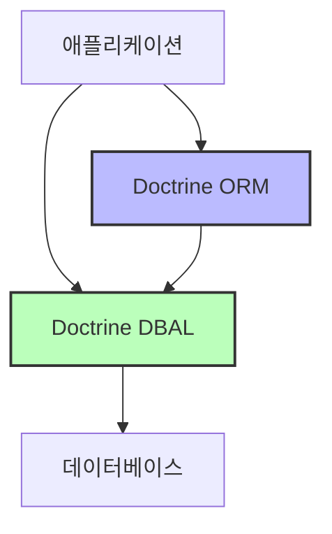
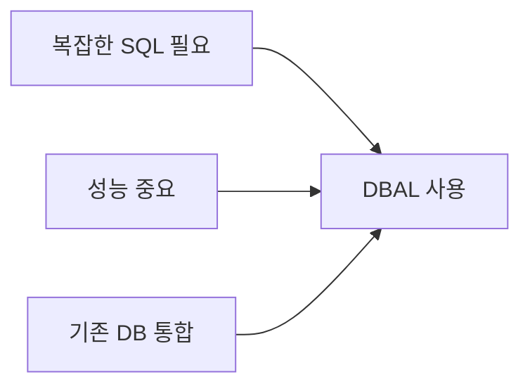
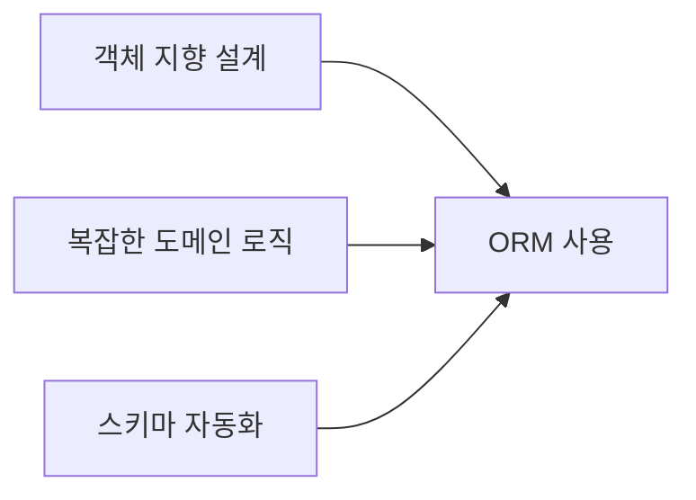

# 기본 관계
Doctrine ORM은 내부적으로 DBAL을 사용한다. 다만, 각각 독립적으로도 사용할 수 있다.

## 계층 구조


# 사용 방식 비교

## 1. DBAL만 사용하는 경우
```php
// DBAL 직접 사용
$connection = DriverManager::getConnection($connectionParams);

// SQL에 가까운 형태로 작업
$queryBuilder = $connection->createQueryBuilder();
$users = $queryBuilder
    ->select('u.*')
    ->from('users', 'u')
    ->where('u.active = :active')
    ->setParameter('active', true)
    ->executeQuery()
    ->fetchAllAssociative();
```

## 2. ORM을 사용하는 경우
```php
// Entity 클래스 정의
/** @Entity */
class User
{
    /** @Id @GeneratedValue @Column(type="integer") */
    private $id;
    
    /** @Column(type="string") */
    private $name;
    
    /** @Column(type="boolean") */
    private $active;
}

// ORM을 통한 객체 지향적 접근
$entityManager = EntityManager::create($connectionParams, $config);
$users = $entityManager->getRepository(User::class)
    ->findBy(['active' => true]);
```

# 각각의 사용 시나리오

## DBAL 단독 사용이 좋은 경우
1. 단순한 데이터베이스 작업
2. 복잡한 SQL 쿼리가 필요한 경우
3. 성능이 중요한 경우
4. 기존 데이터베이스와의 통합이 필요한 경우



## ORM 사용이 좋은 경우
1. 객체 지향적인 설계가 중요한 경우
2. 복잡한 도메인 로직이 있는 경우
3. 데이터베이스 스키마 자동 관리가 필요한 경우
4. 타입 안정성이 중요한 경우



# 함께 사용하는 경우의 예시

```php
class UserService
{
    private $entityManager;
    private $connection;
    
    public function __construct(EntityManager $entityManager)
    {
        $this->entityManager = $entityManager;
        // ORM에서 DBAL Connection 가져오기
        $this->connection = $entityManager->getConnection();
    }
    
    // ORM 사용 - 일반적인 CRUD
    public function findActiveUsers()
    {
        return $this->entityManager
            ->getRepository(User::class)
            ->findBy(['active' => true]);
    }
    
    // DBAL 사용 - 복잡한 통계 쿼리
    public function getUserStatistics()
    {
        return $this->connection
            ->executeQuery('
                SELECT 
                    COUNT(*) as total,
                    SUM(CASE WHEN active = 1 THEN 1 ELSE 0 END) as active_count
                FROM users
            ')
            ->fetchAssociative();
    }
}
```

# 선택 가이드

## DBAL 선택
- 단순한 CRUD 작업이 대부분인 경우
- SQL 쿼리의 완전한 제어가 필요한 경우
- 최적의 성능이 필요한 경우

## ORM 선택
- 복잡한 비즈니스 로직이 있는 경우
- 객체 지향적 설계가 중요한 경우
- 유지보수성이 중요한 경우

## 함께 사용
- 대부분의 작업은 ORM으로 처리
- 복잡한 쿼리나 성능이 중요한 부분만 DBAL 사용

# 결론
Doctrine ORM과 DBAL은 각각 독립적으로 사용할 수 있지만, 함께 사용할 때 더 큰 시너지를 낼 수 있다. ORM이 제공하는 객체 지향적 접근과 DBAL이 제공하는 유연성을 상황에 맞게 적절히 조합하여 사용하는 것이 권장된다.