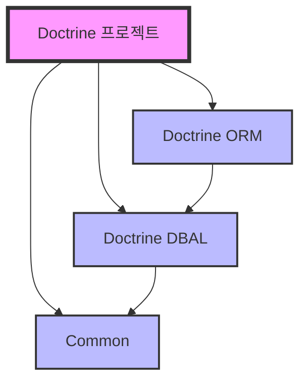
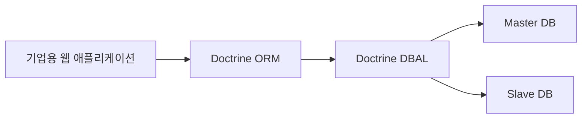

# Doctrine이란?
Doctrine은 PHP에서 사용되는 데이터베이스 도구 모음이다. 주로 데이터베이스 작업을 쉽고 안전하게 처리할 수 있도록 도와주는 라이브러리들의 집합이다.

## 주요 구성 요소



1. Doctrine ORM (Object Relational Mapper)
   - 데이터베이스 테이블을 PHP 객체로 매핑한다
   - SQL 없이 객체지향 방식으로 데이터베이스를 다룰 수 있다
   - 예: User 테이블을 User 클래스로 다룰 수 있다

2. Doctrine DBAL (Database Abstraction Layer)
   - 여러 종류의 데이터베이스를 일관된 방식으로 다룰 수 있게 해준다
   - MySQL, PostgreSQL, SQLite 등을 동일한 코드로 사용할 수 있다

3. Doctrine Common
   - 공통 라이브러리를 제공한다
   - 캐싱, 어노테이션, 이벤트 관리 등의 기능을 포함한다

> [!info]
> [[PHP Doctrine Database Abstraction Layer(DBAL)]]
> [[Doctrine ORM과 DBAL의 관계 및 사용 패턴]]

## 실제 사용 예시

### 1. 전통적인 PHP 데이터베이스 처리
```php
// 기존 PHP의 데이터베이스 처리 방식
$mysqli = new mysqli("localhost", "user", "password", "database");
$result = $mysqli->query("SELECT * FROM users WHERE id = " . $userId);
$user = $result->fetch_assoc();
```

### 2. Doctrine ORM 사용
```php
// Doctrine을 사용한 객체 지향적 처리
/** @Entity */
class User
{
    /** @Id @GeneratedValue @Column(type="integer") */
    private $id;
    
    /** @Column(type="string") */
    private $name;
}

// 사용 예시
$user = $entityManager->find('User', $userId);
```

### 3. Doctrine DBAL 사용
```php
// DBAL을 사용한 데이터베이스 처리
$queryBuilder = $connection->createQueryBuilder();
$user = $queryBuilder
    ->select('u.*')
    ->from('users', 'u')
    ->where('u.id = :id')
    ->setParameter('id', $userId)
    ->executeQuery()
    ->fetchAssociative();
```

# Doctrine의 장점

## 1. 개발 생산성
- SQL 쿼리 직접 작성 최소화
- 객체 지향적 코드 작성 가능
- 데이터베이스 스키마 자동 관리

## 2. 유지보수성
- 데이터베이스 변경에 유연한 대응
- 일관된 코드 구조
- 테스트 용이성

## 3. 보안
- SQL 인젝션 방지
- 타입 안정성
- 자동 이스케이프 처리

# 사용 시나리오

## 1. 소규모 프로젝트


## 2. 대규모 프로젝트


# 사용 시 고려사항

## 1. 학습 곡선
- 객체 관계 매핑 개념 이해가 필요하다
- 설정이 다소 복잡할 수 있다

## 2. 성능 고려
- ORM 사용 시 성능 오버헤드가 있을 수 있다
- 복잡한 쿼리의 경우 직접 SQL 작성이 더 효율적일 수 있다

# 시작하기

## 1. 설치
```bash
composer require doctrine/orm
composer require doctrine/dbal
```

## 2. 기본 설정
```php
// 데이터베이스 연결 설정
$connectionParams = [
    'driver'   => 'pdo_mysql',
    'host'     => 'localhost',
    'dbname'   => 'project',
    'user'     => 'root',
    'password' => 'password'
];

$connection = \Doctrine\DBAL\DriverManager::getConnection($connectionParams);
```

# 결론
Doctrine은 현대적인 PHP 애플리케이션 개발에서 데이터베이스 작업을 더 효율적이고 안전하게 만들어주는 강력한 도구이다. 특히 객체 지향적인 개발 방식을 선호하거나, 여러 데이터베이스를 지원해야 하는 프로젝트에서 큰 가치를 제공한다.