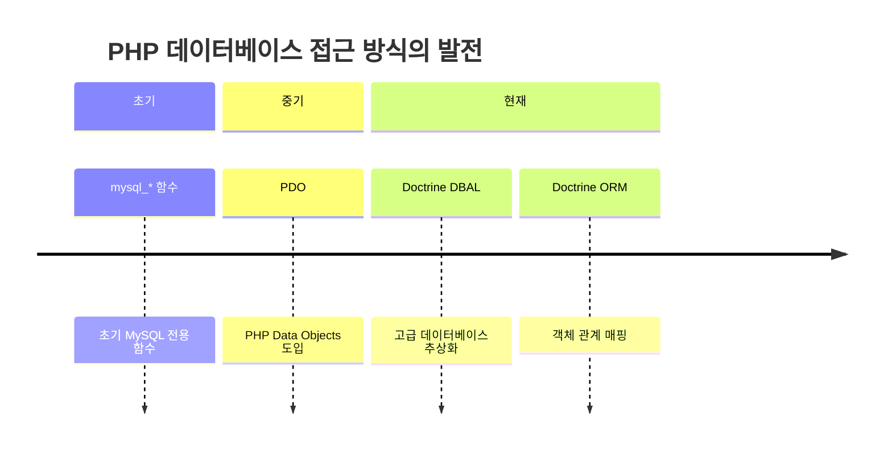
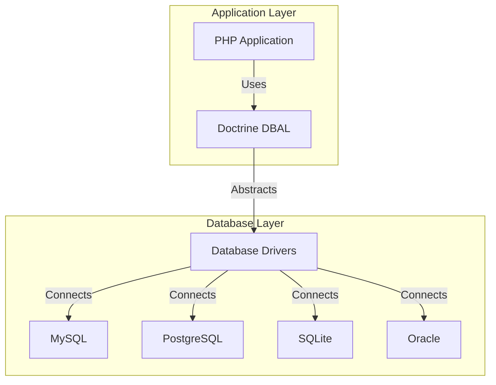
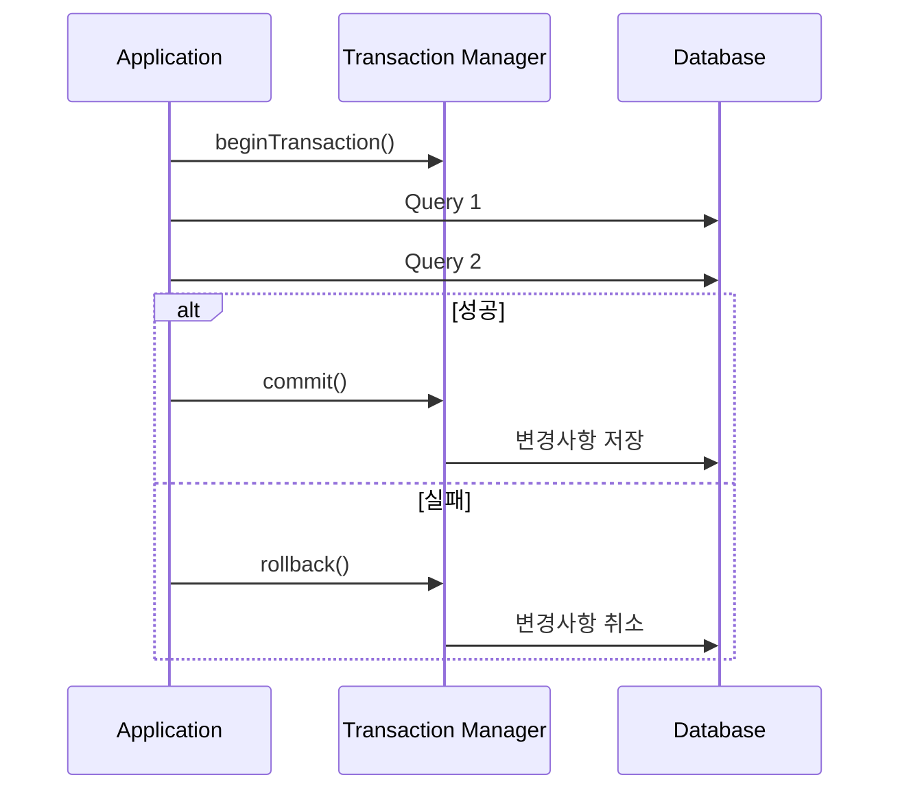

# 개요
Doctrine DBAL은 PHP 언어를 위한 데이터베이스 추상화 계층이다. PHP 생태계에서 가장 널리 사용되는 데이터베이스 추상화 라이브러리 중 하나로, 특히 Symfony 프레임워크와 긴밀하게 통합되어 있다. Laravel 11에서는 DBAL에 대한 의존성이 제거되었다

## 유사 도구 비교
다른 프로그래밍 언어의 유사한 도구들:
- Java: Hibernate
- Python: SQLAlchemy
- Node.js: Sequelize
- Ruby: ActiveRecord

## PHP 데이터베이스 접근 방식의 발전

# 1. 개념 이해

## 1.1 DBAL의 정의와 필요성
DBAL(Database Abstraction Layer)은 다양한 데이터베이스 시스템을 일관된 방식으로 다루기 위한 추상화 계층이다. 

### 실생활 비유
여행자가 각 나라마다 다른 전기 콘센트를 사용하기 위해 멀티어댑터를 사용하는 것처럼, DBAL은 서로 다른 데이터베이스 시스템을 동일한 방식으로 사용할 수 있게 해주는 '데이터베이스 어댑터'이다.

## 1.2 시스템 아키텍처



# 2. 환경 설정과 기본 사용

## 2.1 설치 및 초기 설정

```php
// Composer를 통한 설치
// $ composer require doctrine/dbal

// 데이터베이스 연결 설정
$connectionParams = [
    'dbname' => 'my_database',
    'user' => 'db_user',
    'password' => 'db_password',
    'host' => 'localhost',
    'driver' => 'pdo_mysql',
    // 성능 최적화를 위한 추가 옵션
    'driverOptions' => [
        PDO::ATTR_EMULATE_PREPARES => false,
        PDO::MYSQL_ATTR_INIT_COMMAND => "SET NAMES 'UTF8'"
    ]
];

// Connection 객체 생성
$connection = \Doctrine\DBAL\DriverManager::getConnection($connectionParams);
```

## 2.2 기본 데이터 조작

```php
// 1. 데이터 조회
// 잘못된 예시 - SQL Injection 취약점
$userId = $_GET['id'];
$wrongQuery = "SELECT * FROM users WHERE id = $userId"; // 절대 사용하면 안 됨

// 올바른 예시 - 파라미터 바인딩 사용
$queryBuilder = $connection->createQueryBuilder();
$result = $queryBuilder
    ->select('*')
    ->from('users')
    ->where('id = :id')
    ->setParameter('id', $userId)
    ->executeQuery()
    ->fetchAssociative();

// 2. 데이터 삽입
$connection->insert('users', [
    'name' => '홍길동',
    'email' => 'hong@example.com',
    'created_at' => new \DateTime()
]);

// 3. 데이터 수정
$connection->update('users', 
    ['name' => '김철수'], // 변경할 데이터
    ['id' => 1] // WHERE 조건
);

// 4. 데이터 삭제
$connection->delete('users', ['id' => 1]);
```

# 3. 고급 기능 활용

## 3.1 트랜잭션 처리



```php
// 트랜잭션 처리 예시
class OrderService {
    private $connection;
    
    public function processOrder(int $orderId, int $productId): void {
        $this->connection->beginTransaction();
        try {
            // 1. 재고 확인
            $stock = $this->checkStock($productId);
            if ($stock <= 0) {
                throw new \Exception('재고 부족');
            }
            
            // 2. 주문 처리
            $this->updateOrder($orderId);
            
            // 3. 재고 감소
            $this->decreaseStock($productId);
            
            $this->connection->commit();
        } catch (\Exception $e) {
            $this->connection->rollBack();
            throw $e;
        }
    }
}
```

## 3.2 성능 최적화

### 배치 처리 예시
```php
class BatchProcessor {
    private $connection;
    private const BATCH_SIZE = 1000;
    
    public function processBatch(array $items): void {
        $this->connection->beginTransaction();
        try {
            foreach ($items as $i => $item) {
                $this->connection->insert('items', $item);
                
                if (($i + 1) % self::BATCH_SIZE === 0) {
                    $this->connection->commit();
                    $this->connection->beginTransaction();
                }
            }
            $this->connection->commit();
        } catch (\Exception $e) {
            $this->connection->rollBack();
            throw $e;
        }
    }
}
```

# 4. 보안 고려사항

## 4.1 SQL Injection 방지
```php
// 안전하지 않은 코드
$name = $_POST['name'];
$query = "SELECT * FROM users WHERE name = '$name'"; // 취약!

// 안전한 코드
$qb = $connection->createQueryBuilder();
$query = $qb
    ->select('*')
    ->from('users')
    ->where('name = :name')
    ->setParameter('name', $name);
```

## 4.2 권한 관리
```php
// 데이터베이스 사용자 권한 설정 예시
$connectionParams['user'] = 'read_only_user';
$connectionParams['password'] = 'read_only_pass';

// 읽기 전용 연결 생성
$readOnlyConnection = DriverManager::getConnection($connectionParams);
```

# 5. 문제 해결 가이드

## 5.1 일반적인 문제

### Connection 관련 문제
```php
try {
    $connection = DriverManager::getConnection($connectionParams);
} catch (\Doctrine\DBAL\Exception\ConnectionException $e) {
    // 연결 실패 처리
    $logger->error('데이터베이스 연결 실패: ' . $e->getMessage());
    throw new DatabaseConnectionException('데이터베이스 연결에 실패했습니다.');
}
```

# 6. 모니터링과 디버깅

## 6.1 쿼리 로깅
```php
$configuration = new \Doctrine\DBAL\Configuration();
$logger = new \Doctrine\DBAL\Logging\DebugStack();
$configuration->setSQLLogger($logger);

$connection = DriverManager::getConnection($connectionParams, $configuration);

// 쿼리 실행 후
foreach ($logger->queries as $query) {
    echo sprintf(
        "실행 시간: %f초, SQL: %s\n",
        $query['executionMS'],
        $query['sql']
    );
}
```

# 7. 결론

Doctrine DBAL은 다음과 같은 상황에서 특히 유용합니다:
- 다중 데이터베이스 지원이 필요한 프로젝트
- Type-safe한 데이터베이스 조작이 필요한 경우
- 데이터베이스 벤더 독립성이 필요한 경우

## 7.1 Best Practices 요약
1. 항상 파라미터 바인딩 사용
2. 트랜잭션 범위 최소화
3. 배치 처리 활용
4. 적절한 로깅과 모니터링 구현
5. 데이터베이스 연결 풀링 사용
