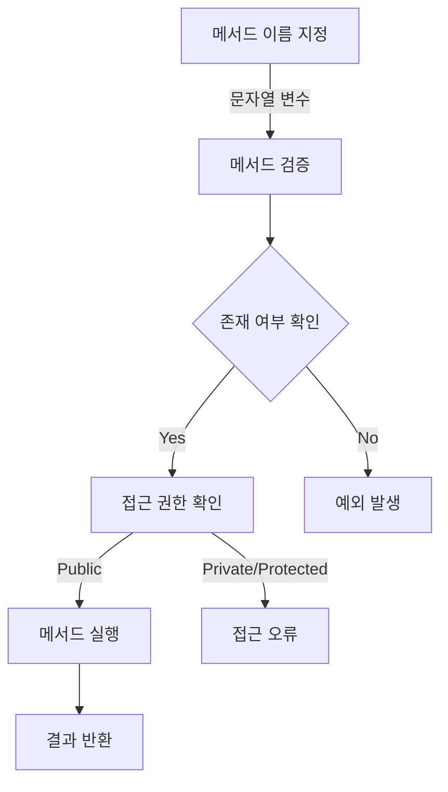
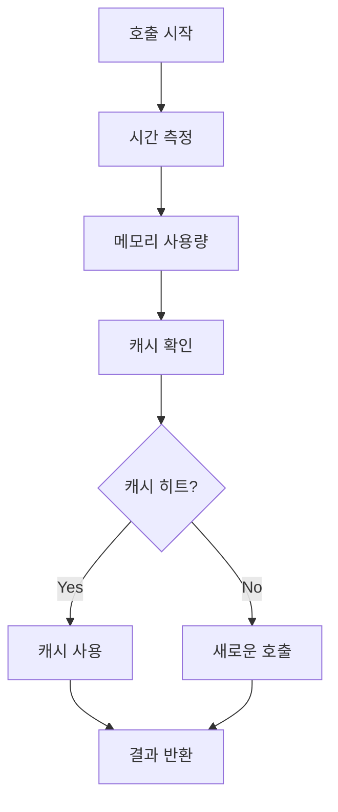

# 동적 메서드 호출 이해하기

식당에서 메뉴 번호로 주문하는 것처럼, PHP의 동적 메서드 호출은 이름표(변수)를 사용해 원하는 기능(메서드)를 실행하는 방식이다. 호출할 메서드의 이름을 문자열로 지정하면, PHP는 해당 이름의 메서드를 찾아 실행한다.

# 동작 방식



# 핵심 구성요소


# 기본 구현 예시
```php
class DataProcessor {
    /**
     * JSON 데이터 처리
     * @param string $data JSON 문자열
     * @return array 변환된 데이터
     */
    public function processJson($data) {
        return json_decode($data, true);
    }

    /**
     * CSV 데이터 처리
     * @param string $data CSV 문자열
     * @return array 변환된 데이터
     */
    public function processCsv($data) {
        return str_getcsv($data);
    }

    /**
     * 동적 메서드 호출 처리
     * @param string $type 데이터 타입
     * @param mixed $data 처리할 데이터
     * @throws Exception
     */
    public function process($type, $data) {
        $methodName = 'process' . ucfirst($type);
        
        // 올바른 방식: 메서드 존재 여부 확인
        if (method_exists($this, $methodName)) {
            return $this->$methodName($data);
        }
        throw new Exception("지원하지 않는 처리 방식: $type");
    }
}
```

# 성능 최적화 버전
```php
class OptimizedProcessor {
    private $methodCache = [];

    public function process($methodName, $data) {
        // 메서드 존재 여부 캐싱
        if (!isset($this->methodCache[$methodName])) {
            $this->methodCache[$methodName] = method_exists($this, $methodName);
        }

        if ($this->methodCache[$methodName]) {
            return $this->$methodName($data);
        }
        throw new Exception("메서드를 찾을 수 없음");
    }
}
```

# 보안 고려사항

## 메서드 이름 검증
```php
private function validateMethodName($name) {
    // 허용된 문자만 포함하는지 확인
    if (!preg_match('/^[a-zA-Z_\x7f-\xff][a-zA-Z0-9_\x7f-\xff]*$/', $name)) {
        throw new Exception("잘못된 메서드 이름입니다.");
    }
    return true;
}
```

## 접근 권한 확인
```php
private function checkMethodAccess($methodName) {
    $reflection = new ReflectionMethod($this, $methodName);
    return $reflection->isPublic();
}
```

# 성능 모니터링 구조



# 일반적인 오류 처리
```php
try {
    $result = $processor->process('json', $data);
} catch (MethodNotFoundException $e) {
    log_error("지원하지 않는 처리 방식: " . $e->getMessage());
} catch (AccessDeniedException $e) {
    log_error("접근 권한 오류: " . $e->getMessage());
} catch (Exception $e) {
    log_error("처리 중 오류 발생: " . $e->getMessage());
}
```

# 모범 사례
1. 메서드 존재 여부 항상 확인
2. 예외 처리 구현
3. 메서드 이름 생성 규칙 표준화
4. 접근 제어 확인
5. 성능 최적화 고려

# 결론
PHP의 동적 메서드 호출은 코드의 유연성을 높이고 반복을 줄여주는 강력한 기능이다. 보안과 성능을 고려한 구현, 철저한 오류 처리, 그리고 지속적인 모니터링이 필수적이다. 이러한 요소들을 균형있게 고려하여 구현하면, 유연하고 안정적인 시스템을 구축할 수 있다.