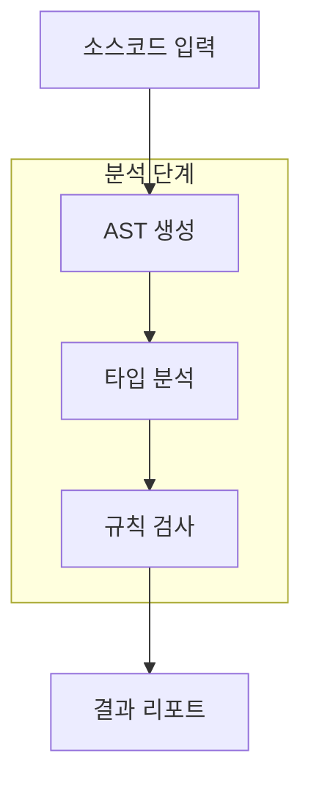
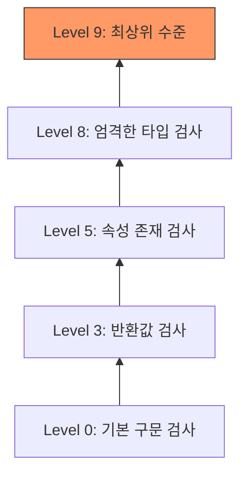
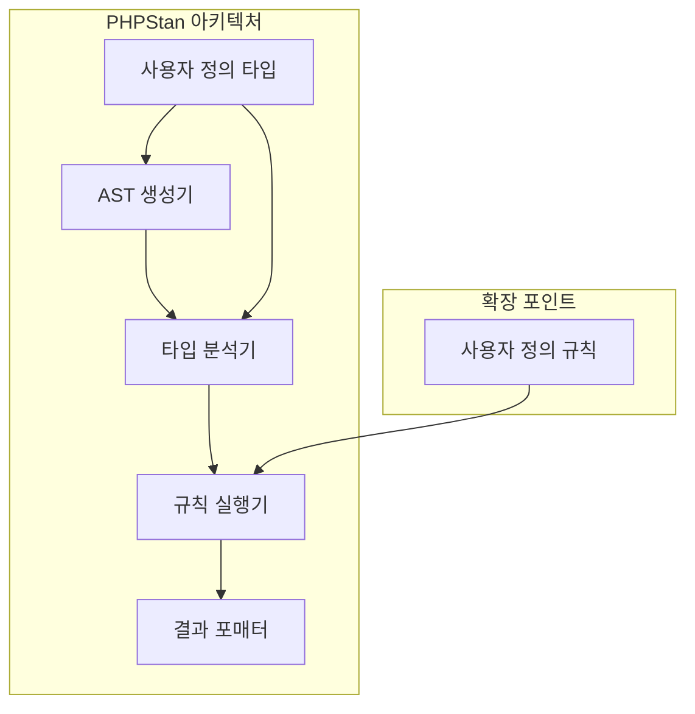

# PHPStan 소개

## 기본 개념
PHPStan은 PHP 코드의 잠재적 문제를 실행 전에 발견하는 정적 분석 도구이다. 코드를 직접 실행하지 않고도 타입 오류, Null 포인터 참조, 미사용 코드 등 다양한 문제를 찾아낸다.

### 실생활 비유
PHPStan은 건물 시공 감리자와 같다:
- 건축 도면 검토 = 코드 정적 분석
- 자재 품질 검사 = 타입 체크
- 안전 규정 준수 확인 = 코딩 표준 검사

## 기술적 특징
- PHP 7.1 이상 지원
- Composer 기반 설치
- 점진적 적용 가능한 분석 레벨(0-9)
- 사용자 정의 규칙 지원

# 동작 방식

## 분석 프로세스



## 레벨별 분석 범위



# 설치 및 기본 설정

## 환경 설정

```bash
# Composer를 통한 설치
composer require --dev phpstan/phpstan

# 설정 파일 생성
touch phpstan.neon
```

### 기본 설정 파일 (phpstan.neon)
```yaml
parameters:
    # 분석 레벨 (0-9)
    level: 5
    
    # 분석 대상 경로
    paths:
        - src
        - tests
    
    # 제외 경로
    excludePaths:
        - tests/*/data/*
        - */vendor/*
    
    # 추가 규칙 설정
    checkMissingIterableValueType: false
```

# 실제 사용 예시

## 기본적인 코드 분석

### 잘못된 코드 예시
```php
<?php
// 타입 힌트 부재로 인한 잠재적 오류
function calculateTotal($price, $quantity) {
    return $price * $quantity;
}

$result = calculateTotal("10", null);  // PHPStan이 오류 감지
```

### 올바른 코드 예시
```php
<?php
// 명확한 타입 힌트와 유효성 검사
function calculateTotal(float $price, int $quantity): float {
    if ($quantity < 0) {
        throw new InvalidArgumentException('수량은 0보다 작을 수 없습니다.');
    }
    return $price * $quantity;
}

$result = calculateTotal(10.0, 2);  // 정상 동작
```

# 고급 활용법

## 사용자 정의 규칙 생성

```php
<?php
namespace App\PHPStan\Rules;

use PhpParser\Node;
use PHPStan\Analyser\Scope;
use PHPStan\Rules\Rule;

class CustomMethodCallRule implements Rule
{
    public function getNodeType(): string
    {
        return Node\Expr\MethodCall::class;
    }

    public function processNode(Node $node, Scope $scope): array
    {
        // 메소드 호출 검사 로직
        if ($node->name->name === 'dangerousMethod') {
            return ['위험한 메소드를 사용하고 있습니다.'];
        }

        return [];
    }
}
```

## 분석 결과 처리

```php
<?php
// 분석 결과 처리 예시
$results = [
    'errors' => [],
    'warnings' => []
];

try {
    $analysisResult = $phpstan->analyse([__DIR__ . '/src']);
    foreach ($analysisResult as $error) {
        $results['errors'][] = [
            'message' => $error->getMessage(),
            'file' => $error->getFile(),
            'line' => $error->getLine()
        ];
    }
} catch (Exception $e) {
    $results['errors'][] = $e->getMessage();
}
```

# 시스템 아키텍처



# 성능 최적화

## 캐시 설정
```yaml
parameters:
    # 캐시 디렉토리 설정
    tmpDir: temp/phpstan
    
    # 증분 캐시 활성화
    enableProgressBar: true
    
    # 병렬 처리 설정
    parallel:
        maximumNumberOfProcesses: 4
```

# 문제 해결 가이드

## 일반적인 문제

### 1. 메모리 부족
```bash
# PHP 메모리 한도 증가
php -d memory_limit=-1 vendor/bin/phpstan analyse
```

### 2. 오탐 처리
```php
/** @phpstan-ignore-next-line */
$result = complexOperation();

/** @phpstan-ignore-error */
function legacyFunction() {
    // 레거시 코드
}
```

# 모범 사례

## CI/CD 통합

```yaml
# GitHub Actions 예시
name: PHPStan

on: [push, pull_request]

jobs:
  phpstan:
    runs-on: ubuntu-latest
    
    steps:
      - uses: actions/checkout@v2
      
      - name: Setup PHP
        uses: shivammathur/setup-php@v2
        with:
          php-version: '8.1'
          
      - name: Install dependencies
        run: composer install
        
      - name: Run PHPStan
        run: vendor/bin/phpstan analyse src tests
```

# 결론

PHPStan은 다음과 같은 이점을 제공한다:
- 코드 품질 향상
- 잠재적 버그 조기 발견
- 리팩토링 안정성 확보
- 팀 코딩 표준 준수 보장

## 도입 전략
1. 낮은 레벨(0-3)부터 시작
2. 점진적으로 레벨 상향
3. CI/CD 파이프라인에 통합
4. 팀 내 코딩 표준으로 확립