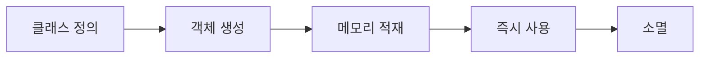

PHP에서 익명 함수는 이름이 없는 함수로, 변수에 할당하거나 다른 함수의 인자로 전달할 수 있는 특별한 형태의 함수다. 특히 'use' 키워드는 익명 함수에서 매우 중요한 역할을 하는데, 이에 대해 자세히 알아보도록 했다.

## 익명 함수란?

익명 함수는 함수의 이름 없이 정의되는 함수로, 클로저(Closure)라고도 불린다. 주로 콜백으로 사용되거나 변수에 저장돼 나중에 실행할 수 있다.

### 기본 문법
```php
$함수명 = function(매개변수) use (외부변수) {
    // 함수 내용
};
```

## 동작 방식



## use 키워드가 필요한 이유

### 1. 스코프 문제
PHP의 익명 함수는 기본적으로 외부 변수에 접근할 수 없다. 이는 변수 스코프의 제한 때문이다.

```php
$message = "안녕하세요";

// 오류 발생
$greet = function() {
    echo $message;  // Undefined variable $message
};

// 정상 동작
$greet = function() use ($message) {
    echo $message;  // "안녕하세요" 출력
};
```

### 2. 변수 캡처
use 키워드는 외부 스코프의 변수를 함수 내부로 가져오는 역할을 한다.

```php
$multiplier = 3;
$numbers = [1, 2, 3, 4, 5];

$result = array_map(function($n) use ($multiplier) {
    return $n * $multiplier;
}, $numbers);
// 결과: [3, 6, 9, 12, 15]
```

## use 키워드 사용 방법

### 1. 여러 변수 캡처하기
```php
$firstName = "길동";
$lastName = "홍";

$fullName = function() use ($firstName, $lastName) {
    return $lastName . $firstName;
};
```

### 2. 참조로 변수 캡처하기
```php
$counter = 0;

$increment = function() use (&$counter) {
    $counter++;
};

$increment();  // $counter는 1이 된다
$increment();  // $counter는 2가 된다
```

## 주요 특징

### 1. 값 복사
use로 캡처한 변수는 기본적으로 값이 복사된다.

```php
$message = "원본";
$printer = function() use ($message) {
    echo $message;
};

$message = "변경됨";
$printer();  // "원본" 출력
```

### 2. 참조 전달
참조로 전달하면 원본 변수의 변경사항이 반영된다.

```php
$message = "원본";
$printer = function() use (&$message) {
    echo $message;
};

$message = "변경됨";
$printer();  // "변경됨" 출력
```

## 실제 사용 예시

### 1. 이벤트 핸들러
```php
$config = ['debug' => true];

$errorHandler = function($error) use ($config) {
    if ($config['debug']) {
        echo "오류 발생: " . $error;
    }
};
```

### 2. 데이터 필터링
```php
$allowedTypes = ['jpg', 'png', 'gif'];

$fileFilter = function($file) use ($allowedTypes) {
    return in_array($file['extension'], $allowedTypes);
};
```

## 주의사항

1. use 키워드는 함수 정의 시점의 변수 값을 캡처한다
2. 너무 많은 변수를 캡처하면 코드의 복잡도가 증가한다
3. 참조 전달은 신중하게 사용해야 한다

## use 키워드의 장점

1. 외부 변수를 명시적으로 선언해 코드의 가독성이 향상됐다
2. 변수의 스코프를 명확하게 제어할 수 있다
3. 클로저의 동작을 예측 가능하게 만든다

## 결론

익명 함수에서 use 키워드는 외부 변수에 접근하기 위한 필수적인 요소다. 이를 통해 클로저의 동작을 더 잘 제어할 수 있으며, 코드의 안정성과 가독성을 높일 수 있다. 다만, 과도한 사용은 코드의 복잡성을 증가시킬 수 있으므로 적절한 상황에서만 사용하는 것이 좋다. 특히 참조 전달을 사용할 때는 side effect를 고려해 신중하게 결정해야 한다.