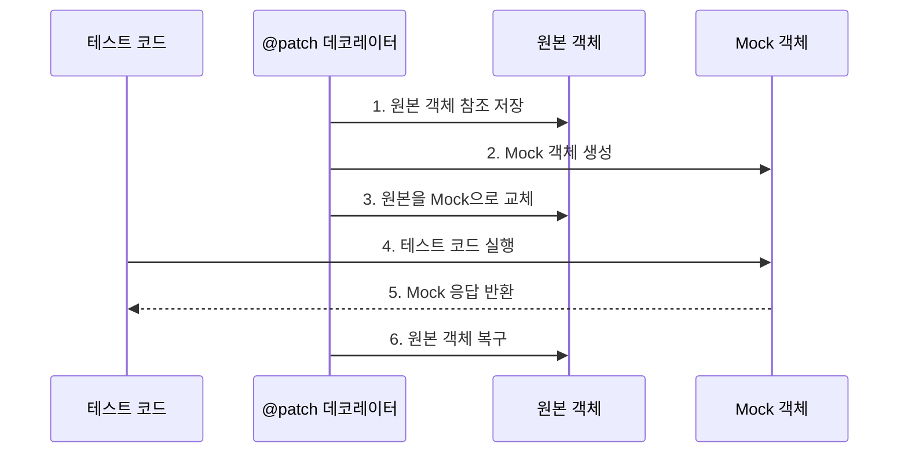

```table-of-contents
title: # 목차
style: nestedList # TOC style (nestedList|nestedOrderedList|inlineFirstLevel)
minLevel: 0 # Include headings from the specified level
maxLevel: 5 # Include headings up to the specified level
includeLinks: true # Make headings clickable
hideWhenEmpty: false # Hide TOC if no headings are found
debugInConsole: false # Print debug info in Obsidian console
```
# 개념 이해하기

## 단위 테스트의 본질

소프트웨어 개발에서 단위 테스트는 마치 요리를 할 때 각 재료의 신선도와 맛을 확인하는 것과 같다. 전체 요리(애플리케이션)가 맛있으려면 각각의 재료(단위 기능)가 제대로 작동해야 한다. Python에서는 이러한 검증을 위해 unittest.mock과 pytest라는 강력한 도구를 제공한다.

## Mock의 개념

Mock은 실제 객체를 흉내 내는 테스트 더블이다. 마치 영화 촬영에서 위험한 장면을 대신하는 스턴트맨처럼, 실제 객체 대신 안전하고 통제된 방식으로 동작을 흉내 낸다.

# 기본 동작 방식

## unittest.mock 동작 원리

Mock 객체는 다음과 같은 핵심 기능을 제공한다:
- 메소드와 속성의 동적 생성
- 호출 기록 추적
- 반환값 지정
- 예외 발생 시뮬레이션

## patch 데코레이터의 이해

patch 데코레이터는 컨텍스트 매니저와 달리 테스트 함수나 메서드 전체에 Mock 객체를 적용한다. 이는 마치 음식점에서 특정 재료를 다른 재료로 완전히 대체하는 것과 같다. 테스트 함수가 실행되는 동안 지정된 객체나 속성이 Mock으로 대체된다.

## pytest 특징

pytest는 다음과 같은 장점을 제공한다:
- 간결한 테스트 코드 작성
- 강력한 fixture 시스템
- 상세한 실패 리포트
- 풍부한 플러그인 생태계

# 실제 사용 예시

## unittest.mock의 데코레이터 활용

외부 서비스를 사용하는 클래스를 테스트하는 예시를 살펴보자:

```python
from unittest.mock import patch
import requests

class WeatherService:
    def __init__(self):
        self.api_key = "your_api_key"
        
    def get_temperature(self, city):
        """도시의 현재 기온을 조회한다"""
        url = f"https://api.weather.com/current/{city}?key={self.api_key}"
        response = requests.get(url)
        data = response.json()
        return data['temperature']
        
    def get_forecast(self, city):
        """도시의 일주일 날씨 예보를 조회한다"""
        url = f"https://api.weather.com/forecast/{city}?key={self.api_key}"
        response = requests.get(url)
        return response.json()['forecast']

# 단일 Mock 데코레이터 사용
@patch('requests.get')
def test_get_temperature(mock_get):
    # Mock 응답 설정
    mock_response = {"temperature": 25.5}
    mock_get.return_value.json.return_value = mock_response
    
    # 테스트 실행
    service = WeatherService()
    temperature = service.get_temperature("Seoul")
    
    # 검증
    assert temperature == 25.5
    mock_get.assert_called_once()

# 여러 Mock 데코레이터 중첩 사용
@patch('requests.get')
@patch('WeatherService.api_key')
def test_get_forecast(mock_api_key, mock_get):
    # Mock 설정
    mock_api_key.return_value = "test_key"
    mock_get.return_value.json.return_value = {
        "forecast": [
            {"day": "Monday", "temperature": 25},
            {"day": "Tuesday", "temperature": 27}
        ]
    }
    
    # 테스트 실행
    service = WeatherService()
    forecast = service.get_forecast("Seoul")
    
    # 검증
    assert len(forecast) == 2
    assert forecast[0]["temperature"] == 25

# 클래스 단위 Mock 적용
@patch('requests.get')
class TestWeatherService:
    def test_get_temperature(self, mock_get):
        mock_get.return_value.json.return_value = {"temperature": 25.5}
        service = WeatherService()
        assert service.get_temperature("Seoul") == 25.5
        
    def test_get_forecast(self, mock_get):
        mock_get.return_value.json.return_value = {
            "forecast": [{"day": "Monday", "temperature": 25}]
        }
        service = WeatherService()
        forecast = service.get_forecast("Seoul")
        assert forecast[0]["temperature"] == 25
```

## pytest와 patch 데코레이터 조합

pytest와 patch 데코레이터를 함께 사용하는 강력한 테스트 패턴:

```python
import pytest
from unittest.mock import patch

# Fixture와 patch 데코레이터 조합
@pytest.fixture
def weather_service():
    return WeatherService()

@pytest.mark.parametrize("city,expected_temp", [
    ("Seoul", 25.5),
    ("Tokyo", 28.0),
    ("Beijing", 30.0)
])
@patch('requests.get')
def test_multiple_cities(mock_get, weather_service, city, expected_temp):
    # Mock 응답 설정
    mock_get.return_value.json.return_value = {"temperature": expected_temp}
    
    # 테스트 실행
    temperature = weather_service.get_temperature(city)
    
    # 검증
    assert temperature == expected_temp
    mock_get.assert_called_once()

# Mock 위치 지정을 통한 세밀한 제어
@patch('WeatherService.get_temperature')
@patch('WeatherService.get_forecast')
def test_weather_integration(mock_forecast, mock_temperature):
    # Mock 동작 설정
    mock_temperature.return_value = 25.5
    mock_forecast.return_value = [
        {"day": "Monday", "temperature": 25}
    ]
    
    service = WeatherService()
    
    # 두 메서드를 연계하는 테스트 시나리오
    current_temp = service.get_temperature("Seoul")
    forecast = service.get_forecast("Seoul")
    
    assert current_temp == 25.5
    assert forecast[0]["temperature"] == 25
```

# 고급 활용법

## Mock 세부 설정

```python
from unittest.mock import Mock, call

# side_effect를 사용한 동적 반환값 설정
mock = Mock()
mock.side_effect = [1, 2, 3]
print(mock(), mock(), mock())  # 1, 2, 3 출력

# 예외 발생 시뮬레이션
mock.side_effect = ValueError("잘못된 값")

# 호출 이력 검증
mock = Mock()
mock(1, 2)
mock(3, 4)
assert mock.call_args_list == [call(1, 2), call(3, 4)]
```

## 데코레이터 패치의 특수한 경우

```python
# 중첩된 속성 패치
@patch('package.module.Class.attribute')
def test_nested_attribute(mock_attr):
    mock_attr.return_value = "mocked_value"
    
# 클래스 메서드 패치
@patch.object(WeatherService, 'get_temperature')
def test_class_method(mock_method):
    mock_method.return_value = 25.5

# 여러 패치의 적용 순서
@patch('module.Class1')
@patch('module.Class2')
def test_multiple_patches(mock2, mock1):  # 순서가 역순임에 주의
    pass
```

# 아키텍처 및 프로세스 플로우

## Decorator를 사용한 Mock 동작 프로세스



# 주의사항

1. 데코레이터 사용 시 주의점
   - 데코레이터 순서가 Mock 주입 순서의 역순이다
   - 패치 경로는 대상이 사용되는 위치 기준이다
   - 클래스 메서드 패치 시 self 인자 처리에 주의해야 한다

2. pytest와 함께 사용 시 고려사항
   - fixture와 데코레이터 조합 시 실행 순서를 이해해야 한다
   - parametrize와 함께 사용할 때 매개변수 순서를 올바르게 지정해야 한다
   - autouse fixture와의 상호작용을 고려해야 한다

# 결론

unittest.mock의 patch 데코레이터는 테스트 코드를 더욱 깔끔하고 관리하기 쉽게 만들어준다. 컨텍스트 매니저 방식과 비교하여 테스트 전체에 일관된 Mock을 적용할 수 있다는 장점이 있다. pytest와의 조합을 통해 더욱 강력하고 유연한 테스트 코드를 작성할 수 있으며, 이는 결과적으로 소프트웨어의 품질 향상에 기여한다.