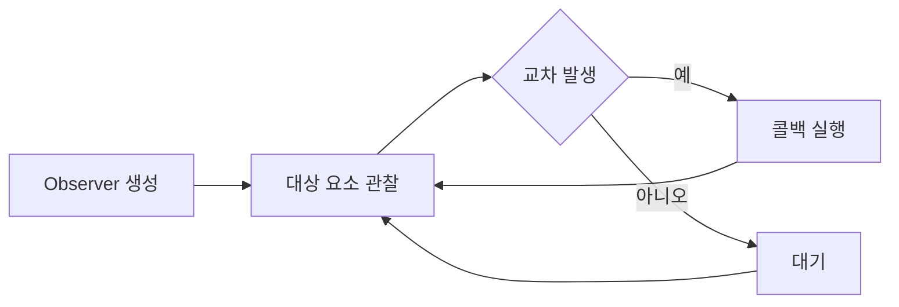
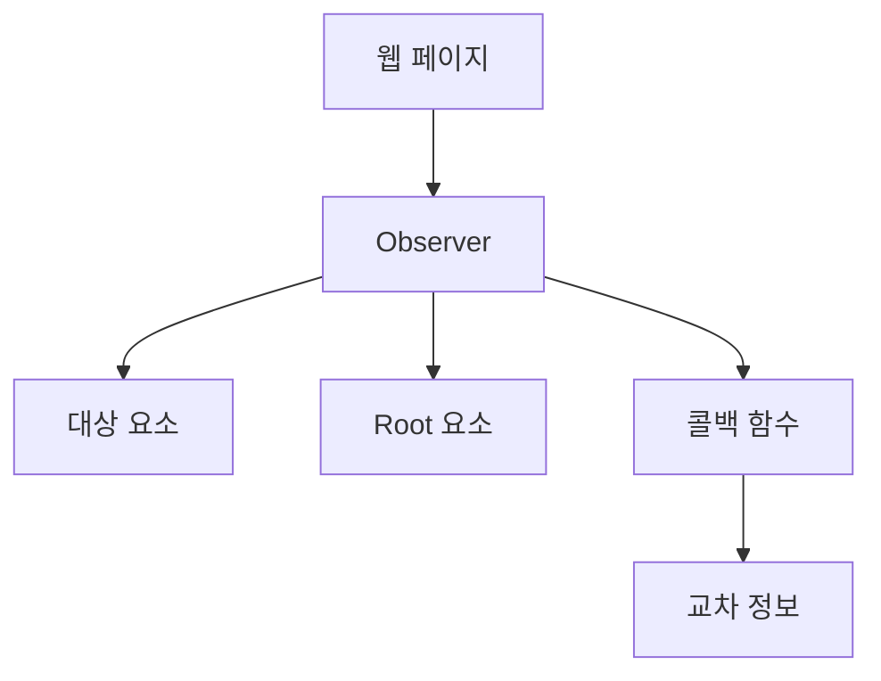

```table-of-contents
title: # 목차
style: nestedList # TOC style (nestedList|nestedOrderedList|inlineFirstLevel)
minLevel: 0 # Include headings from the specified level
maxLevel: 0 # Include headings up to the specified level
includeLinks: true # Make headings clickable
hideWhenEmpty: false # Hide TOC if no headings are found
debugInConsole: false # Print debug info in Obsidian console
```
# 개념 설명
Intersection Observer는 웹 페이지에서 특정 요소가 화면에 보이는지 감지하는 Web API이다. 마치 교차로의 CCTV가 차량의 통행을 감시하는 것처럼, 특정 요소가 뷰포트(viewport)나 지정된 요소와 교차하는 시점을 감지한다.

# 동작 방식


# 시스템 구조


# 단계별 구현

## 1단계: 기본 구현 (잘못된 예시)
```javascript
// 스크롤 이벤트로 구현 - 성능 문제가 있다
window.addEventListener('scroll', () => {
    const element = document.querySelector('.target');
    const rect = element.getBoundingClientRect();
    if (rect.top >= 0 && rect.bottom <= window.innerHeight) {
        console.log('요소가 보인다');
    }
});
```

이 구현의 문제점:
- 스크롤할 때마다 실행되어 성능이 저하된다
- 정확한 교차 지점을 파악하기 어렵다
- 불필요한 계산이 많다
- 메모리 사용량이 많다

## 2단계: 개선된 구현 (올바른 예시)
```javascript
// Intersection Observer 옵션을 설정한다
const options = {
    root: null, // 뷰포트를 기준으로 한다
    rootMargin: '0px', // 여백을 설정한다
    threshold: 0.5 // 50% 이상 보일 때 감지한다
};

// 콜백 함수를 정의한다
const callback = (entries, observer) => {
    entries.forEach(entry => {
        if (entry.isIntersecting) {
            console.log('요소가 50% 이상 보인다');
            // 필요한 작업을 수행한다
        }
    });
};

// Observer를 생성한다
const observer = new IntersectionObserver(callback, options);

// 대상 요소를 관찰한다
const target = document.querySelector('.target');
observer.observe(target);
```

# 실제 사용 예시

## 이미지 지연 로딩
```javascript
const lazyLoadImages = () => {
    const images = document.querySelectorAll('img[data-src]');
    
    const imageObserver = new IntersectionObserver((entries, observer) => {
        entries.forEach(entry => {
            if (entry.isIntersecting) {
                const img = entry.target;
                img.src = img.dataset.src;
                img.removeAttribute('data-src');
                observer.unobserve(img);
            }
        });
    });
    
    images.forEach(img => imageObserver.observe(img));
};
```

## 무한 스크롤
```javascript
const infiniteScroll = () => {
    const sentinel = document.querySelector('#sentinel');
    
    const observer = new IntersectionObserver(async (entries) => {
        if (entries[0].isIntersecting) {
            // 새로운 데이터를 불러온다
            const newData = await fetchMoreData();
            // 데이터를 화면에 추가한다
            appendDataToList(newData);
        }
    });
    
    observer.observe(sentinel);
};
```

# 고급 활용법

## 요소별 다른 임계값 설정
```javascript
const multipleThresholds = () => {
    const options = {
        threshold: [0, 0.25, 0.5, 0.75, 1]
    };
    
    const observer = new IntersectionObserver((entries) => {
        entries.forEach(entry => {
            const ratio = entry.intersectionRatio;
            console.log(`교차 비율: ${ratio * 100}%`);
        });
    }, options);
    
    observer.observe(document.querySelector('.target'));
};
```

## 특정 컨테이너 내 요소 관찰
```javascript
const containerObserver = () => {
    const container = document.querySelector('.container');
    
    const options = {
        root: container,
        rootMargin: '10px',
        threshold: 1.0
    };
    
    const observer = new IntersectionObserver((entries) => {
        entries.forEach(entry => {
            if (entry.isIntersecting) {
                entry.target.classList.add('visible');
            }
        });
    }, options);
    
    const targets = container.querySelectorAll('.item');
    targets.forEach(target => observer.observe(target));
};
```

# 자주 발생하는 문제와 해결방법

1. 성능 문제
   - 상황: 너무 많은 요소를 관찰한다
   - 원인: 불필요한 관찰 대상이 많다
   - 해결: 필요한 요소만 관찰한다

2. 메모리 누수
   - 상황: 제거된 요소를 계속 관찰한다
   - 원인: unobserve를 호출하지 않았다
   - 해결: 더 이상 필요없는 관찰은 중단한다

3. 잘못된 임계값
   - 상황: 콜백이 예상대로 실행되지 않는다
   - 원인: 임계값 설정이 부적절하다
   - 해결: 용도에 맞는 임계값을 설정한다

# 주의사항
1. 브라우저 지원
   - 지원하지 않는 브라우저를 확인한다
   - 필요한 경우 폴리필을 사용한다

2. 성능 최적화
   - 필요한 요소만 관찰한다
   - 적절한 임계값을 사용한다

3. 메모리 관리
   - 불필요한 관찰을 중단한다
   - 연결을 정리한다

# 결론
Intersection Observer는 현대 웹 개발에서 필수적인 도구이다. 스크롤 이벤트 기반의 구현보다 효율적이며, 다양한 용도로 활용할 수 있다.

# 심화 학습을 위한 질문들
1. 성능을 더욱 최적화하려면 어떻게 해야 하는가?
2. 여러 개의 Observer를 사용할 때의 장단점은 무엇인가?
3. 동적으로 추가되는 요소는 어떻게 처리해야 하는가?
4. 다양한 화면 크기에서 어떻게 일관된 동작을 보장할 수 있는가?
5. 애니메이션과 함께 사용할 때 고려할 점은 무엇인가?