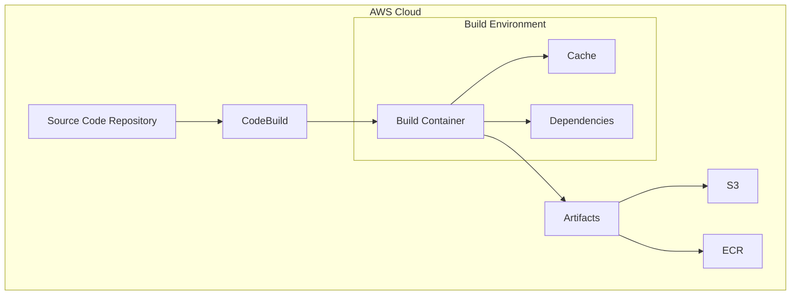

# CodeBuild 개념 이해하기

실생활에서 건물을 지을 때 설계도면을 바탕으로 자재를 모으고, 건설 과정을 관리하는 것처럼, AWS CodeBuild는 소프트웨어를 빌드하고 테스트하는 과정을 자동화하는 완전관리형 빌드 서비스이다. 마치 건설 현장의 건설사가 모든 건설 과정을 관리하듯이, CodeBuild는 소스 코드 컴파일부터 테스트 실행, 소프트웨어 패키지 생성까지의 전 과정을 관리한다.

## 기본 동작 방식

CodeBuild의 핵심 동작 과정은 다음과 같다:

1. 소스 코드 수집: GitHub, AWS CodeCommit, Amazon S3 등에서 소스 코드를 가져온다
2. 빌드 환경 준비: 지정된 빌드 사양(buildspec)에 따라 컨테이너 환경을 구성한다
3. 빌드 실행: 정의된 명령을 순차적으로 실행한다
4. 결과물 저장: 생성된 아티팩트를 S3 등에 저장한다


# 실제 사용 예시

## buildspec.yml 기본 구조

```yaml
version: 0.2

phases:
  install:
    runtime-versions:
      java: corretto11
    commands:
      - echo "Install phase - 의존성 설치"
      - npm install
      
  pre_build:
    commands:
      - echo "Pre-build phase - 빌드 전 준비"
      - aws ecr get-login-password --region $AWS_DEFAULT_REGION | docker login --username AWS --password-stdin $ECR_REPOSITORY_URI
      
  build:
    commands:
      - echo "Build phase - 메인 빌드 프로세스"
      - mvn package
      - docker build -t $ECR_REPOSITORY_URI:$IMAGE_TAG .
      
  post_build:
    commands:
      - echo "Post-build phase - 빌드 후 처리"
      - docker push $ECR_REPOSITORY_URI:$IMAGE_TAG
      
artifacts:
  files:
    - target/*.jar
    - appspec.yml
  discard-paths: yes
```

# 고급 활용법

## 1. 캐시 전략 최적화

빌드 시간을 단축하기 위한 캐시 설정:

```yaml
cache:
  paths:
    - '/root/.m2/**/*'
    - 'node_modules/**/*'
```

## 2. 환경 변수 활용

민감한 정보 관리를 위한 환경 변수 설정:

```yaml
env:
  variables:
    JAVA_HOME: "/usr/lib/jvm/java-11"
  parameter-store:
    DB_PASSWORD: "/production/db/password"
  secrets-manager:
    GITHUB_TOKEN: "prod/github/token"
```

# 주의사항

1. 보안 관련
   - IAM 역할 최소 권한 원칙 적용
   - 민감한 정보는 반드시 AWS Secrets Manager나 Parameter Store 사용
   - VPC 설정을 통한 네트워크 격리 고려

2. 비용 최적화
   - 빌드 시간 최소화를 위한 캐시 활용
   - 적절한 컴퓨팅 타입 선택
   - 불필요한 아티팩트 저장 방지

# 시스템 아키텍처



# 결론

AWS CodeBuild는 현대적인 CI/CD 파이프라인의 핵심 구성 요소로, 다음과 같은 장점을 제공한다:

1. 완전관리형 서비스로 인프라 관리 불필요
2. 다양한 빌드 환경 지원
3. 확장성과 유연성 제공
4. 보안과 규정 준수 기능 내장

효율적인 CodeBuild 활용을 위해서는 빌드 프로세스 최적화, 적절한 보안 설정, 그리고 비용 관리가 중요하다. 지속적인 모니터링과 최적화를 통해 더욱 효율적인 빌드 파이프라인을 구축할 수 있다.