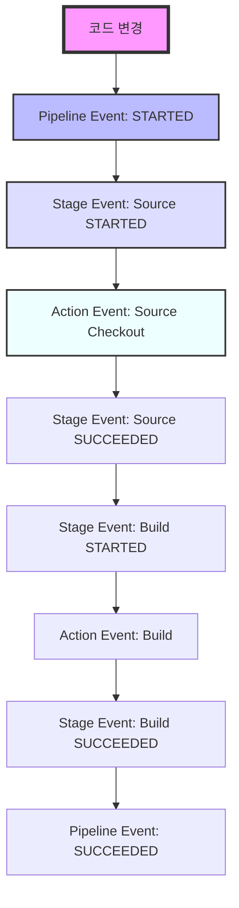
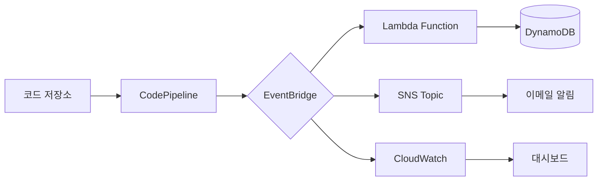

# 개념 설명
CodePipeline Events는 AWS의 CI/CD 파이프라인에서 발생하는 모든 상태 변화를 추적하는 알림 시스템이다. 이는 마치 대규모 물류 센터의 배송 추적 시스템과 유사하다:
- 전체 배송 과정 추적 (Pipeline Execution Events)
- 각 물류 센터의 처리 상태 (Stage Execution Events)
- 개별 택배 기사의 배송 상태 (Action Execution Events)

## Event 타입별 특징
1. Pipeline Execution Events
   - 전체 파이프라인의 생명주기를 관리한다
   - 시작, 성공, 실패, 취소 상태를 알린다

2. Stage Execution Events
   - 개별 단계의 진행 상황을 전달한다
   - 각 단계별 성공/실패를 추적한다

3. Action Execution Events
   - 구체적인 작업 단위의 상태를 알린다
   - 가장 상세한 수준의 모니터링이 가능하다

# 기본 동작 방식

## Event Flow 구조


## 시스템 아키텍처


# 실제 사용 예시

## 기본적인 이벤트 처리
```python
# 잘못된 예시 - 모든 이벤트를 동일하게 처리
def handle_events_bad(event):
    """
    모든 이벤트를 동일한 방식으로 처리하는 잘못된 접근
    """
    if event['state'] == 'FAILED':
        send_notification()  # 차별화 없는 알림 발송

# 올바른 예시 - 이벤트 타입별 처리
def handle_events_good(event):
    """
    이벤트 타입에 따라 적절한 처리를 수행하는 올바른 접근
    """
    detail_type = event['detail-type']
    detail = event['detail']
    
    if detail_type == 'CodePipeline Pipeline Execution State Change':
        handle_pipeline_event(detail)
    elif detail_type == 'CodePipeline Stage Execution State Change':
        handle_stage_event(detail)
    elif detail_type == 'CodePipeline Action Execution State Change':
        handle_action_event(detail)

def handle_pipeline_event(detail):
    """파이프라인 수준 이벤트 처리"""
    if detail['state'] == 'FAILED':
        # 전체 파이프라인 실패 시 긴급 대응
        create_incident_ticket()
        notify_devops_team()

def handle_stage_event(detail):
    """스테이지 수준 이벤트 처리"""
    if detail['state'] == 'FAILED':
        # 스테이지 실패 시 담당 팀 알림
        notify_stage_owner(detail['stage'])
        log_stage_failure(detail)

def handle_action_event(detail):
    """액션 수준 이벤트 처리"""
    if detail['state'] == 'FAILED':
        # 액션 실패 시 자동 재시도
        retry_failed_action(detail)
        log_action_failure(detail)
```

# 고급 활용법

## 상태 관리 시스템
```python
class PipelineStateManager:
    """파이프라인 상태를 관리하는 클래스"""
    
    def __init__(self):
        self.dynamodb = boto3.resource('dynamodb')
        self.table = self.dynamodb.Table('pipeline-states')
        self.sns = boto3.client('sns')
    
    def update_state(self, event):
        """
        파이프라인 상태를 업데이트하고 필요한 알림을 발송한다
        
        Args:
            event: CodePipeline 이벤트 객체
        """
        pipeline_id = event['detail']['pipeline']
        execution_id = event['detail']['execution-id']
        current_state = event['detail']['state']
        
        # 상태 업데이트
        self.table.update_item(
            Key={'pipeline_id': pipeline_id},
            UpdateExpression='SET current_state = :state, '
                           'last_updated = :time, '
                           'execution_id = :exec_id',
            ExpressionAttributeValues={
                ':state': current_state,
                ':time': datetime.now().isoformat(),
                ':exec_id': execution_id
            }
        )
        
        # 중요 상태 변경 시 알림 발송
        if current_state in ['FAILED', 'SUCCEEDED']:
            self.send_state_notification(pipeline_id, current_state)
    
    def send_state_notification(self, pipeline_id, state):
        """상태 변경 알림을 발송한다"""
        message = f"파이프라인 {pipeline_id}가 {state} 상태가 되었습니다."
        self.sns.publish(
            TopicArn='arn:aws:sns:region:account:topic',
            Message=message,
            Subject=f"파이프라인 상태 변경: {state}"
        )
```

# 주의사항

## 일반적인 문제점
1. 이벤트 순서 문제
   - 이벤트가 비동기적으로 발생한다
   - 순서가 보장되지 않을 수 있다

2. 중복 이벤트
   - 동일한 이벤트가 여러 번 전달될 수 있다
   - 멱등성 있는 처리가 필요하다

3. 이벤트 유실
   - 네트워크 문제로 이벤트가 유실될 수 있다
   - 재시도 메커니즘이 필요하다

## 해결 방안
```python
class EventProcessor:
    """이벤트 처리기 클래스"""
    
    def __init__(self):
        self.processed_events = set()
    
    def process_event(self, event):
        """
        중복 없이 이벤트를 처리한다
        
        Args:
            event: CodePipeline 이벤트 객체
        """
        event_id = event['id']
        
        if event_id in self.processed_events:
            logger.info(f"중복 이벤트 무시: {event_id}")
            return
        
        try:
            self._handle_event(event)
            self.processed_events.add(event_id)
        except Exception as e:
            logger.error(f"이벤트 처리 실패: {str(e)}")
            raise
```

# 결론
AWS CodePipeline Events는 파이프라인의 상태를 효과적으로 모니터링하고 관리하기 위한 핵심 기능이다. 각 이벤트 타입의 특성을 이해하고 적절한 처리 로직을 구현하면 안정적인 CI/CD 시스템을 구축할 수 있다. 특히 이벤트의 신뢰성과 순서 보장을 위한 추가적인 장치가 필요하며, 이는 상태 관리 시스템과 올바른 에러 처리를 통해 달성할 수 있다.