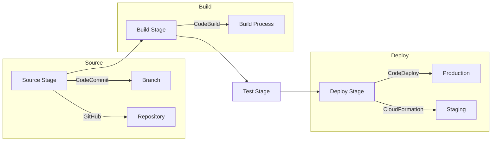
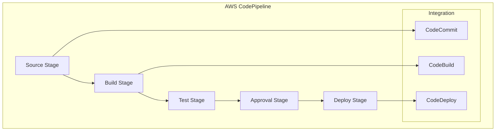

# CodePipeline 개념 이해하기

자동차 생산 라인을 생각해보자. 원자재가 들어와서 여러 단계의 조립 과정을 거쳐 완성된 자동차가 나오는 것처럼, AWS CodePipeline은 소프트웨어가 개발되어 최종적으로 사용자에게 전달되기까지의 모든 과정을 자동화하는 지속적 전달 서비스이다. 각 단계는 컨베이어 벨트처럼 자연스럽게 연결되어 있으며, 품질 검사부터 최종 조립까지 모든 과정이 자동화되어 있다.

## 기본 동작 방식

CodePipeline은 다음과 같은 단계로 동작한다:

1. 소스 단계: 코드 변경 감지 및 파이프라인 트리거
2. 빌드 단계: 코드 컴파일 및 테스트 실행
3. 테스트 단계: 자동화된 테스트 수행
4. 배포 단계: 다양한 환경에 애플리케이션 배포



# 실제 구현 예시

## Pipeline 정의 (AWS CloudFormation)

```yaml
AWSTemplateFormatVersion: '2010-09-09'
Description: 'AWS CodePipeline 예시 템플릿'

Resources:
  Pipeline:
    Type: AWS::CodePipeline::Pipeline
    Properties:
      RoleArn: !GetAtt PipelineRole.Arn
      ArtifactStore:
        Type: S3
        Location: !Ref ArtifactBucket
      Stages:
        - Name: Source
          Actions:
            - Name: SourceAction
              ActionTypeId:
                Category: Source
                Owner: AWS
                Provider: CodeCommit
                Version: '1'
              Configuration:
                RepositoryName: !Ref RepositoryName
                BranchName: main
              OutputArtifacts:
                - Name: SourceOutput
              
        - Name: Build
          Actions:
            - Name: BuildAction
              ActionTypeId:
                Category: Build
                Owner: AWS
                Provider: CodeBuild
                Version: '1'
              Configuration:
                ProjectName: !Ref BuildProject
              InputArtifacts:
                - Name: SourceOutput
              OutputArtifacts:
                - Name: BuildOutput
                
        - Name: Deploy
          Actions:
            - Name: DeployAction
              ActionTypeId:
                Category: Deploy
                Owner: AWS
                Provider: CodeDeploy
                Version: '1'
              Configuration:
                ApplicationName: !Ref ApplicationName
                DeploymentGroupName: !Ref DeploymentGroupName
              InputArtifacts:
                - Name: BuildOutput
```

# 고급 활용법

## 1. 승인 단계 추가

수동 승인 단계를 통한 배포 제어:

```yaml
- Name: Approve
  Actions:
    - Name: ApprovalAction
      ActionTypeId:
        Category: Approval
        Owner: AWS
        Provider: Manual
        Version: '1'
      Configuration:
        CustomData: "프로덕션 환경 배포 승인이 필요합니다"
```

## 2. 병렬 작업 구성

동시에 실행되는 여러 작업 정의:

```yaml
- Name: ParallelTests
  Actions:
    - Name: UnitTests
      RunOrder: 1
      # ... 설정 생략
    - Name: IntegrationTests
      RunOrder: 1
      # ... 설정 생략
```

# 시스템 아키텍처



# 주의사항

1. 보안 관련
   - 파이프라인 IAM 역할의 최소 권한 설정
   - 환경 변수 및 시크릿 관리
   - 소스 코드 보안 검사 단계 포함

2. 성능 최적화
   - 병렬 실행을 통한 파이프라인 속도 향상
   - 아티팩트 크기 최적화
   - 캐시 전략 수립

3. 비용 관리
   - 불필요한 파이프라인 실행 방지
   - 아티팩트 보관 기간 설정
   - 리소스 사용량 모니터링

# 모니터링 및 로깅

CodePipeline의 모니터링은 다음과 같은 방법으로 수행할 수 있다:

1. CloudWatch Events를 통한 파이프라인 상태 모니터링
2. CloudTrail을 통한 API 호출 로깅
3. SNS 알림 설정으로 중요 이벤트 통지

# 결론

AWS CodePipeline은 현대적인 소프트웨어 개발에서 필수적인 CI/CD 도구로, 다음과 같은 이점을 제공한다:

1. 자동화된 릴리스 프로세스
2. 일관된 배포 품질 보장
3. 확장 가능한 파이프라인 구성
4. AWS 서비스들과의 완벽한 통합

효과적인 CodePipeline 활용을 위해서는 파이프라인 설계부터 모니터링까지 전체적인 관점에서의 이해와 구성이 필요하다. 지속적인 개선과 최적화를 통해 더욱 효율적인 소프트웨어 전달 프로세스를 구축할 수 있다.